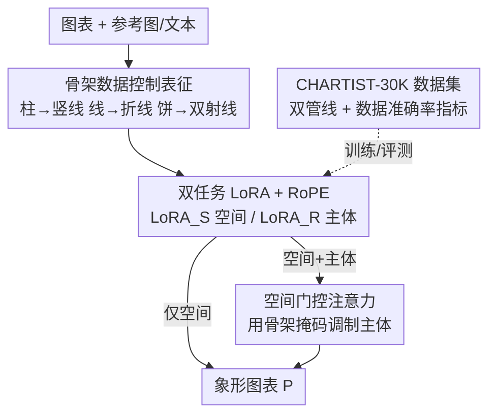

# ChArtist: Generating Pictorial Charts with Unified Spatial and Subject Control

**会议**: CVPR 2026  
**论文**: [CVF Open Access](https://openaccess.thecvf.com/content/CVPR2026/html/Xiao_ChArtist_Generating_Pictorial_Charts_with_Unified_Spatial_and_Subject_Control_CVPR_2026_paper.html)  
**代码**: 项目页 https://chartist-ai.github.io/ （代码未明确开源，⚠️ 以项目页为准）  
**领域**: 扩散模型 / 图像生成  
**关键词**: 象形图表生成, 可控扩散, 骨架表征, 主体驱动生成, 注意力门控  

## 一句话总结
ChArtist 把"柱/线/饼"的数据结构抽象成极简的**骨架（skeleton）**作为空间条件、再叠加参考图的**主体（subject）**条件，用两个独立 LoRA 分别学这两种控制，并在推理时用**空间门控注意力**让主体服从于空间结构，从而自动生成既忠于数据又有视觉表现力的象形图表。

## 研究背景与动机
**领域现状**：象形图表（pictorial chart）把语义图像直接嵌进图表结构里讲数据故事——比如用一串小狗的高低代替柱子、用一朵花的轮廓沿着折线走。它比普通柱状图更抓眼、更易记忆，但目前主要靠设计师手工拼贴或借助半自动作图工具完成，既费力又缺少对"数据是否被画准"的量化评估。

**现有痛点**：想用现成的可控扩散模型自动生成并不顺手。主流空间控制（ControlNet 的 Canny 边缘、深度图等）是为自然图像设计的**稠密像素级条件**，它假设条件和生成图之间逐像素对应，于是把图像死死按在轮廓上——这对需要"创造性形变"的象形图表是灾难：内容被挤进硬边界、或者干脆只剩素描感。另一端的稀疏条件（bounding box）又太弱，管不住图表内部的结构。

**核心矛盾**：象形图表本质上要同时满足两个互相拉扯的要求——**数据忠实度**（柱高、折线趋势、饼角必须画准）与**视觉表现力**（图像要自然好看、能融入参考主体）。稠密条件偏向前者牺牲后者，稀疏条件反之。更麻烦的是，当你想同时加"空间约束"和"参考图主体"两路控制时，二者会发生**跨条件干扰**：主体那一路会扭曲空间结构、或把参考图内容泄漏到背景，直接破坏数据忠实度。

**本文目标**：做一个端到端的象形图表生成管线，支持两种来自真实设计流程的控制方式——"数据优先"（先定好图表再找合适图像）对应**空间控制**，"视觉优先"（先选好看的图再变形塞进图表）对应**主体控制**，两者可独立也可联合使用。

**切入角度**：与其沿用自然图像的通用条件，不如为图表设计一个**任务专属**的控制表征。作者观察到图表的信息其实只活在"数据编码维度"上（柱子的高度、折线的走向、饼的角度），其余都是可自由发挥的样式空间。

**核心 idea**：用只编码数据维度的**骨架表征**取代稠密轮廓做空间控制，把空间和主体拆成两个独立 LoRA 训练，再用一个免训练的**空间门控注意力**在推理时强制"主体服从空间"，从而在数据忠实与视觉表现之间拿到平衡。

## 方法详解

### 整体框架
ChArtist 建立在预训练的 Diffusion Transformer（FLUX.1-DEV）之上，输入是一张图表骨架 $S$（必要时叠加一张参考图 $R$ 或一段文本），输出是融合了视觉主体、又对齐数据结构的象形图表 $P$。整条路分四块：先把图表压成**骨架表征**当空间条件；再训练两个任务专属 LoRA——$\text{LoRA}_S$ 负责空间对齐、$\text{LoRA}_R$ 负责主体注入，两者通过 RoPE 位置策略拼进同一条多模态序列；推理时若要双控，则用**空间门控注意力**让主体信号被空间掩码调制，避免干扰；而支撑这一切训练的是作者自建的 **CHARTIST-30K** 三元组数据集与一套**数据准确率指标**。

### 关键设计

**1. 骨架数据控制表征：只编码数据维度，把样式空间让出来**

针对"稠密条件太死、稀疏条件太弱"这个矛盾，作者在控制表征的"复杂度光谱"上找了个甜点：**骨架（skeleton）**。它的设计原则是只保留图表的主数据编码维度，结构上尽可能极简，从而既忠实编码数据、又给语义/样式注入留足自由度。具体到三类图表，骨架被定义得非常省：柱状图里**每根柱子用一条竖线**（编码高度），折线图用**一条折线**追踪趋势，饼图用**两条带色的径向线**标出每个扇区顺时针的起止角度。和 Canny/深度图相比，骨架不含任何具体物体轮廓，所以生成时模型不会被"原物体形状"绑架，可以把任意参考主体自由地变形塞进这套结构里——这正是象形图表需要的"创造性形变"。

**2. 双任务 LoRA + RoPE 统一序列：把空间与主体拆成可独立/联合的两路条件**

为了让一个框架同时支持"空间优先"和"视觉优先"两种工作流，作者没有把两种控制混在一起学，而是训练两个**任务专属 LoRA**。条件图像 token $C$（空间用骨架 $S$、主体用参考图 $R$）和文本 token $T$、噪声图像 token $X$ 拼成统一序列 $[T, X, C]$ 送进 DiT：$T$ 和 $X$ 走冻结的预训练主干，只有 $C$ 过可训练的 LoRA 适配器，靠多模态注意力让三类 token 自由交互。两个 LoRA 训练数据不同——$\text{LoRA}_S$ 学骨架-图表对 $(S, P)$、$\text{LoRA}_R$ 学参考-图表对 $(R, P)$；且二者对位置的诉求不同：空间控制必须和潜变量 $X$ **空间对齐**，主体控制则不需要。为统一进同一框架，作者用 RoPE 位置感知策略——骨架 $S$ 与潜 token $X$ **共享位置索引**（保证逐位对齐），参考图 $R$ 则在潜空间里整体平移一个偏移 $\Delta$ 放到 $X$ 旁边（不抢 $X$ 的坐标）。这样两路 LoRA 既能单用也能联用，对应不同的语义来源（文本概念 / 参考图外观）。

**3. 空间门控注意力：把"并行竞争"改成"串行依赖"，让主体服从结构**

直接把两个 LoRA 并行合成会引发严重的跨条件干扰，对图表尤其致命，表现为两种失败：要么生成结果不贴骨架（**结构错位**），要么图表区填对了但参考内容泄漏进背景（**风格泄漏**）。作者的洞察是：象形图表天然要求主体**显式从属于**空间约束，于是把推理范式从"并行竞争"换成"串行条件"，提出免训练的空间门控注意力。做法分两步。先从空间条件里导出一张**空间掩码** $M$：因为骨架稀疏、不直接编码物体形状，先算骨架 query 与潜 key 的注意力图

$$W_{S\to X} = \mathrm{softmax}\!\left(\frac{Q_S K_X^\top}{\sqrt{d_k}}\right),$$

其中 $(W_{S\to X})_{i,j}$ 表示潜 token $j$ 对齐骨架 token $i$ 的概率；再把骨架图里前景（有色）像素坐标映射到潜序列的 1D token 索引集合 $I_S$，对这些"数据编码 token"的注意力做聚合得到掩码 $M = \sum_{i \in I_S}(W_{S\to X})_i$。然后用 $M$ 去门控主体注意力——把原始主体注意力 $W_{X\to R}$ 替换成门控后的

$$W'_{X\to R} = M \odot W_{X\to R} + \beta\cdot(1-M)\odot W_{X\to R},$$

$\odot$ 是逐元素乘，$\beta$ 控制背景区域里主体表现的强度，最后再归一化恢复概率分布。直观上：图表区 $M$ 高、主体注意力保留；非图表区 $M$ 低、主体注意力被压到 $\beta$ 倍——$\beta$ 越小越能把参考内容"按"在图表区里、防止泄漏到背景。整套机制不需要重新训练，纯推理期生效。

**4. CHARTIST-30K 数据集与数据准确率指标：用两条管线造三元组、用结构感知 F1 量数据忠实度**

微调上述 LoRA 需要 $(S, R, P)$ 三元组，但这种数据现实里没有，作者合成了 3 万条（柱/线/饼各 1 万）。难点是不同图表所需的形变差异极大，于是分两条管线。**柱状图走 $(R, S)\to P$（参考优先）**：先用 T2I 生成单物体参考 $R$、BiRefNet 抠背景拿到精确高度，再把 $R$ 竖切成 $K=5$ 个等高网格，按网格两两 SSIM 排出"可编辑优先队列"（高 SSIM=重复纹理，可安全复制/裁剪），据此复制或删格子去匹配 $S$ 指定的高度，最后过 I2I 精修成无缝象形柱。**折线/饼图走反向的 $S\to P\to R$（图表优先）**：因为把规整物体硬掰成曲线是病态问题，作者先用 T2I 生成带重复纹理的背景、拿骨架 $S$ 当二值掩码裁出图表形状得到初始 $P$、再 I2I 补全细节；然后用 diptych（双联画）提示让 inpainting 模型在 $P$ 右侧补一个"和 $P$ 外观一致但形状自然独立"的物体反推出参考 $R$，必要时反复 inpaint 去掉残留的图表特征，两阶段都加人工核验过滤。评测侧作者另设一个**结构感知 F1**：因为骨架稀疏、IoU 这类指标抓不到结构对齐，他们沿数据编码维度构造**距离场**、按距离分区采样近似精确率/召回，并按"数据编码类型"加权——折线对靠近轨迹的区域加权、柱状对柱端点加权、饼图对决定角度的径向分割线加权，得到一个能同时反映几何精度与结构完整度的加权分数。

### 损失函数 / 训练策略
沿用 OmniControl 的默认设置，在 CHARTIST-30K 上对 FLUX.1-DEV 做 LoRA 微调；每种图表类型各训两个 rank=16 的 LoRA（空间/主体），分辨率 $512\times512$，每个任务 25,000 次迭代，2×NVIDIA A100（80GB）。推理时主体抑制因子默认 $\beta=0.6$。

## 实验关键数据

### 主实验
评测分两个任务：Task 1 仅空间对齐、Task 2 主体引导（及二者联合）。每类图表每任务生成 500 张评测图，提示词由 ChatGPT 覆盖 30 个大类（植物/动物/建筑/运动等）。

**Task 1（仅空间对齐）** 对比不同空间控制表征。数据准确率（Data Acc）越高越忠实、CLIP-T 越高越贴合文本语义：

| 方法 | 柱 Data Acc | 柱 CLIP-T | 线 Data Acc | 线 CLIP-T | 饼 Data Acc | 饼 CLIP-T |
|------|------|------|------|------|------|------|
| ControlNet-Canny | 0.741 | 0.249 | 0.819 | 0.227 | 0.725 | 0.136 |
| ControlNet-Depth | 0.686 | 0.243 | 0.858 | 0.243 | 0.626 | 0.158 |
| SDEdit | 0.774 | 0.233 | 0.792 | 0.190 | 0.836 | 0.190 |
| InPainting | **0.923** | 0.231 | 0.754 | 0.179 | 0.794 | 0.217 |
| **ChArtist** | 0.894 | **0.304** | **0.920** | **0.247** | 0.778 | **0.252** |

ChArtist 在三类图表上的 **CLIP-T 全部第一**，说明它能把视觉语义画进去又不破坏结构；个别 baseline（如 InPainting 的柱状 Data Acc 0.923）单项更高，但代价是 CLIP-T 极低（图表变成素描感、不贴语义）。

**Task 1+2（双控：空间+主体）** 对比 ControlNet+IP-Adapter、Paint-by-Example 及先进图像编辑模型（Qwen-Image-Edit / Nano Banana / GPT-Image-1）。DINO、CLIP-I 衡量与参考图的视觉一致性：

| 方法 | 柱 Data Acc | 柱 DINO | 线 Data Acc | 线 DINO | 饼 Data Acc | 饼 DINO | MUSIQ |
|------|------|------|------|------|------|------|------|
| ControlNet-Canny + IP-Adapter | 0.634 | 0.652 | 0.728 | 0.613 | 0.652 | 0.651 | 67.38 |
| Paint-by-Example | 0.912 | 0.586 | 0.513 | 0.429 | 0.420 | 0.495 | 65.37 |
| Qwen-Image-Edit | 0.733 | 0.697 | 0.574 | 0.621 | 0.765 | 0.578 | 63.18 |
| Nano Banana | 0.727 | 0.731 | 0.716 | 0.606 | 0.546 | 0.692 | 65.32 |
| GPT-Image-1 | 0.758 | 0.745 | 0.628 | 0.679 | 0.422 | 0.657 | 67.98 |
| **ChArtist** | **0.931** | **0.837** | **0.905** | **0.728** | 0.753 | 0.689 | **69.35** |

ChArtist 在数据准确率、视觉一致性、图像质量上几乎全面领先；折线图最明显，Data Acc 0.905 远超次优的 0.728。Paint-by-Example 柱状 Data Acc 0.912 看似高，但 DINO/CLIP-I 偏低，说明它根本没保住参考图风格。

### 消融实验
对折线象形图调主体抑制因子 $\beta$：

| $\beta$ | Data Acc | DINO | CLIP-T | 说明 |
|------|------|------|------|------|
| 0.3 | **0.927** | 0.732 | 0.324 | 强抑制：主体被压在图表区，数据最准 |
| 0.6 | 0.876 | 0.748 | **0.349** | 默认折中 |
| 0.9 | 0.729 | **0.775** | 0.337 | 弱抑制：易把参考图背景一起复制进来 |

### 关键发现
- $\beta$ 直接控制"数据忠实 vs 视觉一致"的权衡：$\beta$ 越小越压制非图表区注意力、越能防背景泄漏并提升 Data Acc（0.9→0.3 时 Data Acc 0.729→0.927），但视觉一致性（DINO）反向下滑，二者不可兼得。
- 空间门控注意力是双控可用的关键：去掉它并行合成 LoRA 会出现结构错位/风格泄漏（论文 Fig. 5），而它免训练、只在推理生效。
- 300 人在线主观研究里 ChArtist 在数据准确率和语义对齐两项都排第 2，是所有方法里**最均衡**的——印证它不靠单项极端、而靠平衡取胜。

## 亮点与洞察
- **"任务专属表征 > 通用条件"是核心信条**：作者明确把骨架放在控制表征的复杂度光谱上论证——稠密(Canny/深度)太死、稀疏(bbox)太弱，图表的甜点是只编码数据维度的极简骨架。这个"为任务定制条件"的思路可迁移到任何"结构刚性 + 样式自由"冲突的生成任务（如字体艺术、二维码隐写）。
- **空间门控注意力把多控制问题转成依赖问题**：与其让两路 LoRA 平等竞争，不如用一路（空间）的注意力导出掩码去门控另一路（主体），且全程免训练。这种"用条件 A 的 attention map 当 mask 调制条件 B"的范式很巧，对其他多控制冲突场景有借鉴价值。
- **反向数据管线解病态形变**：折线/饼图不直接 warp 物体，而是先按骨架生成象形图、再反推参考物体（$S\to P\to R$），巧妙绕开"把花掰成折线"的病态优化。

## 局限与展望
- 三类骨架（竖线/折线/双射线）是手工为柱/线/饼定义的，更复杂图表（散点、雷达、树图）虽被划进两条管线的覆盖范围，但骨架定义和泛化效果论文未给量化结果，⚠️ 跨图表类型的真实泛化能力待验证。
- 数据准确率指标的加权方案依赖人工设定的距离场与权重（按图表类型手调），不同图表的分数不完全可横向比大小。
- 饼图上 ChArtist 并非全面最优（如 Task 1 Data Acc 0.778 低于 SDEdit 的 0.836），角度类编码可能比线性高度类更难控。
- 依赖 FLUX 主干 + 自建合成数据，真实手绘/复杂多系列图表的表现、以及 $\beta$ 是否需逐图调参，仍是开放问题。

## 相关工作与启发
- **vs ControlNet（Canny/Depth）**: 它用稠密像素条件做强空间约束，逐像素对应导致内容被挤进硬轮廓、语义被推到背景；ChArtist 用只编码数据维度的稀疏骨架，不绑轮廓，给样式形变留空间，CLIP-T 全面更高。
- **vs SDEdit / Inpainting**: 它们是弱图像条件，容易漂离图表形状或退化成素描；ChArtist 的骨架空间引导明显更强，能稳住结构。
- **vs 多控制并行合成（IP-Adapter 等）**: 并行合成 LoRA 会跨条件干扰、破坏数据忠实；ChArtist 改成串行依赖、用空间门控注意力让主体服从结构。
- **vs 图像编辑模型（Qwen-Image-Edit / Nano Banana / GPT-Image-1）**: 它们视觉一致性不错但难严格遵守结构约束；ChArtist 在数据准确率上显著占优，专为图表的结构刚性而设计。

## 评分
- 新颖性: ⭐⭐⭐⭐⭐ 把象形图表生成形式化为"骨架空间控制 + 主体控制"，并用免训练的空间门控注意力解多控制干扰，表征与机制都是任务专属创新。
- 实验充分度: ⭐⭐⭐⭐ 覆盖三类图表、两任务、多 baseline，含主观研究与 $\beta$ 消融；但骨架跨更多图表类型的泛化、数据指标的客观性论证略欠。
- 写作质量: ⭐⭐⭐⭐⭐ 动机的"光谱"论证清晰，方法图文对照，失败模式（结构错位/风格泄漏）说明到位。
- 价值: ⭐⭐⭐⭐ 让生成模型自动产出忠实又好看的象形图表，并配套数据集与评测指标，对数据可视化叙事与多控制生成都有实用与方法论价值。

<!-- RELATED:START -->

## 相关论文

- [\[CVPR 2026\] Scone: Bridging Composition and Distinction in Subject-Driven Image Generation via Unified Understanding-Generation Modeling](scone_bridging_composition_and_distinction_in_subject-driven_image_generation_vi.md)
- [\[CVPR 2026\] ConsistCompose: Unified Multimodal Layout Control for Image Composition](consistcompose_multimodal_layout_control.md)
- [\[CVPR 2026\] FlowFixer: Towards Detail-Preserving Subject-Driven Generation](flowfixer_towards_detail-preserving_subject-driven_generation.md)
- [\[CVPR 2026\] Spatial-SSRL: Enhancing Spatial Understanding via Self-Supervised Reinforcement Learning](spatial-ssrl_enhancing_spatial_understanding_via_self-supervised_reinforcement_l.md)
- [\[CVPR 2026\] PSR: Scaling Multi-Subject Personalized Image Generation with Pairwise Subject-Consistency Rewards](psr_scaling_multi-subject_personalized_image_generation_with_pairwise_subject-co.md)

<!-- RELATED:END -->
