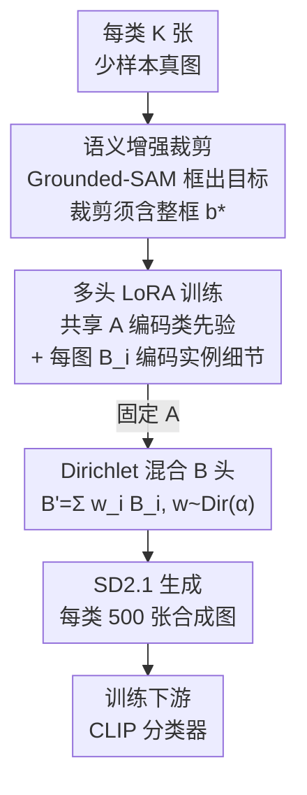

# ChimeraLoRA: Multi-Head LoRA-Guided Synthetic Datasets

**会议**: CVPR 2026  
**论文**: [CVF Open Access](https://openaccess.thecvf.com/content/CVPR2026/html/Kim_ChimeraLoRA_Multi-Head_LoRA-Guided_Synthetic_Datasets_CVPR_2026_paper.html)  
**代码**: https://cskhy16.github.io/chimeralora （项目页）  
**领域**: 图像生成 / 扩散模型  
**关键词**: 合成数据集, 多头LoRA, 扩散模型微调, 少样本, 长尾分类  

## 一句话总结
针对少样本/长尾场景缺数据的问题，ChimeraLoRA 把扩散模型的 LoRA 拆成「类共享的 A 编码类先验 + 每张图独占的 B 头编码实例细节」，再用 Dirichlet 权重把多个 B 头混合生成图像，同时用 Grounded-SAM 框约束裁剪保住目标物体，合成出的训练集既多样又细节丰富，9 个数据集下游分类平均比 SOTA 高 2.1 个点。

## 研究背景与动机
**领域现状**：在细粒度识别、医学影像这类专业域里，数据天然稀缺、还常是长尾分布，每个尾部类可能只有几张标注图。一个流行的补救办法是借预训练文生图扩散模型（Stable Diffusion）合成额外训练样本——但纯靠类名 text prompt 生成的图很容易偏离目标分布，反而拖低下游精度。

**现有痛点**：为了把合成图拉回真实分布，近期方法用少样本真图来引导扩散模型微调 LoRA，但卡在一个粒度二选一的两难上：
- **image-wise LoRA**（如 LoFT）：在单张参考图上训 LoRA，细节保真高，但生成结果几乎是这张图的复制，**多样性极差**；
- **class-wise LoRA**（如 DataDream）：在一个类的全部 shot 上训一个 LoRA，编码了类级先验、多样性好，但**忽略实例细节**，常画不准目标物体（比如生成不出完整的相机）。

**核心矛盾**：这个 trade-off 的根源是「只在单一粒度（要么图、要么类）上适配扩散模型」。多样性来自类级先验，保真来自实例细节，单粒度 LoRA 没法同时握住两端。

**切入角度**：作者注意到已有分析指出**单个 LoRA 内部 A 和 B 的角色本就不对称**——A 像一个与输入分布无关的投影（encoder），B 才真正贴合输入数据分布（decoder）。于是很自然地想到：让一份共享的 A 去吸收"这一类长什么样"的共性，让多份各自独立的 B 去记住"这一张图的个性"，就能在一个模型里同时统一类级泛化与图级保真。

**核心 idea**：用「一个共享 LoRA A（类先验）+ K 个 per-image LoRA B 头（实例细节）」的非对称多头结构微调扩散模型，生成时固定 A、用 Dirichlet 采样的权重混合 B 头，得到既多样又细节充足的合成训练集。

## 方法详解

### 整体框架
ChimeraLoRA 的目标是：给定每类 K 张少样本真图（论文主设定 K=4），产出一批多样且保真的合成图来扩充下游分类训练集。整条管线分三步走——先用 Grounded-SAM 给每张参考图框出目标物体（为后续语义裁剪服务），再在这些图上**联合训练**一个非对称多头 LoRA（共享 A + 每图一个 B），生成阶段固定 A、把 K 个 B 头按 Dirichlet 权重混成一个 $B'$ 接回 SD2.1 出图，最后用合成集训练 CLIP 分类器。

底层 LoRA 的形式是把权重更新近似为两个低秩矩阵之积：冻结预训练权重 $W_0 \in \mathbb{R}^{d_1\times d_2}$，引入可训练的 $B \in \mathbb{R}^{d_1\times r}$、$A \in \mathbb{R}^{r\times d_2}$（秩 $r \ll \min(d_1,d_2)$），等效权重为 $W_0 + BA$。ChimeraLoRA 的关键改动就是把这里的 $A$ 在一个类的全部图之间共享、而给每张图配一个独立的 $B_i$。

### 关键设计

**1. 非对称多头 LoRA：共享 A 抓类先验、每图 B 头抓实例细节**

这是全文的核心，直接对准"单粒度 LoRA 二选一"的痛点。作者把适配器拆成两半：一个在类内全部 K 张图之间**共享的 LoRA A**，和一组**每张图各自独占的 LoRA 头** $\mathcal{B}=\{B_i\}_{i=1}^K$。训练时冻住基扩散模型，联合优化 A 和所有 $B_i$。每张图 $x_i$ 上的重建损失是标准的扩散去噪目标

$$\mathcal{L}(A,B_i) := \mathbb{E}_{\epsilon\sim\mathcal{N}(0,1),\,t}\big[\,\|\epsilon - \epsilon_{\theta,A,B_i}(z_{i,t},t,\tau(y))\|_2^2\,\big]$$

其中 $z_{i,t}$ 是从增强视图 $f_{\text{aug}}(x_i)$ 得到的带噪 latent，$\tau(y)$ 是类名文本嵌入。共享 A 则在全部 K 张图上对各图目标取平均来优化：$\mathcal{L}(A,\mathcal{B}) = \frac{1}{K}\sum_{i=1}^K \mathcal{L}(A,B_i)$。初始化沿用原 LoRA 习惯——A 用高斯随机初始化、每个 $B_i$ 置零；为了让共享 A 稳定收敛，给 A 设比 B **更低的学习率**（实验里 A 用 $1\times10^{-4}$、B 用 $1\times10^{-3}$）。

为什么这样拆是有效的？作者给了一个 encoder/decoder 的解释并做了对照实验（图 8）：A 像 encoder，把特征投影到一个共享的 rank-$r$ 子空间；B 像 decoder，再把这个表示抬回完整模型空间。当少样本参考图共享同一类语义时，共享 encoder A 促成"类一致的编码"，而各自的 decoder B 负责重建高频结构与实例细节。论文还反向验证了一把：如果改成**共享 B、每图独立 A**，生成图看着更"花"但常常画不全目标（耳机被截断、订书机变形、摩托车缺内轮），印证了"该共享的是 A 不是 B"。顺带一提，因为 A 被共享，整体可训练参数比 LoFT/DataDream 少了 37.5%。

**2. 语义增强（Semantic Boosting）：用 Grounded-SAM 的检测框锁住目标，别被裁掉**

这一步专治"数据增强把目标物体裁飞"的问题。常规训练会对参考图做随机裁剪等增强，但裁剪很可能把目标主体切掉一块，导致和 text prompt 对不上、甚至训出来根本生不出目标类（论文图 3：不加这步、单张图训的 LoRA 给 "a photo of a car" 都画不出完整的车）。

具体做法：对带标签 $y$ 的图 $x$，用类名作 prompt 跑 Grounded-SAM 做文本条件检测，取高置信目标的**最小外接框** $b^\star$；然后采样一个带轻微缩放/平移抖动的裁剪区域 $R$，但**强制约束** $b^\star \subseteq R$——也就是裁剪框必须把整个目标框包进去。万一原图尺寸不够包住整框，就给原图**补零填充**，保证 $b^\star$ 始终完整可见、同时裁出的图能凑够目标尺寸。这样反复把"完整目标"喂给模型，模型不仅能稳定生成目标类，还更好地保住了目标的长宽比和细粒度结构（图 4）。和 KeepAugment/ContrastiveCrop 这类靠显著图或 object proposal 的增强相比，它直接用检测框**显式保证物体完整性**，而非软约束。

**3. Dirichlet 权重的 LoRA 头混合：生成阶段在类骨架上插实例细节**

训练完有了 K 个各管一张图的 $B_i$，但生成时只用单个 $B_i$ 仍只覆盖类内分布的一个点。作者改成**把 K 个头按非负权重凸组合**成一个新头：

$$B' = \sum_{i=1}^K w_i B_i,\qquad (w_1,\ldots,w_K)\sim \text{Dirichlet}(\alpha),\quad \alpha=\alpha\mathbf{1}_K$$

成形 $B'$ 后，把固定的共享 A 连同 $B'$ 一起挂回基扩散模型出图。对称 Dirichlet 下权重的均值方差为 $\mathbb{E}[w_i]=\frac{1}{K}$、$\mathrm{Var}[w_i]=\frac{K-1}{K^2(K\alpha+1)}$，浓度参数 $\alpha$ 直接调控混合在单纯形上的铺开程度：$\alpha<1$ 时分布稀疏、质量集中到某个 $B_i$，近似退回 **image-wise** 模式（保真高、多样低）；$\alpha>1$ 时权重向均匀向量聚拢，近似 **class-wise** 模式（多样高）；$\alpha=1$ 即在单纯形上均匀采样，论文默认用 $\text{Dir}(1)$ 且实测它给出最广的覆盖。妙在每生成一张图就重抽一组 $w$，等于每张图都在"类骨架 A"上挂一套不同的实例细节组合，自然得到既连贯又多样的样本。作者也讨论了工程权衡：每张图重建 $B'$ 会拖慢批量生成，可退而用 $w_i=1/K$ 的均匀混合（仍保真、覆盖尚可）或复用同一组 $w$ 配合扩散随机性补多样，但 per-image 的 $\text{Dir}(1)$ 覆盖最广。

### 损失函数 / 训练策略
训练目标就是上面的多头扩散去噪损失（式 3、4），基扩散模型 SD2.1 全程冻结，只更新共享 A 与各 B 头，A/B 用不同学习率（$1\times10^{-4}$ / $1\times10^{-3}$）。下游用 CLIP ViT-B/16，给图像与文本编码器各挂 rank-16 LoRA，在 4-shot 衍生出的合成集上 AdamW + cosine 退火训 60 epoch，学习率 $1\times10^{-4}$，每设定跑 3 个随机种子报均值方差。生成时引导尺度（guidance scale）取 2。

## 实验关键数据

### 主实验
**Few-shot（4-shot，每类再合成 500 张，共 504 张/类训 CLIP）**：ChimeraLoRA 在 9 个数据集上平均 74.6%，比最强 baseline LoFT 高 2.1pp，且**超过了纯 4-shot 真图的 71.8%**——而多数 baseline 加了合成数据反而还在 4-shot 真图之下，暴露出"合成-真实差距"。

| 方法 | AIR | CAR | DTD | EUR | FLO | PET | ISIC | AVG（9 集） |
|------|-----|-----|-----|-----|-----|-----|------|------|
| CLIP 4-shot（真图） | 41.3 | 74.3 | 62.0 | 83.5 | 89.9 | 93.3 | 19.6 | 71.8 |
| IsSynth | 39.9 | 71.5 | 60.1 | 73.4 | 89.0 | 91.6 | 23.8 | 70.1 |
| DataDream（class-wise） | 44.3 | 81.7 | 56.0 | 72.2 | 92.9 | 92.2 | 20.7 | 71.3 |
| LoFT（image-wise） | 41.7 | 78.0 | 58.0 | 85.0 | 91.3 | 92.4 | 25.6 | 72.5 |
| **ChimeraLoRA** | **46.0** | 79.6 | 61.6 | **86.3** | **93.4** | **93.4** | **29.2** | **74.6** |

医学皮肤病 ISIC 上提升尤其明显（29.2 vs LoFT 25.6、DataDream 20.7），说明在专业域、长尾域上"既多样又保真"的合成数据更值钱。

**长尾（一半类做头部≤500 真图、一半做尾部仅 4-shot，只给尾部类补 500 张合成图）**：ChimeraLoRA 在 5 个数据集上相对纯真图平均 +7.62pp，**尾部类专门看更是 +14.74pp**；在 ImageNet-100 上给尾部补合成图甚至连带提升了头部精度。

| 数据集 | 真图(Avg) | ChimeraLoRA(Avg) | 尾部 真图→本文 |
|--------|-----------|------------------|------|
| CIFAR-10 | 84.5 | **89.6** | 70.1 → **81.0** |
| EuroSAT | 56.4 | **74.5** | 13.6 → **51.3** |
| Flowers102 | 93.5 | **95.4** | 94.2 → **96.9** |

### 消融实验
**组件消融**（AIR/FLO，去掉两个组件就退化成 LoFT）：

| 多头 LoRA | 语义增强 | AIR | FLO | 说明 |
|:---:|:---:|-----|-----|------|
| ✗ | ✗ | 41.7 | 91.3 | 退化为 LoFT，最低 |
| ✓ | ✗ | 43.9 | 93.1 | 加类共享适配器，明显涨 |
| ✗ | ✓ | 44.4 | 92.2 | 仅加框约束裁剪也涨 |
| ✓ | ✓ | **46.0** | **93.4** | 两者叠加最佳 |

**合成-真实差距**（9 集平均，FID 在 CLIP 嵌入空间算、真 4-shot 为 0 基准）：

| 方法 | FID@4 ↓ | CLIP score ↑ | 质心相似度 ↑ |
|------|---------|--------------|------|
| DataDream | 0.23 | 29.67 | 87.8 |
| LoFT | 0.22 | 30.04 | 90.1 |
| **ChimeraLoRA** | **0.20** | **30.31** | **90.5** |

### 关键发现
- **两个组件没有谁普遍占优、但叠加互补**：单看 AIR 是语义增强(44.4)略胜多头(43.9)、FLO 反过来，组合后才同时拿到最好，说明它们针对的是不同失败模式（覆盖 vs 物体完整性）。
- **"共享谁"是关键而非细节**：共享 A 才对——换成共享 B 生成图更花却画不全目标，从机制上印证了 A=encoder/B=decoder 的非对称角色假设。
- **合成预算可缩**：合成图从 500 张往下减时 ChimeraLoRA 仍稳健且随量增长上升；反观 DataDream/LoFT 在 EUR、AIR 上越加越掉，暴露随规模放大的合成-真实差距。
- **覆盖度可视化**：t-SNE 上 ChimeraLoRA 的样本大体均匀铺在真锚点张成的区域内（单类覆盖 Cov(R;S)=0.93、Cov(S;R)=0.90 均最高），LoFT 塌缩成几个紧簇出近重复、DataDream 漂出真区域且保真低。

## 亮点与洞察
- **把"LoRA A/B 角色不对称"这条分析性观察落成一个生成式数据增强框架**：别人观察到 A 是输入无关投影、B 贴合数据分布，本文顺势让 A 共享承载类共性、B 独占承载实例个性，思路清爽且可解释。
- **Dirichlet 浓度 $\alpha$ 给了一个统一的"多样性↔保真"旋钮**：$\alpha<1$ 偏 image-wise、$\alpha>1$ 偏 class-wise，把以前两条对立路线收进一个连续谱里，工程上还能用均匀权重换吞吐。
- **用检测框做硬约束裁剪**这一手很实用：把"增强别把目标裁飞"从软约束（显著图）变成显式的 $b^\star\subseteq R$ + 补零保证，几乎零成本可迁移到任何需要保物体完整性的增强流程。
- **省参数还更强**：共享 A 让可训练参数比 baseline 少 37.5%，却拿到更好结果，对少样本场景尤其友好。

## 局限与展望
- 作者承认医学域验证有限：语义增强统一用通用的 Grounded-SAM，但医学场景里 MedSAM 这类领域工具可能更合适，简单替换工具是否够用还没充分证明，未来要在更多医学数据集和临床扰动下做鲁棒性分析。
- ⚠️ 方法依赖 Grounded-SAM 能可靠检测到目标框，对检测器失效的极端细粒度/罕见类别可能退化（论文未量化检测失败的影响）。
- 每图 K 个 B 头随类内样本数 K 扩展，K 很大时头数与混合开销会上升；论文主设定停在 4-shot，更大 K 下的可扩展性未深入。
- 生成阶段每张图重抽 Dirichlet 权重会拖慢批量生成，需在均匀混合 / 复用权重 / per-image 采样间做 wall-time–精度权衡。

## 相关工作与启发
- **vs LoFT（image-wise LoRA）**：LoFT 给每张图训独立 LoRA 并在采样时混合贡献，细节保真但多样性塌缩成近重复；ChimeraLoRA 多了一个共享 A 提供类骨架，把混合从"几张图之间"升级为"在统一类先验上插实例细节"，覆盖更广。
- **vs DataDream（class-wise LoRA）**：DataDream 在整类上训单个 LoRA，多样但丢实例细节、常画不准目标；本文用 per-image B 头补回实例保真，同时靠语义增强保住物体完整。
- **vs HydraLoRA / FedSA-LoRA / AsymLoRA**：这些非对称多头 LoRA 来自 NLP 指令微调/联邦学习，用专家路由或本地 B 头处理异质性；本文把"共享 A + 多 B 头"这一范式**首次落到扩散模型的少样本合成数据生成**上，并配 Dirichlet 混合与框约束裁剪两件适配生成任务的新部件。
- **vs KeepAugment / ContrastiveCrop / SAMAug**：同是语义保留的增强，前者靠显著图或 object proposal 做软引导、不保证裁剪后物体完整；本文用 Grounded-SAM 检测框做硬约束，显式确保完整目标进入训练。

## 评分
- 新颖性: ⭐⭐⭐⭐ 把非对称 LoRA 观察 + Dirichlet 混合 + 框约束裁剪三者组合到扩散合成数据上，思路新但单个部件多有前作。
- 实验充分度: ⭐⭐⭐⭐⭐ 11 个数据集涵盖细粒度/卫星/纹理/医学，few-shot 与长尾两套设定，组件/共享对象/预算/覆盖度消融齐全。
- 写作质量: ⭐⭐⭐⭐ 动机清晰、图示直观，encoder/decoder 解释到位；部分公式 OCR 较乱需对照原文。
- 价值: ⭐⭐⭐⭐ 少样本/长尾/专业域的合成数据增强非常实用，省参还更强，易复用。

<!-- RELATED:START -->

## 相关论文

- [\[CVPR 2026\] AHS: Adaptive Head Synthesis via Synthetic Data Augmentations](ahs_adaptive_head_synthesis.md)
- [\[CVPR 2026\] Quantization with Unified Adaptive Distillation to enable multi-LoRA based one-for-all Generative Vision Models on edge](quantization_with_unified_adaptive_distillation_to_enable_multi-lora_based_one-f.md)
- [\[CVPR 2026\] MapReduce LoRA: Advancing the Pareto Front in Multi-Preference Optimization for Generative Models](mapreduce_lora_advancing_the_pareto_front_in_multi-preference_optimization_for_g.md)
- [\[CVPR 2026\] InterEdit: Navigating Text-Guided Multi-Human 3D Motion Editing](interedit_navigating_textguided_multihuman_3d_moti.md)
- [\[ICML 2025\] Synthetic Face Datasets Generation via Latent Space Exploration from Brownian Identity Diffusion](../../ICML2025/image_generation/synthetic_face_datasets_generation_via_latent_space_exploration_from_brownian_id.md)

<!-- RELATED:END -->
