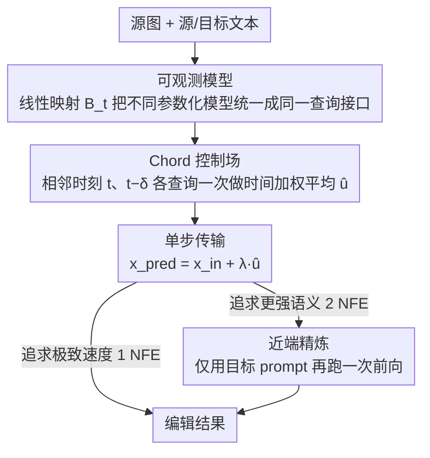

<!-- 由 src/gen_stubs.py 自动生成 -->
# ChordEdit: One-Step Low-Energy Transport for Image Editing

**会议**: CVPR 2026  
**arXiv**: [2602.19083](https://arxiv.org/abs/2602.19083)  
**代码**: 有 (项目页: [https://chordedit.github.io](https://chordedit.github.io))  
**领域**: 图像生成  
**关键词**: 图像编辑, 最优传输, 单步推理, 扩散蒸馏模型, 无训练编辑

## 一句话总结

基于动态最优传输理论，推导出低能量的 Chord 控制场，将不稳定的朴素编辑场平滑化，首次实现了对蒸馏单步 T2I 模型的无训练、无反演、高保真实时图像编辑。

## 研究背景与动机

### 1. 领域现状

单步文生图（T2I）模型如 SD-Turbo、SwiftBrush-v2、InstaFlow 等通过蒸馏大规模扩散模型实现了前所未有的生成速度，一次前向传播即可生成高质量图像。这种实时生成能力自然引发了将其应用于文本引导图像编辑的期望——如果生成只需一步，那编辑是否也能做到实时？

### 2. 现有痛点

现有的图像编辑方法存在两大阵营的困境：

- **多步方法**（DDIM+PnP、FlowEdit 等）：需要 30-50 步推理，运行时间在 7-80 秒量级，无法做到实时交互
- **单步有训练方法**（SwiftEdit）：需要训练专门的反演网络，牺牲了模型无关性（model-agnostic），且依赖精确反演
- **无训练差分方法**（InfEdit、FlowEdit）：在多步模型上效果不错，但在单步模型上彻底失败——出现严重的物体畸变和非编辑区域崩塌

### 3. 核心矛盾

单步模型的蒸馏过程使得文本条件到向量场的映射变得高度非线性和敏感。朴素的编辑场（目标 drift - 源 drift）本质上是两个大幅值、发散轨迹的算术差，产生一个不稳定的高能量控制场。在多步模型中，这种不稳定性通过迭代的小步积分被逐步消化；但在单步模型中，必须一步走完，巨大的积分步长将误差急剧放大，导致编辑完全失败。

### 4. 本文目标

如何在**无训练、无反演**的前提下，让单步 T2I 模型也能完成高保真的文本引导图像编辑，同时保持实时速度。

### 5. 切入角度

作者跳出了"对 drift 做简单算术"的思路，将编辑问题重新定义为一个**动态最优传输（OT）问题**——在源分布和目标分布之间寻找一条低能量的传输路径。从 Benamou-Brenier 框架出发，推导出一个理论上有保证的控制场估计器。

### 6. 核心 idea

用时间加权平均替代朴素差分，构造一个低能量、低方差的 Chord 控制场，使得单步大步长积分也能稳定完成编辑传输。

## 方法详解

### 整体框架

ChordEdit 想解决的是：让一个只跑一步的蒸馏 T2I 模型，在不训练、不反演的前提下完成文本引导编辑。它的关键转念在于——不再用"目标 drift 减源 drift"这种朴素差分去推图，而是把编辑重新表述成一个最优传输问题，求出一条能量更低、因而单步大步长也能稳住的控制场，沿它走一步即可。

整条流水线（Algorithm 1）其实只有三件事：先在两个相邻时间点 $t$ 和 $t-\delta$ 各查询一次模型，做时间加权平均得到 Chord 控制场 $\hat{u}$；再做一次单步传输 $x^{\rm pred} = x_{\rm in} + \lambda \hat{u}$；最后可选地对结果只用目标 prompt 跑一次前向，做"近端精炼"补强语义。输入是源图 $x_{\rm src}$、源/目标文本 $c_{\rm src}, c_{\rm tar}$ 以及四个超参 $t, \delta, \lambda, t_c$；整个编辑只需 1-2 次网络前向（NFE），耗时 0.20-0.38 秒。

### 关键设计

**1. 可观测模型：把不同参数化的单步模型统一成同一个查询接口**

单步模型五花八门——SD-Turbo 输出噪声预测、InstaFlow 输出速度预测，直接拿来做差会因为参数化口径不同而对不上。可观测模型先把编辑锚点固定在干净源图 $x_\tau = x_1$，通过前向加噪核 $K_t(\cdot|x_\tau)$ 合成一个带噪代理 $z$，再查询模型得到可观测输出 $Q(z, t, c)$；要害是引入一个与时间相关的线性映射 $\mathcal{B}_t$，把噪声预测、速度预测等不同输出都投影到同一个 drift/velocity 空间，由此定义可观测代理场

$$\mathbf{R}(x_\tau, t) = \mathbb{E}_{z \sim K_t}[\mathcal{B}_t \Delta Q(z, t)]$$

正是这个统一接口让 ChordEdit 做到模型无关（model-agnostic）——同一套公式能不加改动地套到三种不同的单步模型上。

**2. Chord 控制场：把朴素编辑场的能量压下去，让单步大步长不再爆炸**

这是全文的核心。朴素编辑场 $\mathbf{R}$ 本质是两条大幅值、发散轨迹的算术差，在单步极限下能量会激增（实验里步数 $S \to 1$ 时朴素场能量飙升、PSNR 崩塌）；多步模型能靠迭代小步积分把这种不稳定一点点消化掉，但单步必须一步走完，巨大的积分步长会把误差急剧放大。ChordEdit 换了个视角：把可观测场 $\mathbf{R}$ 看成真实场 $u_t$ 叠加了一个零均值噪声 $\varepsilon_t$ 的观测，在短时间窗 $[t-\delta, t]$ 内最小化一个严格凸的二次代理目标（一边压低递归能量先验、一边贴合新观测），解出的最优估计恰好是一个时间加权平均：

$$\hat{u}_t(x_\tau) = \frac{t \cdot \mathbf{R}(x_\tau, t-\delta) + \delta \cdot \mathbf{R}(x_\tau, t)}{t + \delta}$$

它本质上是一个因果单侧核平滑算子。之所以管用，是因为由 Jensen 不等式，时间平均直接给出 $L^2$ 收缩 $\int\|\hat{u}\|^2 \leq \int\|\mathbf{R}\|^2$；与此同时场的 $L^\infty$ 范数、时间导数和空间梯度一起被收缩，于是显式 Euler 的一致性常数 $\mathcal{C}(u)$ 变小，$h=1$ 步的全局 $O(h)$ 误差界被直接收紧——单步积分这才稳得住。

**3. 近端精炼：把"保结构"和"加语义"拆开，让用户按需权衡**

Chord 传输偏保守，结构保得很好（高 PSNR）但语义增强偏弱（CLIP 偏低）。近端精炼就是在传输结果 $x^{\rm pred}$ 上、只用目标 prompt $c_{\rm tar}$ 再额外跑一次前向：

$$\operatorname{prox}(x^{\rm pred}, t_c, c_{\rm tar}) = \mathcal{B}_{t_c} Q(x^{\rm pred}, t_c, c_{\rm tar})$$

这样结构保持交给传输、语义增强交给精炼，两者功能正交。它是可选的一步：要极致速度就跳过（1 NFE、0.20 秒），要更强的目标语义就加上（2 NFE、0.38 秒），权衡由用户自己拿捏。

### 损失函数 / 训练策略

ChordEdit 是**完全无训练**的方法。其核心公式（Eq. 4.5）来自最优传输理论的解析推导，无需任何学习过程。唯一需要调节的是推理阶段的超参数：

- $t=0.90$：步进时间点
- $\delta=0.15$：平滑窗口宽度（控制稳定性 vs 语义强度的权衡）
- $\lambda=1.00$：步长缩放
- $t_c=0.30$：近端精炼的噪声水平

## 实验关键数据

### 主实验

在 PIE-bench（700 样本、10 类编辑、512×512）上与多步/少步/单步方法全面对比：

| 类型 | 方法 | PSNR↑ | MSE↓(×10³) | LPIPS↓(×10³) | CLIP-Whole↑ | CLIP-Edited↑ | 无训练 | 无反演 | 步数 | NFE | 运行时间(s) | 显存(MiB) |
|------|------|-------|-----------|-------------|-------------|-------------|--------|--------|------|-----|------------|-----------|
| 多步 | DirectInv+PnP | 21.43 | 8.10 | 106.26 | 25.48 | 22.63 | ✓ | ✗ | 50 | 150 | 28.03 | 9262 |
| 多步 | FlowEdit (SD3) | 22.17 | 7.69 | 104.81 | **26.64** | **23.69** | ✓ | ✓ | 33 | 33 | 7.22 | 17140 |
| 少步 | InfEdit (SD1.4) | **24.14** | 6.82 | **55.69** | 24.89 | 21.88 | ✓ | ✓ | 4 | 4 | 1.41 | **6502** |
| 单步 | SwiftEdit | 21.71 | 8.22 | 91.22 | 24.93 | 21.85 | ✗ | ✗ | 1 | 2 | 0.54 | 15060 |
| 单步 | **ChordEdit (SD-Turbo)** | 22.20 | 6.84 | 128.25 | 25.58 | 22.96 | ✓ | ✓ | **1** | 2 | **0.38** | 6988 |
| 单步 | ChordEdit (w/o prox) | 23.89 | 5.05 | 88.36 | 24.97 | 21.87 | ✓ | ✓ | **1** | **1** | **0.20** | 6988 |

传输与精炼的消融实验：

| 方法 | 朴素场 PSNR↑ | 朴素场 CLIP-Edited↑ | Chord场 PSNR↑ | Chord场 CLIP-Edited↑ | NFE |
|------|-------------|-------------------|-------------|---------------------|-----|
| w/o prox | 21.89 | 20.83 | **23.89** | 21.87 | 1 |
| w/ prox | 21.38 | 21.96 | 22.20 | **22.96** | 2 |

### 消融实验

**模型无关性验证**：在三个不同的单步 T2I 模型上测试，ChordEdit 一致性地超越朴素基线：

| T2I 模型 | 朴素 PSNR | ChordEdit PSNR | 朴素 CLIP-Ed | ChordEdit CLIP-Ed |
|----------|----------|---------------|-------------|------------------|
| InstaFlow | 22.05 | **23.05** | 20.19 | **21.39** |
| SwiftBrush-v2 | 20.52 | **22.04** | 21.06 | **22.58** |
| SD-Turbo | 21.38 | **22.20** | 21.96 | **22.96** |

**噪声样本数分析**：$n=1$ 时 ChordEdit 的 Pareto 前沿与 $n=2,3,4$ 几乎重叠，且严格 Pareto 支配朴素方法的 $n=4$。跨 20 个种子的 CLIP CoV 仅 0.20%，PSNR CoV 仅 0.07%。

### 关键发现

1. **能量与稳定性关系**：当步数 $S \to 1$ 时，朴素场能量激增、PSNR 崩塌；Chord 场能量保持低位、PSNR 稳定
2. **Pareto 支配**：在 LPIPS-CLIP 权衡曲线上，ChordEdit（$\delta \neq 0$）严格 Pareto 支配朴素基线（$\delta = 0$）
3. **速度优势极其显著**：比 FlowEdit 快 19×，比 Direct Inversion 快 208×，显存仅为 SwiftEdit 的约 46%
4. **用户研究**：参与者在编辑语义（42.5%）和背景保持（48.3%）上均压倒性地偏好 ChordEdit

## 亮点与洞察

1. **理论优雅**：从动态最优传输（Benamou-Brenier）出发推导编辑控制场，而非启发式设计。Jensen 不等式直接保证能量收缩，一致性常数的收紧提供了单步积分的误差界保证
2. **极简实现**：核心公式仅一行加权平均（Eq. 4.5），无需额外网络、无需反演、无需掩码，真正的即插即用
3. **模块化解耦**：将问题拆分为"结构保持的低能传输"+"可选的语义增强精炼"，两步功能正交，用户可灵活选择
4. **单噪声即够**：证明了 Chord 场的内在低方差特性使得 Monte Carlo 平均变得不必要，$n=1$ 即可获得种子鲁棒的结果
5. **参数化统一**：通过线性映射 $\mathcal{B}_t$ 的设计，将噪声预测、速度预测等不同参数化模型统一到同一框架

## 局限与展望

1. **LPIPS 指标偏高**：完整 ChordEdit（含 prox）的 LPIPS 为 128.25，高于 InfEdit 的 55.69，说明近端精炼在增强语义的同时牺牲了感知相似度
2. **编辑强度有限**：作为无训练方法，对复杂的结构性编辑（如大幅度姿态变化）可能力不从心
3. **超参数敏感**：$\delta$ 控制稳定性 vs 语义的权衡，$t_c$ 控制精炼强度，不同编辑场景可能需要不同的超参组合
4. **仅限文本引导**：当前仅支持 source/target prompt 对的编辑模式，未扩展到其他编辑控制方式（如图像参考、区域掩码等）
5. **扩展方向**：可探索自适应 $\delta$ 选择策略、与注意力控制方法结合、或将 OT 框架推广到视频编辑

## 相关工作与启发

- **FlowEdit**：同为无训练无反演方法，但依赖多步积分来平均不稳定性；ChordEdit 从理论层面解决了单步问题
- **SwiftEdit**：唯一的单步编辑竞争者，但需训练反演网络且显存开销大（15GB vs 7GB）
- **InfEdit**：少步方法中背景保持最好（PSNR 24.14），但仍需 4 步推理
- **动态 OT 启发**：将 Benamou-Brenier 框架应用于生成模型编辑是新颖的视角，可能启发更多 OT-guided 的生成控制方法

## 评分

⭐⭐⭐⭐ — 理论推导扎实优雅、方法极简高效、模型无关性强，是单步图像编辑领域的重要突破。LPIPS 偏高和编辑强度有限是主要不足，但核心贡献（低能量传输场的理论保证+实时性能）极具价值。

## 评分
- 新颖性: 待评
- 实验充分度: 待评
- 写作质量: 待评
- 价值: 待评

<!-- RELATED:START -->

## 相关论文

- [\[CVPR 2026\] Language-Free Generative Editing from One Visual Example](language-free_generative_editing_from_one_visual_example.md)
- [\[CVPR 2026\] Low-Resolution Editing is All You Need for High-Resolution Editing](low-resolution_editing_is_all_you_need_for_high-resolution_editing.md)
- [\[CVPR 2026\] WaDi: Weight Direction-aware Distillation for One-step Image Synthesis](wadi_weight_direction-aware_distillation_for_one-step_image_synthesis.md)
- [\[CVPR 2026\] Extending One-Step Image Generation from Class Labels to Text via Discriminative Text Representation](emf_meanflow_text_to_image.md)
- [\[CVPR 2025\] SwiftEdit: Lightning Fast Text-Guided Image Editing via One-Step Diffusion](../../CVPR2025/image_generation/swiftedit_lightning_fast_text-guided_image_editing_via_one-step_diffusion.md)

<!-- RELATED:END -->
