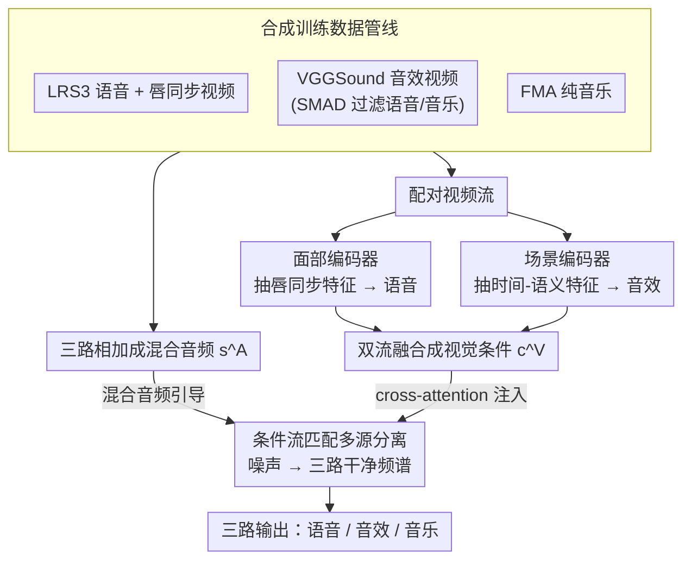

# Cinematic Audio Source Separation Using Visual Cues

**会议**: CVPR 2026  
**arXiv**: [2603.26113](https://arxiv.org/abs/2603.26113)  
**代码**: [项目页](https://cass-flowmatching.github.io)  
**领域**: Image Generation (音视频多模态)  
**关键词**: 影视音频源分离, 音视频学习, 条件流匹配, 合成训练数据, 多源分离

## 一句话总结

提出首个音视频影视音频源分离（AV-CASS）框架，利用面部和场景双视频流的视觉线索，通过条件流匹配进行生成式三路音频分离（语音/音效/音乐），仅在合成数据上训练即可泛化到真实电影。

## 研究背景与动机

**领域现状**：影视音频源分离（CASS）随 DnR 数据集的引入被形式化为语音/音效/音乐三路分离问题。BandIt 等方法推进了音频端性能，但所有现有方法都忽略了电影的多模态本质。

**现有痛点**：(a) CASS 方法均为纯音频，忽略了视觉线索（唇动对应语音、场景动作对应音效）；(b) 缺少同时具有源分离音轨和时间对齐视频的数据集；(c) 预测式分离模型容易产生频谱空洞伪影。

**核心矛盾**：视觉信息显然有助于音频分离，但获取真实电影的独立音轨几乎不可能。

**本文目标**：在无法获取真实隔离音轨的情况下，利用可独立获取的野外音视频数据训练有效的 AV-CASS 模型。

**切入角度**：合成训练数据管线（面部视频→语音、场景视频→音效、纯音乐）+ 生成式流匹配分离模型。

**核心 idea**：训练用双视频流（面部+场景），推理时从真实电影单视频中提取双流，零样本泛化。

## 方法详解

### 整体框架

这篇论文要解决的是带画面的电影音频分离：给一段电影的混合音轨和对应视频，把它拆成语音、音效、音乐三路，并且让视觉画面来帮忙判断哪段声音该归到哪一路。整条流水线分两半。前半是双流视觉编码器，它从视频里同时抽两路视觉信号——一路盯着人脸（唇动对应说话），一路看整个场景（动作、物体对应音效）——把两者融成统一的视觉条件 $\mathbf{c}^V$。后半是一个条件流匹配（conditional flow matching）生成模型，它不去预测「保留哪些频谱、抹掉哪些频谱」的掩码，而是从纯噪声出发、以混合音频 $\mathbf{s}^A$ 和视觉条件 $\mathbf{c}^V$ 为引导，一步步生成出三路干净频谱图。而模型能学起来的前提是有训练数据，这正是论文的第一个贡献——用各自独立的野外单源音视频「凑」出带真值的混合。训练时双视觉流来自各自独立的源视频，推理时则从同一段真实电影里就地抽出人脸流和场景流，整个范式不改架构就能从合成数据迁移到真实电影。

### 关键设计

**1. 合成训练数据管线：用「凑」出来的混合补上真实音轨拿不到的坑**

AV-CASS 最大的现实障碍是没有数据——真实电影的独立语音/音效/音乐音轨几乎不可能拿到，更别说还要配上时间对齐的视频。论文绕开这个死结的办法是反过来合成：每一路单源的「音频+视频」数据其实在野外非常丰富，于是分别取语音用 LRS3（唇同步视频+语音，152K 片段）、音效用 VGGSound（日常事件的视频+音频，并用 SMAD 过滤掉夹带语音或音乐的片段，约 62K）、音乐用 FMA（纯音乐，过滤后约 49K），再直接相加成混合 $\mathbf{a}^A = \mathbf{a}^{DX} + \mathbf{a}^{FX} + \mathbf{a}^{MX}$。这样混合是自己拼的，每一路的真值天然完整可控，而每路又都自带匹配的视频流，正好喂给后面的双流视觉编码器。

**2. 双流视觉编码器与融合：让人脸管语音、场景管音效，互补覆盖有画面的两路**

视觉线索之所以能帮上分离，是因为 CASS 三路里有两路天然和画面挂钩——人在说话时唇动同步于语音，场景里发生的动作/物体同步于音效。论文据此设两路编码器：面部编码器（来自 AVDiffuSS）抽唇同步特征，场景编码器（来自 CAVP）抽时间-语义对齐特征，两者都冻结不训练，各自投影后沿时间轴拼成 $\mathbf{c}^V \in \mathbb{R}^{(T_f+T_s) \times C'}$，再通过 U-Net 的 cross-attention 注入生成模型。一路对应语音、一路对应音效，刚好把三路里有视觉关联的两路补齐；音乐没有稳定的视觉对应物，所以不强行给它配视觉流。

**3. 条件流匹配多源分离：用生成代替掩码，换更快的推理和更自然的音频**

有了视觉条件，剩下的问题是怎么把三路声音生成出来。论文不走传统的频谱掩码（预测式分离常在掩码处留下频谱空洞、产生伪影），而是用条件流匹配：把三路频谱图沿通道维拼在一起当作目标 $\mathbf{x}_1$，从噪声 $\mathbf{x}_0$ 出发学一个速度场把噪声直线推向干净频谱，训练目标是

$$\mathcal{L} = \mathbb{E}_{t, \pi_1, \pi_0} \|\mathbf{u}_\theta(\mathbf{x}_t, t \mid \mathbf{c}) - (\mathbf{x}_1 - \mathbf{x}_0)\|_2^2$$

其中条件 $\mathbf{c}$ 同时含混合音频和视觉条件，时间步用 logit-normal 采样（把训练算力更多压在中间噪声水平上）。相比扩散，流匹配的直线路径让推理步数更少、更快；相比掩码，它是直接「画」出干净频谱，因此音频听感更自然、没有空洞伪影。

### 训练策略

为了不让模型一上来就过度依赖视觉，训练采两段式：先做纯音频去噪预热，把音频分离本身学稳；再用 ControlNet 式的零初始化卷积把视觉条件渐进引入，让视觉从「零贡献」慢慢加权进来。优化用 Adam、学习率 1e-4、训练 600K 步、4×RTX 4090，推理 128 步。

## 实验关键数据

### 主实验

| 方法 | 真实电影MOS↑ | AVDnR FAD↓ | AVDnR PESQ↑ | AVDnR WPR↓ |
|------|------------|-----------|-------------|-----------|
| MRX | 2.55 | 3.47 | 1.89 | 14.91 |
| BandIt | 3.78 | 2.15 | 2.15 | 4.65 |
| DAVIS-Flow (AV) | - | 5.94 | 1.96 | 12.14 |
| **AV-CASS** | **4.13** | **0.84** | **2.26** | **1.84** |

### 消融实验

| 配置 | FAD↓ | WPR↓ | 说明 |
|------|------|------|------|
| Audio-only | 1.63 | 2.01 | 纯音频基线 |
| AV-CASS | **0.84** | **1.84** | 视觉条件提升 48% FAD |
| DAVIS-Flow | 5.94 | 12.14 | 通用AV分离不适用于CASS |

### 关键发现

1. 视觉线索使 FAD 从 1.63 降至 0.84（提升 48%），WPR 从 2.01 降至 1.84。
2. 定性分析：鸟鸣在纯音频模型中被误分为音乐，AV-CASS 通过场景中的鸟正确分配到音效。
3. 合成训练→真实电影泛化成功（MOS 4.13/5）。
4. CASS ≠ 通用 AV 分离：DAVIS-Flow 在 FX 上 WPR 低但 DX/MX 极差。

## 亮点与洞察

- 训推范式转换优雅：训练双视频流（独立源），推理从单电影提取面部+场景双流，无需架构修改。
- 流匹配在音频分离中展现出色感知质量。
- WPR 指标创新——衡量跨轨泄漏，无需GT参考。
- 音频预热 + 视觉渐进注入防止过早依赖视觉。

## 局限与展望

- 音乐无视觉关联，视觉对 MX 分离增益有限。
- 128 步推理较慢，可探索蒸馏加速。
- 仅 16kHz mono，影视级 48kHz 多声道待验证。

## 相关工作与启发

- 合成训练→真实泛化的范式对其他缺乏配对数据的多模态任务有启发。
- 条件流匹配在音频生成中的应用正快速扩展。

## 评分

- 新颖性: ⭐⭐⭐⭐⭐ 首个AV-CASS + 合成管线 + 双流设计
- 实验充分度: ⭐⭐⭐⭐⭐ 真实电影MOS + 合成测试全指标 + 公开基准
- 写作质量: ⭐⭐⭐⭐⭐ 逻辑清晰，动机充分
- 价值: ⭐⭐⭐⭐⭐ 开辟AV-CASS新方向，影视后期直接应用

<!-- RELATED:START -->

## 相关论文

- [\[CVPR 2026\] Preserving Source Video Realism: High-Fidelity Face Swapping for Cinematic Quality](preserving_source_video_realism_high-fidelity_face_swapping_for_cinematic_qualit.md)
- [\[AAAI 2026\] MACS: Multi-source Audio-to-Image Generation with Contextual Significance and Semantic Alignment](../../AAAI2026/image_generation/macs_multi-source_audio-to-image_generation_with_contextual_significance_and_sem.md)
- [\[CVPR 2026\] Probing and Bridging Geometry–Interaction Cues for Affordance Reasoning in Vision Foundation Models](probing_and_bridging_geometry-interaction_cues_for_affordance_reasoning_in_visio.md)
- [\[NeurIPS 2025\] A Data-Driven Prism: Multi-View Source Separation with Diffusion Model Priors](../../NeurIPS2025/image_generation/a_data-driven_prism_multi-view_source_separation_with_diffusion_model_priors.md)
- [\[ICML 2026\] From Talking to Singing: A New Challenge for Audio-Visual Deepfake Detection](../../ICML2026/image_generation/from_talking_to_singing_a_new_challenge_for_audio-visual_deepfake_detection.md)

<!-- RELATED:END -->
