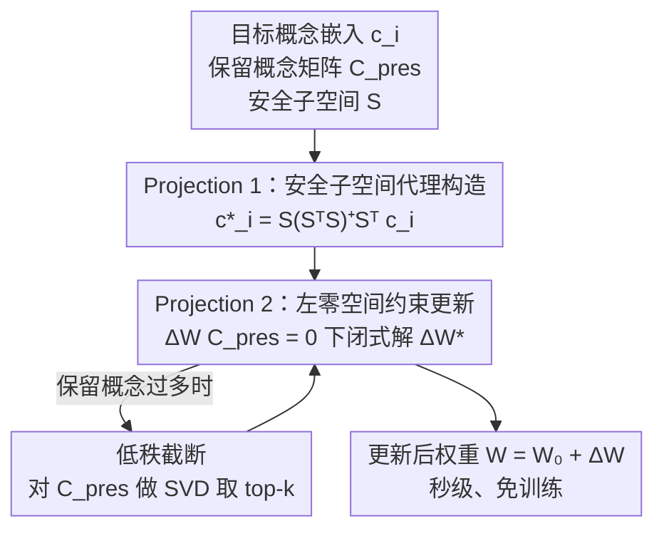

# Closed-Form Concept Erasure via Double Projections

**会议**: CVPR 2026  
**论文**: [CVF Open Access](https://openaccess.thecvf.com/content/CVPR2026/html/Zhang_Closed-Form_Concept_Erasure_via_Double_Projections_CVPR_2026_paper.html)  
**代码**: 有（论文摘要给出链接）  
**领域**: 图像生成 / 扩散模型 / AI安全  
**关键词**: 概念擦除, 扩散模型, 闭式解, 零空间投影, 模型编辑  

## 一句话总结
本文提出 Double Projections（DP），把扩散/流匹配模型的「概念擦除」改写成两步闭式投影——先把目标概念投影到「安全子空间」得到代理向量，再把权重更新约束在保留概念的左零空间里——从而在秒级、免训练的前提下既擦干净目标概念，又几乎不损伤无关概念。

## 研究背景与动机
**领域现状**：扩散（Stable Diffusion）与流匹配（FLUX）等生成模型能力很强，但会复现版权内容、生成有害/有偏图像。于是出现了「概念擦除」这条线——选择性地从模型表征里抹掉某个物体、画风或身份。现有做法包括微调（ESD）、交叉注意力编辑（UCE）、剪枝（ConceptPrune）、对抗引导（AGE）等。

**现有痛点**：迭代优化类方法（ESD/CP/AGE）擦除效果不错，但需要分钟到小时级的训练，且容易「误伤」——在抹掉目标概念的同时让无关概念也掉点（表 1 里 ESD、CP 在保留概念上的掉点常超过 20%）。

**核心矛盾**：擦除（erasure）和保留（preservation）这两个目标天然耦合。即便是已有的闭式方法 UCE，虽然在最小二乘目标里显式加了保留项，仍不能保证无关概念不被扰动。本文用一个几何直觉点破原因：最小二乘只是让全局损失最小的「最佳拟合线」，并不保证每个概念点都落在线上——当目标概念与保留概念在隐空间里相关/非正交时，保留概念照样会偏离。论文用 Theorem 3.1 把这件事量化：在单目标编辑下，对保留向量 $p$ 的扰动满足 $\|\Delta W p\|_2 \ge \lambda \|\Delta W c\|_2$，即只要 $p$ 与目标 $c$ 方向有重叠（$\lambda>0$），保留概念就会跟着被改。

**本文目标**：在保持闭式、免训练、秒级的前提下，给「保留无关概念」提供可证明的几何保证，而不是靠损失项软约束去碰运气。

**核心 idea**：把擦除拆成两步几何投影——第一步把目标概念「净化」到安全子空间得到代理目标，第二步把权重改动强行限制在保留概念的**左零空间**里，使得更新对保留概念正交、从数学上保证 0 扰动。两步都有闭式解。

## 方法详解

### 整体框架
DP 编辑的对象是预训练模型里的一个线性映射 $W_0\in\mathbb{R}^{p\times n}$（实践中是注意力的 Key/Value 矩阵，FLUX 上是 embedding 层）。输入是若干要擦的目标概念嵌入 $c_i$、一组要保留的概念矩阵 $C_{\text{pres}}=[c_1,\dots,c_m]$，以及一个由「安全概念」张成的安全子空间 $S$；输出是一个修改后的 $W=W_0+\Delta W$，让它在目标提示词上不再生成目标内容、在保留提示词上行为不变。

形式上 DP 要解的是对 $\Delta W$ 与代理向量 $c_i^*$ 的联合优化：
$$\min_{W,\,c_i^*\in S}\ \|W c_i - W_0 c_i^*\|_2^2 + \|W C_{\text{pres}} - W_0 C_{\text{pres}}\|_F^2$$
第一项要求把目标概念 $c_i$ 映射到一个「中性代理」$W_0 c_i^*$（即擦除），第二项要求在保留概念上不动。这本是个交替优化问题（同时求 $W$ 和 $c_i^*$），一般要迭代梯度下降；DP 的贡献是把它拆成两步、每步都给出闭式解，整条流程如下：

### 关键设计

**1. Projection 1：在安全子空间里构造代理向量，给目标概念「净化」**

擦除的第一步要先想清楚「把目标概念替换成什么」。UCE 直接挑一个中性锚点当代理 $c_i^*$，但这个锚点可能仍带有会干扰保留概念的方向分量。DP 改成：把目标概念 $c_i$ 正交投影到由若干安全概念张成的子空间 $S\in\mathbb{R}^{n\times k}$ 上，
$$c_i^* = \mathrm{proj}_S(c_i) = S(S^\top S)^{+}S^\top c_i,$$
其中 $(S^\top S)^{+}$ 是 Moore–Penrose 伪逆，保证即便基向量线性相关投影也有效。这一步抽取的是目标概念落在「安全（非目标）方向」里的成分，等于把那些会干扰保留概念的方向先滤掉。作者指出这一步是**可选**的：用更丰富的安全子空间 $S$ 会让后续更新幅度 $\|\Delta W\|_F$ 更小、对原模型扰动更轻；而当 $S$ 退化为单个概念向量（$k=1$）时，Eq.(9) 就坍缩回 UCE 的情形——也就是说 DP 把 UCE 当成自己的特例。

**2. Projection 2：把更新约束到保留概念的左零空间，换取可证明的零扰动**

这是 DP 真正不可省的一步，也是它和所有已有闭式方法拉开差距的地方。前面 Theorem 3.1 说明：只要更新方向和保留概念有重叠，保留概念就会被改。DP 的对策很直接——**强制让更新对保留概念正交**：把 $\Delta W$ 限制在 $C_{\text{pres}}$ 的左零空间里，即 $\Delta W\,C_{\text{pres}}=0$。这样任何 $v\in\mathrm{col}(C_{\text{pres}})$ 都有 $W v = W_0 v$，保留概念被**精确**保住（Theorem 4.1）。

落到求解上：设 $U_2\in\mathbb{R}^{n\times(n-r)}$ 是 $C_{\text{pres}}$ 左零空间的标准正交基（$r=\mathrm{rank}(C_{\text{pres}})$），任何可行更新都能写成 $\Delta W = Z\,U_2^\top$。令 $x = U_2^\top c_i$、$b = W_0(c_i^* - c_i)$，约束最小二乘 $\min_Z\|Zx-b\|_2^2$ 的最小范数解为
$$Z^\star = \frac{b\,x^\top}{\|x\|_2^2},\qquad \Delta W^\star = \frac{W_0(c_i^*-c_i)\,x^\top}{\|x\|_2^2}\,U_2^\top.$$
全程没有任何迭代或梯度，纯解析。之所以有效，是因为它把「保留」从软约束（损失项里的一项，可能被全局最优牺牲掉）升级成了**硬约束**（零空间几何，结构上就不可能动到保留概念），代价只是擦除自由度从整个空间缩到 $n-r$ 维。

**3. 低秩截断：保留概念很多时的可扩展近似**

当 $C_{\text{pres}}$ 包含大量概念时，左零空间会被压得很小、擦除自由度不够。DP 对 $C_{\text{pres}}$ 做 SVD $C_{\text{pres}}=U_1\Sigma V^\top$，只保留前 $k$ 个主奇异方向 $U_{1,k}$，把更新改成 $\Delta W=Z\,U_{2,k}^\top$，仍是闭式解。这相当于「只严格保护能量最大的那批保留方向、放弃冗余的低能量方向」，换来更大的擦除空间。论文给了对应的误差界：保留扰动被第 $k+1$ 个奇异值控制 $\|(W'-W_0)p_i\|_2\le\|Z^\star\|_2\,\sigma_{k+1}(C_{\text{pres}})$（Theorem 4.2，当 $k=r$ 时右端归零、退回精确保留），以及擦除强度的下界（Theorem 4.3）。另外论文借 AGE 的观察指出：擦一个概念主要只影响语义相邻的一小簇概念，所以 $C_{\text{pres}}$ 本来就可以只取一个紧凑的相关子集，不必把所有概念都塞进去。

### 损失函数 / 训练策略
没有训练。$c_i^*$ 和 $C_{\text{pres}}$ 在所有层间共享，两步投影都是解析闭式更新，整套编辑在 GPU 上秒级完成（SD1.4 上约 7.4 秒），无需采样图像或对生成模型反传。

## 实验关键数据

### 主实验
评测在 SD1.4 / SD1.5 / FLUX 上做物体擦除（10 个 ImageNet 类，ResNet-50 Top-1 准确率）和画风擦除（5 位艺术家，CLIP 文图相似度）。两个指标都是越低越好：目标类的 Erased Accuracy 越低说明擦得越干净，其余类的 Preservation Drop 越低说明对无关概念伤害越小。

SD1.4 物体擦除（表 1，10 类均值；原始准确率 85.9）：

| 方法 | Erased Acc ↓ | Preservation Drop ↓ | 备注 |
|------|------|------|------|
| ESD | 7.2 | 19.5 | 迭代微调，保留掉点大 |
| ConceptPrune | 5.7 | 32.5 | 剪枝，误伤最严重 |
| AGE | 9.6 | 5.6 | 对抗引导 |
| UCE | 7.8 | 6.7 | 闭式但保留约束弱 |
| **DP（本文）** | **0.8** | **2.4** | 擦除最干净、保留最好 |

SD1.4 画风擦除（表 2，5 位艺术家均值；原始 CLIP 79.5 / 90.3）：

| 方法 | Erased ↓ | Preservation Drop ↓ |
|------|------|------|
| ESD | 21.0 | 8.8 |
| ConceptPrune | 19.2 | 16.7 |
| AGE | 17.2 | 6.7 |
| UCE | 14.5 | 1.1 |
| **DP（本文）** | **11.7** | **0.5** |

FLUX 流匹配模型物体擦除（表 3，均值；ESD/剪枝/对抗方法不适用流匹配，故只比 UCE）：

| 方法 | Erased Acc ↓ | Preservation Drop ↓ |
|------|------|------|
| UCE | 23.9 | 2.2 |
| **DP（本文）** | **1.0** | **0.6** |

DP 在 FLUX 上把残余准确率压到近 0，而 UCE 在 Church、Gas Pump 等复杂类上仍有较高残留，说明单步线性投影没能完全刻画流场的几何结构。

### 效率与消融

| 对比维度 | 配置 | 结果 | 说明 |
|------|------|------|------|
| 计算耗时（图 2，SD1.4/3090） | ESD | 11.2 min | 迭代优化 |
| | ConceptPrune | 6.2 min | 迭代剪枝 |
| | AGE | 91.4 min | 对抗，最慢 |
| | UCE | 7.2 s | 闭式 |
| | **DP（本文）** | **7.4 s** | 闭式，与 UCE 同量级 |
| Projection 1 | 去掉（直接指定 UCE 式代理） | 仍可用，但 $\|\Delta W\|_F$ 更大 | 第一步可选，作用是减小更新幅度 |
| Projection 2 | 去掉零空间约束 | 退化为 UCE，保留掉点变大 | 第二步必需，是零扰动保证来源 |

### 关键发现
- **贡献最大的是 Projection 2（零空间约束）**：它把保留从软约束变成硬约束，是 DP 在保留掉点上全面碾压（物体 2.4 vs UCE 6.7、风格 0.5 vs UCE 1.1）的根因。Projection 1 是锦上添花，去掉只是更新幅度变大。
- **闭式 ≠ 好解**：UCE 同样是闭式秒级，但保留项只是损失里的一项、会被全局最优牺牲；DP 用几何结构保证保留，说明「快」和「不误伤」可以兼得。
- **跨架构泛化**：DP 在扩散和流匹配两类完全不同的生成范式上都近零残留，因为它只操作线性映射、不依赖模型特定的生成动力学。
- **为什么没有完美保留？**⚠️ DP 理论上应零扰动，但实测保留仍有微小掉点。论文归因于扩散模型里的位置编码 $z_j=c_j+q_j$：DP 只保证 $\Delta W c_j=0$，位置项 $q_j$ 的加性耦合（以及编码器自注意力的跨 token 交互）带来小而一致的偏差；在 FLUX 上改为对 embedding 层做擦除可以绕开位置编码、得到更干净的保留。

## 亮点与洞察
- **把「保留」从损失项升级成几何硬约束**：用左零空间投影把无关概念的不变性变成结构上不可违反的约束，比在最小二乘里加一项软惩罚靠谱得多——这是最核心的「啊哈」。
- **UCE 是 DP 的特例**：安全子空间退化到单概念（$k=1$）时 DP 坍缩回 UCE，说明 DP 是对已有闭式方法的严格推广，迁移代价低。
- **诊断先于方法**：作者先用 Theorem 3.1 把「闭式≠好解」量化（保留扰动 $\ge\lambda$ 倍目标扰动），再针对性设计零空间约束，方法动机非常具体而非套话。
- **可迁移性**：零空间/子空间约束的思路可搬到任何「编辑某线性层、又想锁住一部分方向」的场景，如 LLM 的 MLP 编辑（论文提到 nullspace editing 在 LLM 上做 MLP，本文做视觉模型的注意力/embedding 层）。

## 局限与展望
- **保留并非完美**：位置编码与自注意力的耦合让理论上的零扰动在实践中打折，作者只能在 FLUX 上靠改编辑层规避，扩散模型上的小偏差尚未根治。
- **依赖安全子空间/保留集的选取**：$S$ 和 $C_{\text{pres}}$ 选得好坏直接影响效果，论文用 AGE 的「局部性」假设来缩小 $C_{\text{pres}}$，但如何自动构造最优安全子空间没有系统化方案。⚠️ 安全集选择的鲁棒性、对抗鲁棒性（被改写 prompt 绕过擦除）未在正文充分评测。
- **只擦线性层**：方法作用于注意力 Key/Value 或 embedding 这类线性映射，对分布在非线性结构里的概念表征是否够用，仍是开放问题。
- **改进思路**：把位置编码也纳入零空间约束的设计，或为多概念擦除给出全局最优的子空间共享方案，可能进一步逼近完美保留。

## 相关工作与启发
- **vs UCE**：两者都是闭式、秒级、操作注意力线性映射。UCE 用最小二乘软约束保留，会因全局最优牺牲保留概念；DP 用左零空间硬约束 + 安全子空间代理，保留掉点全面更低（FLUX 上 0.6 vs 2.2），且把 UCE 当成自己的特例。
- **vs ESD / ConceptPrune / AGE**：这些迭代/剪枝/对抗方法擦除有效但慢（6 分钟到 90 分钟）、误伤大（保留掉点 5.6%–32.5%），且剪枝/对抗类无法用于流匹配模型；DP 秒级、跨架构、保留最好。
- **vs LLM 的 nullspace editing**：同样用零空间编辑思想，但已有工作针对 LLM 的 MLP 层；本文把它落到视觉生成模型的注意力与 embedding 层，并补上安全子空间代理这一步。

## 评分
- 新颖性: ⭐⭐⭐⭐ 把概念擦除重述为两步闭式投影、用左零空间给出可证明的保留保证，几何视角清晰且把 UCE 纳为特例。
- 实验充分度: ⭐⭐⭐⭐ 覆盖 SD1.4/1.5/FLUX、物体与画风两类任务、含耗时对比，但正文消融偏定性，多数细节（LPIPS/FID、SD1.5、对抗鲁棒）压在附录。
- 写作质量: ⭐⭐⭐⭐⭐ 先诊断「闭式≠好解」再给方法，定理与几何直觉穿插，动机扎实、推导干净。
- 价值: ⭐⭐⭐⭐ 秒级、免训练、可直接 drop-in 的概念擦除工具，对生成模型安全编辑实用性强。

<!-- RELATED:START -->

## 相关论文

- [\[CVPR 2026\] Neighbor-Aware Localized Concept Erasure in Text-to-Image Diffusion Models](neighbor-aware_localized_concept_erasure_in_text-to-image_diffusion_models.md)
- [\[CVPR 2026\] Beyond Text Prompts: Precise Concept Erasure through Text–Image Collaboration](beyond_text_prompts_precise_concept_erasure_through_text-image_collaboration.md)
- [\[CVPR 2026\] Prototype-Guided Concept Erasure in Diffusion Models](prototype-guided_concept_erasure_in_diffusion_models.md)
- [\[AAAI 2026\] Mass Concept Erasure in Diffusion Models with Concept Hierarchy](../../AAAI2026/image_generation/mass_concept_erasure_in_diffusion_models_with_concept_hierarchy.md)
- [\[CVPR 2026\] MapRoute: Semantic Routing for Precise Concept Erasure with Mapper](maproute_semantic_routing_concept_erasure.md)

<!-- RELATED:END -->
