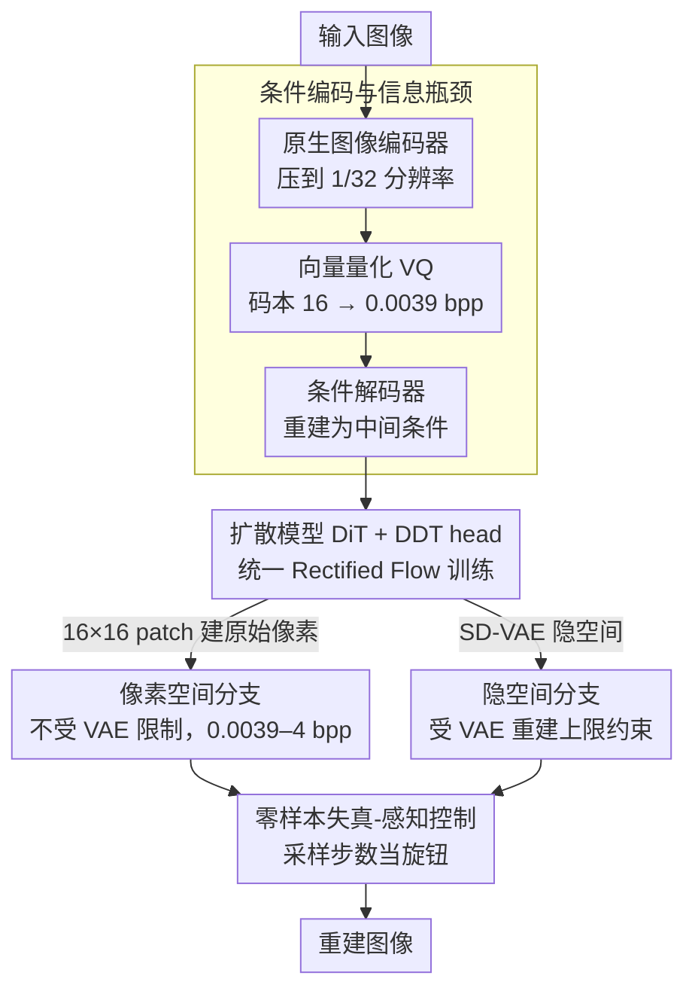

# CoD: A Diffusion Foundation Model for Image Compression

**会议**: CVPR 2026  
**arXiv**: [2511.18706](https://arxiv.org/abs/2511.18706)  
**代码**: [GitHub](https://github.com/microsoft/GenCodec/tree/main/CoD)  
**领域**: 图像压缩 / 扩散模型  
**关键词**: 压缩导向扩散, 基础模型, rectified flow, 像素空间扩散, 率失真感知

## 一句话总结

提出首个面向压缩的扩散基础模型 CoD，从零训练学习端到端的压缩-生成联合优化，替换 Stable Diffusion 后在下游扩散编解码器中实现超低码率（0.0039 bpp）下的 SOTA 性能，训练成本仅为 SD 的 0.3%。

## 研究背景与动机

现有扩散编解码器（PerCo、DiffEIC、OSCAR 等）通常构建在 Stable Diffusion 之上以继承其生成先验。但文本条件从压缩角度看是次优的：

**文本描述能力有限**：人类文本难以精细描述自然图像的空间和纹理细节。

**离散词汇不可微**：文本编码器（如 BLIP-2）和扩散模型（如 SD）无法做联合端到端优化，无法进行率失真优化。

**实证证据**：DiffC 的零样本实验表明文本条件在低码率时实际上**损害**压缩性能。

核心洞察：如果把图像字幕生成器看作编码器、扩散模型看作解码器，这本质上就是一个压缩系统——但文本作为中间表示是低效的。用神经网络学习的原生图像 token 替代文本，并端到端联合训练压缩和生成，才是正确方向。

## 方法详解

### 整体框架

CoD 的出发点是把图像压缩看成一个「编码器（图像字幕生成器）+ 解码器（扩散模型）」的系统，但认为文本作中间表示太低效，干脆用神经网络学的原生图像 token 替代文本、端到端联合训练压缩与生成。架构很简洁：原生图像编码器 → 信息瓶颈（向量量化）→ 条件解码器 → 扩散模型（DiT backbone + DDT head），像素空间和隐空间都有实现。

### 关键设计

**1. 条件编码与信息瓶颈：用 16 大小的码本逼出 0.0039 bpp**

编码器用残差块 + 注意力层把图像压到 1/32 分辨率，信息瓶颈用向量量化（VQ），码本大小 $N = 2^4 = 16$，对应 $4 \text{ bits} / (32 \times 32) = 0.0039 \text{ bpp}$ 的超低码率。如此激进的瓶颈逼着扩散模型学出强生成能力来补偿信息丢失，条件解码器再把量化 token 重建成 1/16 分辨率的中间条件。

**2. 统一 Rectified Flow 训练：把失真项自然融进流匹配**

CoD 预测速度场 $v_t = x - \epsilon$（线性插值调度 $x_t = t \cdot x + (1-t) \cdot \epsilon$），用 rectified flow 损失。作者发现标准 RF 损失**只保证结构一致而非颜色**，于是提出统一训练：随机选 $\alpha\%$ 样本用 $t \in [0,1]$ 训练（优化感知），其余用 $t=0$ 训练。在 $t=0$ 时 RF 损失正好退化成单步重建 MSE：

$$\mathcal{L}_{\text{RF}}|_{t=0} = \text{MSE}(v_0, v_0^{\text{pred}}) = \text{MSE}(x, \hat{x}_0)$$

这就在连续流框架里自然嵌入了失真项，实现率-失真-感知联合优化。

**3. 像素空间 vs. 隐空间：跳出 VAE 的重建天花板**

隐空间 CoD 在 SD-VAE 隐空间操作（2×2 patch embedding → 1/16），但受限于 VAE 的重建上限（~26 dB PSNR、0.6 bpp 码率天花板）。像素空间 CoD 改用 16×16 patch embedding 直接建模原始像素，DDT head 为每个特征预测一个神经场重建 16×16 patch，因而不受 VAE 限制，能覆盖 0.0039-4 bpp 的宽码率范围、PSNR 可达 ~47 dB 近无损级别。

**4. 零样本失真-感知控制：用采样步数当旋钮**

统一训练顺带给了 CoD 一个免费能力——直接用采样步数调失真-感知权衡。25 步拿最佳感知质量；减到 1 步时 PSNR 提升 3.4 dB（16.2→19.6 dB），中间步数平滑插值，全程不需额外训练。

### 损失函数 / 训练策略

$$\mathcal{L} = \mathcal{L}_{\text{RF}} + \lambda \cdot \mathcal{L}_{\text{REPA}} + \beta \cdot \mathcal{L}_C + \gamma \cdot \mathcal{L}_{\text{aux}}$$

其中 $\mathcal{L}_{\text{REPA}}$ 是 DINOv2 特征对齐损失，$\mathcal{L}_C$ 是码本承诺损失，$\mathcal{L}_{\text{aux}}$ 是辅助头（重建原始像素 + DINOv2 特征）。训练分两阶段：256×256（400k 步）→ 512×512（150k 步），4 张 A100 约 5 天。

## 实验关键数据

### 主实验

**像素空间比较**（Kodak 512×512）：

| 方法 | 码率 (bpp) | PSNR↑ | FID↓ | 说明 |
|------|-----------|-------|------|------|
| VTM | ~0.2 | 基准 | - | 传统编解码器 |
| Pixel-CoD+DiffC | ~0.2 | **≈VTM** | **远优** | BD-Rate -2.1% vs VTM |
| MS-ILLM (GAN) | ~0.2 | 较低 | 较高 | 感知质量以 PSNR 为代价 |
| HiFiC (GAN) | ~0.2 | 低 | 中等 | 同上 |

**隐空间比较**（超低码率）：

| 方法 | 码率 (bpp) | 重建质量 | 说明 |
|------|-----------|---------|------|
| CoD (latent) + DiffC | <0.02 | **SOTA** | 超低码率优势显著 |
| SD-based DiffC | <0.02 | 差 | 文本条件在低码率有害 |
| PerCo (SD) | 0.0036 | 中等 | 依赖文本+图像条件 |
| OSCAR | ~0.01 | 较好 | 去文本但仍基于 SD |

### 消融实验 / Scaling Law

| 模型规模 (参数量) | 压缩性能 | 说明 |
|-----------------|---------|------|
| 49M CoD | 已优于 MS-ILLM (181M) | GAN 方法参数更多但效果差 |
| 114M CoD | 明显更优 | |
| 330M CoD | 进一步提升 | 清晰的 scaling law 趋势 |

### 关键发现

- **像素扩散的潜力被严重低估**：像素空间 CoD 能同时达到 VTM 级 PSNR 和超越 GAN 的感知质量，是首次证明扩散编解码器能在失真和感知两方面同时取胜
- **文本条件确实有害**：DiffC on SD 加入文本条件后 LPIPS 在低码率变差，CoD 条件直接提升
- **训练成本极低**：~20 A100 GPU days vs SD 的 ~6250 天（0.3%），完全开源数据可复现
- **49M 参数就能打败 181M 的 GAN 编解码器**，证明压缩性能提升来自算法而非模型规模

## 亮点与洞察

- 从压缩理论角度重新审视"文本条件在扩散编解码器中的角色"，得出文本有害的反直觉结论，并提供了清晰的理论解释
- 统一 RF 训练将 $t=0$ 的单步重建等价于 MSE 失真优化，在连续流框架中自然融入了率-失真-感知三方优化
- 通过采样步数控制失真-感知权衡是一个零成本的附加能力，无需额外训练
- 像素空间扩散的全面复兴：以往认为隐空间扩散全面优于像素空间，本文证明像素空间在高码率和宽范围方面有不可替代的优势

## 局限与展望

- 目前仅支持 512×512 分辨率，扩展到 2K+ 需要大幅增加计算成本
- 与所有扩散编解码器一样，推理速度不满足实时编码需求（虽然单步蒸馏版本已接近实时）
- 码率的最低值固定为 0.0039 bpp（受 VQ 码本大小限制），灵活码率控制需要额外设计
- 未在视频压缩上验证，时序扩展是自然方向

## 相关工作与启发

- **DiffC** [Theis et al.] 提出了零样本扩散压缩的理论框架，CoD 为其提供了更适合的基础模型
- **PerCo** [Careil et al.] 证明了扩散模型在极低码率压缩的潜力，但依赖文本条件
- **CDC** [Yang et al.] 是早期像素空间扩散编解码器探索，但需要感知损失且未考虑 scaling law
- 率-失真-感知三方权衡理论 [Blau & Michaeli] 是本文优化目标的理论基础

## 评分

- **新颖性**: ⭐⭐⭐⭐⭐ 首个面向压缩的扩散基础模型，统一训练策略和像素空间复兴都是重要贡献
- **实验充分度**: ⭐⭐⭐⭐⭐ 像素/隐空间双线比较 + 多基准 + scaling law + 零样本控制 + 视觉对比
- **写作质量**: ⭐⭐⭐⭐⭐ 从问题分析到方法设计再到实验验证环环相扣，insight 深刻
- **价值**: ⭐⭐⭐⭐⭐ 0.3%训练成本+全开源数据+SOTA性能，对扩散压缩领域有基础性推动

<!-- RELATED:START -->

## 相关论文

- [\[ICML 2026\] Compression as Adaptation: Implicit Visual Representation with Diffusion Foundation Models](../../ICML2026/image_generation/compression_as_adaptation_implicit_visual_representation_with_diffusion_foundati.md)
- [\[CVPR 2026\] DiT-IC: Aligned Diffusion Transformer for Efficient Image Compression](ditic_aligned_diffusion_transformer_for_efficient.md)
- [\[CVPR 2026\] NanoSD: Edge Efficient Foundation Model for Real Time Image Restoration](nanosd_edge_efficient_foundation_model_for_real_time_image_restoration.md)
- [\[CVPR 2026\] DA-VAE: Plug-in Latent Compression for Diffusion via Detail Alignment](da-vae_plug-in_latent_compression_for_diffusion_via_detail_alignment.md)
- [\[AAAI 2026\] Steering One-Step Diffusion Model with Fidelity-Rich Decoder for Fast Image Compression](../../AAAI2026/image_generation/steering_one-step_diffusion_model_with_fidelity-rich_decoder_for_fast_image_comp.md)

<!-- RELATED:END -->
