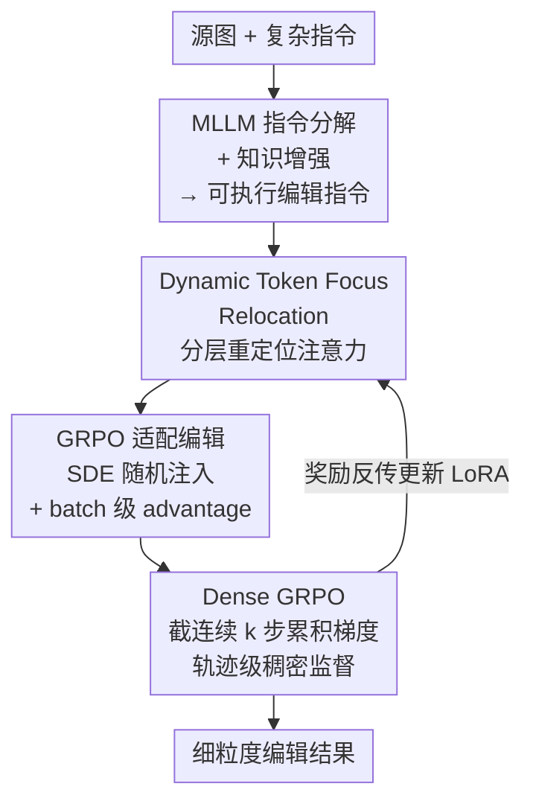

# CogniEdit: Dense Gradient Flow Optimization for Fine-Grained Image Editing

**会议**: CVPR 2026  
**论文**: [CVF Open Access](https://openaccess.thecvf.com/content/CVPR2026/html/Li_CogniEdit_Dense_Gradient_Flow_Optimization_for_Fine-Grained_Image_Editing_CVPR_2026_paper.html)  
**代码**: https://github.com/yl4467/CogniEdit  
**领域**: 扩散模型 / 图像编辑  
**关键词**: 指令图像编辑, 细粒度对齐, GRPO, 稠密奖励优化, 多模态推理

## 一句话总结
CogniEdit 用 MLLM 把复杂指令拆成可执行编辑指令、用动态 token focus 让不同网络层关注不同粒度的属性，再把 GRPO 从"单步独立优化"改成"跨连续去噪步累积梯度的轨迹级稠密优化"，在 Kris-Bench / GEdit-Bench 上把颜色/数量/位置这类细粒度指令的执行做到了 SOTA，同时不牺牲通用编辑能力。

## 研究背景与动机
**领域现状**：指令式图像编辑（InstructPix2Pix、Qwen-Image-Edit、OmniGen2 等）靠扩散模型 + 配对数据监督学习，已经能根据一句话把图改得有模有样。近期一批工作开始用强化学习（尤其是 GRPO）来把生成结果对齐到人类偏好/指令。

**现有痛点**：两条线都不擅长**细粒度**指令——"把紫色的眼睛改成红色"、"在左边加五个"这种精确指定**颜色 / 位置 / 数量**的要求，模型经常抓不准；遇到需要推理或领域知识的指令，更是出现指令语义和编辑动作之间的"理解鸿沟"，改出来语义错误甚至不合常理。

**核心矛盾**：根因有二。其一，配对数据上的监督学习只优化生成图和目标图的**整体视觉相似度**，从不显式优化"文本里某个细粒度属性"和"图像里对应区域"之间的对齐。其二，现有 GRPO 用法把**每个采样步当成独立决策点**单独优化，反馈稀疏——梯度不在连续采样步之间流动，模型学到的是"把某一步改好"，而不是"让整条去噪轨迹从粗结构到细节正确演化"。对编辑任务而言，源图和编辑区的一致性至关重要，缺了跨步梯度流既难做细粒度对齐，又容易出伪影、训练难收敛。

**本文目标**：同时解决"复杂指令的语义理解"和"细粒度属性的精确执行"，且执行要靠**优化过程本身**做对齐，而不是只在生成前把指令处理一下。

**核心 idea**：把"MLLM 推理 + 动态注意力重定位 + 稠密轨迹级 GRPO"统一进一个框架——让监督信号沿整条去噪轨迹流动（dense gradient flow），从而把细粒度对齐落到优化里。

## 方法详解

### 整体框架
CogniEdit 以 Qwen-Image-Edit 为底座（LoRA 微调），输入是源图 + 用户指令，输出是编辑后的图。整条管线分三段：先用 **MLLM 把复杂指令分解并知识增强**成清晰可执行的编辑指令；编辑模型在处理这条指令时，用 **Dynamic Token Focus Relocation** 让不同层关注不同粒度的语义 token；训练时用 **Dense GRPO** 在采样轨迹上随机截一段连续 $k$ 步、跨步累积梯度，给出轨迹级的稠密奖励监督。其中 GRPO 本身还针对编辑任务做了适配（确定性 ODE → SDE 注入随机性、batch 级 advantage）。三段协同：MLLM 保证"理解对"，token focus 保证"关注对"，Dense GRPO 保证"整条轨迹优化对"。

### 关键设计

**1. MLLM 指令分解 + 知识增强：先把"看不懂的指令"翻译成"能执行的指令"**

针对"理解鸿沟"这个痛点：复杂或需要领域知识的指令，编辑模型靠视觉模式匹配根本读不懂。CogniEdit 让一个多模态大模型（MLLM/VLM）同时看源图和原始指令，生成一条**知识增强后的指令**——补充场景的语义与上下文信息，把模糊要求拆解成清晰、可执行的编辑指令，再喂给编辑模型。和 Step1X-Edit、GenArtist 等"用 MLLM 预处理指令"的做法相比，本文的关键区别在于：它们到此为止、生成过程仍是配对数据上的监督学习，而 CogniEdit 把这一步当作整个框架的**入口**，后面还接着用优化过程去做细粒度对齐，所以"理解对"之后还能"执行对"。

**2. Dynamic Token Focus Relocation：让浅层抓高层语义、深层抓细粒度属性**

作者观察到一个具体现象：模型在所有层里都死盯着 "change""add" 这类**通用动作词**，反而忽略 "purple""five""on the left" 这些决定编辑成败的细粒度语义。直觉上应该是浅层关注高层语义、深层关注细粒度属性，于是本设计**按层自适应地把注意力重定位**到当下最该关注的 token。

形式上，对第 $i$ 层编码后的指令 token $h_i^l \in \mathbb{R}^{l\times d}$，用一个轻量预测器 $p_\eta$ 预测最该强调的起始位置 $pos = p_\eta(h_i^l)$，$pos\in[0,\,l-\xi]$，$\xi$ 是要强调的 token 个数。然后用每层各自的可学习软 token $s_i^{1:\xi}=E(i)\in\mathbb{R}^{\xi\times d}$ 作为"注意力锚点"，注入到预测位置、替换原 embedding：

$$h_i^{pos:pos+\xi} \leftarrow s_i^{1:\xi}, \qquad a_i^{pos:pos+\xi} = s_i^{1:\xi}\cdot A^l$$

左式替换 token embedding，右式用注入的软 token 算注意力分。预测器 $p_\eta$ 和各层软 token $\{s_i^{1:\xi}\}_{i=1}^N$ 端到端联合训练，从而学出**分层注意力模式**：浅层关注 "the color" 这种抽象概念、中间层切到 "purple""red" 等具体属性、深层落到 "change" 动作（见分析实验）。这样组合式的语义 grounding 就比"全程只盯 change"准得多。

**3. GRPO 适配编辑：给确定性编辑注入可控随机性 + batch 级 advantage**

标准 flow-matching GRPO 直接搬到编辑上有两个坑。其一，编辑要求和源图高度一致，用的是**确定性 ODE**，但 GRPO 需要从同一输入采多个不同样本来算相对优势——确定性轨迹采出来全一样，advantage 没法算。解法是把 ODE 用 Euler-Maruyama 离散成 SDE，注入可控噪声：$x_{t+\Delta t}=x_t+s_\theta(x_t,t)\Delta t+\sqrt{\Delta t}\,\sigma_t\epsilon$，$\epsilon\sim\mathcal N(0,1)$，$\sigma_t$ 控噪声水平，在保编辑质量的前提下造出采样多样性。

其二，即便注入了随机，同一输入的编辑结果多样性仍有限，**per-instance 归一化的 advantage 方差很大**。于是改成在 $B$ 个编辑实例组成的 batch 上算统计量：$\hat A_b=\frac{1}{G}\sum_{i=1}^G \frac{R(x_0^{b,i},c_b)-\mu_{batch}}{\sigma_{batch}}$，其中 $\mu_{batch},\sigma_{batch}$ 是整个 batch 上奖励的均值与标准差。batch 级归一化让 advantage 估计更稳，又保住了细粒度控制所需的信号。

**4. Dense GRPO 轨迹级优化：跨连续 k 步累积梯度，把稀疏反馈变稠密监督**

这是全文最核心的设计，直击"单步独立优化、反馈稀疏"的痛点。扩散编辑里每个去噪步都在逐步细化图像，早期采样决策一旦差了，后期即使最后一步优化对了也救不回来。Dense GRPO 不再只在单步给监督，而是**随机选一个起始步 $r\in[0,T-k]$，连续走 $k$ 步**，让梯度在这段轨迹上反向流动。每步随机采样为 $x_{t-1}=x_t-\frac{1}{T}s_\theta(\mathrm{sg}(x_t),t)+\frac{\sigma_t}{\sqrt{T}}\epsilon$，其中 $\mathrm{sg}(\cdot)$ 是 stop-gradient，用来精确控制梯度回流到前一采样步（⚠️ 公式中 $\mathrm{sg}$ 的具体放置以原文为准）。

把这 $k$ 步的概率比对数累加：

$$\psi_b^{r:r-k}(\theta)=\sum_{t=r}^{r-k+1}\log\frac{p_\theta(x_{t-1}^b\mid x_t^b,c_b)}{p_{\theta_{old}}(x_{t-1}^b\mid x_t^b,c_b)}$$

再做 clip 得 $\tilde r_b^{r:r-k}(\theta)=\exp(\mathrm{clip}(\psi_b^{r:r-k}(\theta),-\log(1+\epsilon),\log(1+\epsilon)))$，最终目标用完成 $x_{r-k}$ 后的奖励算 $\hat A_b$、套 GRPO 的 clip 形式 $J_{Dense}(\theta)$。关键在于：advantage 用的是走完这 $k$ 步之后的**最终奖励**，但梯度沿整段轨迹累积——于是模型不是孤立地改某一步，而是学会"让这一段轨迹整体往对的方向演化"。这就是 trajectory-level gradient flow，比端点单步优化提供了稠密得多的监督信号，训练更稳、细粒度对齐更好。

### 损失函数 / 训练策略
底座 Qwen-Image-Edit，LoRA rank=4 做 PEFT；训练 500 步，AdamW，lr=1e-5，batch size=4，前 10% 线性 warmup 后 cosine 衰减，梯度裁剪 max norm=1.0。超参 $k=5$（连续去噪步数）、$\xi=64$（强调 token 数）。8×A800-80G。训练数据由 SEED-Data-Edit 采 3k + COCO 2017 选 1k 构成，并用 VLM 做知识增强改写指令。

## 实验关键数据

### 主实验
Kris-Bench 上四指标 VC（视觉一致性）/ VQ（视觉质量）/ IF（指令遵循）/ KP（知识保持），GPT-4 评测，跨三个领域取平均：

| 方法 | 社科 Avg | 自然科学 Avg | 知识推理 Avg | 三域 VQ |
|------|---------|------------|------------|--------|
| InstructPix2Pix | 22.56 | 26.56 | 31.00 | 偏低 |
| Step1X-Edit | 51.94 | 52.69 | 48.50 | 中 |
| OmniGen2 | 50.46 | 47.76 | 33.90 | 高 |
| Qwen-Image-Edit | 66.40 | 57.30 | 53.39 | 高 |
| Qwen-Image-Edit-r1 | **77.99** | 64.78 | 55.48 | 高 |
| **CogniEdit** | 77.64 | **67.42** | **59.29** | **92.40 / 90.47 / 91.72** |

CogniEdit 在三个领域的 **VQ 全部最高**，自然科学、知识推理两域的总分也最高；社科域总分 77.64 略低于 Qwen-Image-Edit-r1 的 77.99，但仍保住 VQ 第一。说明稠密优化在"细粒度遵循 ↔ 视觉质量"之间取得了更好平衡。

### 消融实验
在 Kris-Bench 知识推理类做消融（Avg）：

| 配置 | VC | VQ | IF | KP | Avg | 说明 |
|------|----|----|----|----|-----|------|
| w/o Dense GRPO | 41.67 | 75.00 | 35.04 | 32.72 | 46.11 | 去稠密优化，掉最多 |
| w/o Dynamic | 62.67 | 86.17 | 41.73 | 36.09 | 54.66 | 去动态重定位，甚至低于 base |
| w/o both（base 模型） | 71.33 | 88.37 | 35.03 | 27.55 | 55.48 | 退回 Qwen-Image-Edit-r1 |
| **CogniEdit（Full）** | 71.50 | 91.72 | 40.14 | 33.33 | **59.29** | 完整模型 |

### 关键发现
- **Dense GRPO 贡献最大**：去掉后 Avg 从 59.29 暴跌到 46.11，证明轨迹级监督对学细粒度语义对应是关键。
- **Dynamic Token Focus 不能单飞**："w/o Dynamic"=54.66 反而**低于 base 模型 55.48**——说明动态注意力重定位只有和 Dense GRPO 的轨迹级优化**配合**才有效，二者是互补关系，必须联合优化注意力模式和奖励信号。
- **效率分析**：Dense GRPO 相比标准 GRPO 在更低 FLOPs 下取得更高 CLIP score，学习曲线更陡、更稳；标准 GRPO 因只在端点算梯度，CLIP score 抖动剧烈。
- **注意力可视化**：加了动态重定位后，对 "Change the color of the purple eyes to red"，浅层关注 "the color"、中层切到 "purple/red"、深层落到 "change"；不加则全程只盯 "change"，语义解析不完整。

## 亮点与洞察
- **把"单步 GRPO"升级成"轨迹级 Dense GRPO"是核心洞察**：用 stop-gradient + 跨 $k$ 步累积概率比，让一个最终奖励反传到整段轨迹，思路可迁移到任何"过程质量决定终点质量"的扩散 RL 任务（视频生成、长链采样）。
- **确定性编辑 ODE→SDE + batch 级 advantage** 是把 GRPO 落到编辑任务的两个务实工程点：前者解决"采样无多样性、advantage 算不了"，后者解决"per-instance 方差大"，对想在编辑/受控生成上用 GRPO 的人很有参考价值。
- **"分层注意力分工"的实证很漂亮**：用可学习软 token 在不同层强调不同粒度 token，并用可视化证明浅→深 = 抽象→具体→动作，给"层级语义"提供了可操作的注意力干预手段。
- **消融里的反直觉点**：Dynamic 单独加反而掉点，提醒"组件孤立有效"不等于"组合有效"，强调联合优化的重要性。

## 局限与展望
- 多数核心机制（数据构建细节、stop-gradient 基础、人类评测、GEdit-Bench 结果）都放在附录，正文给的实现细节有限；社科域总分仍略逊于 Qwen-Image-Edit-r1，细粒度遵循（IF）并非全面领先。
- ⚠️ 仅在 Kris-Bench / GEdit-Bench 评测、底座绑定 Qwen-Image-Edit + LoRA(rank=4)、训练仅 500 步、数据仅 4k 对，规模和泛化性有待更大体量验证；奖励模型的选择对结果影响多大未充分讨论。
- Dense GRPO 的连续步数 $k$、强调 token 数 $\xi$ 等超参敏感性正文未系统给出；trajectory-level 反传 $k$ 步的显存/算力代价随 $k$ 增长，长轨迹下的可扩展性存疑。
- 改进方向：把 $k$ 自适应化（按当前步对终点影响动态选段）、把奖励模型从 CLIP/GPT-4 评测换成更细粒度的属性级奖励，或许能进一步压缩"理解对但执行偏"的剩余 gap。

## 相关工作与启发
- **vs 标准 GRPO（DanceGRPO 等图像 GRPO）**：他们逐采样步独立优化、反馈稀疏；CogniEdit 跨连续步累积梯度做轨迹级稠密监督，在更低 FLOPs 下更稳更准。
- **vs Step1X-Edit / BrushEdit / GenArtist（MLLM 预处理指令）**：他们止步于"生成前把指令理解好"、生成仍是配对数据监督；CogniEdit 把 MLLM 推理当入口，再用优化过程本身做细粒度对齐。
- **vs InstructPix2Pix / Qwen-Image-Edit / OmniGen2（监督学习编辑）**：他们优化整体视觉相似度，不显式对齐文本细粒度属性与视觉内容；CogniEdit 通过 token focus + Dense GRPO 直接优化这种对齐。

## 评分
- 新颖性: ⭐⭐⭐⭐ 把 GRPO 从单步升级为轨迹级稠密优化 + 分层 token 重定位，组合新颖、切中细粒度编辑痛点
- 实验充分度: ⭐⭐⭐⭐ 双 benchmark + 消融 + 效率/注意力分析较完整，但多数细节在附录、规模偏小
- 写作质量: ⭐⭐⭐⭐ 动机—方法—实验逻辑清晰，公式记号略有小瑕（stop-gradient 放置需对照原文）
- 价值: ⭐⭐⭐⭐ 轨迹级 Dense GRPO 与编辑场 GRPO 适配技巧对受控扩散生成有较强可迁移性

<!-- RELATED:START -->

## 相关论文

- [\[CVPR 2026\] Fine-Grained GRPO for Precise Preference Alignment in Flow Models](fine-grained_grpo_for_precise_preference_alignment_in_flow_models.md)
- [\[CVPR 2026\] SliderEdit: Continuous Image Editing with Fine-Grained Instruction Control](slideredit_continuous_image_editing_with_fine-grained_instruction_control.md)
- [\[CVPR 2026\] Towards Fine-Grained Attribution: Instance-Aware Preference Optimization for Aligning Diffusion Models](towards_fine-grained_attribution_instance-aware_preference_optimization_for_alig.md)
- [\[CVPR 2026\] PromptEnhancer: Taming Your Rewriter for Text-to-Image Generation via Fine-Grained Reward](promptenhancer_taming_your_rewriter_for_text-to-image_generation_via_fine-graine.md)
- [\[CVPR 2026\] SkyReels-Text: Fine-Grained Font-Controllable Text Editing for Poster Design](skyreels-text_fine-grained_font-controllable_text_editing_for_poster_design.md)

<!-- RELATED:END -->
