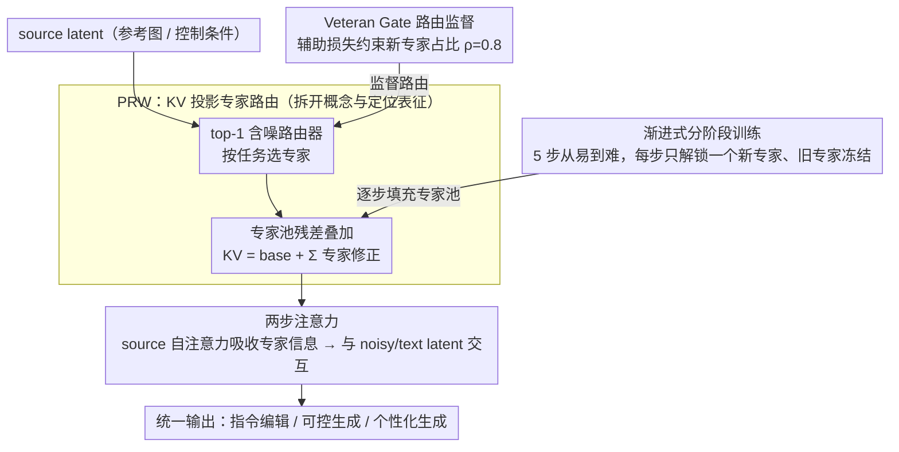

# CoLoGen: Progressive Learning of Concept-Localization Duality for Unified Image Generation

**会议**: CVPR 2026  
**arXiv**: [2602.22150](https://arxiv.org/abs/2602.22150)  
**代码**: 暂无  
**领域**: 统一图像生成 / 扩散模型  
**关键词**: 统一生成框架, 概念-定位对偶性, 渐进式训练, 专家路由, FLUX

## 一句话总结

提出 CoLoGen，一个基于"概念-定位对偶性"（Concept-Localization Duality）的统一图像生成框架，通过渐进式分阶段训练和 Progressive Representation Weaving（PRW）动态专家路由架构，在指令编辑、可控生成和个性化生成三大任务上同时达到或超越专用模型水平。

## 研究背景与动机

统一多模态图像生成（涵盖 mask inpainting、visual grounding、可控生成、个性化生成、指令编辑）面临的核心困境是**表征冲突**：

- **概念表征 $\mathcal{R}_c$**：编码语义一致性和物体级理解，可控生成（如 canny/depth/seg 条件）主要依赖此能力
- **定位表征 $\mathcal{R}_l$**：编码空间对齐、几何和结构一致性，个性化生成需精确定位参考图中的身份特征

现有统一框架将这两种异质表征强行共享，导致概念理解和空间精度互相干扰（联合优化 $f_c$ 可能损害 $f_l$）。这解释了为何现有通用模型往往在部分任务上表现良好而在其他任务上退化。

## 方法详解

### 整体框架

CoLoGen 想做的，是让同一个生成模型同时胜任指令编辑、可控生成和个性化生成，而不必为概念理解和空间定位这两种相互打架的能力各开一套表征。它在 FLUX.1 的 MMDiT 骨架上落了两枚关键棋子：一是把每个多模态注意力块里 source latent 的 KV 投影改造成可动态路由的专家池（PRW），让模型根据当前任务挑选合适的表征通路；二是用一条 5 步、从易到难的渐进式训练流水线把这些专家逐个点亮，前面学到的能力被冻结保留，后面的任务只解锁新专家。数据从 source latent 流入注意力块时，先由路由器选出专家加权融合，再与 noisy/text latent 交互生成输出，整个过程里概念和定位两种表征始终各走各的专家，互不污染。

### 关键设计

**1. Progressive Representation Weaving（PRW）：用 KV 层的专家路由把概念表征和定位表征拆开**

统一框架最大的痛点是把概念表征 $\mathcal{R}_c$ 和定位表征 $\mathcal{R}_l$ 强行塞进同一组共享参数，结果联合优化时互相拖后腿。PRW 的做法是只在 source latent 的 KV 投影这一层动手脚，给它配一个专家池 $\{E_k\}_{k=1}^N$ 和一个带噪声的 top-1 路由器。路由权重由当前隐状态 $h$ 算出，加性噪声项让训练期的专家选择带上探索性：

$$\mathbf{w} = hW_r + \epsilon \odot \text{softplus}(hW_n), \quad \epsilon \sim \mathcal{N}(0, \mathbf{I})$$

选中的专家以残差形式叠加到基础 KV 投影上，等于在不破坏原始 FLUX 表征的前提下，按任务追加一份专家修正：

$$(K_{\hat{h}}, V_{\hat{h}}) = \text{KV\_proj}_{\text{base}}(h) + \sum_{k \in \mathcal{S}} \text{softmax}(\mathbf{w})_k E_k(h)$$

注意力本身分两步走：先让 source latent 自注意力把选中的专家信息吸收进去，再让 noisy/text latent 与这份已经"带任务色彩"的 source 表征交互。由于路由发生在每个 block 内部、且只动 KV，不同任务自然会激活不同专家，概念理解与空间定位因此走在两条不重叠的通路上，避免了共享参数时的相互干扰。

**2. 渐进式分阶段训练：按能力依赖顺序逐个点亮专家，旧专家冻结防遗忘**

如果一上来就把所有任务混在一起训，概念和定位的冲突会让模型每个任务都学不透。CoLoGen 把训练拆成 5 步，严格按"先打地基、再盖上层"的依赖关系推进：Step 0-1 是内生预训练，用 3M 合成数据做 Mask Inpainting 把概念能力练出来，再用 1M 数据做 Visual Grounding 把定位能力练出来；Step 2 注入条件，用 20M 数据让模型适配 Canny/Depth/HED/Lineart/Seg 等可控生成信号；Step 3-4 做指令-图像对齐，先用 200K 数据学 Customized Generation，再用 1.6M 数据学 Instruction Editing。关键在于每一步只解锁一个新专家 $E_{N-1}$，之前训好的专家全部冻结——这样新任务的学习不会改写旧能力，效果上类似终身学习里的参数隔离，天然抵抗灾难性遗忘。

**3. Veteran Gate Routing Supervision：用辅助损失约束新专家的使用密度，逼模型继续用老本事**

光冻结旧专家还不够，因为路由器很容易偷懒，把几乎所有 token 都甩给最新解锁的专家，导致前几步辛苦学到的概念/定位能力被晾在一边。CoLoGen 加了一项 veteran gate 损失，直接监督新专家 $E_{N-1}$ 的路由占比 $U_t$（即被路由到新专家的 token 比例），把它拉向一个目标密度 $\rho$：

$$\mathcal{L}_{\text{veteran}} = \alpha \cdot |U_t - \rho|, \quad U_t = \frac{1}{L_n} \sum_{i=1}^{L_n} \mathbb{I}(e_i = N-1)$$

取 $\rho = 0.8$，意思是允许新专家承担 80% 的路由、但强制留 20% 给历史专家，这样老本事既不会被遗忘也持续参与推理。它和任务损失相加构成总目标 $\mathcal{L}_{\text{total}} = \mathcal{L}_{\text{task}} + \mathcal{L}_{\text{veteran}}$。

### 损失函数 / 训练策略

- 主损失：标准扩散生成损失 $\mathcal{L}_{\text{task}}$（Flow Matching）
- 辅助损失：Veteran Gate Routing Supervision $\mathcal{L}_{\text{veteran}}$，权重 $\alpha = 0.5$
- PRW 专家使用 LoRA（rank=128）实现参数高效
- 各阶段训练 200K-400K iterations，global batch size 128-256
- 总训练数据：~25M 样本

## 实验关键数据

### 主实验

| 任务 / 数据集 | 指标 | CoLoGen | 之前 SOTA | 对比 |
|--------------|------|---------|-----------|------|
| 指令编辑 / Emu Edit | DINO ↑ | **0.843** | 0.831 (UniReal) | +0.012 |
| 指令编辑 / MagicBrush | DINO ↑ | **0.932** | 0.879 (Emu Edit) | +0.053 |
| 指令编辑 / MagicBrush | CLIP_out ↑ | **0.301** | 0.308 (UniReal) | -0.007 |
| 可控生成 / MultiGen-20M | Canny CLIP-S ↑ | **33.31** | 32.15 (ControlNet) | +1.16 |
| 可控生成 / MultiGen-20M | Depth RMSE ↓ | **31.79** | 33.83 (PixWizard) | -2.04 |
| 个性化生成 / DreamBench | DINO ↑ | **0.714** | 0.702 (UniReal) | +0.012 |
| 个性化生成 / DreamBench | CLIP-T ↑ | 0.315 | **0.326** (UniReal) | -0.011 |

### 消融实验

| 配置 | CLIP-T ↑ | CLIP-I ↑ | DINO ↑ | 说明 |
|------|---------|---------|--------|------|
| Baseline (w/o $\mathcal{R}_l$ & $\mathcal{R}_c$) | 0.260 | 0.889 | 0.901 | MagicBrush 上无专家 |
| w $\mathcal{R}_l$ only | 0.279 | 0.922 | 0.927 | 定位表征提升结构保持 |
| w $\mathcal{R}_c$ only | 0.302 | 0.881 | 0.905 | 概念表征提升指令跟随 |
| Co-training ($\mathcal{R}_c$ & $\mathcal{R}_l$) | 0.269 | 0.918 | 0.922 | 联合训练反而不如单独 |
| CoLoGen (渐进式) | **0.301** | **0.931** | **0.932** | 渐进训练解决冲突 |

### 关键发现

- Co-training 策略在个性化生成上 DINO 和 CLIP-I 甚至低于 baseline，验证了"表征冲突"假设
- 渐进式训练在各指标上全面优于 co-training，证明分阶段学习能有效缓解概念-定位冲突
- Veteran Gate Routing $\rho = 0.8$ 最优；$\alpha$ 过大反而限制灵活性
- LoRA rank=128 为最佳设置

## 亮点与洞察

- **概念-定位对偶性**是对统一图像生成困境的深刻理论洞察——将"不同任务需要不同表征"形式化为两个竞争子空间
- PRW 架构巧妙复用 MoE 思想，但将其限制在 KV 投影层且仅 top-1 路由，保持轻量
- 渐进训练 + 专家冻结是终身学习在生成模型中的有效应用，有效缓解灾难性遗忘
- 数据工程细致：mask inpainting 的 3 种 mask 类型（random/object-shaped/Bessel curve 不规则）、20:40:40 采样比例

## 局限与展望

1. 随着任务和专家数量增加，PRW 的内存占用持续增长，可扩展性受限
2. 当前仅验证了 5 个任务，对更多条件类型（如 pose、sketch）的泛化能力未知
3. 部分指标略低于 UniReal 等专用模型，统一模型在极致性能上仍有差距
4. LoRA rank=128 参数量已不算"轻量"，与 full fine-tuning 的性能差距未报告

## 相关工作与启发

- 与 OmniGen（统一多模态生成但无显式表征管理）相比，CoLoGen 通过 PRW 实现了更好的编辑/定制平衡
- 与 PixWizard 和 UniReal 等通用编辑模型相比，CoLoGen 的核心优势在于可控生成方面的兼顾
- 启发：统一生成不应追求"一个表征适配所有任务"，而应通过动态路由让模型学会任务自适应的表征切换

## 评分

- **新颖性**: ⭐⭐⭐⭐ 概念-定位对偶性视角新颖，PRW + 渐进训练的组合设计系统性强
- **实验充分度**: ⭐⭐⭐⭐ 覆盖编辑/可控/个性化三大任务线，6 个基准，消融深入
- **写作质量**: ⭐⭐⭐⭐ 问题定义清晰，图示质量高，训练策略描述详尽
- **价值**: ⭐⭐⭐⭐ 为统一图像生成提供了有理论基础的实用方案，PRW 可迁移到其他多任务场景

<!-- RELATED:START -->

## 相关论文

- [\[CVPR 2026\] PureCC: Pure Learning for Text-to-Image Concept Customization](purecc_pure_learning_for_text-to-image_concept_customization.md)
- [\[CVPR 2026\] NAMI: Efficient Image Generation via Bridged Progressive Rectified Flow Transformers](nami_efficient_image_generation_via_bridged_progressive_rectified_flow_transform.md)
- [\[CVPR 2026\] UniVerse: A Unified Modulation Framework for Segmentation-Free, Disentangled Multi-Concept Personalization](universe_a_unified_modulation_framework_for_segmentation-free_disentangled_multi.md)
- [\[CVPR 2026\] iMontage: Unified, Versatile, Highly Dynamic Many-to-many Image Generation](imontage_unified_versatile_highly_dynamic_many-to-many_image_generation.md)
- [\[AAAI 2026\] EchoGen: Cycle-Consistent Learning for Unified Layout-Image Generation and Understanding](../../AAAI2026/image_generation/echogen_cycle-consistent_learning_for_unified_layout-image_generation_and_unders.md)

<!-- RELATED:END -->
