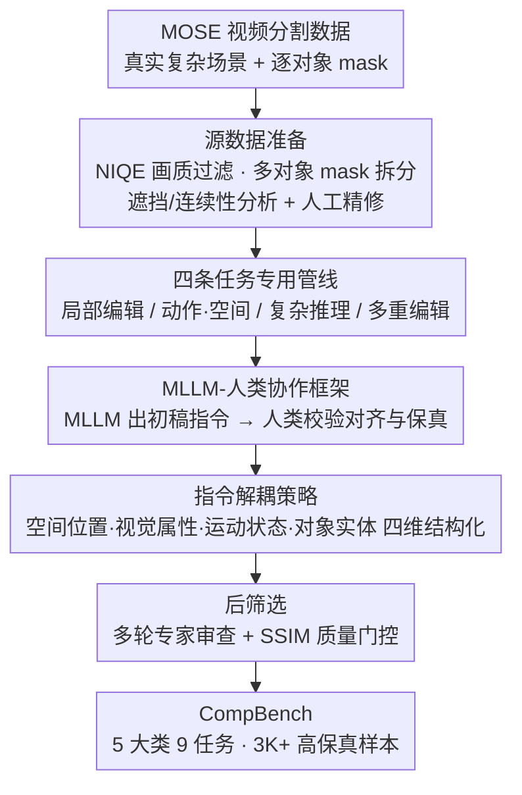

# CompBench: Benchmarking Complex Instruction-guided Image Editing

**会议**: CVPR 2026  
**论文**: [CVF OpenAccess](https://openaccess.thecvf.com/content/CVPR2026/html/Jia_CompBench_Benchmarking_Complex_Instruction-guided_Image_Editing_CVPR_2026_paper.html)  
**项目主页**: https://comp-bench.github.io/  
**领域**: 图像生成  
**关键词**: 指令引导图像编辑, 评测基准, 复杂场景, MLLM-人类协作, 指令解耦, SSIM 质量控制

## 一句话总结
CompBench 是首个面向**复杂真实场景**的指令引导图像编辑评测基准，从视频对象分割数据集 MOSE 取高密度遮挡场景，用 MLLM-人类协作框架 + 指令解耦策略造出 3K+ 高保真编辑样本、覆盖 5 大类 9 项任务，系统揭示了当前编辑模型在多对象、空间推理和隐式推理上的根本性短板。

## 背景与动机

**领域现状**：指令引导图像编辑（instruction-guided image editing）只用一句自然语言指令就能改图，不需要 mask 或额外视觉输入，是近年扩散模型落地的热门方向（InstructPix2Pix、SmartEdit、Step1X-Edit、FLUX.1 Kontext 等）。要评估这些模型，就需要高质量的基准。

**现有痛点**：作者指出现有编辑基准有三个硬伤：

1. **场景太简单**：MagicBrush、Reason-Edit 等多从 MS COCO 这类通用数据集取图，画面稀疏、对象少、遮挡轻——而真实编辑需求往往涉及密集对象交互、复杂空间关系。基准构造者还会刻意回避重遮挡/动态场景（因为难标注 ground truth），导致"基准刷分高、真实场景拉胯"的脱节。
2. **指令不够精细**：现有指令常含糊（如"把车换掉"），无法考察模型的视觉定位、上下文理解、复杂推理能力。
3. **编辑质量差**：很多数据集本身的编辑结果就有指令不对齐、几何畸变、背景不一致等问题，给评估引入噪声，无法区分"真强"和"看起来还行实则有缺陷"的模型。

**核心矛盾**：基准的复杂度和可控性天然冲突——越复杂的场景越难保证 ground truth 质量，于是大家都退而求其次做简单场景，但这样评不出模型在真实复杂任务上的真实能力。

**切入角度**：与其从通用图像数据集取图，不如从**视频对象分割（VOS）数据集** MOSE 取——这类数据天生场景密集、多对象、重遮挡，且自带高质量逐对象 mask，正好补上"复杂场景 + 精确标注"这块。再配一套 MLLM-人类协作的构造管线保证每个样本都是成功编辑。

## 方法详解

### 整体框架

CompBench 不是模型，而是一套**数据集构造管线**。它分两大阶段：先从 MOSE 视频分割数据里筛出高质量、高复杂度的图像和对象 mask（源数据准备），再针对 9 种编辑任务用四条专门管线生成编辑样本，所有管线共用一个"MLLM 出初稿、人类把关"的协作框架，并配合指令解耦策略让指令既自然又精确；最后所有样本经多轮专家审查、SSIM 质量筛选，留下 3K+ 高保真样本。

### 关键设计

**1. 用视频分割数据 MOSE 做场景来源：从根上解决"场景太简单"**

这是整套基准最关键的取舍。现有基准从 COCO 等通用图像集取图，画面对象稀疏；CompBench 改用视频对象分割数据集 MOSE——VOS 任务天然就需要密集、多对象、重遮挡的视频帧，所以这些帧的场景复杂度远高于通用图像，而且自带高质量的逐对象分割 mask，正好同时满足"复杂场景"和"精确对象标注"两个需求。源数据准备阶段先用 NIQE 等自动指标过滤损坏帧并人工复核，再把多对象 mask 拆成单对象实例，丢弃不连续或重遮挡的 mask 并人工精修到像素级。最终统计印证了这个选择：CompBench 平均每图 13.58 个对象（比第二名 GEdit-Bench 高约 36.3%）、平均 5.87 个类别、98.47% 的图含遮挡对象、86.38% 含出框对象，四项复杂度指标全面超过所有现有基准。

**2. MLLM-人类协作框架 + 四条任务专用管线：在复杂场景下仍保证每个样本都是成功编辑**

复杂场景的编辑样本极难自动量产——直接让模型生成，失败率高、质量参差。CompBench 设计了四条针对性管线覆盖不同难度：局部编辑管线（对象增/删/替换）、动作与空间编辑管线（动作、位置、视角编辑）、复杂推理管线（隐式上下文推理编辑）、多重编辑管线（多对象、多轮编辑）。四条管线共用一个统一的 MLLM-人类协作框架：先由多模态大模型（如 Qwen-VL）分析视觉场景和编辑目标、生成初始的任务专用指令，再由人类专家校验指令-图像对齐度和编辑保真度，不合格的编辑迭代重做或直接丢弃，只保留高保真样本。这样把 MLLM 的规模化生成能力和人类的质量把关结合起来，使得即便在密集遮挡场景下，最终入库的每一条都是真正成功的编辑。

**3. 指令解耦策略：把含糊指令拆成四个维度，既精确又不失自然**

复杂编辑的指令容易含糊（"把那辆车换掉"到底指哪辆、换成什么样），但写得太死板又丢掉自然语言的灵活性。CompBench 提出**指令解耦（Instruction Decomposition）**：沿四个维度结构化组织每条编辑指令——空间位置（如"桌子左边"）、视觉属性（颜色/纹理）、运动状态（如"飞行中"）、对象实体。生成走两阶段：先由 MLLM 分析视觉上下文产出"维度感知"的候选指令，再由人类专家精修保证精确性和一致性。这样系统化覆盖一次编辑操作的每个方面，同时保留自然语言表达，产出的指令对复杂编辑既直观可懂又技术精确。

### 一个完整示例
以"移除离水最远的那只老虎"（隐式推理任务）为例：源数据阶段从 MOSE 取到一张含多只老虎和水域的复杂帧，拆分出每只老虎的单独 mask 并精修；复杂推理管线里，MLLM 先理解"离水最远"需要做空间距离推理、定位到目标老虎，生成结构化指令（空间位置维度=离水最远、对象实体=老虎、视觉属性/运动状态留空）；人类专家校验该指令是否唯一指向正确对象、编辑结果是否干净移除且背景一致；通过 SSIM 质量门控后入库。这条样本因此能考察模型"先推理定位、再精确编辑、还要保持复杂背景一致"的综合能力，而这正是简单基准评不出来的。

## 实验关键数据

评测了 15 个主流指令编辑模型（InstructPix2Pix、MagicBrush、SmartEdit、Step1X-Edit、Bagel、FLUX.1 Kontext、Qwen-Image-Edit 等）。对局部/多对象/隐式推理任务采用**前景-背景解耦**评估：前景看编辑是否到位（LC-T：编辑前景与局部描述的 CLIP 文本相似度；LC-I：与 GT 图的 CLIP 图像相似度），背景看是否保持一致（PSNR/SSIM/LPIPS）。

### 基准复杂度对比（节选 Table 1）
| 基准 | 规模 | 平均对象数 | 平均类别数 | 遮挡率% | 出框率% |
|------|------|-----------|-----------|---------|---------|
| MagicBrush | 10K | 9.22 | 5.04 | 91.71 | 78.30 |
| GEdit-Bench | 0.6K | 9.96 | 4.93 | 67.67 | 65.40 |
| RefEdit | 20K | 9.74 | 5.26 | 91.02 | 69.00 |
| **CompBench (Ours)** | **3K** | **13.58** | **5.87** | **98.47** | **86.38** |

### 关键发现
- **四项复杂度指标全面登顶**：平均对象数比第二名（GEdit-Bench 9.96）高约 36.3%，遮挡率 98.47%、出框率 86.38% 均为最高，证明"用 VOS 数据取景"确实显著提升了场景复杂度。
- **暴露现有模型根本短板**：在前景-背景解耦评估下，现有 SOTA 编辑模型在多对象、隐式推理等复杂任务上普遍难以兼顾"前景编辑到位"和"背景保持一致"，揭示了当前指令编辑能力与真实复杂需求之间的差距。
- **样本质量更高**：CompBench 全部样本经多轮专家审查、均为成功编辑，SSIM 显著高于其他数据集，保证评估结果不被低质样本噪声污染。

## 亮点
- **跨任务取景的巧思**：把视频对象分割数据集当作图像编辑基准的场景来源，一举解决"复杂场景 + 精确 mask"两个老大难，思路可迁移到其他需要复杂场景标注的视觉任务。
- **MLLM 规模化 + 人类把关**的协作范式，在保证质量的前提下让复杂样本的量产成为可能。
- **指令解耦**把"自然 vs 精确"的张力拆成四个正交维度来解，是一个简洁可复用的指令工程思路。
- 前景-背景解耦评估让"编辑是否到位"和"背景是否被破坏"分开打分，比单一指标更能区分模型真实能力。

## 局限性
- 规模 3K+，相比一些百万级训练数据集偏小，定位是**评测基准**而非训练集，覆盖的极端长尾场景仍有限。
- 源数据来自 MOSE 单一数据集，场景类型（多为自然/生活场景中的可分割对象）可能存在分布偏置，对文档、图表、艺术创作类编辑覆盖不足。
- 重度依赖人工审查保证质量，构造成本高、扩展到更大规模需要持续投入人力。
- ⚠️ 部分实验数字（各模型 PSNR/SSIM 等）来自 CVF PDF 的大表格，具体逐模型数值以原文 Table 2 为准。

## 相关工作与启发
- **vs MagicBrush / EMU-Edit / Reason-Edit**：它们场景偏简单、指令偏含糊；CompBench 用 VOS 取景把复杂度拉满，并用指令解耦提升指令精度。
- **vs Complex-Edit / ComplexBench-Edit**：同样关注"复杂"，但前者走"Chain-of-Edit"组合指令、后者关注链式依赖一致性；CompBench 的差异化在于**场景本身的视觉复杂度**（密集对象 + 重遮挡）而非仅指令组合复杂度。
- **vs RefEdit**：RefEdit 关注指代表达定位特定对象，CompBench 覆盖更广的 9 类任务且强调隐式推理。
- **启发**：当某个任务缺"复杂场景 + 精确标注"的数据时，不妨向相邻任务（如分割/检测/VOS）的现成标注数据借力，往往比从零标注更高效。

<!-- RELATED:START -->

## 相关论文

- [\[CVPR 2026\] Towards Robust Sequential Decomposition for Complex Image Editing](towards_robust_sequential_decomposition_for_complex_image_editing.md)
- [\[CVPR 2026\] FlowDC: Flow-Based Decoupling-Decay for Complex Image Editing](flowdc_flow-based_decoupling-decay_for_complex_image_editing.md)
- [\[CVPR 2026\] WiseEdit: Benchmarking Cognition- and Creativity-Informed Image Editing](wiseedit_benchmarking_cognition-_and_creativity-informed_image_editing.md)
- [\[ICLR 2026\] Visual Autoregressive Modeling for Instruction-Guided Image Editing](../../ICLR2026/image_generation/visual_autoregressive_modeling_for_instruction-guided_image_editing.md)
- [\[CVPR 2026\] DreamOmni2: Multimodal Instruction-based Generation and Editing](dreamomni2_multimodal_instruction-based_generation_and_editing.md)

<!-- RELATED:END -->
