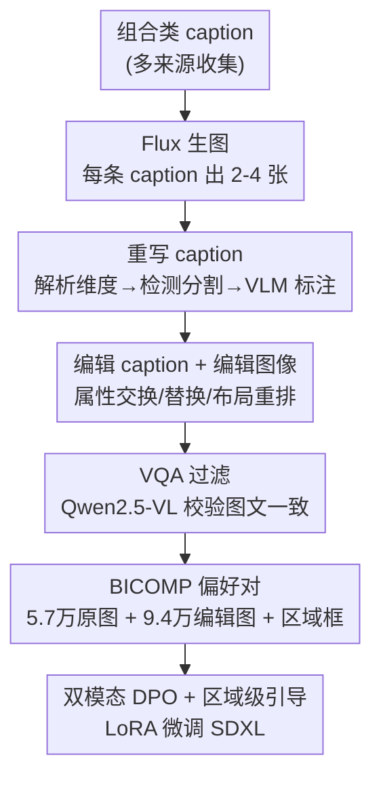

# Compositional Text-to-Image Generation Via Region-aware Bimodal Direct Preference Optimization

**会议**: CVPR 2026  
**论文**: [CVF Open Access](https://openaccess.thecvf.com/content/CVPR2026/html/Liu_Compositional_Text-to-Image_Generation_Via_Region-aware_Bimodal_Direct_Preference_Optimization_CVPR_2026_paper.html)  
**代码**: https://github.com/anzeameol/BiDPO  
**领域**: 扩散模型 / 图像生成  
**关键词**: 组合式生成, 偏好优化(DPO), 双模态对齐, 区域级引导, 偏好数据集  

## 一句话总结
针对文生图模型难以正确处理「多物体 + 属性绑定 + 空间关系」这类组合式 prompt 的问题，BIDPO 把 Diffusion DPO 扩展成「图像 + 文本」双模态偏好优化，并加一层基于 bounding box 的区域级 loss 加权，配合一条自动构建的 9.4 万对偏好数据管线，在 T2I-CompBench 上属性绑定平均涨约 17%、整体涨约 10%。

## 研究背景与动机
**领域现状**：Stable Diffusion 3、DALL-E 3、Flux 这类扩散模型在画质和美感上已经很强，但「组合性」（compositionality）——同一张图里有多个物体、每个物体绑定不同属性（颜色/形状/纹理）、物体之间还有空间或动作关系——仍是公认难点。T2I-CompBench、GenEval、DPG-Bench 等 benchmark 都显示 SOTA 模型在细粒度属性绑定和空间推理上经常翻车。

**现有痛点**：社区已有两条主流改法，但都有明显代价。一是给生成过程喂额外结构信息（layout、scene graph、语义面板），效果好但这些结构标注在真实使用时很难拿到；二是把大语言模型 / 多模态 LLM 当工具来增强理解，但不稳定、推理开销大。两条路都偏离了「只给一句文本就生成」的朴素设定。

**核心矛盾**：组合性失败本质是「跨模态细粒度对齐」没做好——模型没把文本里某个属性词精确绑定到图像里对应的那块区域。而能修这个问题的偏好优化（DPO）此前几乎只被用在「整体画质 / 安全性」上，并且只做图像两两对比，完全没利用文本侧的对比信号，也没有把对比聚焦到该关注的区域。

**本文目标**：在纯文本条件下（不依赖外部模态/工具）提升扩散模型的组合生成能力，具体拆成：(1) 把 DPO 用文本模态也对比起来；(2) 把对比聚焦到相关区域；(3) 造一份带区域标注的高质量组合偏好数据。

**核心 idea**：把 Diffusion DPO 升级成「双模态 DPO（BIDPO）」——同时对图像偏好和文本偏好做对比，并发现「图像两两对比可以由两次文本两两对比隐式得到」；再叠加一个区域级 mask 让 loss 只盯着被编辑的物体区域。

## 方法详解

### 整体框架
BIDPO 是一个后训练（post-training）框架，不改动基础扩散模型结构，只用偏好数据微调。它由三块组成：① 一条全自动的数据管线 **BICOMP**，把普通 caption 变成「最小差异」的偏好图文对（含区域 bounding box）；② **双模态 DPO（Bimodal DPO）**，在 Diffusion DPO 基础上引入文本偏好对比 TextDPO，并把它组合成同时覆盖图像与文本两个模态的偏好优化；③ **区域级引导（Region-level Guidance）**，用编辑区域的 mask 给 loss 做逐元素加权，把监督信号压到该关注的局部。基础模型用 SDXL，靠 LoRA(rank=8) 微调。

数据管线是整套方法里模块最多、最容易看晕的部分，单独画一张图：

### 关键设计

**1. 双模态 DPO：让文本侧也参与偏好对比，并隐式带出图像对比**

原始 Diffusion DPO 只在图像之间做对比：给一对「更优图 $x_0^w$ / 更差图 $x_0^l$」，loss 压低 $x_0^l$ 的扩散过程、抬高 $x_0^w$ 的，目标是

$$\mathcal{L}(\theta) = -\mathbb{E}\,\log\sigma\!\Big(-\beta T\omega(\lambda_t)\big[(\|\epsilon^w-\epsilon_\theta^w\|^2-\|\epsilon^w-\epsilon_{\mathrm{ref}}^w\|^2)-(\|\epsilon^l-\epsilon_\theta^l\|^2-\|\epsilon^l-\epsilon_{\mathrm{ref}}^l\|^2)\big]\Big)$$

问题是它完全忽略文本模态，而组合推理恰恰高度依赖文本理解。作者先定义 **TextDPO**：固定同一张优选图 $x_0^w$，把「优选样本」设为 (优选图 + 优选 caption $y^w$)，「劣选样本」设为 (同一张优选图 + 劣选 caption $y^l$)，于是噪声预测改成条件于文本嵌入 $c^w$ / $c^l$：

$$\mathcal{L}_{\text{TextDPO}}(\theta)=-\mathbb{E}\,\log\sigma\!\Big(-\beta T\omega(\lambda_t)\big[(\|\epsilon^w-\epsilon_\theta(x_t^w,t,c^w)\|^2-\|\epsilon^w-\epsilon_{\mathrm{ref}}(x_t^w,t,c^w)\|^2)-(\|\epsilon^l-\epsilon_\theta(x_t^w,t,c^l)\|^2-\|\epsilon^l-\epsilon_{\mathrm{ref}}(x_t^w,t,c^l)\|^2)\big]\Big)$$

直觉是：对同一张图，让模型更偏好正确 caption $y^w$ 而不是错误 caption $y^l$。

**BIDPO** 就是对一对最小差异图文对 $(x_0^w,y^w)$、$(x_0^l,y^l)$ 各跑一次 TextDPO——构造两个训练样本 $(x_0^w,y^w,y^l)$ 和 $(x_0^l,y^l,y^w)$。论文的巧点在这里：第一个样本让模型对图 $x_0^w$ 偏好 $y^w$、第二个让模型对图 $x_0^l$ 偏好 $y^l$，两者叠加后，对同一个 caption $y^l$ 而言 $x_0^l$ 成了优选图、$x_0^w$ 成了劣选图——也就是说**图像两两对比（ImageDPO）被两次显式的文本两两对比隐式地实现了**（论文 Fig.2a）。这样一次训练既显式对齐文本、又隐式对齐图像，实现真正的双模态偏好对齐。

**2. 区域级引导：把 loss 只压在被编辑的物体区域上**

即便有了双模态对比，模型在复杂场景里仍是「全局」地做对比，没有显式告诉它该盯哪块——而偏好对之间往往只有某个物体的某个属性不同，其它区域几乎一样。区域级引导用一个 mask $M$ 给 BIDPO loss 做逐元素加权：

$$\mathcal{L}_{\text{BIDPO-region}}(\theta)=\mathcal{L}_{\text{BIDPO}}(\theta)\odot M$$

$M$ 来自数据管线里记录的、参与编辑的物体的 bounding box：感兴趣区域权重设为 1，区域外设为 0.5（实现细节，见实验设置），从而把监督信号聚焦到「真正发生属性变化」的那块。配合偏好对在其它区域的最小视觉差异，模型能更干净地学到「这次到底改了哪个物体的哪个属性」。一个重要约束：对「数量」和「空间关系」两类维度**不用**区域级引导，因为这两类需要全局视野，局部加权反而有害。

**3. BICOMP 数据管线：自动造出「最小差异、带区域标注」的组合偏好对**

DPO 训练好不好，关键看偏好对是否「只在该改的地方不同、其它都一样」，否则模型学到的是无关差异。但公开数据里没有这种带区域标注的组合偏好集，作者就造了一条全自动管线（Fig.3），按上面框架图的五步走：(a) 从 CONPAIR、ReasonGen-R1、T2I-R1、T2I-CompBench 测试集收集组合类 caption，用 Flux.1-dev 每条生 2-4 张图；(b) 重写 caption——先用 DeepSeek-V3 解析这条 caption 属于哪个维度（color/shape/texture/spatial/action/numeracy/other，多维度时按「关系 > 数量 > 属性绑定」优先级取一个），用 DeepSeek-R1 抽物体列表，再用 Grounding DINO 检测 + SAM2 分割得到 mask，最后用 Qwen2.5-VL-72B 配合 SoM(Set-of-Mark) 标注逐物体描述、模板化合成新 caption；(c) 编辑——用 Qwen2.5-VL 生成「差异版」区域信息，再用 Qwen-Image-Edit 按模板 prompt 改原图（属性绑定维度且恰好两物体时额外加「交换属性」「单边替换属性」三种编辑增强绑定能力；空间维度改走 DeepSeek 解析 layout → CreatiLayout 重新生图）；(d) 用 Qwen2.5-VL 做 VQA 过滤，答非所问的图文对直接丢弃。最终 BICOMP 含 57,474 张原图、94,502 张编辑图，覆盖 color/shape/texture/spatial/non-spatial/numeracy 六个维度。

### 损失函数 / 训练策略
基础模型 SDXL，LoRA(rank=8) 微调 200 步，有效 batch size 2048，学习率 2048×4e-8、constant schedule + 50 warm-up，4×H100 共 13 小时。训练数据 53k：BICOMP 42k + VisMin 真实数据 12k（增加真实性与多样性）。区域级引导 ROI 权重 1、外部 0.5，数量/空间维度不加区域引导。

## 实验关键数据

### 主实验
在 T2I-CompBench 上，BIDPO 把 SDXL 的属性绑定大幅拉高，且**只用文本 prompt** 就胜过需要额外 layout 条件的 GLIGEN / LMD+ / InstanceDiffusion：

| 维度 | 指标 | SDXL(base) | SDXL-BIDPO | 提升 |
|------|------|-----------|-----------|------|
| Color | ↑ | 58.90 | 79.35 | +20.4 |
| Shape | ↑ | 46.90 | 60.47 | +13.6 |
| Texture | ↑ | 53.13 | 71.36 | +18.2 |
| Spatial | ↑ | 21.23 | 23.41 | +2.2 |
| Non-Spatial | ↑ | 31.20 | 32.29 | +1.1 |

GenEval 上整体分从 0.53 → 0.62，部分子任务（single object、colors）甚至超过 DALL-E 3 和 Flux.1-dev，而 BIDPO 模型更小、训练数据更少：

| 子任务 | SDXL | SDXL-BIDPO | DALL-E 3 | FLUX |
|--------|------|-----------|----------|------|
| Single Obj. | 0.95 | 1.00 | 0.96 | 0.98 |
| Two Obj. | 0.68 | 0.86 | 0.87 | 0.81 |
| Counting | 0.42 | 0.59 | 0.47 | 0.74 |
| Overall | 0.53 | **0.62** | 0.67 | 0.66 |

此外 DPG-Bench 整体 73.38 → 78.84(+5.4)；GenEval 2 atomic +6.6%、prompt +1.8%；把 BIDPO 用到 MMDiT 架构的 SD3-Medium 上同样大涨，复杂度越高优势越明显，甚至反超 Flux，说明方法 model-agnostic；DrawBench 上 HPSv2 美感分平均 +2.65%，即组合性提升的同时画质没掉、反而更好。

### 消融实验
五种配置对比（overall 分），关键看 SFT / ImageDPO / TextDPO / BIDPO 的差异：

| 配置 | T2I-CompBench | GenEval | DPG-Bench | 说明 |
|------|--------------|---------|-----------|------|
| SDXL | 43.57 | 53.29 | 73.38 | 基线 |
| SDXL-SFT | 43.34 | 52.29 | 73.23 | 纯监督微调，几乎无效甚至略降 |
| SDXL-ImageDPO | 45.58 | 53.00 | 75.70 | 只图像偏好，有提升但有限 |
| SDXL-TextDPO | 13.48 | 4.71 | 23.98 | 只文本偏好，崩溃 |
| BIDPO w/o region | 53.10 | 60.71 | 77.53 | 双模态，大涨 |
| BIDPO w/ region | **54.37** | **62.14** | **78.84** | 完整模型 |

### 关键发现
- **双模态是主升力**：从 ImageDPO(45.58) 跳到 BIDPO(53.10) 才是 T2I-CompBench 上最大的一跃，证明「文本对比 + 图像对比」联合比单图像对比强得多。
- **单独 TextDPO 会崩**：只做文本偏好（13.48 / 4.71 / 23.98）严重退化，因为缺少视觉监督、画质和细节失控——文本对比必须和图像对比一起用才有意义，单独拿出来反而有害。
- **SFT 几乎无效**：在组合数据上纯监督微调甚至略降，说明这个问题靠「多看正样本」学不会，必须靠正负偏好对比。
- **区域级引导是稳定的小幅增量**：在 BIDPO 之上再加约 +1.2%(T2I-CompBench) / +1.4%(GenEval)，是锦上添花而非主升力。

## 亮点与洞察
- **「图像对比 = 两次文本对比的隐式结果」这个等价观察很巧**：它让一套 TextDPO 损失同时拿下两个模态的对齐，不用单独设计 ImageDPO 分支，工程上更省、信号上更密。
- **把 DPO 第一次系统性用到组合生成**：以往 DPO 在扩散模型上几乎只优化整体画质/安全，这篇把它推到细粒度属性绑定，且证明纯文本条件下就能打过依赖 layout 的方法。
- **「最小差异偏好对 + 区域 mask」的组合**可迁移：任何需要细粒度对齐的偏好优化任务（如可控编辑、局部属性纠错），都能借鉴「让正负样本只在目标区域不同 + loss 区域加权」这套思路。
- **数据管线是把现成模型串成流水线的范本**：Flux 生图、DeepSeek 解析、Grounding DINO + SAM2 定位、Qwen2.5-VL 标注/过滤、Qwen-Image-Edit 编辑——用一串通用模型自动产出带区域标注的高质量偏好集，绕开了昂贵的人工标注。

## 局限与展望
- **作者承认**：当前只验证了扩散模型，计划扩展到自回归等更多类型的文生图模型。
- **空间/数量维度提升有限**：T2I-CompBench 上 spatial(+2.2)、non-spatial(+1.1) 涨幅远小于属性绑定，且这两类被排除在区域引导之外——说明全局关系类组合仍是该方法的弱项，偏好对比 + 局部 mask 对「关系」类问题帮助不大。
- **依赖一长串外部模型**：数据质量被 Flux/DeepSeek/Grounding DINO/SAM2/Qwen 系列共同决定，任一环节（如检测分割在多物体场景的失败，作者也据此过滤掉物体过多的图）都可能引入噪声，可复现性和数据偏差需留意。
- **区域权重 1 / 0.5 是固定超参**，是否对不同维度/数据集都最优、有没有更自适应的加权方式，论文未深入。⚠️ 部分实现细节（如 GenEval 2 引用编号、个别 loss 推导符号）原文排版有错乱，以官方代码与最终版为准。

## 相关工作与启发
- **vs Diffusion DPO**：Diffusion DPO 只做图像两两对比、且面向整体画质；BIDPO 引入文本模态对比并把图像对比隐式化，再加区域引导，专攻组合细粒度对齐，消融里从 ImageDPO 45.58 提到 53.10 直接量化了这一改进。
- **vs 结构引导类（GLIGEN / LMD+ / InstanceDiffusion / CreatiLayout）**：它们靠额外 layout/scene graph 控制，推理时需要这些结构输入；BIDPO 是后训练，推理只需文本 prompt，且在 T2I-CompBench 上仍胜出，部署更轻。
- **vs LLM 增强类**：用 LLM 当工具增强理解会引入不稳定和高算力；BIDPO 把 LLM/VLM 只用在「离线造数据」阶段，推理期完全不依赖，避免了在线开销。

## 评分
- 新颖性: ⭐⭐⭐⭐ 「双模态 DPO + 图像对比隐式化」的观察和「区域级 loss 加权」组合得当，但底座仍是 Diffusion DPO 的延伸。
- 实验充分度: ⭐⭐⭐⭐⭐ 四个组合 benchmark + 跨架构(SDXL/SD3-Medium) + 美感评估 + 完整五配置消融，覆盖很全。
- 写作质量: ⭐⭐⭐⭐ 思路清晰、消融有说服力，但 CVF 版公式排版多处错乱、个别引用编号有误。
- 价值: ⭐⭐⭐⭐ 提供了一条无需额外模态、model-agnostic 的组合生成增强路径，附带可复用的偏好数据管线和数据集 BICOMP。

<!-- RELATED:START -->

## 相关论文

- [\[CVPR 2026\] GlyphPrinter: Region-Grouped Direct Preference Optimization for Glyph-Accurate Visual Text Rendering](glyphprinter_region-grouped_direct_preference_optimization_for_glyph-accurate_vi.md)
- [\[CVPR 2026\] Synthetic Curriculum Reinforces Compositional Text-to-Image Generation](synthetic_curriculum_reinforces_compositional_text-to-image_generation.md)
- [\[CVPR 2026\] Fusion in Your Way: Aligning Image Fusion with Heterogeneous Demands via Direct Preference Optimization](fusion_in_your_way_aligning_image_fusion_with_heterogeneous_demands_via_direct_p.md)
- [\[CVPR 2026\] OSPO: Object-Centric Self-Improving Preference Optimization for Text-to-Image Generation](ospo_object-centric_self-improving_preference_optimization_for_text-to-image_gen.md)
- [\[CVPR 2026\] Style-GRPO: Semantic-Aware Preference Optimization for Image Style Transfer Guided by Reward Modeling](style-grpo_semantic-aware_preference_optimization_for_image_style_transfer_guide.md)

<!-- RELATED:END -->
