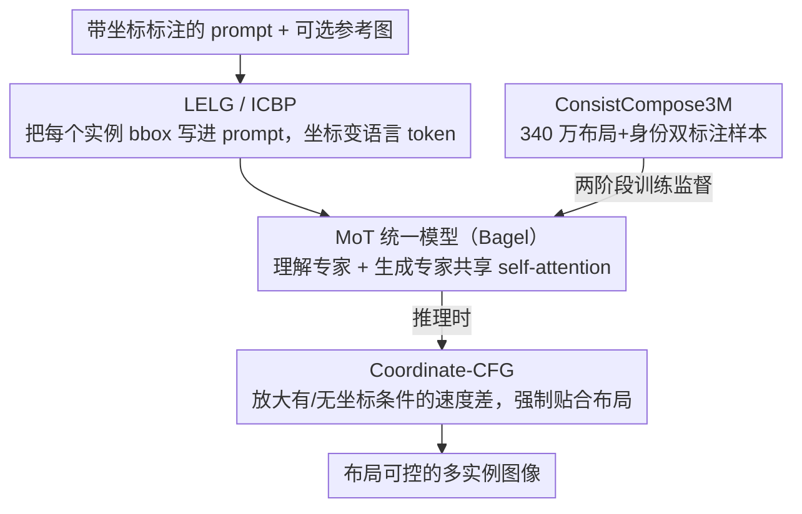

# ConsistCompose: Unified Multimodal Layout Control for Image Composition

**会议**: CVPR 2026  
**arXiv**: [2511.18333](https://arxiv.org/abs/2511.18333)  
**代码**: 无  
**领域**: 图像生成 / 布局控制  
**关键词**: 布局控制生成, 多实例图像合成, LELG, 坐标嵌入prompt, 身份保持

## 一句话总结
提出 ConsistCompose，通过将布局坐标直接嵌入语言prompt（LELG范式），在统一多模态框架中实现布局可控的多实例图像生成；构建340万样本的ConsistCompose3M数据集提供布局+身份监督；配合坐标感知CFG机制，在COCO-Position上实现布局IoU 7.2%提升和AP 13.7%提升，同时保持通用理解能力。

## 研究背景与动机

**领域现状**：统一多模态模型（如Bagel、OmniGen2）已能在单一架构中完成理解和生成，但主要聚焦于视觉理解（grounding），生成侧的布局精确控制仍然薄弱。

**现有痛点**：布局控制生成的现有方法存在根本性障碍——(a) 扩散模型方法（GLIGEN、InstanceDiffusion）依赖专门的布局-图像融合模块或区域感知U-Net，与Transformer生成框架不兼容；(b) 自回归模型（LayoutSAM、PlanGen）将布局作为独立模态处理，仅限于布局任务，无法兼顾视觉推理、理解等通用能力；(c) 多数方法只支持文本条件布局控制，不考虑更难的多参考图像身份保持场景。

**核心矛盾**：布局控制需要任务特定的分支/编码器，这与"统一"框架的理念相矛盾。如何在不引入额外架构模块的情况下实现精确布局控制？

**本文目标** 在统一多模态框架中同时支持：布局接地文本到图像生成、多参考身份一致的多实例合成、通用多模态理解——三者共用一个模型。

**切入角度**：布局本质上是一种可以用语言表达的信息。与其设计专门的空间编码器，不如把坐标编码为文本token，让Transformer通过语言理解自然学习空间接地。

**核心 idea**：语言即布局控制——将坐标嵌入prompt，让统一模型通过文本流学习空间布局，无需任何架构改动。

## 方法详解

### 整体框架
这篇论文要回答的问题是：能不能在一个统一多模态模型里实现精确布局控制，又不给它加任何专门的布局分支。答案是把布局当成语言来处理。整个系统建在 Bagel 的 MoT（Mixture of Transformers）架构上，理解和生成各由一个 Transformer 专家负责，两者共享同一套 self-attention。输入端是一段带坐标标注的文本 prompt，外加可选的参考图像；模型读完这段文本后直接生成满足布局约束的多实例图像。要让这条路走通靠三件事：先用 LELG 范式把每个实例的坐标写进 prompt（训练时让模型学会"读坐标摆位置"），推理时用 Coordinate-CFG 放大坐标条件的影响力，而这两者都需要 ConsistCompose3M 这个同时带布局和身份标注的数据集来喂。

### 关键设计

**1. LELG 范式 + 实例-坐标绑定 Prompt（ICBP）：把 bbox 直接写进 prompt，让坐标变成语言 token**

布局控制以往要么改架构（GLIGEN 加 gated Transformer 层、InstanceDiffusion 加多模态融合模块、CreatiLayout 用 SiamLayout），要么把布局当成独立模态单独建一条分支——这两条路都和"统一模型"的理念相冲突。LELG 的做法是回到输入层：对第 $i$ 个实例，把它归一化后的 bbox $b_i = (x_1^i, y_1^i, x_2^i, y_2^i) \in [0,1]^4$ 用三位小数写出来，紧跟在它对应的主语短语后面，拼成一句话，比如 "a brown sofa &lt;bbox&gt;[0.123, 0.456, 0.789, 0.901]&lt;/bbox&gt;"。坐标就这样成了普通的语言 token，和短语一起进同一个 self-attention，模型靠语言理解自然学会"这个名词应该出现在画面的这个位置"。这样做的好处是连锁的：不需要任何布局编码器或额外 attention 模块（零架构改动）；理解和生成共享同一个 token 空间，所以理解任务里练出来的空间推理能力可以直接迁到生成侧；三位小数把连续坐标离散成约 $1000^3$ 个位置，精度够用又天然兼容现有 tokenizer。相比那些靠加模块解决问题的方法，LELG 纯粹在输入层把事情办了。

**2. 坐标感知 Classifier-Free Guidance（Coordinate-CFG）：把 CFG 从语义引导扩展成空间引导**

ICBP 把空间信号塞进了 prompt，但模型未必足够"服从"这个信号——生成时位置可能飘。Coordinate-CFG 借用文本 CFG 的思路，只不过对比的是"有坐标条件"和"无坐标条件"两次预测的速度差，把这个差放大，逼着生成更贴合布局：

$$\mathbf{v}_t^{\text{coord-cfg}} = \mathbf{v}_t^{\text{uncond}} + s_{\text{coord}}(\mathbf{v}_t^{\text{coord}} - \mathbf{v}_t^{\text{uncond}})$$

其中 $s_{\text{coord}}$ 控制空间引导强度。为防止放大后速度幅度爆炸，再加一个归一化系数 $\alpha = \|\mathbf{v}_t^{\text{base}}\| / \|\mathbf{v}_t^{\text{coord-cfg}}\|$ 把幅度拉回基准。实验里 $s_{\text{coord}}$ 从 1 调到 3，位置精度逐步上升，但调得过大会略微牺牲感知质量，存在一个最优点。这个机制和文本 CFG 解耦、可以叠加使用，也能迁到任何支持 CFG 的生成模型。

**3. ConsistCompose3M 数据集：补上"布局 + 身份"双标注大规模训练数据的空缺**

布局控制生成进展慢的一个现实原因是没有既带布局标注又带身份标注的大规模多实例数据集。ConsistCompose3M 用复用已有数据的方式凑出 340 万样本，分两个子集。T2I 子集（260 万）拿 LayoutSAM 重新加工，按 ICBP 的格式把每个实例的 bbox 坐标附到 caption 里，让模型练"读坐标生成单图多实例"。参考条件子集（80 万）则复用 Subjects200K 和 UNO 的主体素材，把同一批主体在不同布局下重新拼成多主体场景，再用 CLIP/DINO 相似度过滤掉身份漂移的样本，保证"同一个主体在不同位置长得还是它"。这种"重新处理已有数据构建新用途数据集"的思路成本低、又恰好补齐了布局和身份两类监督。

### 训练策略
- **两阶段训练**：先做对齐阶段（混合通用理解数据+ConsistCompose3M注入布局意识），再做混合SFT阶段（联合训练理解/生成/编辑/多主体参考生成+ConsistCompose3M）
- **训练目标**：Flow Matching损失 $\mathcal{L}_{\text{FM}}$ + 语言模型损失 $\mathcal{L}_{\text{LM}}$ 的加权组合，无额外坐标回归损失——空间接地完全从语言流中隐式学习
- **高分辨率微调**：进一步平衡布局控制和通用图像生成性能

## 实验关键数据

### 主实验（COCO-Position）

| 方法 | Instance Success Avg↑ | Image Success Avg↑ | mIoU↑ | AP↑ | AP50↑ | AP75↑ |
|------|---------------------|-------------------|-------|-----|-------|-------|
| GLIGEN | 82.6 | 52.1 | 69.0 | 40.5 | 75.9 | 39.1 |
| InstanceDiffusion | 87.8 | 65.5 | 78.1 | 57.2 | 83.6 | 65.5 |
| MIGC++ | 86.8 | 63.4 | 74.9 | 48.3 | 79.2 | 52.6 |
| CreatiLayout | 74.0 | 42.5 | 64.9 | 32.4 | 61.1 | 31.6 |
| PlanGen | 82.5 | 50.3 | 66.2 | 31.9 | 74.0 | 21.5 |
| **ConsistCompose** | **92.6** | **76.1** | **85.3** | **70.9** | **89.1** | **76.9** |

- 相比最强基线InstanceDiffusion：布局mIoU +7.2%，AP +13.7%，Image Success Avg +10.6%

### 训练阶段消融

| 阶段 | Instance Success Avg | mIoU | AP |
|------|---------------------|------|-----|
| Alignment only | 88.4 | 79.1 | 58.3 |
| + Hybrid SFT | **92.6** | **85.3** | **70.9** |

### 关键发现
- **LELG有效性**：仅通过语言嵌入坐标（无额外架构），布局准确性即大幅超越所有专门设计的基线
- **通用能力保持**：在MMMU和MMBench上与Bagel backbone持平，说明布局控制训练不会损害通用理解
- **Coordinate-CFG的作用**：$s_{\text{coord}}$ 从1到3逐步提升位置精度，存在最优点（过大会略损质量）
- **两阶段训练必要**：Hybrid SFT阶段在Alignment基础上进一步提升AP 12.6%

## 亮点与洞察
- **LELG范式的简洁性**令人印象深刻：将"布局控制"这个看似需要专门模块的问题，化简为"在prompt中插入坐标"——零架构改动实现SOTA布局精度。这个设计思路暗示了一个更大的insight：很多看似需要专门模块的条件控制（深度、边缘、关键点），都可能被统一为语言接口的一部分。
- **Coordinate-CFG**巧妙地将CFG从"语义引导"扩展到"空间引导"，且独立于文本CFG工作，可以叠加使用。这个设计可以迁移到任何支持CFG的生成模型中。
- **数据集构建策略**值得借鉴：通过重新处理已有数据（LayoutSAM→T2I, Subjects200K→参考条件）构建新用途的数据集，高效利用已有资源。

## 局限与展望
- 三位小数的坐标离散化在高分辨率场景下可能精度不足（约0.1%图像宽度的误差）
- 当前只支持bounding box级别的布局控制，不支持更细粒度的mask、关键点或深度条件
- 依赖Bagel作为backbone，受限于其基础生成质量和训练规模
- 需要专门构建ConsistCompose3M数据集，数据准备成本不低
- 多实例场景中实例数较多时（如>6个），性能可能下降（COCO-Position测试最多6个实例）

## 相关工作与启发
- **vs GLIGEN [Li et al., 2023]**: GLIGEN用gated Transformer层引入bbox约束，是架构层面的改动。ConsistCompose的LELG范式更轻量且效果更好（AP +30.4%）
- **vs InstanceDiffusion [Wang et al., 2024]**: InstanceDiffusion通过多模态输入融合实现实例级控制，但仍是U-Net范式。ConsistCompose在Transformer生成范式下超越它
- **vs PlanGen [Gong et al., 2024]**: PlanGen先规划布局再生成图像，分两步走。ConsistCompose的端到端方式更统一且效果更好

## 评分
- 新颖性: ⭐⭐⭐⭐⭐ LELG范式是布局控制生成的范式创新，用语言接口统一空间控制
- 实验充分度: ⭐⭐⭐⭐⭐ COCO-Position、MS-Bench、GenEval、MMMU、MMBench全面评估
- 写作质量: ⭐⭐⭐⭐ 结构清晰，图表丰富，技术细节充分
- 价值: ⭐⭐⭐⭐⭐ 为统一多模态模型的布局控制提供了简洁有效的解决方案

<!-- RELATED:START -->

## 相关论文

- [\[AAAI 2026\] Laytrol: Preserving Pretrained Knowledge in Layout Control for Multimodal Diffusion Transformers](../../AAAI2026/image_generation/laytrol_preserving_pretrained_knowledge_in_layout_control_fo.md)
- [\[CVPR 2026\] Scone: Bridging Composition and Distinction in Subject-Driven Image Generation via Unified Understanding-Generation Modeling](scone_bridging_composition_and_distinction_in_subject-driven_image_generation_vi.md)
- [\[AAAI 2026\] EchoGen: Cycle-Consistent Learning for Unified Layout-Image Generation and Understanding](../../AAAI2026/image_generation/echogen_cycle-consistent_learning_for_unified_layout-image_generation_and_unders.md)
- [\[CVPR 2026\] MICON-Bench: Benchmarking and Enhancing Multi-Image Context Image Generation in Unified Multimodal Models](micon-bench_benchmarking_and_enhancing_multi-image_context_image_generation_in_u.md)
- [\[CVPR 2026\] ChArtist: Generating Pictorial Charts with Unified Spatial and Subject Control](chartist_generating_pictorial_charts_with_unified_spatial_and_subject_control.md)

<!-- RELATED:END -->
