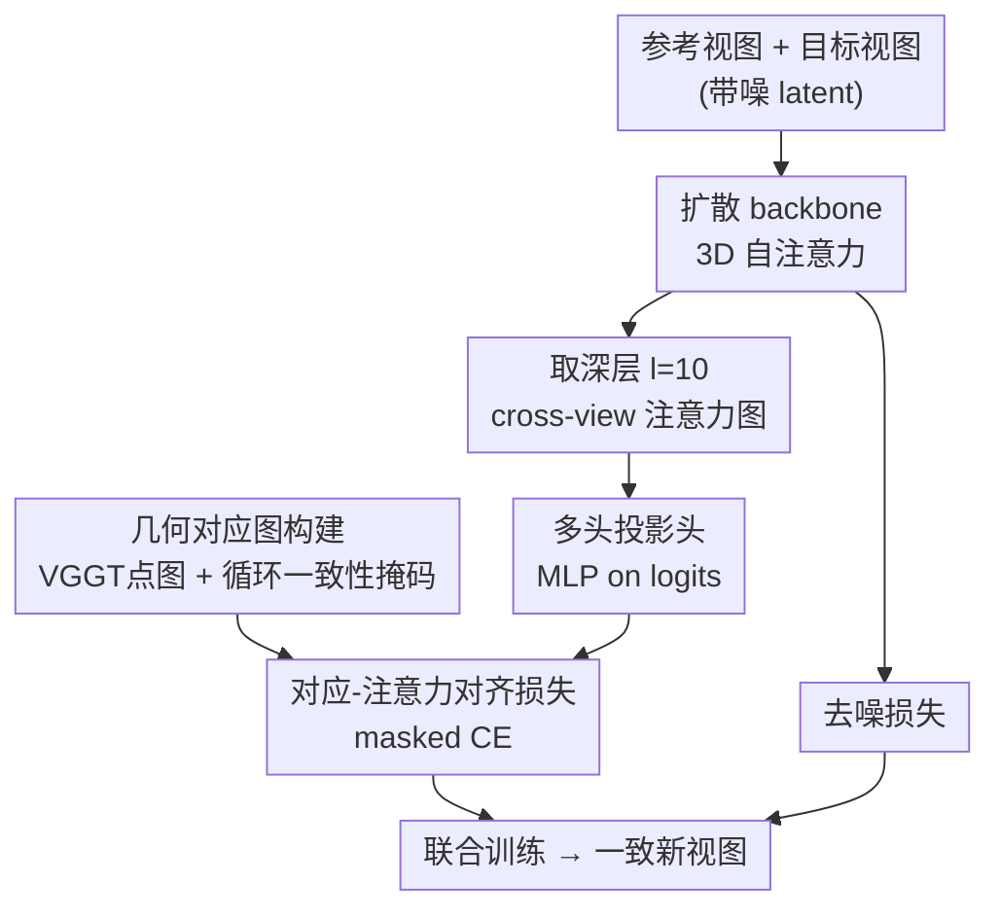

# Correspondence-Attention Alignment for Multi-View Diffusion Models

**会议**: CVPR 2026  
**论文**: [CVF Open Access](https://openaccess.thecvf.com/content/CVPR2026/html/Kwon_Correspondence-Attention_Alignment_for_Multi-View_Diffusion_Models_CVPR_2026_paper.html)  
**代码**: https://cvlab-kaist.github.io/CAMEO/ （项目页）  
**领域**: 扩散模型 / 新视角合成  
**关键词**: 多视角扩散, 新视角合成, 3D自注意力, 几何对应, 注意力监督

## 一句话总结
作者先揭示多视角扩散模型的 3D 自注意力在深层会自发学到「跨视角几何对应」，但这个信号在大视角变化下会退化；据此提出 CAMEO——只用几何对应图直接监督**单个深层注意力**，让收敛速度翻倍、新视角合成质量更高，且对任意多视角扩散模型通用。

## 研究背景与动机
**领域现状**：新视角合成（NVS）正从逐场景优化（NeRF / 3DGS）转向生成式路线。多视角扩散模型（CAT3D、MVGenMaster 等）在 2D 扩散先验上加一层 **3D 自注意力**——把 N 个参考视图和 M 个目标视图的 token 拼成一条长序列，让每个 query token 能 attend 到所有视图的所有空间位置，从而生成跨视角一致的图像。

**现有痛点**：这种一致性在大视角旋转、复杂几何场景下经常崩——会出现跨视角错位、结构扭曲（图 1 里 CAT3D 把建筑物屋顶、砖块生成错位）。更关键的是，**没人说清楚** 3D 自注意力到底是靠什么机制维持视角一致的，所以也无从针对性地改进。

**核心矛盾**：标准的去噪（denoising score matching）目标只隐式地鼓励一致性，它并不直接告诉模型「这个 query 点在另一视图里对应哪个像素」。于是模型要靠海量迭代慢慢「悟」出几何对应，且悟得不彻底——作者实测它在小视角下能逼近 VGGT 点图精度，但大视角下精度断崖式下跌。

**切入角度**：作者先做诊断分析（这是本文一半价值所在）——既然怀疑注意力图承载了几何对应，那就直接量化它。三个发现：① 几何对应**集中在深层**（U-Net 的 l=10、DiT 的 l=32），浅层几乎没有；② 对应精度随训练单调上升，且与 PSNR 强相关；③ 但这个信号不完整——和 VGGT 比有明显 gap，大视角下尤其脆弱。

**核心 idea**：既然「跨视角对应」本就是模型内部维持一致性的关键信号、只是学得慢学得糙，那就**用现成几何模型（VGGT）算出的真值对应图，直接监督那一个深层的注意力图**，把隐式学习变成显式对齐——一层就够，不动其余结构。

## 方法详解

### 整体框架
CAMEO 在常规多视角扩散训练之上**加一条监督支路**，本体网络结构不变。前向时输入 N 参考视图 + M 目标视图（共 F=N+M 个），经扩散 backbone 的若干 3D 自注意力块；在被诊断为「几何对应最强」的那个深层（CAT3D 取 l=10），取出某一对视图 (i,j) 之间的 cross-view 注意力图 $A^l_{i,j}\in\mathbb{R}^{hw\times hw}$。与此并行，用一个现成几何模型（VGGT 点图 + DUSt3R 最近邻匹配）离线算出该视图对的**几何对应图** $P_{i,j}$（逐行 one-hot，标出每个 query token 在另一视图里的真值对应 token）。CAMEO 让前者去对齐后者——经过一个 MLP 投影头后用带可见性掩码的交叉熵损失拉近，再与标准去噪损失加权联合训练。整个改动只触碰一层注意力，因此「model-agnostic」：换成 MVGenMaster（同 U-Net，l=10）或 Hunyuan-DiT（l=32）都照搬。

### 关键设计

**1. 深层注意力即几何对应：把「为什么一致」量化出来**

这是全文的地基，也是方法成立的前提。作者把 cross-view 注意力定义为归一化后的 $A^l_{i,j}=\mathrm{softmax}\!\big(Q^l_i (K^l_j)^\top/\sqrt{d}\big)$，对每个 query token $x_i$，取注意力权重最大的 key 位置当作「模型认为的对应点」，再用 NAVI 数据集的真值对应算 Precision@2cm。结论很硬：CAT3D 在 l=10 的对应精度逼近 DINOv3-L，小视角（0–30°）下甚至追平 VGGT 点图；而浅层、以及未微调的 SD2.1 初始权重几乎没有对应能力。作者还借 PAG 的手法把某层 3D 自注意力强行设成 identity（让 query attend 不到对应点）——扰动浅层画质几乎不变，扰动深层则场景直接崩成几何不可信的扭曲图，反证深层注意力才是一致性的承载者。正是这个分析，决定了 CAMEO「只监督一层、且是深层」的设计，而非盲目全层监督。

**2. 几何对应图构建：用 VGGT 点图造出 token 级 one-hot 真值**

要监督注意力，先得有「正确该 attend 哪里」的真值。作者用现成几何模型 VGGT 取点图，按 DUSt3R 的做法在 3D 空间找最近邻得到像素级对应，再下采样/插值到 token 分辨率 $h\times w$。对每个 query token $x_i$ 构造 one-hot 向量 $P_{i,j}(x_i)\in\mathbb{R}^{hw}$（对应 token $x_j$ 处为 1、其余为 0），堆叠成对应图 $P_{i,j}\in\mathbb{R}^{hw\times hw}$。关键是引入**可见性掩码**处理遮挡/出画——不是每个 query 点在另一视图里都看得见，硬监督会引入噪声。作者用循环一致性判定：从 $x_i$ 经对应到 $x_j$、再从 $x_j$ 经对应回到 $\hat x_i$，只有当往返误差 $\|p(x_i)-p(\hat x_i)\|_2 \le \varepsilon$（$p(\cdot)$ 是 token 索引到 2D 坐标的映射，$\varepsilon=1.5$）时才置 $M_{i,j}(x_i)=1$，否则该 query 不计损失。消融显示阈值放太松（∞，即不做可见性过滤）反而掉点，说明这个掩码确实在挡掉不可靠监督。

**3. 单层对应-注意力对齐损失：用 masked 交叉熵把注意力拉成对应分布**

有了 $A^l_{i,j}$ 和 $P_{i,j}$，对齐损失就很直接——把注意力图的每一行（一个概率分布）往 one-hot 真值上拉，等价于一个 $hw$ 类分类问题，故用交叉熵而非 L1（消融里 CE 明显优于 L1）。损失定义为

$$L_{\text{CAMEO}} = \mathbb{E}_{(i,j),\,x_i}\Big[\, M_{i,j}(x_i)\cdot \mathrm{CE}\big(A^{l}_{i,j}(x_i),\,P_{i,j}(x_i)\big)\Big]$$

只在所有可见的 query token、所有视图对上求期望。最终训练目标把它和标准去噪损失加权相加：$L_{\text{total}} = L_{\text{denoise}} + \lambda L_{\text{CAMEO}}$（$\lambda=0.02$）。值得强调的是「单层就够」——作者只在 l=10 加这一项，就同时拿到了更快收敛、更好画质、以及大视角下更鲁棒的对应，无需逐层监督或改动网络主干。

**4. 多头投影头：别让对齐压垮多头的表达力**

直接把对齐损失加到原始注意力 logits 上有副作用：多视角扩散普遍用多头注意力，不同 head 本应捕捉不同模式，若强迫**所有 head** 都对齐到同一份几何对应，会牺牲架构灵活性、压缩表达力。作者的解法是在 softmax 之前接一个轻量 MLP 投影头，对 attention logits 投影后再算 CAMEO 损失——相当于让监督作用在一个「可学习的对应视角」上，而不直接绑死原始多头分布。消融里去掉 MLP head（✗）相比保留（✓）在 PSNR / SSIM / LPIPS 三项都更差，验证了这个解耦的必要性。

### 损失函数 / 训练策略
总损失 $L_{\text{total}}=L_{\text{denoise}}+\lambda L_{\text{CAMEO}}$，$\lambda=0.02$、循环一致性阈值 $\varepsilon=1.5$。CAT3D / MVGenMaster 监督 l=10，Hunyuan-DiT 监督 l=32。训练用 AdamW、固定学习率 2.5e-5、weight decay 0.01、batch size 6，10% 概率丢弃相机条件做 CFG 训练；推理用 50 步 DDIM、CFG 权重 2.0；512×512 分辨率、2×A100(40GB)。每个训练样本 F=4 视图，随机 1–3 个当目标、其余当参考。

## 实验关键数据

### 主实验
基线为 CAT3D（用 MVGenMaster 的复现、SD2.1 初始化），对比 REPA（特征对齐到 DINOv2）和 Geometry Forcing（特征对齐到 VGGT 几何特征）。下表节选 RealEstate10K（场景级）与 DTU（OOD，物体级）在两个迭代档的结果：

| 数据集 | Iter | 指标 | CAT3D | +REPA | +Geo.F. | +CAMEO |
|--------|------|------|-------|-------|---------|--------|
| RealEstate10K | 80k | PSNR↑ | 18.99 | 18.70 | 18.92 | **19.40** |
| RealEstate10K | 320k | PSNR↑ | 19.88 | 19.76 | – | **20.16** |
| RealEstate10K | 320k | LPIPS↓ | 0.287 | 0.286 | – | **0.279** |
| DTU (OOD) | 80k | PSNR↑ | 10.29 | 10.31 | 10.43 | **11.45** |
| DTU (OOD) | 320k | PSNR↑ | 12.23 | 11.71 | – | **12.16** |

核心结论：CAMEO 在 80k 迭代就达到 PSNR>19.4，而基线要 160k+ 才追平——**约 2× 训练加速**；且收敛后（320k+）仍优于基线，说明既加速又涨质。注意力级对齐（CAMEO）整体优于特征级对齐（REPA / Geo.F.），印证作者论点：跨视角一致性的关键信号在**注意力**里而非单视图特征里。

### 消融实验
| 配置 | 关键指标(80k PSNR↑) | 说明 |
|------|------|------|
| 监督 l=10 | **19.08** | 最强对应层，最佳 |
| 监督 l=2 | 18.80 | 次优，浅层 |
| 监督 l=6 | 18.19 | 中间层最差 |
| w/o MLP head | 18.08 (40k) | 去投影头掉点 |
| w/ MLP head | 18.31 (40k) | 完整 |
| Loss = L1 | 17.84 (40k) | 换 L1 明显变差 |
| Loss = CE | 18.31 (40k) | 完整 |
| 阈值 ε=∞ | 18.18 (40k) | 不做可见性过滤掉点 |
| 阈值 ε=1.5 | 18.31 (40k) | 完整 |

### 关键发现
- **监督层选择最关键**：l=10（对应最强层）显著优于中间层 l=4/6/7，与诊断分析自洽——盲目选层会失效。Hunyuan-DiT 同理在 l=32 最佳。
- **三个组件都在起作用**：MLP 投影头、CE（优于 L1）、可见性阈值 ε=1.5（优于不过滤）各自都有正贡献，缺一掉点。
- **模型无关性成立**：在 MVGenMaster（SOTA、带几何条件）和 Hunyuan-DiT（DiT 架构）上都涨——Hunyuan-DiT 20k 迭代时 PSNR 从 14.40 提到 **16.17**、LPIPS 从 0.459 降到 0.373，早期增益尤其大。
- **OOD 泛化**：场景级模型迁到物体级 DTU 仍稳定优于基线，说明学到的是较通用的几何理解，而非过拟合训练分布。

## 亮点与洞察
- **「先解释，再改进」的范式很漂亮**：不是拍脑袋加 loss，而是先用 Precision@2cm + 注意力扰动（PAG 式 identity 替换）两个独立证据链坐实「深层注意力 = 几何对应承载者」，再据此精准监督那一层。诊断本身就是可复用的分析工具。
- **「单层监督足矣」的极简性**：只动一层注意力、加一项 CE，就拿到 2× 加速 + 涨质 + 跨架构通用，几乎零侵入，落地成本极低。
- **可见性掩码的循环一致性技巧**可迁移到任何「用几何/光流真值监督注意力或特征」的场景——遮挡区不该被硬监督，往返一致性是个干净的过滤器。
- **多头投影头解耦**点出一个易被忽略的坑：用强结构先验监督多头注意力时，别一刀切压所有 head，留一个可学习投影能保住表达力。

## 局限与展望
- **依赖外部几何模型**：对应真值来自 VGGT 点图，质量上限被 VGGT 绑定；VGGT 出错的场景（极端光照、强反光、无纹理）监督信号也会带噪。⚠️ 论文未报告 VGGT 失效时的退化情况。
- **只监督单层、单一深度**：选层依赖对每个新架构先做一遍对应诊断（找最强层），换全新架构需额外分析成本，不是即插即用。
- **几何对应的离线计算开销**：需对训练数据预先跑 VGGT + DUSt3R 匹配，论文称细节在附录（计算成本），正文未量化，⚠️ 以原文附录为准。
- **改进方向**：可探索多层联合/自适应选层、或用更轻的在线对应估计替代离线 VGGT；也可把对齐从 one-hot 硬目标放松成软分布以容忍对应不确定性。

## 相关工作与启发
- **vs REPA / Geometry Forcing（特征对齐）**：它们把扩散的**单视图特征**蒸馏到 DINOv2 语义或 VGGT 几何特征，目标是单视图语义/几何，并不直接约束跨视角一致性；CAMEO 监督的是**跨视角注意力图**这个一致性的直接载体，实验上注意力级对齐普遍胜过特征级对齐。
- **vs CAT3D / MVGenMaster（多视角扩散本体）**：它们靠 3D 自注意力隐式获得一致性、靠海量迭代慢慢学对应；CAMEO 不改其结构，只把「隐式慢学」变成「显式快学」，因此能即插即用地嫁接到这些模型上。
- **vs NVComposer / Track4Gen（用点图/跟踪监督特征）**：思路同源（外部几何/跟踪信号注入扩散），但监督对象不同——CAMEO 抓住的是注意力而非特征，并配套可见性掩码与多头投影头两个工程细节让监督真正生效。

## 评分
- 新颖性: ⭐⭐⭐⭐⭐ 「深层注意力即几何对应」的诊断+单层注意力监督，视角独特且解释性强
- 实验充分度: ⭐⭐⭐⭐⭐ 3 架构 × 多数据集 × 多迭代档 + 完整组件消融，2× 加速与 OOD 都验证
- 写作质量: ⭐⭐⭐⭐⭐ 分析—动机—方法环环相扣，图表把抽象的注意力对应讲清楚了
- 价值: ⭐⭐⭐⭐ 近零侵入、模型无关、半数迭代收敛，对多视角扩散训练有直接实用价值

<!-- RELATED:START -->

## 相关论文

- [\[CVPR 2026\] InstructMix2Mix: Consistent Sparse-View Editing Through Multi-View Model Personalization](instructmix2mix_consistent_sparse-view_editing_through_multi-view_model_personal.md)
- [\[CVPR 2026\] MultiCrafter: High-Fidelity Multi-Subject Generation via Disentangled Attention and Identity-Aware Preference Alignment](multicrafter_high-fidelity_multi-subject_generation_via_disentangled_attention_a.md)
- [\[CVPR 2026\] LaRP: Efficient Multi-View Inpainting with Latent Reprojection Priors](larp_efficient_multi-view_inpainting_with_latent_reprojection_priors.md)
- [\[ICML 2026\] ViewMask-1-to-3: Multi-View Consistent Image Generation via Multimodal Discrete Diffusion Models](../../ICML2026/image_generation/viewmask-1-to-3_multi-view_consistent_image_generation_via_multimodal_discrete_d.md)
- [\[ICLR 2026\] Diffusion Blend: Inference-Time Multi-Preference Alignment for Diffusion Models](../../ICLR2026/image_generation/diffusion_blend_inference-time_multi-preference_alignment_for_diffusion_models.md)

<!-- RELATED:END -->
