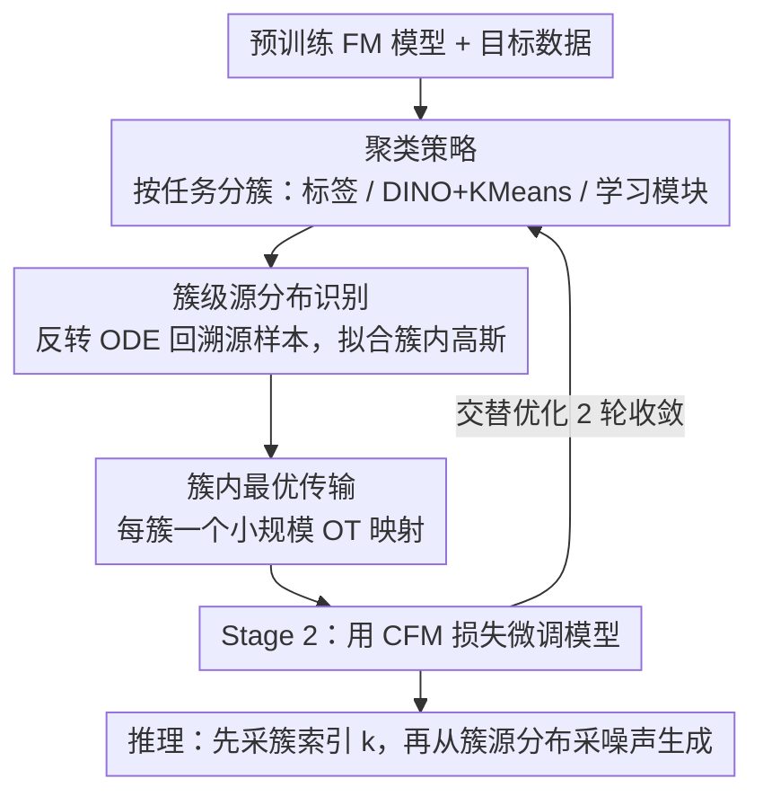

# COT-FM: Cluster-wise Optimal Transport Flow Matching

**会议**: CVPR 2026  
**arXiv**: [2603.13395](https://arxiv.org/abs/2603.13395)  
**代码**: [项目主页](https://embodiedai-ntu.github.io/cotfm)  
**领域**: 生成模型 / Flow Matching  
**关键词**: Flow Matching, 最优传输, 聚类, 向量场拉直, 加速采样

## 一句话总结

提出 COT-FM，一个即插即用的 Flow Matching 增强框架：通过聚类目标样本、反转预训练模型获取簇级源分布、在簇内近似最优传输，显著拉直传输路径，在不改变模型架构的前提下同时加速采样和提升生成质量。

## 研究背景与动机

Flow Matching (FM) 通过学习将简单源分布映射到复杂数据分布的速度场来生成样本。推理时沿速度场积分 ODE 即可生成。核心问题在于**路径弯曲**：

- **随机耦合（Random Coupling）**：每对 $(x_0, x_1)$ 虽然产生直线路径，但不同样本对在同一点的速度场方向矛盾，聚合后形成弯曲的边际速度场
- **批最优传输（Batch OT）**：仅在小 batch 内近似 OT，受局部性限制精度有限
- **弯曲路径的后果**：增大时间离散化误差，降低低步数采样质量；shortcut 方法（如 MeanFlow）只减少步数但不拉直路径

全局 OT 计算复杂度为样本数的立方，不适用于大规模数据。

## 方法详解

### 整体框架

COT-FM 想解决 Flow Matching 的路径弯曲问题：随机耦合让边际速度场互相打架、变弯，低步数采样质量就差。它在预训练 FM 模型基础上交替两个阶段——先聚类目标样本、反转 ODE 估出每个簇的源分布、在簇内算最优传输映射（Stage 1），再用构建好的簇级向量场微调模型（Stage 2），交替 2 轮即收敛。推理时只多一步：先采簇索引 $k$，再从对应源分布 $p_{0,k}$ 采初始噪声。

### 关键设计

**1. 聚类策略：先把目标数据分簇，为分治 OT 打地基**

全局 OT 复杂度是样本数的立方、根本算不动，所以第一步是把目标数据切成若干簇，后面所有阶段都建在这组簇上。分簇方式按场景灵活选择——条件生成直接用类别标签；无条件（CIFAR-10）用 DINO 特征 + K-Means（K=100）；机器人策略这种非固定聚类则学一个模块来预测新观测的源分布。簇分得好，同一簇内样本走向相近、路径交叉少，后续的源分布估计和簇内 OT 才有意义。

**2. 簇级源分布识别：用模型自身的可逆性 bootstrap 出源分布**

分好簇之后，得给每个簇配一个源分布。作者利用预训练 FM 模型的可逆性，对簇 $\mathcal{C}_k$ 里每个数据样本 $x_1$ 反转 ODE 追回源样本 $\hat{x}_0 := x_1 - \int_0^1 v_\theta(\hat{x}_t, t) \, dt$，再把这批回溯样本 $\hat{X}_{0,k}$ 近似成高斯 $p_{0,k}(x) = \mathcal{N}(x; \boldsymbol{\mu}_{0,k}, \boldsymbol{\Sigma}_{0,k})$。妙处在于预训练模型的路径天然不交叉，反转得到的源分布自然保持簇间分离，不需要任何额外标注。

**3. 簇内最优传输近似：把不可解的全局 OT 拆成 K 个小 OT**

有了簇级源分布，就能把全局 OT 分解成 $K$ 个小规模 OT。对每个簇 $\mathcal{C}_k$ 从估计源分布采样 $X_{0,k} \sim p_{0,k}$、算簇内 OT 映射 $\pi_k = \text{OT}(X_{0,k}, \mathcal{C}_k)$。这样既减少了单个 OT 问题的样本数、让 batch OT 近似更准，又把源分布空间限制住、让速度场学习更高效。

**4. 交替优化策略：构建向量场与微调模型轮流来**

Stage 1 构建簇级向量场后，Stage 2 用标准 CFM 损失微调：$\mathcal{L}_{\text{CFM}}(\theta) = \mathbb{E}_{t, (x_0, x_1) \sim B} \|v_\theta(x_t, t) - (x_1 - x_0)\|_2^2$，训练 batch 按簇大小占比采样 $P(k) = \frac{|\mathcal{C}_k|}{\sum_j |\mathcal{C}_j|}$。经验上 2 轮交替即收敛，第 3 轮反而轻微退化（过拟合）。

### 损失函数 / 训练策略

- 标准 CFM 损失（线性插值路径 $x_t = (1-t)x_0 + tx_1$）
- 不修改模型架构或输入输出机制，仅改变训练时的 source-target 耦合策略
- 推理时唯一改动：从簇级源分布（而非全局高斯）采样初始噪声

## 实验关键数据

### 主实验

| 数据集 | 指标 | COT-FM | 之前 SOTA | 提升 |
|--------|------|--------|-----------|------|
| 2D Mix-5-Gaussian | Wasserstein ↓ | **0.1995** | 0.5421 (RF) | -63.2% |
| 2D Mix-5-Gaussian | Curvature ↓ | **0.0084** | 0.0104 (OT-CFM) | -19.2% |
| CIFAR-10 (1-step) | FID ↓ | **205.0** | 378.0 (RF) | -45.8% |
| CIFAR-10 (10-step) | FID ↓ | **8.23** | 12.6 (RF) | -34.7% |
| CIFAR-10 (50-step) | FID ↓ | **3.97** | 4.45 (RF) | -10.8% |
| CIFAR-10 (MeanFlow 1-step) | FID ↓ | **2.60** | 2.92 (MeanFlow) | -11.0% |
| ImageNet 256 (SiT-B/2, 10-step) | FID ↓ | **7.52** | 8.25 (RF) | -8.8% |
| LIBERO-Long (1 NFE) | Success Rate ↑ | **94.5%** | 91.5% (2-RF) | +3.0% |

### 消融实验

| 配置 | FID (50-step) ↓ | 说明 |
|------|-----------------|------|
| Rectified Flow (0 iter.) | 4.45 | 基线 |
| COT-FM (1 iter.) | 4.23 | 1 轮交替，-0.22 |
| COT-FM (2 iter.) | **3.97** | 2 轮最优，-0.48 |
| COT-FM (3 iter.) | 4.17 | 略微退化，过拟合 |
| Uniform 簇采样 | 4.26 | 不如按比例采样 |
| Proportional 簇采样 | **3.97** | 按簇大小采样最优 |

### 关键发现

- 仅引入簇级随机耦合（不做 OT）就能将 1-step FID 从 378 降到 296，说明聚类本身已显著减少路径交叉
- COT-FM 在 CIFAR-10 上 1-step FID 从 378 降到 205（-45.8%），在低步数场景提升尤为显著
- 在 LIBERO 机器人操控任务中，COT-FM 用 1 NFE 达到 96.1%（Spatial）和 94.5%（Long），超越 FLOWER 4 NFE 结果（97.1% 和 93.5%）
- 泛化性验证：训练集和测试集 FID 差距一致（3.97/8.19 vs. 4.45/8.55），无过拟合
- MeanFlow 的学习路径仍然弯曲，验证了 shortcut 方法不能拉直底层速度场

## 亮点与洞察

- **分治 OT 是核心洞察**：将不可解的全局 OT 分解为 K 个可解的簇级 OT，兼顾了理论严谨性和计算可行性
- 利用预训练 FM 模型的可逆性来估计簇级源分布，是一种优雅的 bootstrap 策略——不需要额外标注，自然继承了模型已学到的结构
- 严格保持模型架构和推理流程不变（仅改变初始采样），使其真正成为即插即用的通用增强方案
- 跨域验证（2D 点云、图像生成、机器人操控）充分展示了方法的通用性

## 局限与展望

1. 构建簇级向量场需要反转整个训练集的 ODE，计算开销随数据量增长
2. 高斯近似可能不适合形状复杂的源分布，尤其在高维空间
3. 聚类质量对性能有直接影响——K-Means 在高维特征上可能不是最佳选择
4. 仅在 CIFAR-10 和 ImageNet 256 上验证，未扩展到更大分辨率或文本条件生成
5. 交替优化 2 轮即收敛但第 3 轮退化的原因未深入分析

## 相关工作与启发

- 与 k-Rectified Flow（迭代用自生成样本优化耦合）相比，COT-FM 避免了模型坍塌风险
- 与 OT-CFM（batch 级 OT）相比，COT-FM 通过聚类将 batch OT 限制在更小范围内，显著提升近似精度
- 与 MeanFlow（学习平均速度场）相比，COT-FM 从根本上拉直速度场而非仅跳步
- 启发：Flow Matching 的关键改进空间在于耦合策略而非模型架构，数据层面的结构利用（聚类）是被忽视的维度

## 评分

- **新颖性**: ⭐⭐⭐⭐ 簇级 OT + 预训练模型 ODE 反转估计源分布的组合思路新颖且优雅
- **实验充分度**: ⭐⭐⭐⭐⭐ 2D/图像/机器人三域验证，多基线对比，丰富消融（交替轮数/泛化/采样策略）
- **写作质量**: ⭐⭐⭐⭐ 动机推导严谨，算法伪代码清晰，图示直观
- **价值**: ⭐⭐⭐⭐⭐ 通用即插即用，不改架构不改推理流程，实用价值极高；低步数场景提升显著

<!-- RELATED:START -->

## 相关论文

- [\[ICCV 2025\] Contrastive Flow Matching (ΔFM)](../../ICCV2025/image_generation/contrastive_flow_matching.md)
- [\[NeurIPS 2025\] On the Relation between Rectified Flows and Optimal Transport](../../NeurIPS2025/image_generation/on_the_relation_between_rectified_flows_and_optimal_transport.md)
- [\[ICML 2026\] Pareto-Guided Optimal Transport for Multi-Reward Alignment](../../ICML2026/image_generation/pareto-guided_optimal_transport_for_multi-reward_alignment.md)
- [\[CVPR 2026\] BiFM: Bidirectional Flow Matching for Few-Step Image Editing and Generation](bifm_bidirectional_flow_matching_for_few-step_image_editing_and_generation.md)
- [\[CVPR 2026\] ChordEdit: One-Step Low-Energy Transport for Image Editing](chordedit_one-step_low-energy_transport_for_image_editing.md)

<!-- RELATED:END -->
