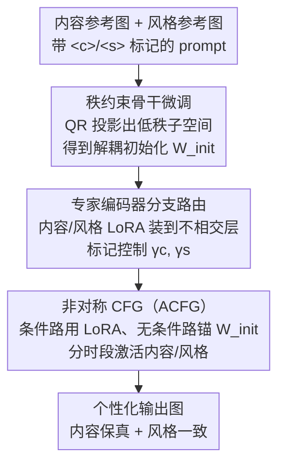

# CRAFT-LoRA: Content-Style Personalization via Rank-Constrained Adaptation and Training-Free Fusion

**会议**: CVPR 2026  
**论文**: [CVF Open Access](https://openaccess.thecvf.com/content/CVPR2026/html/Li_CRAFT-LoRA_Content-Style_Personalization_via_Rank-Constrained_Adaptation_and_Training-Free_Fusion_CVPR_2026_paper.html)  
**代码**: https://github.com/Skylanding/CraftLoRA （有）  
**领域**: 扩散模型 / 图像生成  
**关键词**: LoRA融合, 内容-风格解耦, 个性化生成, Classifier-Free Guidance, 低秩约束  

## 一句话总结
CRAFT-LoRA 用「秩约束的骨干微调（造一个利于解耦的初始化）+ 专家编码器分支路由（按 prompt 标记把内容/风格 LoRA 装到不相交的层）+ 时序非对称 CFG（推理时免训练稳住融合）」三件套，让独立训练的内容 LoRA 和风格 LoRA 能干净地组合，在内容相似度、风格相似度和 GPT-4o 综合评分上都刷到 SOTA。

## 研究背景与动机
**领域现状**：个性化图像生成里，LoRA 是最高效的定制手段——往冻结的文生图扩散模型里塞一对小的低秩矩阵，只用一张参考图就能学会某个「内容」（主体身份、结构）或某个「风格」（纹理、色彩）。更诱人的是，多个独立训练好的 LoRA 可以在推理时同时挂载，理论上就能「指定主体 + 指定画风」自由组合。

**现有痛点**：但直接把多个 LoRA 权重加起来融合，质量经常崩——内容和风格表示纠缠在一起，常出现结构变形或风格被冲淡。已有的融合方法各有各的别扭：ZipLoRA 要为每对内容-风格学一组逐列混合系数（需额外优化），B-LoRA 靠注意力模块的功能分工分离，K-LoRA 把不同 LoRA 选择性贴到不同注意力层。它们都在「下游怎么合」上做文章，却没动「上游骨干本身就纠缠」这个病根。

**核心矛盾**：预训练扩散模型从来没被显式训练去支持 LoRA 组合，所以它的生成空间里内容因子和风格因子天然交叠；只在融合阶段补救，要么得反复优化、要么会改动 LoRA 原始权重导致身份/风格丢失，还带来不小的算力开销。

**本文目标**：拆成三个子问题——(1) 怎么让骨干一开始就把内容/风格放进互不重叠的子空间；(2) 怎么在 adapter 层面按语义精细地分别注入、并能调强弱；(3) 怎么在推理时免训练地稳定融合、不破坏原 LoRA 权重。

**切入角度**：作者借了元学习 MAML 的思路——与其在融合阶段救火，不如先找一个「利于快速、可泛化适配」的初始化。具体落到 PaRa 式的秩约束微调：把骨干的生成空间压窄到一个更紧凑、更解耦的表示上，再在这个底座上训 LoRA。

**核心 idea**：用「秩约束初始化（解耦的底座）+ 标记路由的专家编码器（精确注入）+ 非对称 CFG（免训练稳融合）」三段互补的设计，把内容-风格解耦从「事后融合」前移到「骨干 + 训练 + 采样」三个环节联动。

## 方法详解

### 整体框架
CRAFT-LoRA 是一条统一的个性化合成流水线，分三个阶段：**训练前先把骨干「秩约束微调」**成一个内容/风格更分离的初始化 $W_{init}$；在这个底座上**分别训内容 LoRA $\Delta W_c$ 和风格 LoRA $\Delta W_s$**，并用带 `<c>`/`<s>` 标记的 prompt 把它们约束到不相交的层集合；**推理时用专家编码器把 prompt 路由成内容/风格强度标量 $\gamma_c,\gamma_s$，再用时序非对称 CFG（ACFG）在不同去噪步选择性激活两路 LoRA**，免训练地完成稳定融合。输入是「一张内容参考图 + 一张风格参考图 + 一句带标记的 prompt」，输出是同时保住主体身份又忠实迁移画风的图。

### 关键设计

**1. 秩约束骨干微调：先把骨干压成内容/风格不交叠的底座**

针对「预训练骨干本身就纠缠、只在融合阶段救火治标不治本」这个病根，本文在训 LoRA 之前先对 SDXL 的 U-Net 做一次一次性的秩约束微调。每层引入一个可学习基矩阵 $B_l \in \mathbb{R}^{d_{in}\times r_l}$（秩 $r_l \ll \min(d_{out}, d_{in})$），对它做 QR 分解 $B_l = Q_l R_l$ 得到正交基 $Q_l$（$Q_l^\top Q_l = I$），然后把骨干权重沿这个低秩子空间的分量投影掉：

$$W_l = W_l^{(0)} - Q_l Q_l^\top W_l^{(0)}.$$

这一步把更新限制在与学到的低秩子空间正交的方向上，等于给模型加了一个「减少内容/风格表示重叠」的结构性归纳偏置。秩不是全层均匀分配，而是按层线性衰减 $r_l = r_{max} - \frac{l-1}{L-1}(r_{max}-r_{min})$（实现里 $r_{max}=128, r_{min}=4$），给靠前的层更高的秩——因为浅层编码低级结构和纹理、内容风格在这里最纠缠，需要更多适配容量。相比全层统一 $r=64$，这个分层调度把内容相似度提了 4.8%、风格相似度提了 5.2%、互影响降了 11.3%。内容/风格各训一套基 $B_l^{content}, B_l^{style}$，把对应正交子空间拼接后再 QR 合并 $Q_l^{merged} = [Q_l^{content} \mid Q_l^{style}]$ 得到联合更新，保证两类变化落进互不相交的低秩子空间。

为了驱动这个解耦，作者还专门构了 100 对**对比式内容-风格配对**：用频域分解来操作化「内容 vs 风格」——内容对应低频（结构、布局、语义），风格对应高频（纹理、色彩）。具体是用截止频率 $\sigma=0.35$（归一化）的高斯低通滤波提内容、残差当风格（$\sigma$ 在 $\{0.2,\dots,0.5\}$ 里用 MLLM 评估分离质量挑出来的）。取 10 张内容图 × 10 张风格图穷举配对，固定内容换风格 / 固定风格换内容，让模型分别学到内容基和风格基。作者发现「多样性比数量更重要」：50 对就能达到满配置 95% 的效果，加到 200 对只多不到 2%。消融里去掉 Rank-FT 掉点最多，证实它是解耦的核心。

**2. 专家编码器分支路由：按 prompt 标记把内容/风格精确注入不相交的层，还能调强弱**

针对「现有方法把主体塌成一个粗粒度 token、丢掉了身份/发型/服饰这种层级结构、也没法控制各元素保留多少」的痛点，本文在解耦底座上加了一套 prompt 引导的专家编码器。给一句带显式标记的 prompt（如 "A photo of a person `<c>` smiling in a watercolor style `<s>`"），先把标记去掉送进 SDXL 文本编码器得到统一语义嵌入 $e_{sem}$，同时单独抽出 `<c>` 对应的内容嵌入 $e_c$ 和 `<s>` 对应的风格嵌入 $e_s$，让两路得到隔离的语义引导。训练时把内容矩阵 $A_i^{(c)}$ 和风格矩阵 $A_i^{(s)}$ 分配到**不相交的层索引集合** $I_c$（浅/中层，管结构身份）和 $I_s$（高层，管纹理渲染），梯度只在各自指定层集合内更新，从架构上偏向独立子空间。推理时专家编码器把 prompt 路由成控制标量 $\gamma_c, \gamma_s$（默认按标记有无取 $\{0,1\}$，也可在 $[0,1]$ 连续调），聚合骨干为：

$$W^{agg} = W_{init} + \sum_{i\in I_c} E_i\big(\gamma_c \Delta W_i^{(c)}\big) + \sum_{i\in I_s} E_i\big(\gamma_s \Delta W_i^{(s)}\big),$$

其中 $E_i(\cdot)$ 把输入注入第 $i$ 层、其余层填零，使求和等价于逐层直和。标记缺失则对应分支不激活；用户直接调 $\gamma_c,\gamma_s$ 就能实现「保内容换风格」这类组合，全程无需重训。

**3. 非对称 CFG（ACFG）：推理时免训练地稳住融合，不动 LoRA 权重**

针对「ZipLoRA 这类融合要额外优化、直接改 LoRA 参数又会抹掉关键身份/风格信息」的痛点，本文提出非对称 Classifier-Free Guidance。标准 CFG 里条件路和无条件路共用同一套权重，挂上 LoRA 后无条件路会被内容/风格 adapter 污染，导致生成不稳。ACFG 的做法是**不对称**：条件路用 LoRA 适配后的权重，无条件路始终锚在秩约束底座 $W_{init}$ 上（$W_i^{uncond}(t) = W_i^{init}, \forall t,i$）。同时引入时序激活调度 $\gamma_c(t)=\mathbb{1}_{t\in T_c}$、$\gamma_s(t)=\mathbb{1}_{t\in T_s}$——内容 LoRA 在早-中段激活先立住结构布局，风格 LoRA 在中-晚段激活再细化纹理渲染，契合扩散从粗到细的本质（实现里 $T=50$ 步，设 $T_c=[1,35]$、$T_s=[15,50]$，中段留重叠窗让两者联合过渡）。最终引导估计为：

$$\epsilon_\theta^{acfg} = (1+\omega)\,\epsilon_{cond} - \omega\,\epsilon_{uncond}.$$

关键洞察是：把无条件路钉死在 $W_{init}$，引导信号 $\epsilon_{cond}-\epsilon_{uncond}$ 就只隔离出 LoRA adapter 在每个时间步的净效应，而不会把 adapter 影响和无条件基线混在一起；配上时序调度，内容结构先建立、风格细节后施加，进一步减少互扰。ACFG 不需任何额外训练或参数优化，保持和标准 CFG 一样的两次前向，额外开销 <5%；它甚至能脱离秩约束底座直接套在标准 SDXL LoRA 上（融合更稳，但解耦稍差）。

### 损失函数 / 训练策略
全部基于 SDXL，在 NVIDIA 4090 上用 DreamBooth 方式训 LoRA（秩 $r=64$、Adam-8bit、1000 步、学习率 $1\times10^{-5}$，每个 LoRA 从单张参考图学）。秩约束骨干微调是一次性成本：$r_{max}=128, r_{min}=4$ 线性衰减，2×4090 上跑 5000 步，得到的 $W_{init}$ 之后被所有 LoRA 训练/推理复用。推理时 ACFG 与标准 CFG 同为两次前向、额外开销 <5%。

## 实验关键数据

内容概念用 DreamBooth 数据集（30 主题、每主题 4-5 图），风格概念用 StyleDrop 并补充艺术风格图；评测用严格不相交的训练/测试划分。指标：内容相似度、风格相似度用 CLIP-I 嵌入算；综合评分（Combination Score）用 GPT-4o 二元判断——给定内容参考、风格参考、输出，问是否同时整合了内容身份与艺术风格，每样本 50 次取平均成功率。每个指标在 10 对内容-风格、每对 10 张生成图上平均。

### 主实验
| 方法 | 内容相似度 (CLIP-I) ↑ | 风格相似度 (CLIP-I) ↑ | 综合评分 (GPT-4o) ↑ |
|------|------|------|------|
| Direct Merging | 0.65 | 0.60 | 0.62 |
| StyleDrop | 0.68 | 0.76 | 0.70 |
| ZipLoRA | 0.70 | 0.69 | 0.73 |
| KLoRA | 0.71 | 0.72 | 0.76 |
| BLoRA | 0.74 | 0.70 | 0.77 |
| LoRA.rar | 0.73 | 0.71 | 0.76 |
| **Ours** | **0.79** | **0.80** | **0.83** |

基线各有偏科：Direct Merging 内容风格都保不住，StyleDrop 偏风格牺牲结构，ZipLoRA/KLoRA/BLoRA/LoRA.rar 更均衡但整体协调性受限；CRAFT-LoRA 在三项上全部最高。

### 消融实验
| Rank-FT | Router | ACFG | 内容相似度 ↑ | 风格相似度 ↑ | 综合评分 ↑ |
|:---:|:---:|:---:|:---:|:---:|:---:|
| | | | 0.65 | 0.60 | 0.62 |
| ✓ | | | 0.73 | 0.70 | 0.72 |
| | ✓ | | 0.69 | 0.65 | 0.67 |
| | | ✓ | 0.68 | 0.64 | 0.66 |
| ✓ | ✓ | | 0.76 | 0.76 | 0.80 |
| ✓ | | ✓ | 0.75 | 0.73 | 0.78 |
| | ✓ | ✓ | 0.71 | 0.68 | 0.70 |
| ✓ | ✓ | ✓ | **0.79** | **0.80** | **0.83** |

无任何组件即 Direct Merging（0.65/0.60/0.62）。单组件里 Rank-FT 贡献最大（内容 +0.08、风格 +0.10），Router 提供逐层路由的互补增益，ACFG 主要稳住融合质量；三者两两组合都有进一步提升，全配置最优，证明互补。

另有用户研究（30 人、50 样本、1-5 分）：CRAFT-LoRA 在内容保真 4.1、风格保真 4.3、整体协调 4.4 上均居首（次优 BLoRA 为 3.5/3.4/3.6），与自动指标一致。

### 关键发现
- **Rank-FT 是解耦的真正主力**：去掉它掉点最多；结合对比配对后平均 CLIP 内容-风格相似度降 12%，说明特征互影响确实减小。分层秩调度比统一秩更优（内容 +4.8%、风格 +5.2%、互影响 -11.3%）。
- **数据多样性 > 数量**：50 对对比配对就能达到满配置 95% 效果，加到 200 对增益 <2%——构数据时该堆多样性而非规模。
- **失败模式有三类**：(1) 参考图里内容风格高度纠缠（如卡通角色身份和渲染分不开）会出现风格泄漏进内容分支；(2) 以低频为主的风格（如纯色平涂）被频域分离误判进内容域，导致风格捕获不全；(3) 抽象风格描述（如 "ethereal mood"）缺精确 CLIP 嵌入，风格迁移弱而不稳。调 $\sigma$ 或换更强编码器可缓解。

## 亮点与洞察
- **把解耦从「事后融合」前移到「初始化」**：用 PaRa/MAML 式秩约束微调先造一个内容/风格更分离的骨干底座，是这篇最关键的「啊哈」——别人都在下游救火，它直接改病根。QR 正交投影 $W_l - Q_l Q_l^\top W_l$ 给了个干净的、可复用的「压窄生成空间」操作。
- **非对称 CFG 是个很省的 trick**：仅把无条件路锚在 $W_{init}$，就让引导信号纯粹隔离出 LoRA 净效应，免训练、零额外参数、开销 <5%，还能即插即用到任意标准 SDXL LoRA 上——这个解耦无条件/条件路的思路可迁移到其他「多 adapter 推理融合」场景。
- **时序分段激活契合扩散从粗到细**：内容 LoRA 早段立结构、风格 LoRA 晚段补纹理，把「什么时候注入什么」也当成可设计的旋钮，比一刀切全程激活更稳。
- **频域 = 内容/风格的可操作代理**：用高斯低通的截止频率 $\sigma$ 把内容（低频）和风格（高频）显式切开来构对比数据，简单但有效，也直接暴露了「平涂风格会被误判」的边界。

## 局限与展望
- 作者承认：层分配（哪些层归内容、哪些归风格）是架构相关、手工指定的；依赖文本嵌入质量；频域分离对平涂/低频主导的风格假设不成立；两分支 ACFG 结构限制了多内容/多风格的混合。
- 自己看：⚠️ Combination Score 依赖 GPT-4o 二元判断，主观性和评测器偏差较大，跨论文不可直接横比；用户研究只有 30 人、风格/内容样本规模有限。频域 $\sigma=0.35$ 是按 MLLM 评估选的经验值，换数据域可能要重调。
- 改进思路：作者提到自动化层分配、多概念调度，以及扩展到 KOALA、SANA 等架构；评测端可补客观的解耦度量（而非只靠 CLIP-I 和 GPT-4o）。

## 相关工作与启发
- **vs ZipLoRA**: ZipLoRA 为每对内容-风格学逐列混合系数、需额外优化；本文不动 LoRA 参数，靠秩约束底座 + 非对称 CFG 免训练融合，综合评分 0.83 vs 0.73。
- **vs B-LoRA / K-LoRA**: 它们都在「下游怎么合」上做文章（B-LoRA 靠注意力功能分工、K-LoRA 选择性贴层），本文额外动了「上游骨干本就纠缠」这个病根，并把解耦前移到初始化阶段。
- **vs StyleDrop**: StyleDrop 用专属 adapter 隔离风格但偏科（风格 0.76、内容仅 0.68）；本文内容/风格更均衡（0.79/0.80）。
- **vs PaRa / MAML**: 本文直接借了 PaRa 的秩约束投影和 MAML「找好初始化以快速泛化适配」的精神，把它落到内容-风格解耦这个具体目标上。

## 评分
- 新颖性: ⭐⭐⭐⭐ 把解耦前移到秩约束初始化 + 非对称 CFG 的组合较新，但各组件都站在 PaRa/MAML/ZipLoRA 等已有工作肩上。
- 实验充分度: ⭐⭐⭐⭐ 对比 6 个基线 + 完整三组件消融 + 用户研究 + 失败模式分析，较扎实；但评测规模偏小、依赖 GPT-4o 主观打分。
- 写作质量: ⭐⭐⭐⭐ 三段设计动机清晰、公式完整、图示到位，可读性好。
- 价值: ⭐⭐⭐⭐ 免训练融合 + 即插即用 ACFG 实用性强，对多 LoRA 个性化生成有直接借鉴价值。

<!-- RELATED:START -->

## 相关论文

- [\[CVPR 2026\] A Training-Free Style-Personalization via SVD-Based Feature Decomposition](a_training-free_style-personalization_via_svd-based_feature_decomposition.md)
- [\[CVPR 2026\] OrthoFuse: Training-free Riemannian Fusion of Orthogonal Style-Concept Adapters for Diffusion Models](orthofuse_training-free_riemannian_fusion_of_orthogonal_style-concept_adapters_f.md)
- [\[CVPR 2026\] SplitFlux: Learning to Decouple Content and Style from a Single Image](splitflux_learning_to_decouple_content_and_style_from_a_single_image.md)
- [\[CVPR 2025\] K-LoRA: Unlocking Training-Free Fusion of Any Subject and Style LoRAs](../../CVPR2025/image_generation/k-lora_unlocking_training-free_fusion_of_any_subject_and_style_loras.md)
- [\[CVPR 2026\] StyleGallery: Training-free and Semantic-aware Personalized Style Transfer from Arbitrary Image References](stylegallery_training-free_and_semantic-aware_personalized_style_transfer_from_a.md)

<!-- RELATED:END -->
