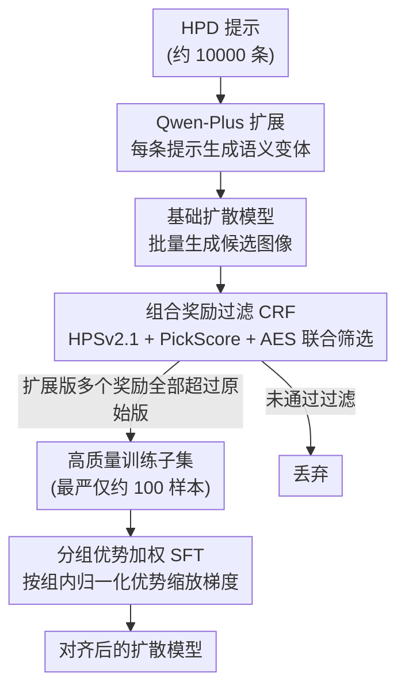

# CRAFT: Aligning Diffusion Models with Fine-Tuning Is Easier Than You Think

**会议**: CVPR 2026  
**arXiv**: [2603.18991](https://arxiv.org/abs/2603.18991)  
**代码**: 无  
**领域**: 图像生成 / 扩散模型对齐  
**关键词**: 扩散模型对齐, 人类偏好, 组合奖励过滤, 监督微调, 数据高效

## 一句话总结

CRAFT 提出一种超轻量的扩散模型对齐方法：通过组合奖励过滤(CRF)策略自动构建高质量训练集，然后执行增强版 SFT，理论证明 CRAFT 实际优化的是分组强化学习的下界，仅用 100 个样本就超越了需要数千偏好对的 SOTA 方法，且训练速度快 11-220 倍。

## 研究背景与动机

1. **领域现状**：扩散模型的后训练对齐主要有三条路线——SFT（需要高质量数据）、DPO 风格的偏好优化（需要大规模偏好对）、在线 RL 方法（计算开销大）。
2. **现有痛点**：SFT 依赖难以获取的高质量图像；DPO 方法如 Diff-DPO 依赖大规模偏好数据集且质量不一致；在线方法如 SPO 需要反复采样和评估，计算极其昂贵。
3. **核心矛盾**：数据效率与计算效率的双重挑战——现有方法要么需要大量数据，要么需要大量计算，两者难以兼得。
4. **本文目标**：设计一种既数据高效又计算轻量的微调方法。
5. **切入角度**：不需要外部高质量数据或偏好对，模型自己生成候选图像并通过多维奖励筛选最优样本。
6. **核心 idea**：组合多个奖励模型进行数据过滤 + 优势加权的 SFT，理论上等价于分组 RL 的下界优化。

## 方法详解

### 整体框架

CRAFT 想解决的问题是：怎样不依赖外部高质量图像、也不依赖大规模偏好对，就把扩散模型对齐到人类偏好。它的整条流水线完全自包含——模型自己生成数据、自己筛选、再用筛出来的数据微调自己。具体分三步走：先从 HPD 数据集采样约 10000 个提示，用 Qwen-Plus 把每个提示扩展成多个语义变体，再用待微调的基础模型为这些提示批量生成候选图像；接着用一组互补的奖励模型对候选图像做联合筛选，只把质量确实变好的那批留下来；最后在这批高质量子集上做一次"加权版"的标准 SFT，让梯度按样本质量自适应缩放。关键在于，前两步把"什么样的图算好"这件事交给了奖励模型，后一步把"好坏"翻译成梯度权重，于是一次普通的监督微调就承担起了原本要靠 RL 才能做到的偏好对齐。

### 关键设计

**1. 组合奖励过滤（CRF）：用多维奖励自动策展训练集，替代外部数据**

SFT 的老大难是高质量图像难拿、DPO 又要成千上万条偏好对，CRAFT 干脆让模型自己生成候选、再用奖励模型把好图挑出来。它同时挂三个互补的奖励模型——HPSv2.1 管人类偏好、PickScore 管拣选偏好、AES 管美学评分——并设计了一套由松到紧的多级过滤：单奖励过滤 $\mathcal{I}_\xi$ 只要任一奖励比原始版本高就保留，双奖励过滤 $\mathcal{I}_{ha}$ 要求两个同时提升，三重过滤 $\mathcal{I}_{hpa}$ 则要求三个全部提升、最为严格。判断的对象是"提示的扩展变体 vs 原始提示"：对某个原始提示，只有当它的扩展版生成的图在选定的几个奖励上都压过原始版，这批样本才会进入训练集。这样做的好处是数据完全自策展，不必蒸馏强模型、也不必采购偏好数据集，而多维奖励的"取交集"天然保证了留下来的样本在多个维度上一致地变好，避免某个奖励被单独刷高带来的偏置。

**2. 分组优势加权 SFT：把样本质量翻译成梯度权重**

光把好样本挑出来还不够，同一批留下的样本之间也有好坏之分，CRAFT 让质量更高的样本在微调时获得更大的话语权。它先对每一组样本计算归一化优势

$$\hat{A}^{(i,j)} = \frac{r^{(i,j)}_{\text{total}} - \text{mean}}{\text{std} + \epsilon},$$

也就是把该样本的总奖励减去组内均值、再除以组内标准差，得到它在本组里"好出多少个标准差"。随后用这个优势值去加权标准的噪声预测 SFT 损失 $\|\epsilon_\theta(x^{(i,j)}_t, t, c) - \epsilon^{(i,j)}_t\|^2$，并配一个指示函数把没通过过滤的样本直接置零。于是组内更优的样本梯度被放大、偏弱的被压低，等于在普通 SFT 里塞进了一条隐式的奖励引导信号，而无需像 RL 那样反复采样和打分。

**3. 理论保证（Theorem 3.1）：证明这套加权 SFT 是分组 RL 目标的下界**

CRAFT 不满足于"经验上有效"，它给出了为什么选择性 SFT 能顶替 RL 的解释。论文在小学习率假设下证明：上面那条优势加权的 SFT 损失，实际上优化的是分组强化学习目标 $\hat{J}(\theta)$ 的一个下界——两者之间存在精确的数学关系，最大化这个下界就在拉高真正的 RL 目标。这把"挑好数据做 SFT"从一个工程技巧抬升为有理论依据的对齐方法，也解释了为何它能在仅用 SFT 的算力下逼近甚至超过在线 RL 的对齐效果。

> ⚠️ 定理的精确形式与假设条件以原文为准。

### 损失函数 / 训练策略

损失函数为优势加权的噪声预测 MSE 损失。使用 AdamW 优化器对 UNet 进行全参数微调。SD1.5 训练 120 步，SDXL 训练 200 步，batch size 128，学习率 5e-5。总训练仅需约 4 GPU 小时（SDXL on H100）。

## 实验关键数据

### 主实验

| 基准/指标 | SDXL 基线 | Diff-DPO | SPO | CRAFT | 提升 vs SPO |
|-----------|----------|----------|-----|-------|------------|
| HPDv2 HPSv2.1↑ | 27.93 | 29.76 | 32.32 | **32.67** | +0.35 |
| HPDv2 ImgReward↑ | 0.819 | 1.037 | 1.103 | **1.312** | +0.209 |
| HPDv2 MPS↑ | 14.35 | 14.70 | 15.36 | **15.62** | +0.26 |
| Parti HPS↑ | 27.32 | 28.74 | 30.54 | **31.10** | +0.56 |

CRAFT 在所有指标和数据集上全面领先，且 ImageReward 和 MPS 未在训练中使用，证明泛化能力。

### 消融实验

| 配置 | HPSv2.1 | 训练数据量 | GPU 时间 |
|------|---------|-----------|---------|
| CRAFT ($\mathcal{I}_{hpa}$) | 32.67 | 100 | ~4h |
| CRAFT ($\mathcal{I}_{ha}$) | 32.45 | ~300 | ~4h |
| CRAFT ($\mathcal{I}_h$) | 32.12 | ~1000 | ~4h |
| 无过滤 SFT | 31.80 | 10000 | ~4h |

### 关键发现

- 最严格的三重过滤 $\mathcal{I}_{hpa}$ 效果最好，说明数据质量远比数量重要
- CRAFT 仅用 100 个样本即超越需要 4000 样本的 SPO，数据效率提升 40 倍
- 训练速度比 SPO 快 19.7 倍（SDXL），比 SmPO 快 60.1 倍
- 在 GenEval 组合推理基准上也表现优异，说明对齐能力迁移到了指令跟随
- 在未训练的奖励指标上同样领先，说明不是过拟合训练奖励

## 亮点与洞察

- **极致数据效率**：100 个样本超越数千偏好对的方法，颠覆了"对齐需要大量偏好数据"的认知
- **自策展数据管线**：不需要外部数据，模型自己生成、自己筛选、自己训练，完全自包含
- **理论优雅**：证明选择性 SFT 等价于 RL 下界优化，建立了两种范式的理论桥梁
- **即时落地价值**：4 GPU 小时就能对齐 SDXL，极大降低了扩散模型后训练的门槛

## 局限与展望

- 依赖奖励模型的质量，如果奖励模型本身有偏差会传递到微调模型
- 仅在 SD1.5 和 SDXL 上验证，未在更新的架构（如 DiT/FLUX）上测试
- 理论证明需要小学习率假设，大学习率下可能不成立
- 未来可探索在视频扩散模型或 3D 生成上的应用

## 相关工作与启发

- **vs Diff-DPO**: DPO 需要大量偏好对且效率低，CRAFT 用 SFT 达到更好效果
- **vs SPO**: SPO 需要在线采样和评估，CRAFT 完全离线且快 20 倍
- **vs RLHF/GRPO**: CRAFT 理论证明与 RL 等价但实现简单得多

## 评分

- 新颖性: ⭐⭐⭐⭐ 组合奖励过滤新颖，理论联系有价值
- 实验充分度: ⭐⭐⭐⭐⭐ 多基准、多指标、多基线对比全面
- 写作质量: ⭐⭐⭐⭐ 结构清晰，理论和实验结合好
- 价值: ⭐⭐⭐⭐⭐ 极高实用价值，大幅降低扩散模型对齐成本

<!-- RELATED:START -->

## 相关论文

- [\[NeurIPS 2025\] Aligning Text to Image in Diffusion Models is Easier Than You Think](../../NeurIPS2025/image_generation/aligning_text_to_image_in_diffusion_models_is_easier_than_you_think.md)
- [\[CVPR 2026\] Towards Fine-Grained Attribution: Instance-Aware Preference Optimization for Aligning Diffusion Models](towards_fine-grained_attribution_instance-aware_preference_optimization_for_alig.md)
- [\[CVPR 2026\] Reward Sharpness-Aware Fine-Tuning for Diffusion Models](reward_sharpness-aware_fine-tuning_for_diffusion_models.md)
- [\[CVPR 2026\] Do Less, Achieve More: Do We Need Every-Step Optimization for RL Fine-tuning of Diffusion Models?](do_less_achieve_more_do_we_need_every-step_optimization_for_rl_fine-tuning_of_di.md)
- [\[CVPR 2026\] Memory-Efficient Fine-Tuning Diffusion Transformers via Dynamic Patch Sampling and Block Skipping](memory-efficient_fine-tuning_diffusion_transformers_via_dynamic_patch_sampling_a.md)

<!-- RELATED:END -->
