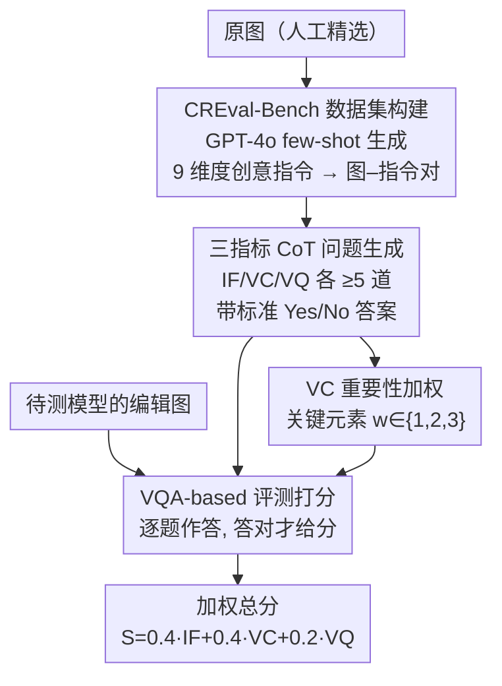

# CREval: An Automated Interpretable Evaluation for Creative Image Manipulation under Complex Instructions

**会议**: CVPR 2026  
**论文**: [CVF Open Access](https://openaccess.thecvf.com/content/CVPR2026/html/Wang_CREval_An_Automated_Interpretable_Evaluation_for_Creative_Image_Manipulation_under_CVPR_2026_paper.html)  
**代码**: https://github.com/ChonghuinanWang/CREval  
**领域**: 图像生成 / 评测基准  
**关键词**: 指令式图像编辑, 创意编辑评测, VQA 打分, MLLM 评估, 基准构建

## 一句话总结
CREval 用「先生成带标准答案的是非题、再让 MLLM 逐题作答、答对才给分」的 VQA 范式取代「让 MLLM 直接打个分」的黑盒做法，配套一个覆盖 3 大类 9 维度、874 个创意编辑样本的 CREval-Bench，把指令遵循（IF）、视觉一致性（VC）、视觉质量（VQ）拆成可解释的三项指标，发现当前主流编辑模型在「自由创意编辑」上普遍仍吃力，尤其难保住原图关键元素。

## 研究背景与动机
**领域现状**：指令式图像编辑（GPT-Image-1、Gemini 2.5 Flash Image、Qwen-Image-Edit、Seedream 4.0、FLUX Kontext 等）发展很快，对复杂指令的理解明显进步。但「这些模型到底编辑得好不好」需要一套靠谱的自动评测，现有 benchmark（ImgEdit-Bench、KRIS-Bench、GEdit-Bench 等）几乎都靠让 MLLM 给图直接打个总分。

**现有痛点**：直接让 MLLM 打分有两个硬伤。其一，**黑盒不可解释**——分数是怎么来的、模型到底看了哪些点、扣分扣在哪里，完全不透明，导致打分常常不稳定、漏掉细节。其二，**覆盖不全**——一个总分糊在一起，无法分辨模型是「没听懂指令」还是「编辑后把原图主体改没了」还是「画质有瑕疵」。

**核心矛盾**：评测一张编辑图本质上要同时核对两件相反的事——指令要求改的地方改到位了没（要变），指令没说的视觉/语义元素保住了没（不能变）。把这两件事压成一个总分，必然丢信息、且无从追责。

**本文目标**：(1) 给创意编辑设计一套**全自动、可解释、与人类判断对齐**的评测流程；(2) 补上现有 benchmark 不覆盖「自由创意编辑」（把宠物做成手办、把人物做成 chibi、设计商品海报这类天马行空的指令）的空白。

**切入角度**：与其让 MLLM「凭感觉打分」，不如把评测拆成一串**有标准答案的是非题**。每道题对准一个具体可核验的事实（「chibi 钥匙扣是否挂在银色钥匙环上？」），MLLM 只需回答 Yes/No，答对得分、答错不得分——评测过程因此变得透明（每分加/扣在哪一目了然）且可拆维度。

**核心 idea**：用「QA 式 VQA 评测」替代「MLLM 黑盒打分」，并把总分拆成 IF/VC/VQ 三项可解释指标。

## 方法详解

### 整体框架
CREval 是「基准 + 评测流程」一体的方案，整条管线分三个阶段串行：**Stage 1 指令生成**（人工挑高质量原图，用 GPT-4o few-shot 在 9 个创意维度下批量生成创意编辑指令，得到「图–指令」对，构成 CREval-Bench 的样本）→ **Stage 2 评测问题生成**（对每个「图–指令」对，用 CoT 沿 IF/VC/VQ 三个指标各生成 ≥5 道带标准 Yes/No 答案的评测题，每对 ≥15 题，得到带题库的完整 benchmark）→ **Stage 3 评测打分**（把待测编辑模型生成的图，连同原图、指令、单道问题喂给作为评委的 MLLM，逐题作答，答案与参考答案一致才给分，按维度聚合并加权得最终分）。

输入是「原图 + 创意指令 + 待测模型的编辑图」，输出是 IF/VC/VQ 三个分项分及加权总分。三阶段里前两阶段是**一次性建库**（产出 CREval-Bench 的题库），第三阶段是**对任意模型可复用的评测器**。

### 关键设计

**1. VQA-based 评测：用「答对带标准答案的是非题才给分」替代 MLLM 黑盒打分**

这是全文的范式核心，直击「MLLM 直接打分不可解释、覆盖不全」的痛点。CREval 不再问 MLLM「这张图编辑得几分」，而是先针对每个「图–指令」对生成一组评测问答 $\{Q, A\}$，每道问题都配一个明确的 `YES`/`NO` 参考答案；评测时把原图 $I_i$、编辑图 $I_o$、单道问题 $Q$ 组成三元组 $[I_i, I_o, Q]$ 喂给 MLLM 评委让它作答，**预测答案与参考答案一致才得对应分，否则不得分**。这样做之所以有效：每一分的归属都对应一个可核验的具体事实，扣分扣在哪、加分加在哪一目了然，把原本糊成一团的总分变成「逐点核对」，既提升可解释性，也保证评测维度的覆盖完整——不会像凭感觉打分那样漏掉某个细节。

**2. 三指标拆解（IF/VC/VQ）：把「改到位」「没改坏」「画质好」分开核验**

针对总分糊一起无法追责的问题，CREval 把评测拆成三项互补指标，每项都用 CoT 单独生成对应题库 $\{Q, A\}$：**IF（Instruction Following）** 衡量编辑图是否准确实现了指令要求的修改，构造问题时 CoT 先拆解指令、分析意图，遵循两条准则——结果不能偏离指令本意、指令内容不能有遗漏；**VC（Visual Consistency）** 衡量原图中「具有关键识别价值」的元素在编辑后是否保住，CoT 先拆解指令判断哪些视觉成分该保持不变；**VQ（Visual Quality）** 衡量成图的真实感、自然度与有无明显瑕疵（扭曲纹理、几何断裂、细节退化等）。三项分开，才能区分一个模型究竟栽在「没听懂」「把主体改没了」还是「画质崩了」上——这正是单一总分给不出的诊断信息。

**3. VC 重要性加权与最终加权聚合：不同元素对「认得出原主体」的贡献天差地别**

如果 VC 把所有该保留的元素一视同仁地算，就会高估那些只保住了无关紧要细节的模型。CREval 据此给每个需保留的元素赋一个重要性权重 $w \in \{1, 2, 3\}$：丢掉它会严重破坏主体辨识的元素给高权，影响小的给低权。例如把油画《戴珍珠耳环的少女》的主体做成钥匙扣，**珍珠耳环**是最具标识性的视觉特征，被判为关键元素、赋最高权重 $w=3$；VC 分按各元素权重加权得出。三项分项分 $S_{IF}, S_{VC}, S_{VQ}$ 算出后，最终总分按固定权重加权：

$$S = 0.4 \cdot S_{IF} + 0.4 \cdot S_{VC} + 0.2 \cdot S_{VQ}$$

IF 与 VC 各占 0.4、VQ 只占 0.2，是有意为之：作者指出当前 MLLM 对视觉质量的细微差异**敏感度有限**（容易忽略扭曲肢体、多余手指等小瑕疵），故调低 VQ 权重，让总分更可靠地反映「功能正确性」而非被不靠谱的画质判断带偏。

**4. CREval-Bench：3 大类 × 9 维度、用 few-shot 让 GPT-4o 量产创意指令**

为补「现有 benchmark 不覆盖自由创意编辑」的空白，作者构建了 CREval-Bench：先从公开资源与已有数据集精选高质量原图（含真实与合成图，覆盖多种物体/场景/风格），再用 GPT-4o 自动生成创意编辑指令。把创意编辑归为三大类——**Customization**（对物体形态的创意重构：衍生角色/再想象表征/超现实奇想）、**Contextualization**（把物体放进特定场景/商业设计/信息叙事：容器化场景/商业设计/信息与叙事表达）、**Stylization**（艺术化再呈现：艺术风格迁移/身份与文化转换/材质转换）——每类再细分 3 维度共 9 个维度，各维度样本数大体均衡（76~122 不等）。为保证指令贴合维度，作者给每个维度提供代表性示例做 few-shot，引导 GPT-4o 生成对应类别的指令，最终得到 800+「图–指令」对（基准规模 874），配上约 13K 条评测问答。

### 损失函数 / 训练策略
本文是评测基准与流程，不涉及模型训练，无损失函数。评测侧主要超参为最终加权系数 $0.4/0.4/0.2$，以及 VC 元素权重 $w\in\{1,2,3\}$；评委 MLLM 主用 GPT-4o，并用 Qwen3-VL 做鲁棒性交叉验证。

## 实验关键数据

### 主实验
在 CREval-Bench 上、以 GPT-4o 为评委评测主流开源/闭源编辑模型（分数归一到百分制）。下表摘取 Overall 列的代表性结果：

| 模型 | 类型 | IF | VC | VQ | Overall avg |
|------|------|----|----|----|----|
| Seedream 4.0 | 闭源 | 89.12 | 73.44 | 92.01 | **83.43** |
| Gemini 2.5 Flash Image | 闭源 | 83.38 | **74.79** | 90.37 | 81.34 |
| Qwen-Image-Edit-2509 | 开源 | **85.82** | 68.50 | 90.26 | 79.78 |
| GPT-Image-1 | 闭源 | 88.34 | 63.46 | 91.23 | 78.97 |
| FLUX.1 Kontext [dev] | 开源 | 70.13 | 73.88 | 86.03 | 74.81 |
| FLUX.1 Kontext [pro] | 闭源 | 71.24 | 71.98 | 87.98 | 74.88 |
| Bagel | 开源 | 78.32 | 53.69 | 80.07 | 68.82 |
| ICEdit | 开源 | 45.33 | 55.25 | 67.72 | 53.78 |

闭源整体领先，Seedream 4.0 综合最强、Gemini 2.5 Flash Image 次之；开源里 Qwen-Image-Edit-2509 最好、FLUX.1 Kontext [dev] 紧随。**普遍短板在 VC**：几乎所有模型 VC 分都偏低，说明当前编辑模型仍难可靠地识别并保住原图关键元素——GPT-Image-1 的总分被拖后腿正是因为 VC（63.46）全场近乎最低。

### 人类偏好一致性验证
在 6 个代表模型、200+ 样本、18 名标注者（0–5 评分后归一到百分制）上，把 CREval 与 Aesthetic Score / VIEScore / EditScore 等基线对比与人类打分的吻合度：

| 模型 | VIEScore | EditScore | CREval (Qwen3-VL) | CREval (GPT-4o) | HumanScore |
|------|----------|-----------|-------------------|-----------------|-----------|
| Bagel | 6.02 | 7.28 | 72.59 | 68.99 | 49.98 |
| FLUX.1-Kontext [dev] | 7.17 | 7.36 | 80.38 | 75.05 | 51.77 |
| Qwen-Image-Edit | 6.83 | 7.97 | 83.02 | 79.18 | 63.49 |
| GPT-Image-1 | 6.73 | 8.21 | 83.15 | 78.01 | 63.21 |
| Gemini 2.5 Flash Image | 7.39 | 7.92 | 87.14 | 81.78 | 66.14 |
| Seedream 4.0 | 7.49 | 8.13 | **88.47** | **84.31** | **72.01** |

CREval 给出的排序与 HumanScore 高度一致（人类也把 Seedream 4.0 排第一、Gemini 第二），且换用 Qwen3-VL 当评委时绝对分会变、但**相对排序基本不变**，说明结论对评委 MLLM 的选择稳健。

### 关键发现
- **VC 是全行业共同瓶颈**：闭源开源都低，编辑模型最难做到的是「改了该改的、同时保住原主体的标识性特征」。
- **「会保留」未必是好事**：UniWorld-V1 的 VC 分在开源里最高，但定性检查发现这是因为它**根本没执行编辑指令**——没动的图自然与原图一致，提醒看 VC 不能脱离 IF 单独解读。
- **「思考模块」无益甚至有害**：Bagel 与 Step1X-Edit 的 think 变体在 IF 上反而不如普通版，额外的「思考」对指令对齐没帮助、略有拖累。
- **VQ 趋同、需调低权重**：除 UniWorld-V1/ICEdit 明显偏弱外，多数模型（尤其闭源）VQ 分非常接近，因 MLLM 常忽略扭曲肢体、多余手指等细微瑕疵——这也解释了为何最终加权把 VQ 压到 0.2。

## 亮点与洞察
- **把「打分」改写成「答有标准答案的是非题」**：这是最巧的一步——评测的可解释性不靠让 MLLM「解释自己」，而是靠题目本身的可核验性，每一分都能溯源到一道具体问答，天然规避黑盒。
- **重要性加权 VC 抓住了创意编辑的要害**：创意编辑允许大改外形，唯一不能丢的是「让人认出这还是原主体」的标识性元素（珍珠耳环式的点），用 $w$ 权重把这件事量化进指标，比一视同仁的一致性度量精准得多。
- **「高一致性 = 没编辑」这个反例值得记住**：任何「保留性」指标都要和「修改性」指标联看，否则一个什么都不改的模型能在一致性上刷到满分——这条洞察可迁移到任何编辑/翻译/风格化任务的评测设计。
- **加权系数承认了评委的能力边界**：把 VQ 压到 0.2 不是拍脑袋，而是基于「MLLM 对画质瑕疵不敏感」的实测，设计指标时把评测器自身的弱点纳入考量，这种诚实在 benchmark 论文里少见。

## 局限与展望
- **评测器即天花板**：绝对分数本质上取决于评委 MLLM 自身能力，作者也承认 MLLM 对细微视觉瑕疵不敏感，因此 VQ 维度天生受限；只能靠「相对排序稳定」来背书结论，不能把绝对分当真值。
- **数据生成同源风险**⚠️：指令由 GPT-4o 生成、评测又主要用 GPT-4o 当评委，二者同源是否会引入偏向（更偏好「GPT 式」指令/图）论文未深入讨论，是潜在隐患。
- **是非题的粒度上限**：把评测压成 Yes/No，对「程度性」的好坏（如风格迁移的美感强弱）表达力有限，难以区分「勉强达标」与「做得出彩」。
- **改进方向**：引入更强或多评委集成以缓解评测器瓶颈；为创意/审美维度补充分级（非二值）问答；交叉用不同家族 MLLM 生成指令以降低同源偏置。

## 相关工作与启发
- **vs VIEScore / 直接 MLLM 打分（ImgEdit-Bench、KRIS-Bench、GEdit-Bench 等）**：它们让 MLLM 对编辑图直接给总分，黑盒、不可解释、覆盖不全；CREval 改成生成带标准答案的 QA 逐题核对、并拆成 IF/VC/VQ 三维，可解释性和诊断力都更强。
- **vs I2EBench / 基于检测器或人工标注的自动评测**：那类方法或部分依赖人工标注、或用 COCO 训练的检测器过滤场景元素，因而被限制在常规编辑、难适配自由创意编辑；CREval 全自动且面向开放式创意指令。
- **vs 面向多步推理/空间复杂度的 benchmark（RISE-Bench 等）**：它们把「复杂」理解为逻辑/组合/操作难度，没覆盖自由创意编辑的开放性；CREval-Bench 用 3 类 9 维度专门刻画创意维度。

## 评分
- 新颖性: ⭐⭐⭐⭐ 「QA 式可解释评测 + 重要性加权 VC + 创意编辑专属基准」组合扎实，单点创新不算颠覆但切中真实痛点。
- 实验充分度: ⭐⭐⭐⭐ 覆盖 13 个主流开源/闭源模型、9 维度细评，并有 18 人 200+ 样本的人类一致性与双评委鲁棒性验证。
- 写作质量: ⭐⭐⭐⭐ 三阶段管线与三指标定义清晰，公式与权重动机交代到位。
- 价值: ⭐⭐⭐⭐ 给创意图像编辑提供了可解释、可复用、与人类对齐的评测底座，对模型选型与后续研究实用。

<!-- RELATED:START -->

## 相关论文

- [\[CVPR 2026\] PSDesigner: Automated Graphic Design with a Human-Like Creative Workflow](psdesigner_automated_graphic_design_with_a_human-like_creative_workflow.md)
- [\[CVPR 2026\] Score2Instruct: Scaling Up Video Quality-Centric Instructions via Automated Dimension Scoring](score2instruct_scaling_up_video_quality-centric_instructions_via_automated_dimen.md)
- [\[ICCV 2025\] CAP: Evaluation of Persuasive and Creative Image Generation](../../ICCV2025/image_generation/cap_evaluation_of_persuasive_and_creative_image_generation.md)
- [\[CVPR 2026\] Towards Robust Sequential Decomposition for Complex Image Editing](towards_robust_sequential_decomposition_for_complex_image_editing.md)
- [\[CVPR 2026\] FlowDC: Flow-Based Decoupling-Decay for Complex Image Editing](flowdc_flow-based_decoupling-decay_for_complex_image_editing.md)

<!-- RELATED:END -->
