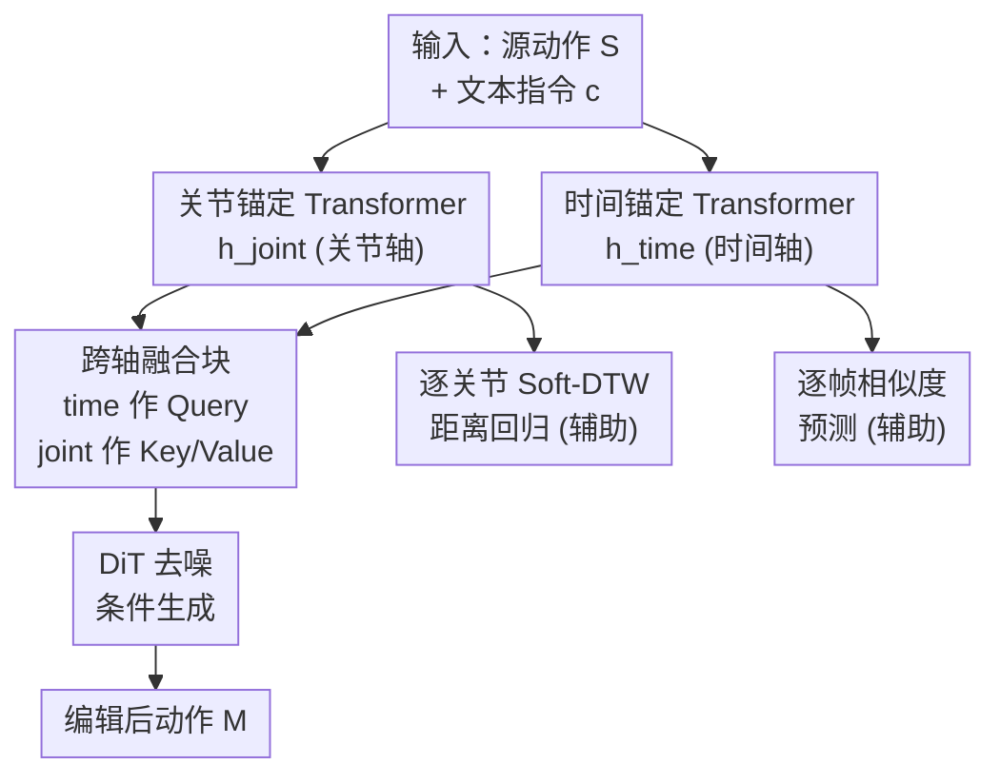

# Cross-Axis Feature Fusion with Joint-Wise Motion Difference Prediction for Text-Based 3D Human Motion Editing

**会议**: CVPR 2026  
**arXiv**: [2606.01014](https://arxiv.org/abs/2606.01014)  
**代码**: 无  
**领域**: 扩散模型 / 3D视觉 / 人体动作编辑  
**关键词**: 文本驱动动作编辑, 轴锚定 Transformer, 跨轴融合, Soft-DTW, 关节级监督

## 一句话总结
针对文本驱动的 3D 人体动作编辑，本文用「关节锚定」和「时间锚定」两个 Transformer 分别在关节轴和时间轴上建模，再用跨轴融合块整合，并配一个回归源/目标旋转轨迹 Soft-DTW 距离的辅助任务，让模型不仅知道「何时」改、还知道「改哪些关节」，在 MotionFix 上全面刷到 SOTA。

## 研究背景与动机

**领域现状**：文本驱动的 3D 人体动作编辑（给定源动作 + 自然语言指令 → 生成保留风格/结构但局部改动的目标动作）随着 MotionFix 数据集（指令-源-目标三元组）的发布而升温。主流做法是在这个监督设定下训练扩散模型：TMED 把 CLIP 文本嵌入和源动作的线性投影拼接后喂给 diffusion transformer（DiT）做条件；SimMotionEdit 进一步加了个 condition transformer 在进 DiT 前先融合文本和动作特征，并引入「逐帧动作相似度预测」辅助任务，教模型学习「序列中何时该发生改动」。

**现有痛点**：SimMotionEdit 的特征编码器是在每个时间步上沿关节维度聚合（得到逐帧的 $h_{\text{motion}}\in\mathbb{R}^{N,D}$），这种聚合天然压扁了关节级的解耦信息，导致它的辅助监督也只能停留在帧级——只能预测「逐帧相似度」。这只回答了「何时改」，对「改身体哪个部位/哪些关节」几乎没有提供信息。

**核心矛盾**：动作编辑的指令本质上是关节级的（「抬右腿而不是左腿」「换抬手的那只胳膊」），但现有架构把关节信息在帧聚合时丢掉了，使得编码器对关节级控制的理解始终欠规约，限制了条件与编辑结果之间的语义对齐。

**本文目标**：让编码器同时理解两件事——时间轴上「何时」该改、关节轴上「哪些关节」该改、改多少。

**切入角度**：作者主张「捕捉每个关节在整段序列上的全局特性」和「理解每帧姿态的时间特性」同等重要，因此应当把这两条轴**分开**用两个独立的锚定 Transformer 建模，再融合，而不是先沿关节聚合成逐帧特征。

**核心 idea**：用两个轴锚定 Transformer（关节轴 + 时间轴）+ 跨轴融合块替代单一逐帧编码器，并用「逐关节 Soft-DTW 距离回归」这个对时间平移鲁棒的辅助任务，把关节级监督真正注入编码器。

## 方法详解

### 整体框架
模型要解决的是：从源动作 $S\in\mathbb{R}^{N\times K}$（$N$ 帧，每帧 $K=207$ 维姿态向量：21 个关节的 6D 旋转 126 维 + 22 个关节位置 66 维 + 全局平移 3 维 + 全局朝向 12 维）和文本指令 $c$ 出发，用扩散模型生成编辑后的动作 $M$。整体走法是：源动作 + 文本同时输入两个轴锚定 Transformer，分别产出关节锚定特征 $h_{\text{joint}}\in\mathbb{R}^{K,D}$ 和时间锚定特征 $h_{\text{time}}\in\mathbb{R}^{N,D}$；跨轴融合块以 $h_{\text{time}}$ 为 Query、$h_{\text{joint}}$ 为 Key/Value 做多头注意力，得到融合特征 $h_{\text{fusion}}$；$h_{\text{fusion}}$ 与加噪动作拼接后作为条件喂给 DiT，DiT 预测去噪量、从纯噪声逐步采样出编辑动作。训练时除了主扩散损失，还挂两个辅助头：一个在时间锚定支路上做逐帧相似度预测，一个在关节锚定支路上做逐关节 Soft-DTW 距离回归。

### 关键设计

**1. 轴锚定双 Transformer：把关节轴和时间轴分开建模，别再压扁关节信息**

针对 SimMotionEdit「沿关节维度聚合成逐帧特征」丢掉关节级解耦信息的痛点，本文不再用单一编码器，而是用两个结构相同（各 4 层 Transformer encoder、8 头、512 维）但「锚定轴」不同的支路。关节锚定 Transformer 沿时间方向聚合，为**每个关节**抽出它在整段序列上的全局轨迹特征 $h_{\text{joint}}\in\mathbb{R}^{K,D}$；时间锚定 Transformer 沿关节方向聚合，为**每一帧**抽出全身姿态特征 $h_{\text{time}}\in\mathbb{R}^{N,D}$。两者输入都是 $(S,c)$。这样「哪些关节要动」的信息被显式保留在 $h_{\text{joint}}$ 里，而不是像旧方法那样在帧聚合时被抹平

**2. 跨轴融合块：让逐帧上下文去「看」逐关节上下文**

有了两条轴的特征，需要让它们交互。融合块实现为一个多头交叉注意力（8 头、512 维），关键在于谁查询谁：以时间锚定特征 $h_{\text{time}}$ 作 Query、关节锚定特征 $h_{\text{joint}}$ 作 Key 和 Value。直觉是——以「每一帧的全身姿态」为视角去检索「每个关节的全局轨迹上下文」，从而让融合特征 $h_{\text{fusion}}$ 同时携带「何时改（来自 time 轴）」和「改哪些关节（来自 joint 轴）」两类信息。$h_{\text{fusion}}$ 与加噪动作拼接送入 DiT，使去噪过程同时被源动作和文本指令条件化，做到既忠于指令、又不偏离源动作

**3. 逐关节 Soft-DTW 距离预测：用对时间平移鲁棒的辅助任务把关节级监督真正喂进去**

光有架构还不够，要逼关节锚定 Transformer 学到「每个关节该不该动、动多少」。本文从 $h_{\text{joint}}$ 中取出对应 21 个 SMPL 关节 6D 旋转的子张量 $h'_{\text{joint}}\in\mathbb{R}^{K'\times D}$（$K'=126$），用回归头 $\varphi_{\text{reg}}$ 为每个旋转通道预测一个标量 $\hat{d}_j$，去拟合源/目标旋转轨迹之间的距离。关键是距离度量的选择：很多文本编辑只改动作的起始时间或速度、并不改动作形态，若用逐帧 L2 会把这些无害的时间平移当成大差异过度惩罚。因此用 Soft-DTW——它把经典 DTW 的硬最小值替换成由温度 $\gamma>0$ 控制的软最小（log-sum-exp）：

$$\mathrm{SoftDTW}_{\gamma}(x,y)=\operatorname{softmin}^{(\gamma)}_{\pi\in\mathcal{A}}\sum_{(n,m)\in\pi} d(x_n,y_m)$$

既保留了 DTW 对局部时间扭曲的不变性，又完全可微、可 GPU 加速。监督目标是逐通道 Soft-DTW 距离 $d_j=\mathrm{SoftDTW}_{\gamma}(S'_j,T'_j)$，论文观察到「动得越大的关节 Soft-DTW 距离越高」，因此这个回归任务直接教会编码器按轨迹形状（而非绝对时间）区分「该改的关节 vs 该保留的关节」

### 损失函数 / 训练策略
主损失是标准扩散噪声预测损失 $\mathcal{L}_{\text{diff}}=\mathbb{E}_{\tau,\epsilon}\big[\lVert g(T_\tau; f(S,c),\tau)-\epsilon\rVert_2^2\big]$。关节级辅助损失为均方误差 $\mathcal{L}_{\text{aux}}=\frac{1}{K'}\sum_{j=1}^{K'}(\hat{d}_j-d_j)^2$，外加沿时间支路的逐帧相似度预测任务（沿用 SimMotionEdit 思路）。训练用 AdamW（学习率 $10^{-4}$、batch 64），跑 1500 epoch，单张 RTX 4090 约 12 小时。推理用 DDPM 固定 300 步、cosine 噪声调度，文本与源动作两路条件的 guidance scale 均为 2.0。

## 实验关键数据

数据集为 MotionFix（6730 个三元组）。评测沿用基于预训练 TMR 的「动作到动作」检索基准：用 batch（size 32）和完整测试集分别报告 Top-K 检索准确率 R@1/R@2/R@3 与平均排名 AvgR，并用 FID 衡量生成动作与目标动作分布的保真度。

### 主实验

| 方法 | R@1↑ (Batch) | R@2↑ | R@3↑ | AvgR↓ | R@1↑ (Test) | AvgR↓ (Test) | FID↓ |
|------|------|------|------|------|------|------|------|
| MDM-BP | 39.10 | 50.09 | 54.84 | 6.46 | 8.69 | 180.99 | – |
| TMED | 62.90 | 76.51 | 83.06 | 2.71 | 14.51 | 56.63 | 0.167 |
| MotionReFit | 66.33 | 80.05 | 84.98 | 2.64 | – | – | – |
| SimMotionEdit | 70.62 | 82.92 | 88.12 | 2.38 | 25.49 | 23.49 | 0.110 |
| **Ours** | **74.38** | **88.54** | **92.08** | **1.92** | **29.45** | **16.42** | **0.097** |

本文在 batch 和测试集两套评测、所有检索指标上全面超过基线：R@1 从 SimMotionEdit 的 70.62 提到 74.38，AvgR 从 2.38 降到 1.92，FID 从 0.110 降到 0.097。测试集上 R@1 从 25.49 提到 29.45、AvgR 从 23.49 大幅降到 16.42。

### 消融实验

| Motion Sim. | Joint Delta | R@1↑ (Batch) | AvgR↓ | R@1↑ (Test) | FID↓ |
|------|------|------|------|------|------|
| ✗ | ✗ | 72.08 | 2.13 | 30.24 | 0.122 |
| ✗ | L2 | 71.46 | 2.16 | 29.25 | 0.113 |
| ✗ | Soft-DTW | 72.92 | 2.07 | 28.85 | 0.108 |
| ✓ | ✗ | 71.04 | 2.03 | 29.45 | 0.143 |
| ✓ | L2 | 71.04 | 1.97 | 26.48 | 0.113 |
| ✓ | **Soft-DTW** | **74.38** | **1.92** | 29.45 | **0.097** |

消融对照「逐帧相似度（Motion Sim.）」与「逐关节距离（Joint Delta）」两个辅助任务，并对 Joint Delta 比较 L2 与 Soft-DTW 两种度量。

### 关键发现
- **两个辅助任务缺一不可且要搭配 Soft-DTW**：只开其中一个都不如全开；Joint Delta 用 L2 时（✓+L2）batch R@1 仅 71.04，换成 Soft-DTW 直接跳到 74.38，FID 也从 0.113 降到 0.097，印证「对时间平移鲁棒」这一动机的有效性。
- **L2 度量甚至可能拖累**：在只开 Joint Delta 的设定下，L2（71.46）反而略低于不加该任务时部分配置，说明逐帧 L2 会因过度惩罚无害的时间平移而误导监督，Soft-DTW 才是关键。
- **架构 + 监督协同**：FID 的改善（0.097 为全表最低）表明生成动作不仅语义对齐更准，分布上也更接近真实动作。

## 亮点与洞察
- **「分轴建模」抓住了任务结构**：动作数据天然是「关节 × 时间」二维的，旧方法沿关节聚合成逐帧特征是把一维拍扁；本文坚持两条轴各用一个 Transformer 独立建模再融合，是对任务本质的回应，而非堆模块。
- **用 Soft-DTW 当监督目标很巧**：把「该不该改这个关节」转化为「源/目标旋转轨迹的形状差异」，并用对时间扭曲不变的 Soft-DTW 度量，绕开了「编辑常改时序但不改形态」带来的伪差异——这个「用形状距离而非逐帧距离做关节级监督」的思路可迁移到任何序列编辑任务（如语音/手势编辑）。
- **跨轴融合的 Query/Key 方向是设计点而非随意**：以时间特征查询关节特征，让逐帧表征显式吸收关节级上下文，融合方向本身承载了「何时 × 何处」的耦合。

## 局限与展望
- **强依赖 MotionFix 单一数据集**：仅 6730 个三元组，编辑类型与多样性受限，跨数据集/跨域泛化未验证。
- **无代码与开源信息**：复现成本较高；辅助任务的温度 $\gamma$、两路辅助损失的权重等超参对结果敏感（消融已显示 Soft-DTW vs L2 差异巨大），需要细致调参。
- **评测以检索 + FID 为主**：检索基准衡量语义对齐，但对「编辑是否物理合理/无穿模/脚滑」等感知质量覆盖有限，论文主要靠定性图补充。
- **改进方向**：可探索更细的关节-时间联合监督、或把 Soft-DTW 监督扩展到位置/接触等其他通道，而不仅是旋转通道。

## 相关工作与启发
- **vs TMED**：TMED 仅把 CLIP 文本嵌入与源动作线性投影拼接、把融合推迟到 DiT 内部的自注意力；本文在进 DiT 前就用双轴 Transformer + 跨轴融合显式建立细粒度跨模态对齐，R@1 从 62.90 提到 74.38。
- **vs SimMotionEdit**：两者都在 DiT 前融合且都用辅助任务，但 SimMotionEdit 沿关节聚合成逐帧特征、辅助监督只到帧级（「何时改」）；本文保留关节轴并用逐关节 Soft-DTW 监督（「改哪些关节、改多少」），把语义对齐和保真度都进一步推高（R@1 70.62→74.38，FID 0.110→0.097）。
- **vs MotionReFit / MDM-BP**：MDM-BP 靠 GPT 抽身体部位标签做编辑、MotionReFit 为另一条 SOTA 路线；本文不依赖外部 LLM 标注部位，而是让模型从 Soft-DTW 监督中自己学会关节级控制。

## 评分
- 新颖性: ⭐⭐⭐⭐ 「双轴锚定 + 跨轴融合 + Soft-DTW 关节级监督」组合针对任务结构，思路清晰且有针对性
- 实验充分度: ⭐⭐⭐⭐ MotionFix 上全指标 SOTA，消融清楚分离了两个辅助任务与 L2/Soft-DTW 的贡献；但只在单一数据集验证
- 写作质量: ⭐⭐⭐⭐ 动机—痛点—设计的逻辑链顺畅，公式与符号交代完整
- 价值: ⭐⭐⭐⭐ 为文本动作编辑提供了「关节级可控」的实用范式，Soft-DTW 监督思路有迁移潜力

<!-- RELATED:START -->

## 相关论文

- [\[CVPR 2026\] InterEdit: Navigating Text-Guided Multi-Human 3D Motion Editing](interedit_navigating_textguided_multihuman_3d_moti.md)
- [\[CVPR 2025\] Nonisotropic Gaussian Diffusion for Realistic 3D Human Motion Prediction](../../CVPR2025/image_generation/nonisotropic_gaussian_diffusion_for_realistic_3d_human_motion_prediction.md)
- [\[CVPR 2026\] Causal Motion Diffusion Models for Autoregressive Motion Generation](causal_motion_diffusion_models_for_autoregressive_motion_generation.md)
- [\[CVPR 2026\] OneHOI: Unifying Human-Object Interaction Generation and Editing](onehoi_unifying_human-object_interaction_generation_and_editing.md)
- [\[ECCV 2024\] Realistic Human Motion Generation with Cross-Diffusion Models](../../ECCV2024/image_generation/realistic_human_motion_generation_with_cross-diffusion_models.md)

<!-- RELATED:END -->
