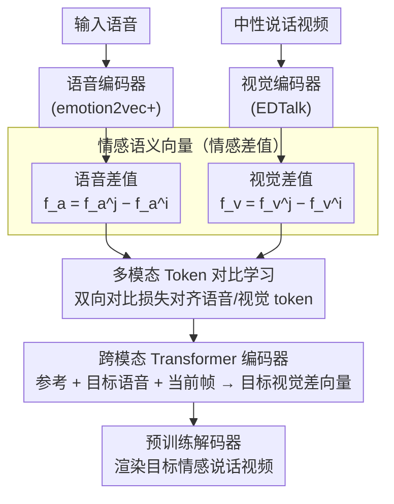

# Cross-Modal Emotion Transfer for Emotion Editing in Talking Face Video

**会议**: CVPR 2026  
**arXiv**: [2604.07786](https://arxiv.org/abs/2604.07786)  
**代码**: [https://chanhyeok-choi.github.io/C-MET/](https://chanhyeok-choi.github.io/C-MET/)  
**领域**: 图像生成 / 说话人脸  
**关键词**: 情感编辑, 跨模态迁移, 说话人脸生成, 情感语义向量, 扩展情感

## 一句话总结
提出 C-MET（Cross-Modal Emotion Transfer），通过建模语音和面部表情空间之间的情感语义向量映射，首次实现了基于语音驱动的扩展情感（如讽刺、魅力）说话人脸视频生成，情感准确率超越 SOTA 14%。

## 研究背景与动机

**领域现状**：情感说话人脸生成是生成模型的核心应用，目标是将中性说话视频转换为带有目标情感的视频。现有方法按情感源分为三类：标签驱动、语音驱动、图像驱动。

**现有痛点**：(1) 标签驱动方法仅支持预定义的离散情感类别（如 8 种基础情感），无法表示复杂/微妙的情感；(2) 语音驱动方法中情感与语言内容纠缠，无法分离；(3) 图像驱动方法需要高质量正面参考图，扩展情感（如讽刺）的参考数据难以获取。

**核心矛盾**：如何在不收集额外标注数据的情况下，利用丰富的语音情感信息来驱动面部表情生成，特别是训练中未见过的扩展情感？

**本文要解决**：跨模态（语音→视觉）的情感迁移，同时支持扩展情感的零样本生成。

**切入角度**：不直接预测面部表情，而是学习"情感语义向量"——即两种不同情感嵌入之间的差值——在语音空间和视觉空间之间的映射关系。

**核心 idea**：情感语义向量 = 目标情感嵌入 − 输入情感嵌入，通过跨模态 Transformer 学习从语音语义向量到视觉语义向量的映射。

## 方法详解

### 整体框架
C-MET 由三个部分组成：(a) 预训练编码器提取语音/视觉嵌入并计算情感语义向量（即两种情感嵌入之间的差值）；(b) 多模态 token 对比学习把语音与视觉表征空间对齐；(c) 跨模态 Transformer 编码器把目标语音差向量回归成目标视觉差向量，再加回当前嵌入、交给预训练解码器重建情感视频。整条链路只训练中间的对比对齐模块和回归器，前端编码器、后端解码器都复用现成模型。

### 关键设计

**1. 情感语义向量：用"情感差值"代替"情感本身"，换来扩展情感的零样本能力**

扩展情感（讽刺、魅力）之所以难，是因为它们既没有标签、又没有参考图，模型在训练里根本见不到。C-MET 绕开这个问题的办法是：不去建模"某个情感长什么样"，而去建模"从一种情感变到另一种情感要往哪个方向走"。具体地，给定输入情感 $i$ 和目标情感 $j$，它在语音空间取差值 $f_a^{i \to j} = f_a^j - f_a^i$，在视觉空间取差值 $f_v^{i \to j} = f_v^j - f_v^i$，把这两个差向量称为情感语义向量。这一步的好处是把绝对的"情感识别"问题转成了相对的"情感迁移"问题——差向量在连续嵌入空间里可加可组合，于是训练时只喂 MEAD 的 8 种基础情感，推理时把任意两个情感嵌入相减就能合成出训练从没出现过的迁移方向，扩展情感自然落在这个连续空间里。这个差向量的思路借鉴自 EmoKnob 对语音情感的控制，本文把它从语音端推广到了视觉端。

**2. 多模态 Token 对比学习：先把语音和面部对齐，再谈跨模态回归**

语音情感和面部表情分属两个差异巨大的模态，直接拿语音语义向量去回归视觉语义向量，表征空间对不上、回归就不准。为此 C-MET 在回归前先做一轮表征对齐：用 1D 卷积搭视觉 tokenizer $T_v$、用投影层搭音频 tokenizer $T_a$，把两个模态各自切成 token，再用双向对比损失把成对的语音 token 和视觉 token 在嵌入空间里拉近、非成对的推远：

$$L_{\text{cnt}} = \frac{L_{v \to a} + L_{a \to v}}{2}$$

双向（$v \to a$ 与 $a \to v$ 各算一遍取平均）保证对齐是对称的，不会偏向某一个模态。对齐之后两个空间的"情感方向"才有可比性，后面那个把语音差向量映射成视觉差向量的回归才站得住脚——消融里它单独贡献了 4 个点的情感准确率。

**3. 跨模态 Transformer 编码器：把"参考、目标语音、当前帧"喂进同一序列，回归出目标视觉差向量**

有了对齐好的表征，最后一步是真正完成"语音→视觉"的跨模态预测。C-MET 把三种来源的嵌入——参考视觉语义向量 $z_r$、目标语音语义向量 $z_a$、当前输入视觉嵌入 $z_v$——拼成一条 token 序列送进 Transformer 编码器，输出目标视觉语义向量：

$$\hat{f}_{v,t}^{i \to j} = P_v\big(TE(\{z_{r,t'}\} \,\|\, \{z_a\} \,\|\, \{z_{v,t}\})\big)$$

为了让 Transformer 分得清序列里哪段是参考、哪段是语音、哪段是当前帧，三种来源各自带一个 type embedding，注意力因此能正确建模跨模态依赖而不会把不同来源混为一谈。预测出的视觉语义向量加回输入视觉嵌入 $z_v$ 就得到目标情感嵌入，再喂进预训练解码器即可渲染出带目标情感的说话视频——整条链路只需训练中间这个回归器，前后的编码器/解码器都复用现成模型。

### 损失函数 / 训练策略
- 重建损失（双向）：$L_{\text{recon}} = L_{i \to j} + L_{j \to i}$
- 方向损失：$L_{\text{dir}} = 1 + \frac{\langle \hat{f}_v^{i \to j}, \hat{f}_v^{j \to i} \rangle}{\|\hat{f}_v^{i \to j}\| \|\hat{f}_v^{j \to i}\|}$（确保正反向向量方向相反）
- 总损失：$L = L_{\text{recon}} + \lambda_{\text{cnt}} \cdot L_{\text{cnt}} + \lambda_{\text{dir}} \cdot L_{\text{dir}}$
- $\lambda_{\text{cnt}} = 0.1$, $\lambda_{\text{dir}} = 0.05$

## 实验关键数据

### 主实验

| 方法 | 情感源类型 | Acc_emo↑ (MEAD) | Acc_emo↑ (CREMA-D) | FID↓ | AITV↓ |
|------|----------|----------------|-------------------|------|-------|
| EAMM | 图像 | 18.81 | 19.15 | 161.6 | 3.745 |
| EAT | 标签 | 41.56 | 39.97 | 91.0 | 12.575 |
| EDTalk | 图像 | 41.99 | 29.69 | **76.4** | 2.827 |
| FLOAT | 语音 | 13.21 | 29.11 | 92.8 | 1.434 |
| **C-MET** | **语音** | **55.91** | **43.47** | 90.8 | 2.643 |

### 消融实验

| 损失配置 | Acc_emo↑ (MEAD) | 说明 |
|---------|----------------|------|
| $L_{\text{recon}}$ only | 49.43 | 基线 |
| + $L_{\text{cnt}}$ | 53.46 | 对比学习贡献 +4% |
| + $L_{\text{cnt}}$ + $L_{\text{dir}}$ | **55.91** | 方向损失进一步 +2.4% |

即插即用验证：

| 骨干网络 | 原始 Acc_emo | + C-MET Acc_emo | AITV 变化 |
|---------|------------|----------------|----------|
| PD-FGC | 33.36 | 36.82 (+3.46) | 1.247→1.180（更快） |
| EDTalk | 41.99 | **55.91 (+13.92)** | 2.827→2.643（更快） |

### 关键发现
- 情感准确率提升显著（比 SOTA 高 14%），但在 FID/FVD 等视觉质量指标上略有让步——这反映了情感表达强度和视觉保真度之间的固有 trade-off
- 用户研究中 C-MET 在基础情感和扩展情感设定下均获得压倒性偏好（>75%）
- C-MET 可作为即插即用模块替换重的表情编码器，同时降低推理时间

## 亮点与洞察
- **首创性**：首个显式建模语音-视觉情感语义向量映射的方法
- **扩展情感零样本**：训练仅用 MEAD 的 8 种基础情感，推理时可生成讽刺、魅力等从未见过的扩展情感
- **即插即用**：可无缝集成到现有解耦网络（EDTalk、PD-FGC）中，替换重量级表情编码器

## 局限与展望
- 视觉质量指标（FID、FVD）略逊于图像驱动方法，强烈的情感表达导致较大的面部运动偏差
- 依赖预训练的 emotion2vec+large 和 EDTalk 编码器/解码器，模型的天花板受限于这些组件的能力
- 扩展情感的定量评估缺乏标准 benchmark，目前只能通过用户研究验证

## 相关工作与启发
- 与 FLOAT（语音驱动但情感-内容纠缠）的对比验证了解耦设计的必要性
- EmoKnob 的语音情感控制思路被巧妙推广到视觉生成领域
- 对比学习用于模态对齐的策略可推广到其他跨模态迁移任务

## 评分
- 新颖性: ⭐⭐⭐⭐⭐ 情感语义向量映射的思路新颖，扩展情感零样本生成具有开创性
- 实验充分度: ⭐⭐⭐⭐ 定量+定性+用户研究+消融完整，但扩展情感缺乏标准评估
- 写作质量: ⭐⭐⭐⭐ 结构清晰，但符号略多
- 价值: ⭐⭐⭐⭐⭐ 具有实际应用价值，解决了情感说话人脸生成的关键瓶颈

<!-- RELATED:START -->

## 相关论文

- [\[CVPR 2026\] EmoStyle: Emotion-Driven Image Stylization](emostyle_emotion-driven_image_stylization.md)
- [\[CVPR 2026\] MOS: Mitigating Optical-SAR Modality Gap for Cross-Modal Ship Re-Identification](mos_mitigating_optical-sar_modality_gap_for_cross-modal_ship_re-identification.md)
- [\[CVPR 2026\] Preserving Source Video Realism: High-Fidelity Face Swapping for Cinematic Quality](preserving_source_video_realism_high-fidelity_face_swapping_for_cinematic_qualit.md)
- [\[CVPR 2026\] Harmonic Canvas: Inversion-Free Editing for Visually-Guided Music Style Transfer](harmonic_canvas_inversion-free_editing_for_visually-guided_music_style_transfer.md)
- [\[CVPR 2025\] EmoDubber: Towards High Quality and Emotion Controllable Movie Dubbing](../../CVPR2025/image_generation/emodubber_towards_high_quality_and_emotion_controllable_movie_dubbing.md)

<!-- RELATED:END -->
