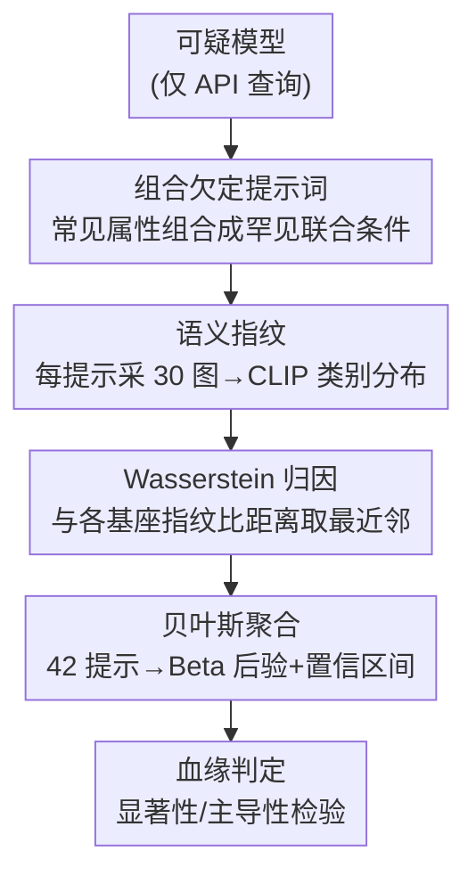

# CSF: Black-box Fingerprinting via Compositional Semantics for Text-to-Image Models

**会议**: CVPR 2026  
**arXiv**: [2604.16363](https://arxiv.org/abs/2604.16363)  
**代码**: 无  
**领域**: 扩散模型 / 模型版权 / 黑盒指纹  
**关键词**: 文生图、模型溯源、黑盒指纹、组合语义、贝叶斯归因

## 一句话总结
CSF 把文生图模型当成"语义类别生成器"，用一批在微调数据里**极其罕见的组合语义提示词**（如"一只危险的城市夜行动物"）反复采样，提取模型对模糊提示的类别分布作为指纹，再用 Wasserstein 距离 + 贝叶斯归因判定一个只能 API 访问的可疑模型属于哪个受保护基座家族——在 6 个基座家族、13 个微调变体上全部通过"主导性"判据。

## 研究背景与动机

**领域现状**：文生图模型（FLUX、Stable Diffusion、Kandinsky 等）是高价值商业资产，常以限制性许可（非商用 / 仅研究）分发。要让许可真正有约束力，就得能检测"有人拿你的受保护模型微调后只通过 API 偷偷商用"这种侵权场景，即把可疑模型**归因**到某个受保护的基座血缘（lineage）。

**现有痛点**：两类已有方法都不适用于这个最苛刻的场景。① 水印（watermarking）需要**部署前**就往基座里注入触发器，会损害模型质量，且一旦触发器被发现就能被去除；对已部署的"裸"模型无能为力。② 指纹（fingerprinting）从已部署模型被动提取特征，但主流做法要么依赖**白盒 / 灰盒**访问（权重、隐层激活、扩散轨迹），要么只在 toy 数据集上验证，无法处理微调变体——而商业 API 只给"输入文本、拿回图像"的查询接口。

**核心矛盾**：微调会剧烈改变风格、配色、内容偏好、生成质量，把像素级和 CLIP 视觉特征的细微信号彻底淹没（论文 Fig. 3 的 t-SNE 显示 CLIP 特征按风格聚类、不按家族聚类）；甚至连把图转成 caption 的文本空间也会泄漏风格信息导致跨家族混在一起。但**基座从预训练继承的深层语义偏好**在微调后往往还在。问题在于：在只有文本-图像对的黑盒下，如何把"语义身份"从"视觉外观"里剥离出来。

**本文目标**：在 query-only 黑盒下设计一个指纹 $\phi_M$，同时满足**可区分性**（不同基座 $\phi_{M_i}\neq\phi_{M_j}$）和**鲁棒性**（微调变体 $\phi_{M'}\approx\phi_M$），并给出带不确定性量化的统计判定。

**切入角度**：作者反转了水印的逻辑——水印之所以能在微调后存活，是因为罕见的触发输入不会出现在微调数据里、得不到更新信号。那就不注入触发器，而是**主动找出本就罕见、且能暴露基座语义偏好的提示词**。

**核心 idea**：把模型抽象成"文本→类别"生成器，用**组合欠定提示词**（多个常见语义属性组合后联合极罕见）去探测模型对模糊条件的类别分布，用这个分布当指纹做贝叶斯归因。

## 方法详解

### 整体框架
CSF 要回答的是"这个只能 API 访问的可疑模型，源自哪个受保护基座家族"。它的核心转换是：**不比像素、比语义**——把文生图模型看成对"模糊提示"产出**类别分布**的生成器，而这个分布反映的是预训练继承、微调难以覆盖的偏好。整条流水线是：先设计一批组合欠定提示词 → 对可疑模型每个提示采样 $N=30$ 张图 → 用 CLIP 零样本分类把每张图变成类别概率向量、聚成经验分布（指纹）→ 计算可疑模型与各基座指纹之间的 Wasserstein 距离、最近邻判定每次试验归属 → 跨 42 个提示用贝叶斯 Beta-Binomial 聚合，给出带 95% 置信区间的血缘判定。

### 关键设计

**1. 语义指纹：把模型抽象成"文本→类别"生成器，剥离风格只留语义**

痛点是视觉特征和 caption 都会被微调改掉的风格污染，让指纹按风格而非家族聚类。CSF 的做法是把语义空间约束到一组**预定义类别**（如"动物"下的 tiger/lion/wolf），不再问"图里画了什么、怎么描述"，而只问"这张图对应哪个类别"。给定一个欠定提示 $C$（如"a photo of animal"），模型因为随机采样会诱导出一个类别分布 $P(Y\mid C,M)$；每次生成经 CLIP 零样本分类得到一个落在 $(K-1)$ 维概率单纯形上的向量 $\mathbf{p}\in\Delta^{K-1}$。模型指纹就是这些类别向量的分布 $P(\mathbf{p}\mid C,M)$，用 $N$ 个 i.i.d. 样本估计。这样做有效，是因为"模型如何解读模糊条件"是预训练注入的深层偏好，和具体画风、配色解耦，微调改风格时这个解读分布不一定被改

**2. 组合欠定提示词：用常见属性的罕见组合，把基座偏好"锁"在微调改不到的地方**

光语义抽象还不够——朴素宽泛提示（如"an animal"）对应微调数据里常见的类别，微调很容易把基座偏好覆盖掉，指纹就丢了。CSF 的解法是**组合欠定**：把一个上位类别 $T$（"animal"）和多个语义属性 $\{c_1,c_2,\dots\}$ 拼成 $C=$"A photo of $c_1\,c_2\,\cdots\,c_k\,T$"。关键性质是**联合罕见性单调递减**：

$$P(T)\gg P(T\cap c_1)\gg P(T\cap c_1\cap c_2)\gg\cdots\gtrsim 0$$

每个属性单独都常见，但组合起来联合出现的概率指数级变小，进入微调数据里几乎不存在的"罕见区"。在罕见区里微调几乎没有更新压力作用到这个语义行为上，于是 $P(\mathbf{p}\mid C,M')\approx P(\mathbf{p}\mid C,M)$，基座指纹被保留。这正是和后门水印同一个鲁棒性原理——罕见条件得不到更新信号——但 CSF 不注入触发器、训练无关、部署后才生成提示。由此带来**防御方不对称优势**：侵权者要去掉指纹就得封堵所有可能的组合，而组合空间指数爆炸不可穷尽；验证者却能在部署后随时构造全新的罕见组合

**3. Wasserstein 距离 + 贝叶斯归因：把单次判定升级成带置信区间、可控风险的统计裁决**

IP 纠纷需要的不是"看起来像"，而是统计上站得住的证据。每个提示 $C$ 下，模型产出 $N$ 个类别向量构成经验测度 $\phi=\frac1N\sum_i\delta_{\mathbf{p}_i}$，两模型之间用 **2-Wasserstein 距离**比较：

$$W_2(\phi_1,\phi_2)=\Big(\inf_{\gamma\in\Gamma(\phi_1,\phi_2)}\mathbb{E}_{(i,j)\sim\gamma}\|\mathbf{p}_i-\mathbf{p}_j\|_2^2\Big)^{1/2}$$

之所以用 Wasserstein 而非 JSD，是因为它把每个类别向量当作单纯形中的几何点、保留类别间的联合结构，而 JSD 把类别当独立处理、置信度更弱（Table 2 显示 Wasserstein 的归因置信度比 JSD 高 +13.7%~+54.5%）。单次试验取最近邻基座 $\hat M_{\text{base}}(C)=\arg\min_{M_i} W_2(M'(C),M_i(C))$，命中真值即成功。跨 $T=42$ 个提示得到成功数 $s$、失败数 $f$，用 Beta 共轭先验做贝叶斯聚合：$\theta\mid s,f\sim\mathrm{Beta}(\alpha+s,\beta+f)$（取无信息先验 $\mathrm{Beta}(1,1)$）。后验均值估计归因准确率、95% 可信区间量化不确定性，再配两条判据——**显著性检验**（区间下界 $>1/K\approx17\%$，强于随机猜）和**主导性检验**（下界 $>0.5$，即正确基座比所有其他候选加起来还更可能，才算可执行的归因）

### 损失函数 / 训练策略
方法**训练无关**、无需任何模型修改。实现上：每个组合提示对可疑模型采 $N=30$ 张图，用 CLIP 零样本分类 $\phi_i=\mathrm{softmax}(\mathrm{CLIP}_{\text{visual}}(I_i)\cdot\mathrm{CLIP}_{\text{text}}(\{y_1,\dots,y_K\}))$，子类别来自 Wikipedia 分类法 / 已有数据集标签 / LLM 生成。提示采用三段式结构：① 一个**欠定语义属性**（逼模型做主观语义选择、暴露偏好）、② 一个**上位类别**（定域）、③ 一个**具体上下文条件**（约束构图、物体数、场景复杂度，保证每张图恰好一个可识别主体，避免多物体/空背景干扰 CLIP 分类）。系统地在固定具体条件下变化欠定属性，得 42 个提示，每模型 $42\times30=1260$ 个样本，商业 API 成本约 \$50/模型。

## 实验关键数据

### 主实验
6 个基座家族（FLUX、Kandinsky、SD1.5/2.1/3.0/XL）、13 个微调变体，覆盖 LoRA、全量微调、模型融合（cocktail）、DPO/RLHF、蒸馏少步模型、组件替换（VAE swap）等所有主流适配类型。Table 1 报告各变体在 6 个基座上的后验均值，对角线（真值基座）均带 `*` 表示通过主导性检验（CI 下界 $>0.5$），**全部 13 个变体满足主导性**。

| 微调变体 | 真值基座 | 真值基座得分 | 次高其他基座 | 结论 |
|----------|----------|--------------|--------------|------|
| Flux-LoRA | Flux | 0.932* | 0.068 (SDXL) | 主导 |
| Flux-Turbo-Alpha | Flux | 0.977* | 0.023 | 主导（蒸馏） |
| Kandinsky-Naruto | Kandinsky | 0.977* | 0.023 | 主导 |
| Kandinsky-Pokemon-LoRA | Kandinsky | 0.829* | 0.098 (SD2.1) | 主导 |
| SD1.5-DreamShaper | SD1.5 | 0.659* | 0.159 (SDXL) | 主导（融合+DPO） |
| SD2.1-DPO | SD2.1 | 0.977* | 0.023 | 主导 |
| SD3-Reality-Mix | SD3 | 0.705* | 0.136 (Flux) | 主导（全量重训） |
| SDXL-DPO | SDXL | 0.977* | 0.023 | 主导 |
| SDXL-Lightning-4Step | SDXL | 0.864* | 0.091 (Kandinsky) | 主导（4 步蒸馏） |

最难的几个案例（SD3-Reality-Mix 全量重训改写语义先验、DreamShaper 在已稀释的 cocktail 上再叠 DPO、Lightning/Turbo 蒸馏丢细微偏好）都还通过主导性检验，说明组合语义偏好在激进适配下依然留存。

### 消融与分析实验

| 配置 | 关键指标 | 说明 |
|------|----------|------|
| 完整 CSF（组合提示） | 13/13 全部满足主导性 | 完整方法 |
| 仅基座提示（无组合约束） | 失败、多模型混淆 | DreamShaper→Kandinsky；SD12 对 SDXL 后验 0.429，验证组合欠定不可或缺 |
| 距离：Wasserstein vs JSD | 置信度 +13.7%~+54.5% | Wasserstein 保留单纯形几何结构（Table 2） |
| 对抗概念擦除（UCE 去动物概念后 9 个动物探针） | 仍保持归因，真值基座 ≈0.714~0.857（Table 3） | CSF 靠广义语义类别+上下文，难被窄概念擦除击穿 |
| 人类研究（"Name That Dataset"，50 人 ×10 试） | 朴素提示 18% vs CSF 提示 71% | CSF 偏好与人类直觉一致，可作旁证 |

### 关键发现
- **组合欠定是必要条件而非锦上添花**：去掉组合约束、只用基座提示，归因直接崩溃并出现跨家族混淆，证明"罕见区保留基座偏好"是指纹存活的根本机制。
- **Wasserstein 完胜 JSD**：在 Kandinsky-Naruto 上置信度差距高达 +54.5%（97.7% vs 43.2%），因为类别间存在相关结构、不能当独立处理。
- **黑盒反而是优势**：白盒方法因蒸馏改变生成轨迹而失效、灰盒方法拿不到中间激活，CSF 在纯 API 设置下成功归因蒸馏模型（SDXL-Lightning、FLUX-Turbo）。
- **抗对抗擦除**：UCE 擦除动物概念后归因依旧稳定，因为要击穿 CSF 得抹掉整片广义语义能力、会严重损害模型通用效用——这与不对称优势正交。
- **失败模式**：当模型无法遵循组合提示、生成出目标类别外的物体（如"砖墙前的咸味烘焙物""花盆里的热带花"产出难辨物体）时归因失效，但可用**熵阈值**检测并自动过滤这类不可靠提示。

## 亮点与洞察
- **反转水印逻辑**最巧妙：水印是"主动注入罕见触发器→微调改不到"，CSF 是"被动找出本就罕见的组合语义→微调同样改不到"，既绕开了部署前注入、又继承了同样的鲁棒性原理，还白送一个"部署后可无限生成新提示"的防御方不对称优势。
- **把版权归因变成可控风险的统计裁决**：用 Beta-Binomial 后验+显著性/主导性双判据，给出的不是"像不像"而是带 95% 置信区间的证据，直接对接 IP 纠纷对证据强度的要求。
- **"组合罕见性"这一招可迁移**：任何"想找微调/再训练后仍存活的信号"的场景（如检测 LLM 血缘、检测数据集污染）都可借鉴"把常见原子组合成联合罕见条件"的思路。
- 成本仅 ~\$50/模型、训练无关、无需部署前介入，工程落地友好。

## 局限与展望
- **依赖 CLIP 零样本分类的可靠性**：当模型生成物体落在目标类别外时分类失效（作者承认的失败模式），虽可用熵阈值过滤，但意味着部分提示会被丢弃、有效证据减少。
- **类别和提示需人工/半自动设计**：42 个提示、各域子类别需从 Wikipedia/数据集/LLM 获取，跨到全新领域时提示工程成本未知，论文未给自动化提示搜索。
- **评测规模有限**：6 个开源家族、13~19 个变体，未覆盖闭源商业 API（DALL-E、Midjourney）的真实归因，"$50 成本"也只是按 DALL-E 3 定价推算的估值。
- **未量化误报率上限**：主导性检验保证真值基座占优，但对"两个高度同源基座（如 SD1.5 vs SD2.1，后者训练数据是前者超集）"的区分边界、以及面对刻意模仿某基座语义偏好的强自适应攻击者，鲁棒性边界仍待探。

## 相关工作与启发
- **vs 水印（watermarking）**：水印部署前注入触发器、会损质量、被发现即可去除、对已部署裸模型无效；CSF 训练无关、部署后才探测、提示可无限再生、对裸模型同样适用——本质是把"注入"换成"发现已有的罕见语义偏好"。
- **vs 白盒/灰盒指纹（权重距离 / 隐层核 / 扩散轨迹）**：它们要求访问权重或中间激活，商业 API 拿不到，且对蒸馏改变轨迹的模型失效；CSF 只需文本-图像查询，黑盒下反而能归因蒸馏模型。
- **vs 朴素视觉/文本特征聚类**：CLIP 视觉特征和 I2T caption 都泄漏风格、按风格而非家族聚类；CSF 把问题搬到"文本→类别"语义空间，剥离风格只留预训练偏好。

## 评分
- 新颖性: ⭐⭐⭐⭐⭐ 首个纯 query-only 黑盒文生图血缘归因方法，"反转水印逻辑+组合罕见性"的视角很新
- 实验充分度: ⭐⭐⭐⭐ 6 家族 13 变体覆盖全主流适配类型，含对抗擦除/距离消融/人类研究；但缺闭源 API 与误报率上限
- 写作质量: ⭐⭐⭐⭐ 动机推导清晰、鲁棒性原理讲透；个别表述（Table 1 缓存里部分数字/Figure 描述）略显仓促
- 价值: ⭐⭐⭐⭐⭐ 直击 API 时代生成模型 IP 保护的真实痛点，训练无关+低成本+统计证据，落地性强

<!-- RELATED:START -->

## 相关论文

- [\[CVPR 2026\] Black-box Membership Inference Attacks on the Pre-training Data of Image-generation Models](black-box_membership_inference_attacks_on_the_pre-training_data_of_image-generat.md)
- [\[CVPR 2026\] BlackMirror: Black-Box Backdoor Detection for Text-to-Image Models via Instruction-Response Deviation](blackmirror_black-box_backdoor_detection_for_text-to-image_models_via_instructio.md)
- [\[CVPR 2026\] HiCoGen: Hierarchical Compositional Text-to-Image Generation in Diffusion Models via Reinforcement Learning](hicogen_hierarchical_compositional_text-to-image_generation_in_diffusion_models_.md)
- [\[CVPR 2026\] Synthetic Curriculum Reinforces Compositional Text-to-Image Generation](synthetic_curriculum_reinforces_compositional_text-to-image_generation.md)
- [\[CVPR 2026\] Compositional Text-to-Image Generation Via Region-aware Bimodal Direct Preference Optimization](compositional_text-to-image_generation_via_region-aware_bimodal_direct_preferenc.md)

<!-- RELATED:END -->
