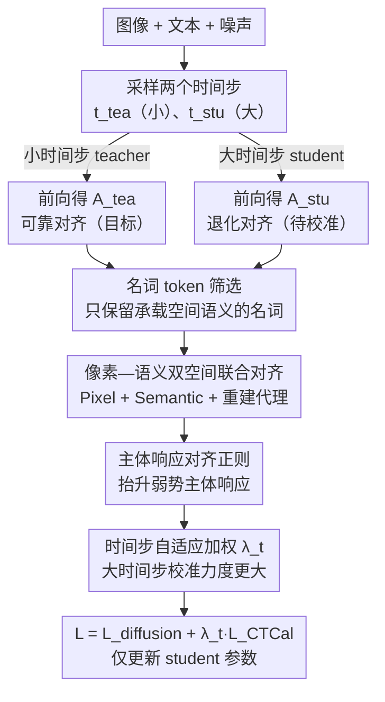

# CTCal: Rethinking Text-to-Image Diffusion Models via Cross-Timestep Self-Calibration

**会议**: CVPR 2026  
**arXiv**: [2603.20741](https://arxiv.org/abs/2603.20741)  
**代码**: [https://github.com/xiefan-guo/ctcal](https://github.com/xiefan-guo/ctcal)  
**领域**: 图像生成 / 文本到图像扩散模型  
**关键词**: 文本到图像生成, 扩散模型, Cross-Attention 对齐, 自校准, 组合生成

## 一句话总结
提出 CTCal（Cross-Timestep Self-Calibration），利用扩散模型在小时间步（低噪声）下形成的可靠文本-图像对齐（cross-attention maps）来校准大时间步（高噪声）下的表征学习，为文本到图像生成提供显式的跨时间步自监督，在 T2I-CompBench++ 和 GenEval 上全面超越现有方法。

## 研究背景与动机

**领域现状**：扩散模型在文本到图像生成中占主导地位，但精确的文本-图像对齐（尤其是复杂 prompt 的组合生成）仍是开放挑战。

**现有痛点**：(1) 传统扩散损失仅提供隐式监督，难以捕获细粒度文本-图像对应关系；(2) 推理时优化方法（Attend-and-Excite 等）泛化性差且不可扩展；(3) 大时间步下噪声严重，cross-attention maps 质量退化，无法建立正确对齐——这是生成质量的关键瓶颈。

**核心矛盾**：小时间步下文本-图像对齐好但"太容易"，大时间步下对齐差但"很重要"（决定了推理初始阶段的生成质量）。

**本文要解决**：如何为扩散模型在大时间步下建立正确的文本-图像对应关系提供显式监督？

**切入角度**：**关键观察**——同一图像-文本-噪声三元组，在训练模式下于不同时间步提取的 cross-attention maps 质量差异巨大：小时间步的 maps 与真实图像结构和语义高度一致，大时间步的完全退化。

**核心 idea**：用小时间步的可靠 attention maps（"teacher"）来校准大时间步的 attention maps（"student"），实现模型自己教自己。

## 方法详解

### 整体框架
给定图像、文本和噪声，采样两个时间步 $t_{\text{tea}} < t_{\text{stu}}$。分别前向得到 cross-attention maps $\mathbf{A}_{\text{tea}}$ 和 $\mathbf{A}_{\text{stu}}$。用 $\mathbf{A}_{\text{tea}}$ 作为目标校准 $\mathbf{A}_{\text{stu}}$，仅优化 $t_{\text{stu}}$ 对应的网络参数。整条流水线是一个"自己教自己"的双分支结构：同一三元组在小时间步分支产出可靠的 teacher 对齐、在大时间步分支产出退化的 student 对齐，再经名词筛选、双空间对齐、主体均衡、自适应加权把校准信号注入扩散损失。

### 关键设计

**1. 名词 token 筛选：只校准真正承载空间语义的那部分 attention**

直接拿大时间步的 cross-attention maps 去对齐小时间步的版本会踩一个坑：prompt 里像 "the"、"and"、"of" 这些冠词、连词、介词本身不指向画面里的任何物体，它们的 attention 分布是发散且无意义的，逼着 student 去拟合这些噪声反而把有用的物体定位也带偏了。CTCal 因此先用 Stanza 对 prompt 做词性标注，挑出名词集合 $\mathcal{Y}_{\text{noun}}$，校准损失只在这些 token 上累加：

$$\mathcal{L}_{\text{CTCal}} = \frac{1}{N_{\text{noun}}} \sum_{\mathbf{y}_i \in \mathcal{Y}_{\text{noun}}} \mathcal{D}(\mathbf{A}_{\text{stu},\mathbf{y}_i}, \mathbf{A}_{\text{tea},\mathbf{y}_i})$$

其中 $\mathcal{D}$ 度量 student 与 teacher 两张 attention map 的差异。这一步看似简单却是全篇最关键的取舍——消融里把约束施加到全部 token（naive 版）反而让 Color 从 0.643 掉到 0.629、2D-Spatial 从 0.178 掉到 0.169，只有筛掉非名词后各项才转正。

**2. 像素—语义双空间联合对齐：既对齐位置，也对齐含义，还防编码器塌掉**

只在像素层面让两张 map 逐点接近，捕获的是"物体落在哪"的空间信息，但抓不住"这块响应代表的是什么语义"这种高层一致性；而如果直接引入一个编码器把 map 投到语义空间再对齐，编码器又容易学成把所有输入都映射到同一点的退化解（模式崩塌）。CTCal 用一个轻量自编码器 $(f^{\text{enc}}, f^{\text{dec}})$ 同时管这两件事，并补一个重建代理任务给编码器"上锁"：

$$\mathcal{L}_{\text{CTCal}} = \lambda_1 \underbrace{\mathcal{D}(\mathbf{A}_{\text{stu}}, \mathbf{A}_{\text{tea}})}_{\text{Pixel}} + \lambda_2 \underbrace{\mathcal{D}(f^{\text{enc}}(\mathbf{A}_{\text{stu}}), f^{\text{enc}}(\mathbf{A}_{\text{tea}}))}_{\text{Semantic}} + \lambda_3 \underbrace{\mathcal{D}(f^{\text{dec}}(\mathbf{A}_{\text{tea}}), \mathbf{A}_{\text{tea}})}_{\text{Reconstruction}}$$

像素项保证空间位置对得上，语义项让两张 map 在编码后的高层表征上也一致，重建项强迫编码器保留足够信息能还原回 teacher map、从而堵死"把一切压成常数"的捷径。

**3. 主体响应对齐正则：别让强势主体把弱势主体挤没**

组合生成里有个典型失败模式：prompt 写 "cat and dog"，但模型只画出 cat——因为 cat 这个 token 的 attention 响应远高于 dog，强响应主体在去噪早期就抢占了画面，弱响应主体始终没能被渲染出来。为此 CTCal 加一项正则，把每个名词主体的响应往当前最高响应主体看齐：

$$\mathcal{R}_{\text{subject}} = \frac{1}{N_{\text{noun}}} \sum \text{ReLU}\big(\mathcal{S}_{\text{attn}} - \max(\mathbf{A}_{\text{stu},\mathbf{y}_i}) - \tau\big)$$

ReLU 配合阈值 $\tau$ 只在主体间响应差距超过一定容忍度时才施加惩罚，把落后主体的响应"抬"上来，让多个物体能更均衡地占据画面，而不是被单一主体压制。

**4. 时间步自适应加权：把校准力度放在真正需要的大时间步上**

CTCal 的初衷就是补救大时间步（高噪声）下退化的对齐，而小时间步本身对齐就已经很好、扩散损失足以维持，这时再强行校准是多此一举。于是它给校准项配一个随时间步线性增长的权重 $\lambda_t = t_{\text{stu}} / T_{\text{train}}$：时间步越大权重越高、CTCal 越主导，时间步越小则让原本的扩散损失唱主角。这样监督信号被精准投放到瓶颈所在的高噪声区间，而不是均匀摊到全程。

### 损失函数 / 训练策略
- $\mathcal{L} = \mathcal{L}_{\text{diffusion}} + \lambda_t \mathcal{L}_{\text{CTCal}}$
- 使用 LoRA 微调 text encoder 自注意力层和去噪网络注意力层
- 对 SD 2.1 设 $t_{\text{tea}}=0$；对 SD 3 需根据 logit-normal 采样分布选择 $t_{\text{tea}}$
- 数据集：基于 reward-driven 方法从生成数据中选择高质量文本-图像对

## 实验关键数据

### 主实验——T2I-CompBench++

| 方法 | Color↑ | Shape↑ | 2D-Spatial↑ | Numeracy↑ | Complex↑ |
|------|--------|--------|------------|----------|---------|
| SD 2.1 | 0.507 | 0.422 | 0.134 | 0.458 | 0.339 |
| SD 2.1 + AE | 0.640 | 0.452 | 0.146 | 0.477 | 0.340 |
| SD 2.1 + GORS | 0.643 | 0.486 | 0.178 | 0.486 | 0.337 |
| **SD 2.1 + CTCal** | **0.723** | **0.515** | **0.214** | **0.508** | **0.340** |
| SD 3 (2B) | 0.813 | 0.589 | 0.320 | 0.617 | 0.377 |
| **SD 3 + CTCal** | **0.844** | **0.597** | **0.348** | **0.629** | **0.381** |

### GenEval

| 方法 | Overall↑ | Two Object↑ | Counting↑ | Colors↑ | Position↑ |
|------|---------|-------------|----------|---------|-----------|
| SD 3 (2B) | 0.62 | 0.74 | 0.63 | 0.67 | 0.34 |
| **SD 3 + CTCal** | **0.69** | **0.85** | **0.70** | **0.79** | **0.38** |

### 消融实验

| 配置 | Color↑ | 2D-Spatial↑ | 说明 |
|------|--------|------------|------|
| SD 2.1 + GORS 基线 | 0.643 | 0.178 | - |
| + naive 全 token 约束 (a) | 0.629 (-2.2%) | 0.169 (-4.6%) | 反而下降！ |
| + 名词选择 (b) | 显著提升 | 显著提升 | 名词选择至关重要 |
| + pixel+semantic (c) | 进一步提升 | 进一步提升 | 联合优化有效 |
| + response alignment (d) | 继续提升 | 继续提升 | 主体均衡有帮助 |
| + adaptive weighting (e) | **最优** | **最优** | 完整 CTCal |

### 关键发现
- 名词选择是最关键的设计——不加选择地对齐所有 token 反而损害性能
- CTCal 对基于 cross-attention 的 SD 2.1 和基于 MM-DiT 的 SD 3 都有效，证明了通用性
- 用户研究中 CTCal 获得压倒性偏好（SD 2.1: 76.67%, SD 3: 54.17%）

## 亮点与洞察
- **训练阶段视角**：不同于推理时优化方法，CTCal 从训练阶段解决文本-图像对齐问题，效果持久且无推理开销
- **自监督范式**：模型用自己的小时间步输出教大时间步，无需额外标签或教师模型
- **模型无关性**：同时适用于 U-Net (SD 2.1) 和 Transformer (SD 3) 架构

## 局限与展望
- 训练数据构建依赖于 reward-driven 采样，数据构建成本不低
- 使用 LoRA 微调，完整微调的效果未探索
- 名词选择依赖 POS 标注工具，对非英语 prompt 适用性未知

## 相关工作与启发
- Attend-and-Excite 等推理时方法启发了关注 cross-attention 的方向，但 CTCal 在训练阶段更优雅地解决了问题
- GORS 的 reward-driven 数据选择策略被 CTCal 用作基础，CTCal 在此之上增加了显式对齐监督

## 评分
- 新颖性: ⭐⭐⭐⭐⭐ 跨时间步自校准思路新颖且优雅
- 实验充分度: ⭐⭐⭐⭐⭐ 两个 benchmark+SD 2.1 和 SD 3+用户研究+完整消融
- 写作质量: ⭐⭐⭐⭐⭐ 观察→设计→验证的逻辑链清晰
- 价值: ⭐⭐⭐⭐⭐ 对文本到图像生成的文本-图像对齐有实质提升

<!-- RELATED:START -->

## 相关论文

- [\[CVPR 2026\] RebRL: Reinforcing Discrete Visual Diffusion Models with Rebalanced Timestep Credits](rebrl_reinforcing_discrete_visual_diffusion_models_with_rebalanced_timestep_cred.md)
- [\[CVPR 2026\] TINA: Text-Free Inversion Attack for Unlearned Text-to-Image Diffusion Models](tina_text-free_inversion_attack_for_unlearned_text-to-image_diffusion_models.md)
- [\[CVPR 2026\] OctoT2I: A Self-Evolving Agentic Text-to-Image Router](octot2i_a_self-evolving_agentic_text-to-image_router.md)
- [\[CVPR 2026\] Neighbor-Aware Localized Concept Erasure in Text-to-Image Diffusion Models](neighbor-aware_localized_concept_erasure_in_text-to-image_diffusion_models.md)
- [\[CVPR 2026\] Self-Evaluation Unlocks Any-Step Text-to-Image Generation](self-evaluation_unlocks_any-step_text-to-image_generation.md)

<!-- RELATED:END -->
