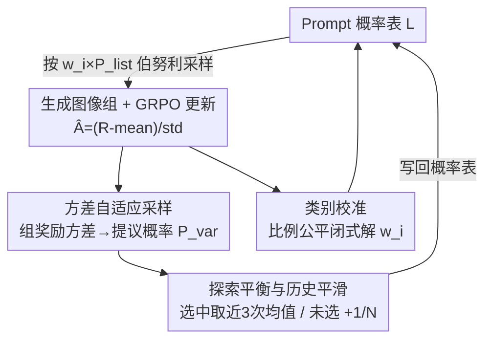

# Curriculum Group Policy Optimization: Adaptive Sampling for Unleashing the Potential of Text-to-Image Generation

**会议**: CVPR 2026  
**论文**: [CVF Open Access](https://openaccess.thecvf.com/content/CVPR2026/html/Li_Curriculum_Group_Policy_Optimization_Adaptive_Sampling_for_Unleashing_the_Potential_CVPR_2026_paper.html)  
**代码**: https://github.com/PRIS-CV/CGPO  
**领域**: 文生图 / 强化学习 / GRPO  
**关键词**: GRPO, 文生图, 课程学习, 自适应采样, 奖励方差

## 一句话总结
针对 GRPO 训练文生图时"均匀采样让一半 prompt 学不动也没增益"的问题，CGPO 用每个 prompt 一组图像的**奖励方差**当作"模型部分掌握但未稳定掌握"的在线信号，自适应地多采样这些处于学习甜区的 prompt，再配一个比例公平的类别校准，在 GenEval/T2I-CompBench++/DPG Bench 上既涨点又把训练速度提到 2 倍。

## 研究背景与动机
**领域现状**：文生图（T2I）的强化学习微调正从 PPO 转向 GRPO。GRPO 不需要单独的价值网络，对同一个 prompt 采样一组图像、用组内相对优势来估计梯度，省掉了在高维视觉空间训 critic 的开销，Flow-GRPO 又把它接到了 flow matching 模型上，是当前的主流做法。

**现有痛点**：这些方法几乎都用**均匀采样**——每个 prompt 被选中的概率一样。问题是不同 prompt 在当前策略下的"学习增益"差别极大：已经稳定做对的简单 prompt 几乎不再提供新信号，远超能力的难 prompt 又学不动。均匀采样导致一个 batch 里塞满了边际效用很低的样本，样本利用率低、收敛慢。

**核心矛盾**：最有信息量的 prompt 应该既不太易也不太难，要和模型**当前**能力匹配——这正是教育学里的"最近发展区"（ZPD）。但难度是动态的：随着模型变强，哪些 prompt 处于甜区一直在变。经典课程学习用预定义难度标签从易到难排序，既难以在大规模数据上可靠定义，又是**静态**的，无法跟着模型能力演化。

**本文目标**：在不引入任何额外难度标注的前提下，在线、动态地识别出"仍然可学"的 prompt，并持续向它们倾斜采样预算。

**切入角度**：理论上当 prompt 的成功概率 $p(x)\approx 0.5$（模型表现不一致）时学习信号最强。作者的关键观察是：GRPO 训练**本来就**对每个 prompt 生成一组图、算一组奖励，那么这组奖励的**方差**天然就是"prompt 不一致性"的在线代理——方差高 = 有时做对有时做错 = 部分掌握未稳定 = 正落在 ZPD 里。

**核心 idea**：把组奖励方差当作免费的在线难度信号，给高方差 prompt 提高采样概率，让课程随模型能力自动演化，再用比例公平校准平衡多类别奖励的难度差异。

## 方法详解

### 整体框架
CGPO 把"自适应课程"无缝嵌进 GRPO 训练循环，构成一个每轮迭代自我更新的闭环。系统维护一张 prompt-概率表 $L_{\text{probability}}=\{(p_1,P_1^{\text{list}}),\dots,(p_N,P_N^{\text{list}})\}$，记录数据集里每个 prompt 当前的采样概率。每一轮训练走四个阶段：**①概率采样**按当前概率挑一批 prompt；**②策略更新**对每个 prompt 生成图像组、算 GRPO 优势并更新 T2I 模型；**③概率计算**用这组奖励的方差换算出"提议概率"；**④概率更新**对选中的 prompt 做历史平滑、对没被选中的做探索补偿，写回概率表，进入下一轮。与此并行，一个**类别校准**模块周期性地根据各类别平均奖励算出校准系数 $w_i$，让采样在 prompt 级之外再做一层类别级的难度平衡。

四个阶段中，②是标准 GRPO（脚手架），真正的贡献集中在"方差→采样概率"（①③）、"探索平衡与历史平滑"（④）和"类别校准"三处。

### 关键设计

**1. 方差自适应采样：用组奖励方差当 ZPD 的在线代理**

这是 CGPO 的核心，直接针对"均匀采样浪费预算在零增益样本上"的痛点。训练时每个 prompt $p$ 生成一组 $G$ 张图，奖励模型给每张图打分 $R_{x_i}$，先算这组奖励的方差作为不一致性度量：

$$V_p=\text{Var}(\{R_{x_1},\dots,R_{x_G}\})=\frac{1}{G}\sum_{i=1}^{G}(R_{x_i}-\mu_x)^2$$

方差高意味着模型对同一 prompt 有时画对有时画错——部分掌握、尚未稳定，正是最有学习余量的样本；方差低则要么已经稳定做对、要么稳定做错，两头都没什么可学。然后在每个 batch $S_b$ 内把方差线性归一化成一个"提议概率"：

$$P^{\text{var}}(p)=\frac{V_p-\min(V)}{\max(V)-\min(V)}$$

采样侧用的是 **Poisson/伯努利式**采样：把每个 prompt 当作独立的伯努利试验、按各自概率决定是否入选，再叠一层拒绝采样（随机抽候选、按概率做接受检验、被拒就换新候选直到填满 batch）。这样设计是为了避免某个 prompt 的概率被别的 prompt"挤压"掉——比起一次性按整体分布抽 top-k，独立判定能保住高价值 prompt 的入选机会。注意最终入选概率是 $w_i\times P_i^{\text{list}}$（$w_i$ 来自下面的类别校准），不是单看 $P_i^{\text{list}}$。整个机制不依赖任何预定义难度标签，纯靠训练中自然产生的奖励算出来，所以课程能跟着模型能力一起漂移——论文的可视化显示高概率 prompt 随训练从 Level 1（3–4 个物体）→ Level 2 → Level 3（9–10 个物体）逐步上移，正是 ZPD 在自动后移。

**2. 探索平衡与历史平滑：防止 prompt 被永久冷落、也防灾难性遗忘**

只用提议概率更新概率表会有两个隐患：一是被打了低概率的 prompt 可能"永远不再被选"，但其中一些难样本会随模型变强而重新变得可学；二是选中 prompt 的概率掉得太快，是灾难性遗忘的前兆。这一设计用一条分段更新规则同时解决：

$$P^{\text{list}'}(p)=\begin{cases}\dfrac{1}{3}\sum_{t-2}^{t}P_{(t)}^{\text{var}}(p), & p\in S_b\\[2mm] P^{\text{list}}(p)+\dfrac{1}{N}, & p\notin S_b\end{cases}$$

对**被选中**的 prompt，不直接用当前提议概率，而是取最近三次 $P^{\text{var}}$ 的平均做历史平滑，避免概率骤降；对**没被选中**的 prompt，每轮给一个 $1/N$ 的小幅自增量（$N$ 为数据集 prompt 总数），相当于"长期被忽视就慢慢补偿"，保证它们最终有机会重新被采样。这条机制让采样焦点能随模型成长平滑地从易往难迁移，而不是卡死在早期判定上。消融里它单独带来 +0.59 的提升（从 +0.73 到 +1.32），说明探索补偿确实捞回了一批"后期才变得可学"的难样本。

**3. 类别校准：用比例公平把采样预算偏向弱类别**

实际场景里奖励常分多个类别（论文把不同奖励维度称为 "category"，如 GenEval 的 Single Object/Counting/Position 等六类），各类别的评测标准和奖励计算机制不同，联合训练时天然存在难度落差，容易让模型偏科。作者用**比例公平优化**求一组校准系数，目标函数为：

$$\max_{q}\ \sum_{i=1}^{c}\log(q_i)-\lambda\cdot\text{KL}(v\|q)\quad \text{s.t.}\ q_i\ge0,\ \sum_{i=1}^{c}q_i=1$$

其中 $\sum\log(q_i)$ 是比例公平项，$-\lambda\cdot\text{KL}(v\|q)$ 把解约束在参考分布 $v$ 附近，$v_i=\frac{1/r_i}{\sum_j 1/r_j}$ 由各类别平均奖励 $r_i$ 构造——奖励越低的类别 $v_i$ 越大。用拉格朗日乘子法可得闭式解 $q_i=\frac{1+\lambda v_i}{c+\lambda}$：$\lambda=0$ 时退化为均匀 $1/c$，$\lambda\to\infty$ 时完全偏向低奖励类别，调 $\lambda$ 即在"均衡采样"和"靶向强化弱项"之间平滑过渡。实现上转成系数 $w_i=1+\lambda v_i$ 存表，采样时用 $P_i^{\text{sampling}}=w_i\times P_i^{\text{list}}$ 做伯努利试验。这样在 prompt 级自适应之上又叠了一层类别级再平衡，把预算往表现差的类别倾斜。

### 损失函数 / 训练策略
策略更新沿用 GRPO：对每个 prompt 的图像组算组内相对优势

$$\hat{A}_i=\frac{R(x_i,p)-\text{mean}(\{R(x_i,p)\}_{i=1}^{G})}{\text{std}(\{R(x_i,p)\}_{i=1}^{G})}$$

再对 GRPO loss 做梯度下降更新 T2I 模型。基线为 SD3.5-Medium，框架用 Flow-GRPO（部分实验用其加速版 Flow-GRPO-Fast，每条轨迹只需 1–2 个去噪步）。用 LoRA 微调（$\alpha=64,\ r=32$），每个 batch 含 48 个 prompt、每个 prompt 生成 $G=24$ 张图，训练用 10 个时间步加速、推理用 40 步保画质，全部在 8 张 H100 上跑。

## 实验关键数据

### 主实验
训练数据与奖励模型都来自 GenEval，在 GenEval、T2I-CompBench++、DPG Bench 三个 benchmark 上评测。

GenEval（同一模型）：

| 任务 | SD3.5-M | Flow-GRPO | CGPO |
|------|---------|-----------|------|
| Single object | 0.98 | 1.00 | **1.00** |
| Two object | 0.78 | 0.99 | **0.99** |
| Counting | 0.50 | 0.95 | **0.96** |
| Colors | 0.81 | 0.93 | **0.94** |
| Position | 0.24 | 0.98 | **0.99** |
| Attribute | 0.52 | 0.82 | **0.89** |
| **Overall** | 0.63 | 0.94 | **0.96** |

CGPO 全任务领先：Overall 比 SD3.5-M 高 0.33、比 Flow-GRPO 高 0.02；尤其在 SD3.5-M 原本最弱的 Attribute Binding 上比 Flow-GRPO 还高 0.07。T2I-CompBench++ 上多数子任务最优，在 Flow-GRPO 反而退化的 Texture 上 CGPO 提升 0.0183（Flow-GRPO 0.7298 → CGPO 0.7521）。DPG Bench 上 Overall 85.5，略超 Flow-GRPO 的 85.4，说明长文本指令下也有效。

训练效率：达到 Flow-GRPO 的峰值 0.944 时，CGPO 只用了 **160 GPU 小时**，约为 Flow-GRPO 的 **2 倍训练速度**。

### 消融实验
GenEval 上逐组件累加，baseline 为 Flow-GRPO（94.42%）：

| 配置 | Overall (%) | 相对 baseline |
|------|-------------|---------------|
| baseline (Flow-GRPO) | 94.42 | – |
| +概率采样（方差自适应） | 95.15 | +0.73 |
| +探索平衡 | 95.74 | +1.32 |
| +类别校准 | 96.10 | +1.68 |

### 关键发现
- **方差自适应采样贡献最大**：单组件就带来 +0.73，是整个框架的地基，证明"用奖励方差挑甜区 prompt"这一核心假设确实有效。
- **探索平衡捞回后期难样本**：再 +0.59（→+1.32）。没有它，被早期打了低概率的难 prompt 会被永久冷落，而其中一些在模型变强后本可学；探索补偿让采样焦点能动态后移。
- **类别校准做最后一层均衡**：再 +0.36（→+1.68），缓解类别间难度/奖励计算的固有差异，让弱类别得到更多关注。
- **课程确实在演化**：以物体数分三档难度（Level 1: 3–4 个、Level 2: 6–7 个、Level 3: 9–10 个），高概率 prompt（$P^{\text{list}}>0.7$）在 step<1100 集中于 Level 1、step 1800–2000 转到 Level 2、step>2300 转到 Level 3——可视化直接验证了 ZPD 随训练后移。

## 亮点与洞察
- **把训练副产品变成免费的难度信号**：GRPO 本来就要为每个 prompt 生成一组图、算一组奖励，CGPO 几乎零额外开销地复用这组奖励的方差当在线 ZPD 代理，不需要任何预标注难度——这是最"啊哈"的地方，也是它能同时涨点又提速的根源。
- **ZPD↔成功概率 0.5↔奖励方差**这条链条把教育学直觉、RL 理论和 GRPO 实现串成了一个可计算量，思路干净且可迁移：任何"一个输入采样多个回答 + 奖励"的 RLHF/GRPO 场景（如 LLM 推理）都能借用方差当难度代理。
- **历史平滑 + 自增量**这对组合是个可复用的小 trick：用近三次均值防概率骤降（抗遗忘），用 $1/N$ 自增量防永久冷落（保探索），两行公式就把探索-利用平衡处理掉了。

## 局限与展望
- **奖励方差作为难度代理的边界未充分讨论**⚠️：方差高也可能来自奖励模型本身噪声大或 prompt 本质歧义，而非"部分掌握"。论文没有区分"可学的不一致"与"噪声导致的不一致"，在奖励模型不可靠时这个代理可能失真。
- **"category"概念偏窄**：类别校准在 GenEval 这种带清晰类别标签的数据上自然，但作者把"奖励维度"也称为 category，二者混用；对没有显式类别划分的开放数据如何定义 $r_i$ 和 $v_i$ 不明确。
- **绝对增益有限但效率收益大**：相比 Flow-GRPO 的 Overall 仅 +0.02，主要价值在 2 倍训练加速而非终点性能；在已接近饱和的 benchmark 上，自适应采样的天花板受限于基线框架本身。
- **超参 $\lambda$、平滑窗口（固定为 3）、$1/N$ 自增量步长**等的敏感性没有系统消融，迁移到新数据集时调参成本未知。

## 相关工作与启发
- **vs Flow-GRPO**：Flow-GRPO 把 GRPO 接到 flow matching 上但仍用均匀采样；CGPO 在其之上只改"采样哪些 prompt"，用方差信号重新分配预算，是正交增强——既兼容又能直接拿走 2 倍提速。
- **vs 经典/静态课程学习（如 Curri-DPO、DUMP）**：它们依赖预定义难度排序或预聚类，难度静态、无法随模型能力演化；CGPO 完全在线、无需难度标签，课程随训练自动后移。
- **vs PCL（Prompt Curriculum Learning）**：PCL 从理论上指出成功概率约 0.5 时训练信号最强；CGPO 把这条原则落地为"组奖励方差"这一可直接计算的在线量，省去显式估计成功概率。

## 评分
- 新颖性: ⭐⭐⭐⭐ 把组奖励方差当 ZPD 在线代理、零额外标注地构建自适应课程，思路巧且贴合 GRPO 结构，但单点创新、建立在成熟概念之上。
- 实验充分度: ⭐⭐⭐⭐ 三 benchmark + 累加消融 + 难度演化可视化较完整，但缺关键超参敏感性分析、且只在单一基线/数据上验证。
- 写作质量: ⭐⭐⭐⭐ ZPD→方差→采样的逻辑链清晰，四阶段 pipeline 和公式交代到位。
- 价值: ⭐⭐⭐⭐ 2 倍训练加速 + 即插即用的采样改进，对 RL 微调文生图有直接工程价值。

<!-- RELATED:START -->

## 相关论文

- [\[CVPR 2026\] Synthetic Curriculum Reinforces Compositional Text-to-Image Generation](synthetic_curriculum_reinforces_compositional_text-to-image_generation.md)
- [\[CVPR 2026\] MaskFocus: Focusing Policy Optimization on Critical Steps for Masked Image Generation](maskfocus_focusing_policy_optimization_on_critical_steps_for_masked_image_genera.md)
- [\[CVPR 2026\] POCA: Pareto-Optimal Curriculum Alignment for Visual Text Generation](poca_pareto-optimal_curriculum_alignment_for_visual_text_generation.md)
- [\[CVPR 2026\] Denoising, Fast and Slow: Difficulty-Aware Adaptive Sampling for Image Generation](denoising_fast_and_slow_difficulty-aware_adaptive_sampling_for_image_generation.md)
- [\[CVPR 2026\] Seeing What Matters: Visual Preference Policy Optimization for Visual Generation](seeing_what_matters_visual_preference_policy_optimization_for_visual_generation.md)

<!-- RELATED:END -->
