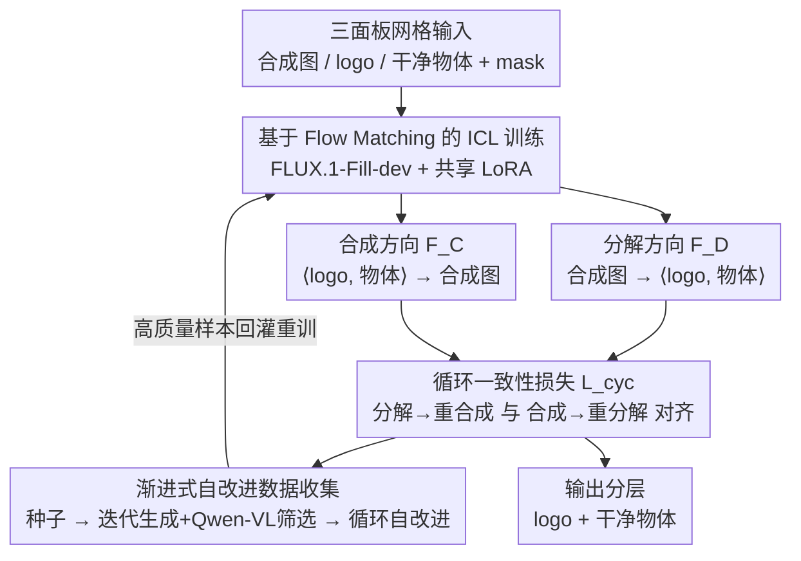

# Cycle-Consistent Tuning for Layered Image Decomposition

**会议**: CVPR 2026  
**arXiv**: [2602.20989](https://arxiv.org/abs/2602.20989)  
**代码**: 无（有项目主页）  
**领域**: 图像分解 / 图像编辑  
**关键词**: 图像分解, 循环一致性, 扩散模型, LoRA微调, 上下文学习

## 一句话总结

提出基于扩散模型的循环一致性微调框架，通过联合训练分解模型和合成模型实现图像层分离（如logo-物体分解），并引入渐进式自改进数据扩增策略，在非线性层交互场景下实现鲁棒分解。

## 研究背景与动机

图像分解（将图像拆分为语义或物理有意义的层）是CV和CG的经典问题：
- 传统方法（如本征分解）局限于线性交互（alpha blending），难以处理光照、透视扭曲、材质反射等非线性耦合
- 从产品照片中分离logo涉及全局非线性交互（阴影、透视变形、表面反射）
- 现有生成式编辑方法（如ICEdit、Flux-Kontext）能去除logo但难以准确隔离提取logo
- 分解是欠定问题（未知数多于输入），需要额外约束

本文的切入点是把分解看成合成的逆过程：同时学习分解与合成、并施加循环一致性约束，用合成方向的确定性来约束分解方向的不确定性。

## 方法详解

### 整体框架

基于 FLUX.1-Fill-dev（预训练diffusion inpainting模型），通过 LoRA 轻量微调适配分解任务。采用 In-Context Learning 范式：输入为三面板网格图像（合成图/logo/干净物体），模型学习从合成图分离出两个层。在这个 ICL 底座之上，本文用循环一致性把分解与合成两个方向绑成一个对偶环来互相监督，并用一套渐进式自改进数据收集源源不断地往训练里回灌高质量分层样本。

### 关键设计

**1. 循环一致性分解-合成框架：用合成的确定性反过来约束分解的欠定性**

分解是个欠定问题——一张产品图里 logo 和物体怎么分，本来就有无穷多种说得通的拆法，没有额外约束模型很容易把阴影、反光乱塞给某一层。本文抓住「合成是分解的逆」这点：同时学一个分解函数 $\mathcal{F}_D(I)=\langle A,B\rangle$ 和一个合成函数 $\mathcal{F}_C(\langle A,B\rangle)=I$，两者共享同一套 LoRA 参数。训练时让数据双向走一圈：一条是从合成图 $I$ 分解出 $\langle A',B'\rangle$、再合成回 $I'$，另一条是从已知层 $A,B$ 合成出 $I^*$、再分解回 $\langle A^*,B^*\rangle$。循环一致性损失把这两条路径对齐：

$$\mathcal{L}_{cyc} = \mathbb{E}\left[\|v_\theta(x_{t_1}^I, M_D, t_1, \tau_D) - v_\theta(x_{t_1}^{I^*}, M_D, t_1, \tau_D)\|_2^2\right] + \mathbb{E}\left[\|v_\theta(x_{t_2}^{\langle A,B\rangle}, M_C, t_2, \tau_C) - v_\theta(x_{t_2}^{\langle A',B'\rangle}, M_C, t_2, \tau_C)\|_2^2\right]$$

合成方向相对确定（给定两层叠出来的图基本唯一），于是它就成了分解方向的"答案校验器"：分解错了，重新合成的图就对不上原图，循环损失立刻惩罚。两个方向互相监督，省下了对大量像素级标注分层数据的依赖。

**2. 渐进式自改进数据收集：从一百个种子样本自举出一整套高质量分层数据**

logo-物体分解几乎没有现成的成对训练数据，直接训根本喂不饱。本文用三阶段自举把数据滚大：先是种子阶段，靠 100 个人工标注三元组加 GPT-4o 辅助，训出一个很粗糙的初始 IC-LoRA；接着进入迭代生成阶段，用当前 IC-LoRA 去批量生成候选三元组，再用 Qwen-VL 把质量差的筛掉、留下的好样本回灌重训，每轮模型的生成稳定性都往上走一截；最后是循环模型自改进阶段，让上面那个循环一致性模型对新合成图做"分解→重合成"的闭环，重合成得够像原图的样本才被收进训练集。这个闭环的关键证据是高质量样本的选择率随轮次单调上升——从第 1 轮的约 20% 涨到第 10 轮的 60% 以上，说明模型确实在用自己产出的数据把自己越喂越好，而不是在原地打转。

**3. 基于 Flow Matching 的 ICL 训练：把分层任务伪装成 inpainting，复用预训练 diffusion 的视觉上下文能力**

为了不从零训一个分层模型，本文把任务塞进 FLUX.1-Fill-dev 这个预训练 inpainting 模型的框架里：输入是一张三面板网格（合成图 / logo / 干净物体），用一个 mask 标出哪些面板要模型生成（ones）、哪些是给定上下文要保留（zeros），分层就变成了"在网格的空面板里 inpaint 出对应的层"。只微调 LoRA 参数，训练目标是 flow matching 重建损失：

$$\mathcal{L}_{rec} = \mathbb{E}_{x,t}\left[\|v_\theta(x_t, M, t, \tau) - \frac{\partial x_t}{\partial x}\|_2^2\right]$$

这样做的好处是单输入能一次产出多个层（视觉版的 in-context learning），又几乎零成本地继承了基础模型已有的图像先验，不用动它的网络结构。

### 损失函数 / 训练策略

- 总损失 = flow matching重建损失 + 循环一致性损失
- 分解和合成共享同一LoRA参数，提高参数效率并稳定训练
- 自改进数据循环用 Qwen-VL 自动过滤 + 简单人工检查

## 实验关键数据

### 主实验

| 方法 | Logo VQAScore↑ | Object VQAScore↑ | VLMScore均分↑ |
|------|---------------|-----------------|--------------|
| AssetDropper | 0.42 | — | — |
| ICEdit | 0.31 | 0.31 | 2.55 |
| Flux-Kontext | 0.40 | 0.32 | 3.79 |
| Gemini | 0.42 | 0.32 | 4.20 |
| **Ours** | **0.43** | 0.31 | **4.22** |

在1.5K合成测试样本上评估，logo提取质量最优且综合评分最高。

### 消融实验

| 配置 | 效果说明 |
|------|---------|
| 仅Round 0 IC-LoRA | 分离质量差，logo残留严重 |
| + 迭代数据生成 | 分解明显改善 |
| + 循环一致性 | logo保真度显著提升 |
| + 自改进过程（完整模型） | 物体一致性和真实感进一步提升 |

泛化实验：本征分解（MAW数据集）Intensity 0.57/Chromaticity 3.54，接近专用SOTA方法。

### 关键发现

- 循环一致性是分解质量提升的最大单一贡献因子
- 自改进数据策略的高质量样本选择率随轮次持续增长（从~20%到>60%）
- 用户研究中超过50%的情况下被排为第一
- 框架可泛化到本征分解和前景-背景分解等不同任务

## 亮点与洞察

- "分解和合成是对偶过程"这一洞察非常优雅——用确定性过程（合成）约束欠定问题（分解）
- 渐进式数据bootstrapping从100个种子样本起步，逐步扩大高质量训练集，数据效率极高
- 单一LoRA同时编码分解和合成能力，参数效率高
- 不同于操纵式方法（Attend-and-Excite等），本方法对基础模型零修改

## 局限与展望

- 当叠加元素占据画面主体（如大面积墙体广告）时表现退化
- 目前仅支持双层分解，不能处理多logo叠加
- 受限于ICL的网格范式，扩展到更多层需要架构调整
- 训练数据偏向产品logo场景，对其他类型叠加元素（如水印、贴纸）需额外适配

## 相关工作与启发

- 与 AssetDropper 对比：后者使用奖励驱动优化提取资产但不能恢复底层物体
- 与 DecompDiffusion 的区别：后者为不同层训练独立模型，本方法共享同一模型
- 循环一致性思想可能扩展到运动/光照/多模态分解
- 渐进自改进数据策略对数据稀缺场景有广泛参考价值

## 评分

- 新颖性: ⭐⭐⭐⭐ 循环一致性+自改进数据策略组合新颖，分解-合成对偶视角优雅
- 实验充分度: ⭐⭐⭐⭐ 定量/定性/消融/用户研究/泛化实验齐全
- 写作质量: ⭐⭐⭐⭐ 结构清晰，动机-方法-验证逻辑流畅
- 价值: ⭐⭐⭐ 应用场景（logo提取）相对小众，但框架思想可泛化
- 价值: 待评

<!-- RELATED:START -->

## 相关论文

- [\[CVPR 2026\] Qwen-Image-Layered: Towards Inherent Editability via Layer Decomposition](qwen-image-layered_towards_inherent_editability_via_layer_decomposition.md)
- [\[CVPR 2026\] High-Fidelity Virtual Try-On beyond Paired Data Scarcity via Diffusion-based Cycle-Consistent Learning](high-fidelity_virtual_try-on_beyond_paired_data_scarcity_via_diffusion-based_cyc.md)
- [\[CVPR 2026\] From Inpainting to Layer Decomposition: Repurposing Generative Inpainting Models for Image Layer Decomposition](from_inpainting_to_layer_decomposition_repurposing_generative_inpainting_models_.md)
- [\[AAAI 2026\] EchoGen: Cycle-Consistent Learning for Unified Layout-Image Generation and Understanding](../../AAAI2026/image_generation/echogen_cycle-consistent_learning_for_unified_layout-image_generation_and_unders.md)
- [\[CVPR 2026\] Match-and-Fuse: Consistent Generation from Unstructured Image Sets](match-and-fuse_consistent_generation_from_unstructured_image_sets.md)

<!-- RELATED:END -->
