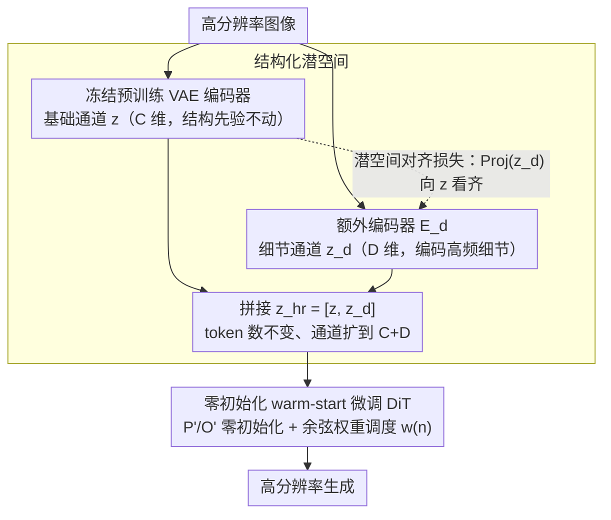

# DA-VAE: Plug-in Latent Compression for Diffusion via Detail Alignment

**会议**: CVPR 2026  
**arXiv**: [2603.22125](https://arxiv.org/abs/2603.22125)  
**代码**: [caixin98.github.io/davae](https://caixin98.github.io/davae)  
**领域**: Image Generation  
**关键词**: VAE压缩, 扩散模型加速, 潜空间对齐, 高分辨率生成, Token效率

## 一句话总结
提出 Detail-Aligned VAE (DA-VAE)，通过在预训练 VAE 的潜空间中引入结构化的"细节通道"并施加对齐约束，在不重训扩散模型的前提下将 token 数压缩 4 倍，仅需 5 H100-days 微调即可实现 SD3.5 的 1024→2048 生成，加速 6 倍。

## 研究背景与动机

1. **领域现状**：当前 Diffusion Transformers (DiTs) 的计算代价随 token 数量二次增长，高分辨率生成成本极高。
2. **现有痛点**：现有高压缩率 tokenizer（如 DC-AE）需要从头训练新的扩散模型，且高维潜空间缺乏有意义的结构导致扩散训练困难。已有方法引入语义对齐或 dropout 等约束，但仍需完整重训。
3. **核心矛盾**：提高压缩率需要增加每个 token 的通道数 $C$，但朴素增加通道会破坏潜空间结构，阻碍下游扩散训练；减少 token 后需要重训扩散模型，代价巨大。
4. **本文目标**：如何在保持预训练扩散模型的情况下，增加 VAE 压缩率，同时保证潜空间可被扩散模型有效建模。
5. **切入角度**：预训练扩散模型已具备结构化的低维潜空间；在此基础上扩展维度并保持原有结构比从头学习新空间更简单。
6. **核心 idea**：将潜空间分为"基础通道"（直接复用预训练 VAE 的 $C$ 通道）和"细节通道"（额外 $D$ 通道编码高分辨率细节），通过对齐约束保持细节通道与基础通道的结构一致性。

## 方法详解

### 整体框架
DA-VAE 想解决的是这样一对矛盾：高分辨率生成要省算力就得让 token 更少、压缩率更高，但减少 token 通常意味着要换一个全新的高维潜空间、从头重训扩散模型，代价高得离谱。它的取巧之处在于不换空间，而是在预训练 VAE 已有的潜空间上"加厚"——token 的数量保持在基础分辨率的水平（因此 DiT 的序列长度不变），但每个 token 的通道数从 $C$ 扩到 $C+D$。前 $C$ 个通道原封不动取自冻结的预训练 VAE，承载已经被扩散模型学透的结构；后 $D$ 个通道由一个额外编码器 $E_d$ 专门从高分辨率图像里抽取细节，补上压缩掉的高频信息。

$$\mathbf{z}_{hr} = [\mathbf{z}, \mathbf{z}_d] \in \mathbb{R}^{(C+D) \times \frac{H}{f} \times \frac{W}{f}}$$

这样高分辨率图像被编码成和基础分辨率一样多的 token，扩散模型只需在原序列长度上多吃几个通道，就能生成更高分辨率的结果。

### 关键设计

**1. 结构化潜空间：把新通道明确定义成"细节"，而不是让它自由生长**

直接把潜空间维度从 $C$ 加到 $C+D$ 最省事，但新加的维度没有任何约束、自由学习，往往会破坏整个空间原有的结构，扩散模型反而更难建模。DA-VAE 的做法是给这 $D$ 个新通道一个明确的语义分工：基础通道 $\mathbf{z} = E(\mathbf{I})$ 整段冻结，只复用预训练 VAE 对基础分辨率图像的编码，原模型学到的先验一点不动；细节通道 $\mathbf{z}_d = E_d(\mathbf{I}_{hr})$ 单独训练，只负责编码高分辨率图像里那些被压缩丢掉的高频细节。这种"基础 + 细节"的分工让扩展后的空间仍以原空间为骨架，下游扩散模型几乎是在熟悉的结构上做小幅补充，而非从零适应一个陌生的高维空间。

**2. 潜空间对齐损失：逼细节通道继承基础通道的结构，别退化成噪声残差**

光给细节通道一个名分还不够——如果只用重建损失训练，$\mathbf{z}_d$ 会偷懒，把自己变成无意义的噪声残差去硬凑重建，而不是形成和基础通道一样有语义聚类的结构（原文 Fig.3 直观展示了这种退化）。对齐损失就是来按住这件事的：用一个参数无关的分组池化把 $D$ 维投影回 $C$ 维，再和基础通道算 L2 距离，强制细节通道的空间结构向基础通道看齐。

$$\mathcal{L}_{align} = \|\text{Proj}(\mathbf{z}_d) - \mathbf{z}\|^2$$

代价是重建指标略有牺牲（rFID 从 0.59 微升到 0.47 这档），但换来的是细节通道有了和基础通道一致的聚类结构，扩散模型能把它当成正常潜变量来建模——后面消融里去掉对齐损失，生成 FID 从 9.27 暴跌到 16.37，正说明这条约束才是结构化空间能被扩散模型用起来的关键。

**3. 零初始化 warm-start：让微调初期的 DiT 等价于原模型，再慢慢引入细节通道**

潜空间从 $C$ 维变成 $C+D$ 维，DiT 的输入输出维度对不上了，得加新的 patch embedder $P'$ 和输出层 $O'$。如果这两个新模块随机初始化，训练一开始就会往原本干净的预训练特征里注入随机扰动，把先验冲掉。DA-VAE 把 $P'$ 和 $O'$ 全部零初始化，于是训练第 0 步模型的行为和原始预训练 DiT 完全一致，细节通道的影响从零起步、再逐步长出来。配合一个余弦退火的损失权重 $w(n)$ 控制细节通道在训练目标里的占比：

$$w(n) = \frac{1 - \cos(\pi n / N_{warm})}{2}$$

早期梯度几乎全来自基础通道，DiT 先稳住原有能力，随 $n$ 增长再渐进吃进细节通道的学习信号，避免一上来就被新维度带偏。消融里随机初始化会让 FID 劣化约 3 倍（9.27→29.73），这也是为什么这步不是锦上添花而是收敛的前提。

### 损失函数 / 训练策略

VAE 端：$\mathcal{L} = \mathcal{L}_{rec} + \lambda_{align}\mathcal{L}_{align}$，其中 $\mathcal{L}_{rec}$ 包括 LPIPS、L1、对抗损失和 KL 正则。

DiT 微调端：加权扩散损失 $\mathcal{L}_{DiT}(n) = \frac{1}{|B| + w(n)|R|}(\|\hat{\boldsymbol{u}} - \boldsymbol{u}\|_2^2 + w(n)\|\hat{\boldsymbol{u}}_d - \boldsymbol{u}_d\|_2^2)$。对 SD3.5 使用 rank=256 的 LoRA 微调所有 attention 和 FFN 层。

## 实验关键数据

### 主实验

**ImageNet 512×512 类条件生成**

| 方法 | AutoEncoder | Token 数 | 训练方式 | FID-50k ↓ | IS ↑ |
|------|------------|----------|---------|-----------|------|
| DiT-XL (SD-VAE) | f8c4p2 | 32×32 | Scratch 2400ep | 3.04 | 255.3 |
| REPA | f8c4p2 | 32×32 | Scratch 200ep | 2.08 | 274.6 |
| DC-Gen-DiT-XL | f32c32p1 | 16×16 | Fine-tune 80ep | 2.22 | 122.5 |
| **DA-VAE (Ours)** | **f32c128p1** | **16×16** | **Fine-tune 80ep** | **1.68** | **314.3** |

**T2I SD3.5 Medium 1024×1024**

| 方法 | Token 数 | 吞吐 (img/s) | FID ↓ | CLIP Score ↑ |
|------|----------|-------------|-------|-------------|
| SD3.5-medium 原版 | 64×64 | 0.25 | 10.31 | 29.74 |
| SD3.5-medium (p=2) | 32×32 | 1.03 | 12.04 | 30.17 |
| **Ours (DA-VAE)** | **32×32** | **1.03** | **10.91** | **31.91** |

### 消融实验

| 配置 | FID-10k ↓ | 说明 |
|------|-----------|------|
| Full model | 9.27 | 对齐 + 零初始化 + 权重调度 |
| w/o alignment | 16.37 | 细节通道缺乏结构，生成质量骤降 |
| w/o zero init | 29.73 | 破坏预训练先验，收敛困难 |
| w/o weight scheduler | 9.80 | 略有下降 |

### 关键发现
- 对齐损失虽然略微降低重建指标（rFID 0.59→0.47），但大幅提升生成质量（FID 16.37→9.27）
- 零初始化对收敛至关重要，随机初始化 FID 劣化 3 倍
- $\lambda_{align}=0.5$ 为最优权衡点

## 亮点与洞察
- **极简有效的思路**：不改变扩散模型架构，仅在 VAE 端做文章，通过对齐约束让新增通道继承已有结构
- **即插即用**：可叠加量化、蒸馏等其他加速方法
- 仅 5 H100-days 适配 SD3.5，相比从头训练节省数百倍计算
- 2048×2048 生成中，原版 SD3.5 出现结构崩坏，DA-VAE 版本依然保持全局一致性

## 局限与展望
- 对齐损失形式简单（分组均值 + L2），可能存在更优替代
- 受限于计算预算，未在 FLUX 等更大模型上验证
- 当前微调使用合成数据，生成图像写实性略逊于 SD3.5 原生 1024 输出
- 仅探索了 $s=2$ 的分辨率放大倍率

## 相关工作与启发
- 与 DC-AE、VA-VAE 等高压缩 tokenizer 正交：它们构建全新潜空间需重训，本文复用已有空间
- 对齐思路可推广到视频生成中的时间维度压缩
- 零初始化 + 渐进权重调度是一个通用的 adapter 训练范式

## 评分
- 新颖性: ⭐⭐⭐⭐ 思路简洁但有效，结构化潜空间 + 对齐约束的组合有新意
- 实验充分度: ⭐⭐⭐⭐ ImageNet 定量 + SD3.5 定性定量，消融全面
- 写作质量: ⭐⭐⭐⭐⭐ 动机清晰，图表精美，逻辑流畅
- 价值: ⭐⭐⭐⭐⭐ 实用价值极高，5 H100-days 获得 4-6x 加速

<!-- RELATED:START -->

## 相关论文

- [\[CVPR 2026\] PromptLoop: Plug-and-Play Prompt Refinement via Latent Feedback for Diffusion Model Alignment](promptloop_plug-and-play_prompt_refinement_via_latent_feedback_for_diffusion_mod.md)
- [\[CVPR 2026\] VFM-VAE: Vision Foundation Models Can Be Good Tokenizers for Latent Diffusion Models](vfm-vae_vision_foundation_models_can_be_good_tokenizers_for_latent_diffusion_mod.md)
- [\[ICLR 2026\] Eliminating VAE for Fast and High-Resolution Generative Detail Restoration](../../ICLR2026/image_generation/eliminating_vae_for_fast_and_high-resolution_generative_detail_restoration.md)
- [\[CVPR 2026\] CoD: A Diffusion Foundation Model for Image Compression](cod_a_diffusion_foundation_model_for_image_compression.md)
- [\[CVPR 2026\] FlowFixer: Towards Detail-Preserving Subject-Driven Generation](flowfixer_towards_detail-preserving_subject-driven_generation.md)

<!-- RELATED:END -->
