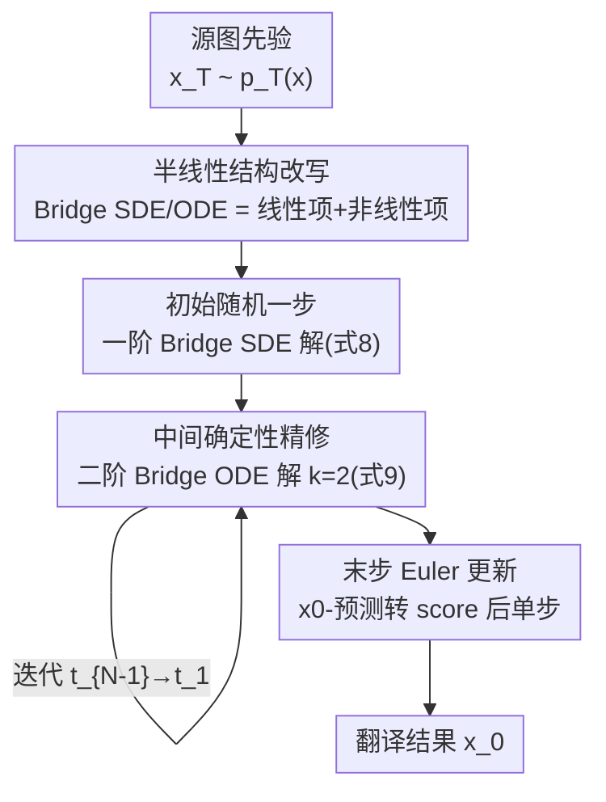

# DBMSolver: A Training-free Diffusion Bridge Sampler for High-Quality Image-to-Image Translation

**会议**: CVPR 2026  
**arXiv**: [2605.05889](https://arxiv.org/abs/2605.05889)  
**代码**: https://github.com/snumprlab/dbmsolver  
**领域**: 扩散模型 / 图像生成 / Image-to-Image Translation  
**关键词**: 扩散桥模型, 训练无关采样器, 指数积分器, 半线性结构, 高阶 ODE 求解

## 一句话总结
针对扩散桥模型（DBM）做图像到图像翻译时采样慢（动辄几十上百次网络评估）的问题，DBMSolver 不改网络、不训练，仅靠揭示 Bridge SDE/ODE 的「半线性结构」并用指数积分器（EI）推出闭式解，把采样步数（NFE）压到 6 步就超过此前 SOTA，在 DIODE 上 20 NFE 时 FID 比二阶基线降 53%。

## 研究背景与动机
**领域现状**：图像到图像翻译（I2I，如修复、上色、风格化、语义图生图）近年从 GAN 转向扩散模型。其中 Diffusion Bridge Models（DBM，DDBM）用 Doob's h-transform 在源图分布 $p_T(\boldsymbol{x})$ 与目标图分布 $p_0(\boldsymbol{x})$ 之间架一条「扩散桥」，理论优雅、生成质量高，是当前 I2I 的高保真主力。

**现有痛点**：DBM 采样太慢。原始的 Hybrid Heun 采样器要 **119 次**网络前向（NFE）才能得到连贯结果；后续的 DBIM-2/3 虽然降到 20 NFE，但它们的高阶解是靠**线性多步法数值逼近**的（非闭式），在低 NFE 时仍有明显的逼近误差，质量上不去。

**核心矛盾**：扩散桥的先验 $p_T(\boldsymbol{x})$ 是**任意图像**而非纯高斯噪声。这一点让为「噪声到图像（N2I）」设计的快速求解器（DDIM、DPMSolver++）的理论基础直接失效——它们假设 $p_T(\boldsymbol{x})\approx\mathcal{N}(\boldsymbol{0},\sigma_T^2\boldsymbol{I})$，先验非高斯时桥就不成立。于是 DBM 只能用专用但慢的采样器。

**本文目标**：在**不额外训练、不改架构**的前提下，为 DBM 推出一个又快又准的即插即用采样器，把 NFE 砍一个数量级且质量不降反升。

**切入角度**：作者重新审视 DBM 反向过程所遵循的 Bridge SDE（式 2）和 Bridge PF ODE（式 5），发现它们其实都具有被前人忽略的**半线性结构**——对 $\boldsymbol{x}_t$ 是线性的、只有 score 项是非线性的。这种结构正是指数积分器（Exponential Integrator, EI）最擅长精确求解的形式。

**核心 idea**：用 EI 对线性项求**精确闭式解**、对含 $\boldsymbol{x}_0$-预测网络的非线性项做 Taylor 展开逼近，从而推出 DBM 专用的一阶 SDE 解和二阶 ODE 解，再组合成一个高阶采样流程，替换掉现有的粗糙数值逼近。

## 方法详解

### 整体框架
DBMSolver 的输入是一张源图（作为先验样本 $\tilde{\boldsymbol{x}}_T\sim p_T(\boldsymbol{x})$）和一个**预训练好的、做 $\boldsymbol{x}_0$ 预测的 DBM** $\textbf{D}_{\boldsymbol{\theta}}$，输出是翻译后的目标图 $\tilde{\boldsymbol{x}}_0$，整个过程不碰网络权重。方法的骨架是先把 DBM 的反向 SDE/ODE 改写成「线性项 + 非线性项」的半线性形式，再分别求解，最后拼成一个**三阶段采样调度**：

- **初始随机一步**：从 $s=T$ 走到 $t=T-\epsilon$（$\epsilon\approx10^{-4}$），用一阶 Bridge SDE 解（Proposition 1，式 8）。之所以单独处理，是因为 ODE 解在 $s\to T$ 时会发散（系数里的 $\rho(\lambda_s,\lambda_T)\to0$），所以起步必须用 SDE。
- **中间确定性精修**：从 $t_{N-1}$ 迭代到 $t_1$，每步用 $k=2$ 的二阶 Bridge PF ODE 解（Proposition 2，式 9），逐步把噪声样本逼向干净图。
- **最后一步 Euler**：从 $t_1$ 到 $t_0=0$，把 $\boldsymbol{x}_0$-预测转成 score 后用一次标准 Euler 更新，得到高保真输出。

### 关键设计

**1. 揭示 Bridge SDE/ODE 的半线性结构：找到能精确求解的「钥匙」**

此前的 DBM 采样器没意识到 Bridge SDE/ODE 内部藏着可被精确处理的结构，只能整体做数值积分，误差大。作者把 $\boldsymbol{x}_0$-预测器 $\textbf{D}_{\boldsymbol{\theta}}$ 代回 Bridge PF ODE（式 5），将其改写成半线性形式 $\frac{\text{d}\boldsymbol{x}_t}{\text{d}t}=\underbrace{L(t)\,\boldsymbol{x}_t}_{\text{线性项}}+\underbrace{N(\textbf{D}_{\boldsymbol{\theta}}(\boldsymbol{x}_t),t,\boldsymbol{x}_T)}_{\text{非线性项}}$，其中线性项对 $\boldsymbol{x}_t$ 线性、非线性项才包含神经网络。Bridge SDE 同样具备这一结构。这个观察是全文的地基：一旦分离出线性项，就能对它用指数积分器求**解析精确解**，把数值逼近误差只留给非线性项，从根本上比「整体数值积分」更准

**2. 一阶 Bridge SDE 解：用指数积分器拿下起步随机步**

ODE 解在 $t=T$ 处会发散，所以必须有个专门的起步求解器。作者对半线性的 Bridge SDE 用 EI 方法求精确解，再做一阶 Taylor 展开（误差 $O(\Delta t^2)$）得到 Proposition 1：
$$\boldsymbol{x}_t=\frac{\text{SNR}_s}{\text{SNR}_t}\frac{\alpha_t}{\alpha_s}\boldsymbol{x}_s+\alpha_t\left(1-\frac{\text{SNR}_s}{\text{SNR}_t}\right)\textbf{D}_{\boldsymbol{\theta}}(\boldsymbol{x}_s)+\sigma_t\sqrt{1-\frac{\text{SNR}_s}{\text{SNR}_t}}\,\boldsymbol{z}_t$$
其中 $\boldsymbol{z}_t\sim\mathcal{N}(\boldsymbol{0},\boldsymbol{I})$，$\text{SNR}_t:=\alpha_t^2/\sigma_t^2$ 是 $t$ 时刻的信噪比。它只在 $s=T\to t=T-\epsilon$ 这一**极小区间**上用一次，区间小到一阶逼近就足够准——作者据此论证起步不必上更高阶，省下复杂度

**3. 二阶 Bridge PF ODE 闭式解：把中间精修做到既精确又解析可算**

中间这些步是采样质量的主战场，DBIM-2/3 在这里用线性多步法做数值逼近，误差较大。作者改为对 Bridge PF ODE 走 EI → 换元 → 把解写成指数加权积分的路线，得到 Proposition 2 的**精确闭式解**（式 9），核心是那一项「指数积分」$\int_{\lambda_s}^{\lambda_t}\frac{e^{2\lambda}\textbf{D}_{\boldsymbol{\theta}}(\boldsymbol{x}_\lambda)}{\sqrt{\rho(\lambda,\lambda_T)}}\text{d}\lambda$，其中 $\lambda_t:=\log(\alpha_t/\sigma_t)$ 可理解为半个 log-SNR、$\rho(a,b):=e^{2(a-b)}-1$。再对这个积分做 $(k-1)$ 阶 Taylor 展开：把 $\textbf{D}_{\boldsymbol{\theta}}$ 的各阶导数估计出来、剩下的积分**解析求出**（式 10）。关键在于：$k=1$ 时它就退化成 DBIM-1，而本文取 $k=2$，多出来的二阶项让逼近误差界更小、低 NFE 下细节更准——且因为解是解析的，不像 DBIM-2/3 那样背负数值多步法的额外误差

**4. 三阶段采样调度与「为什么是 k=2」的阶数选择：把三个解拼成完整算法**

光有两个 Proposition 还要拼成能跑的采样器。作者设计了 SDE 起步 → ODE 中段 → Euler 收尾的三段式调度（见 Algorithm 1）：起步用一阶 SDE 绕开 ODE 在 $t=T$ 的发散；最后从 $t_1$ 到 $0$ 用一次 Euler（先用式 6 把 $\boldsymbol{x}_0$-预测转成 score）。阶数上特意停在 $k=2$ 而非更高：因为 $k\ge3$ 的积分会出现**非初等原函数**（无法用多项式/指数/对数等初等函数写成闭式），只能退回数值多步法——而那正是 DBIM-2/3 的做法、会重新引入更大误差界。所以 DBMSolver 守住「解析可算」的边界，用二阶闭式解换取最干净的逼近，这也是它能在 6 NFE 就超过 DBIM-3 的根因

### 损失函数 / 训练策略
本文是**训练无关**的采样器，不引入任何新损失或训练。它直接复用前人公开的 DBM checkpoint（如 DDBM 在 E2H/DIODE 的权重、DBIM 在 ImageNet inpainting 的 $\text{I}^2\text{SB}$ 微调权重）；对缺权重的数据集（Face2Comics、CelebAMask-HQ）则按标准做法用 ADM U-Net 从头训一个 DBM，再套 DBMSolver 采样。

## 实验关键数据

### 主实验
评测涵盖草图生图（E2H）、表面法线生图（DIODE）、人脸漫画化（Face2Comics）、类条件中心修复（ImageNet）、语义标签生人脸（CelebAMask-HQ），指标为 FID/IS/LPIPS/MSE/CA，效率用 NFE 衡量。

DIODE (256×256) 上 FID 对比（越低越好）：

| 方法 | NFE | FID↓ | IS↑ | LPIPS↓ | MSE↓ |
|------|-----|------|-----|--------|------|
| Hybrid Heun | 119 | 4.43 | 6.21 | 0.244 | 0.084 |
| DBIM-1 | 20 | 4.99 | 6.10 | 0.201 | 0.017 |
| DBIM-2 | 20 | 4.40 | 6.11 | 0.200 | 0.017 |
| DBIM-3 | 20 | 4.23 | 6.05 | 0.201 | 0.017 |
| ODES3 | 28 | 2.29 | 5.92 | 0.203 | 0.018 |
| **DBMSolver (Ours)** | **6** | **3.38** | 6.00 | 0.196 | 0.015 |
| **DBMSolver (Ours)** | **20** | **2.06** | 6.00 | 0.198 | 0.018 |

20 NFE 时 FID 2.06 vs. 二阶基线 DBIM-2 的 4.40，约降 **53%**（与摘要一致）；仅 6 NFE 时 FID 3.38 已优于 119 NFE 的 Hybrid Heun（4.43）和所有 20 NFE 的 DBIM 变体。

E2H (64×64) 上的小分辨率验证：

| 方法 | NFE | FID↓ | LPIPS↓ |
|------|-----|------|--------|
| Hybrid Heun | 119 | 1.83 | 0.142 |
| DBIM-3 | 20 | 1.45 | 0.098 |
| ODES3 | 28 | 0.54 | 0.097 |
| **DBMSolver (Ours)** | **6** | **0.93** | 0.106 |
| **DBMSolver (Ours)** | **20** | **0.53** | 0.099 |

6 NFE 即达 FID 0.93（优于 119 NFE 的 Hybrid Heun），20 NFE 达 0.53（与 28 NFE 的 ODES3 持平且步数更少）。

Face2Comics / CelebAMask-HQ / ImageNet 修复补充：

| 任务 | 方法 | NFE | FID↓ | 备注 |
|------|------|-----|------|------|
| Face2Comics | DBIM-3 | 20 | 8.61 | — |
| Face2Comics | **DBMSolver** | 6 | **3.04** | 6 步超 20 步 DBIM |
| Face2Comics | **DBMSolver** | 20 | **0.96** | — |
| ImageNet 修复 | DBIM-2 | 20 | 4.07 (CA 72.0) | 耗时 13.67 |
| ImageNet 修复 | **DBMSolver** | 6 | 4.98 (CA 70.8) | **耗时 3.66、吞吐 45.4×** |
| ImageNet 修复 | **DBMSolver** | 20 | 4.07 (CA 72.0) | 与 DBIM 持平 |

ImageNet 修复上 6 NFE 把单图耗时从 ~13.7 压到 **3.66**、吞吐率提到 45.41（约 4× 加速）；CelebAMask-HQ 上 20 NFE FID 17.56，优于 DBIM-3 的 19.49 和 200 步 BBDM 的 21.35。

### 消融实验
| 配置 | 关键现象 | 说明 |
|------|---------|------|
| $k=1$（≈ DBIM-1） | FID 较高 | 一阶 Taylor 展开，逼近误差大 |
| $k=2$（DBMSolver 采用） | FID 更优 | 二阶闭式解，误差界更小（附录证实优于 $k=1$） |
| $k\ge3$ | 不可解析 | 出现非初等原函数，只能退回数值多步法（即 DBIM-2/3 路线） |
| 起步用一阶 SDE | 稳定 | 绕开 ODE 在 $t=T$ 的系数发散 |

### 关键发现
- **半线性结构是质量来源**：把线性项做精确闭式解、非线性项做 Taylor 逼近，比 DBIM-2/3 的整体数值多步法误差更小，这解释了为何同为二阶、DBMSolver 6 NFE 就能压过 DBIM-3 的 20 NFE。
- **阶数停在 $k=2$ 是刻意的**：不是越高越好——$k\ge3$ 会失去解析可算性、被迫引入数值误差，反而不划算；二阶是「解析可解」与「精度」的最佳折中。
- **低 NFE 下细节优势最明显**：在 DIODE 树枝、手袋纹理、人脸眼角/发际线/掩膜边缘等细结构上，DBMSolver 6 NFE 仍清晰，而 DBIM 同步数下偏糊。

## 亮点与洞察
- **「训练无关 + 闭式解」的双重红利**：作为现有 DBM 采样的即插即用替换，零重训就把 NFE 砍一个量级（如 6 vs 119），同时质量还升——这种「又快又好、还不用动模型」的组合在工程落地上极有吸引力。
- **把半线性结构挖出来是真正的 aha 点**：DPMSolver 系列早就用 EI 加速 N2I 扩散，但大家默认它在 DBM 上不适用（因先验非高斯）。本文证明 Bridge SDE/ODE 同样半线性、同样能上 EI，等于把 N2I 的加速红利「搬」到了 I2I，思路可迁移到其他带任意先验的桥式生成模型。
- **「阶数边界即误差边界」的洞察可复用**：用「原函数是否初等」来界定能走多高阶、超过就该停手，这个判断准则对设计其他高阶扩散求解器同样有指导意义。

## 局限与展望
- **依赖已有 $\boldsymbol{x}_0$-预测形式的 DBM**：方法推导绑定 Bridge Score Matching 训练出的 $\boldsymbol{x}_0$-预测器与 VP/VE 桥；换成其他参数化或非标准桥时，闭式解需重新推导。
- **分辨率仅验证到 256×256**：论文未在更高分辨率（512/1024）或更大规模潜空间 DBM 上验证，加速比与质量优势能否保持是开放问题。
- **极低 NFE 下并非全面最优**：如 ImageNet 修复 6 NFE 时 FID 4.98 仍高于 20 NFE 的 DBIM（4.07），即「更省步」和「更高绝对质量」之间仍有取舍；CelebAMask-HQ 也只报了 20 NFE。
- **二阶为上限**：受「非初等原函数」限制无法解析地上三阶，若未来能找到三阶的解析近似或更紧的二阶 Taylor 余项，质量或可进一步提升。

## 相关工作与启发
- **vs Hybrid Heun (DDBM)**：HH 交替用一阶 Euler-Maruyama 解 SDE、二阶 Heun 解 ODE，需 119 NFE。本文同样基于 Bridge SDE/ODE，但靠 EI 求半线性精确解，把步数压到 6，质量还更高。
- **vs DBIM-1/2/3**：DBIM 是非马尔可夫采样器，高阶版（DBIM-2/3）用线性多步法**数值**逼近、非闭式。本文 $k=1$ 解恰等价于 DBIM-1，但取 $k=2$ 给出**解析闭式**二阶解，避免了多步法的误差与复杂度，6 NFE 即超过 DBIM-3 的 20 NFE。
- **vs DPMSolver++（N2I 求解器）**：DPMSolver++ 也用 EI，但假设先验为高斯，理论上不适用于 DBM 的任意先验。本文把同类 EI 思想重新落到非高斯桥上，填补了「I2I 没有闭式高阶 EI 求解器」的空白。
- **vs Bridge-TTS 的 EI**：Bridge-TTS 在音频场景用 EI，但属于特定领域近似；本文为 VP/VE 桥推出通用闭式解，避免粗糙近似并在低 NFE 仍有 FID 增益。

## 评分
- 新颖性: ⭐⭐⭐⭐⭐ 首次揭示 Bridge SDE/ODE 的半线性结构并据此推出 DBM 专用闭式高阶 EI 解，把 N2I 的加速红利系统地搬到 I2I。
- 实验充分度: ⭐⭐⭐⭐ 覆盖 5 个任务、多分辨率、多基线，含 NFE-FID 曲线与阶数消融；但分辨率止于 256，极低 NFE 的绝对质量仍有取舍。
- 写作质量: ⭐⭐⭐⭐ 推导分层清晰（半线性→SDE 解→ODE 解→调度），用表 1 把各采样器的先验假设/阶数/马尔可夫性讲明白；公式偏多，需对照附录。
- 价值: ⭐⭐⭐⭐⭐ 训练无关、即插即用、NFE 降一个量级且质量升，对 DBM 实时化与落地有直接价值，代码已开源。

<!-- RELATED:START -->

## 相关论文

- [\[CVPR 2026\] PixelRush: Ultra-Fast, Training-Free High-Resolution Image Generation via One-step Diffusion](pixelrush_ultrafast_trainingfree_highresolution_im.md)
- [\[CVPR 2026\] Frequency-Aware Flow Matching for High-Quality Image Generation](freqflow_frequency_aware_flow_matching.md)
- [\[CVPR 2026\] Efficient and Training-Free Single-Image Diffusion Models](efficient_and_training-free_single-image_diffusion_models.md)
- [\[CVPR 2026\] Training-free, Perceptually Consistent Low-Resolution Previews with High-Resolution Image for Efficient Workflows of Diffusion Models](training-free_perceptually_consistent_low-resolution_previews.md)
- [\[CVPR 2026\] DiT360: High-Fidelity Panoramic Image Generation via Hybrid Training](dit360_high-fidelity_panoramic_image_generation_via_hybrid_training.md)

<!-- RELATED:END -->
