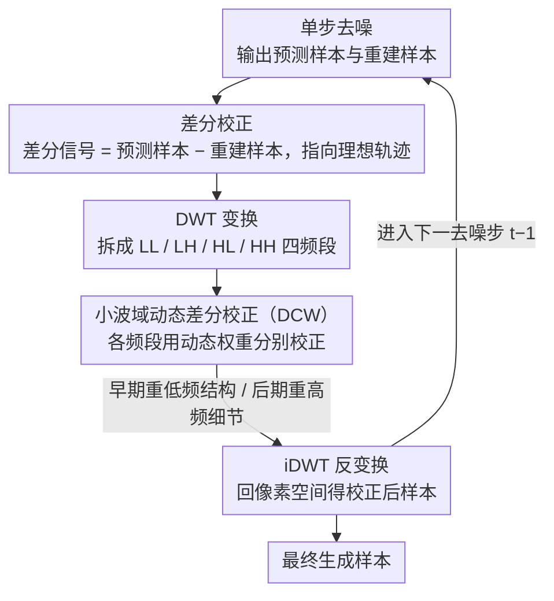

# Elucidating the SNR-t Bias of Diffusion Probabilistic Models

**会议**: CVPR 2026  
**arXiv**: [2604.16044](https://arxiv.org/abs/2604.16044)  
**代码**: [https://github.com/AMAP-ML/DCW](https://github.com/AMAP-ML/DCW)  
**领域**: 图像生成  
**关键词**: 扩散模型, SNR-时间步偏差, 差分校正, 小波域, 免训练

## 一句话总结

本文揭示了扩散模型中普遍存在的 SNR-t 偏差（逆过程样本的信噪比与时间步不匹配），并提出小波域动态差分校正方法（DCW），在不训练的情况下即插即用地提升多种扩散模型的生成质量。

## 研究背景与动机

**领域现状**：扩散概率模型（DPM）在图像、音频、视频等生成任务中取得了巨大成功。模型在训练时将噪声样本与时间步严格绑定：$X_t = \sqrt{\bar{\alpha}_t} X_0 + \sqrt{1-\bar{\alpha}_t} \epsilon_t$，信噪比 $\text{SNR}(t) = \bar{\alpha}_t / (1-\bar{\alpha}_t)$ 完全由时间步 $t$ 决定。

**现有痛点**：推理时，由于网络预测误差和数值求解器离散化误差的累积，逆去噪轨迹不可避免地偏离理想路径，导致预测样本 $\hat{x}_t$ 的实际 SNR 与预设时间步 $t$ 对应的 SNR 不匹配——这就是 SNR-t 偏差。

**核心矛盾**：训练时 SNR 和时间步严格耦合，但推理时这种对应被打破。当网络收到 SNR 不匹配的样本时，会产生明显的预测偏差：SNR 更低的样本导致噪声预测过大，SNR 更高的样本导致预测过小。实验证实逆过程样本始终呈现比正向样本更低的 SNR。

**本文目标**：（1）提供 SNR-t 偏差的系统性实证和理论证明；（2）设计无训练的校正方法来缓解偏差。

**切入角度**：利用逆去噪过程中每步都会产生的重建样本 $x^0_\theta$，其与预测样本 $\hat{x}_{t-1}$ 之间的差分信号包含将偏移样本推向理想轨迹的梯度信息。

**核心 idea**：将差分校正引入小波域，对不同频率分量分别校正，并根据扩散模型"先低频后高频"的去噪特性设计动态权重。

## 方法详解

### 整体框架

DCW 作为即插即用的推理模块嵌入到每个去噪步骤中。在每步去噪完成后：（1）将重建样本 $x^0_\theta$ 和预测样本 $x_{t-1}$ 通过 DWT 映射到小波域；（2）对低频（LL）和高频（LH、HL、HH）分量分别计算差分信号并施加动态加权校正；（3）通过 iDWT 映射回像素空间，得到的校正样本送入下一去噪步。

> SNR-t 偏差的理论证明是诊断性贡献（解释“为什么逆过程 SNR 必然偏低”），不进 pipeline 图；图中节点对应「差分校正」与「小波域动态差分校正（DCW）」两个方法设计。

### 关键设计

**1. SNR-t 偏差的理论证明：把"逆过程 SNR 总是偏低"从实验现象坐实成数学必然**

光有实验曲线还不够，本文要回答的是：为什么逆过程样本的 SNR 一定低于正向过程，而不是偶然如此。关键一步是给重建模型一个更贴近现实的先验——假设它的输出写成 $x^0_\theta(\hat{x}_t, t) = \gamma_t x_0 + \phi_t \epsilon_t$，其中 $0 < \gamma_t \leq 1$ 表示重建对真实信号的衰减，$\phi_t \epsilon_t$ 是残留噪声。沿着逆过程把这个表达式代入采样递推，可推出预测样本的实际信噪比为

$$\text{SNR}(t) = \frac{\hat{\gamma}_t^2 \, \bar{\alpha}_t}{1-\bar{\alpha}_t + \left(\frac{\sqrt{\bar{\alpha}_t}\,\beta_{t+1}}{1-\bar{\alpha}_{t+1}}\phi_{t+1}\right)^2}.$$

与正向过程的 $\text{SNR}(t)=\bar{\alpha}_t/(1-\bar{\alpha}_t)$ 相比，分子被 $\hat{\gamma}_t^2 \leq 1$ 压小、分母又多出一个恒正项，两头都把比值往下拉，于是逆过程 SNR 必然偏低。这里之所以坚持用 $\gamma_t < 1$ 而非更省事的 $x^0_\theta = x_0 + \phi_t \epsilon_t$，是因为后者会让 $\mathbb{E}[\|x^0_\theta\|^2] > \mathbb{E}[\|x_0\|^2]$，直接和 Tweedie 公式、方差恒等式打架；衰减系数 $\gamma_t$ 恰好补上了这处不自洽。

**2. 像素空间差分校正：用去噪自带的"副产品"把偏移样本推回理想轨迹**

既然偏差表现为 SNR 偏低，就需要一个方向信号把样本往"更靠近噪声"的方向轻推。本文发现这个方向其实唾手可得——每步去噪都会顺带算出一个重建样本 $x^0_\theta(\hat{x}_t, t)$，它和预测样本之间的差分 $\hat{x}_{t-1} - x^0_\theta(\hat{x}_t, t)$ 正好指向理想的 $x_{t-1}$。据此把校正写成

$$\hat{x}_{t-1} = \hat{x}_{t-1} + \lambda_t\bigl(\hat{x}_{t-1} - x^0_\theta(\hat{x}_t, t)\bigr),$$

引导系数 $\lambda_t$ 控制推动力度。直觉上这个差分把预测样本朝噪声方向拉了一点，相当于抬高 SNR，正好抵消逆过程 SNR 偏低的毛病。妙处在于差分信号是去噪流程本就要算的东西，不需要额外网络或搜索；而且实验显示校正已经出炉的 $\hat{x}_{t-1}$ 比回头去校正上一步的 $\hat{x}_t$ 更省也更准。

**3. 小波域动态差分校正（DCW）：按频率分量分别校正，并随去噪阶段动态调权**

统一的像素空间校正有个盲区——它对所有频率一视同仁，而扩散模型是"先把低频骨架搭好、再慢慢填高频细节"的，不同阶段真正需要修的频段并不一样。DCW 先用 DWT 把样本拆成 LL、LH、HL、HH 四个频率分量，对每个分量各自做一次差分校正

$$\hat{x}^f_{t-1} = \hat{x}^f_{t-1} + \lambda^f_t\bigl(\hat{x}^f_{t-1} - x^{0,f}_\theta\bigr), \quad f \in \{ll, lh, hl, hh\},$$

再用 iDWT 拼回像素空间。关键是权重 $\lambda^f_t$ 不再是常数，而是随去噪阶段动态调整：早期主要校正低频分量（管全局结构），后期把重心转向高频分量（管纹理细节）。这样校正力度始终落在当前阶段最该修的频段上，比"一刀切"的像素空间校正更贴合扩散模型的去噪节奏。

### 损失函数 / 训练策略

完全免训练。DCW 以即插即用方式嵌入推理过程，不修改模型权重。计算开销仅为 DWT/iDWT 和差分操作，可忽略不计。

## 实验关键数据

### 主实验

| 基础模型 | 原始 FID | + DCW FID | 改善 |
|---------|---------|----------|------|
| IDDPM | 8.45 | 6.72 | -1.73 |
| ADM | 4.59 | 3.97 | -0.62 |
| DDIM (50步) | 8.72 | 7.31 | -1.41 |
| EDM | 1.97 | 1.79 | -0.18 |
| FLUX | 改善 | 改善 | 显著 |

### 消融实验

| 配置 | FID 改善 |
|------|---------|
| 像素空间差分校正（DC） | 中等 |
| 小波域差分校正（DCW） | 最优 |
| 仅低频校正 | 部分 |
| 仅高频校正 | 部分 |
| 动态权重 vs 固定权重 | 动态更好 |

### 关键发现

- DCW 在 8 种不同扩散模型上都有效（IDDPM、ADM、DDIM、A-DPM、EA-DPM、EDM、PFGM++、FLUX），证明 SNR-t 偏差的普遍性
- 可以与 exposure bias 校正模型叠加使用并获得额外增益，说明 SNR-t 偏差是比 exposure bias 更底层的问题
- 在不同分辨率数据集上一致有效（CIFAR-10、ImageNet 等）
- 小波域校正比像素空间校正效果更好，验证了频率分离校正的必要性
- 计算开销可忽略不计

## 亮点与洞察

- **揭示了一个基础性问题**：SNR-t 偏差是所有 DPM 的固有问题，比 exposure bias 更本质。$\gamma_t < 1$ 的理论推导优雅地解释了偏差的必然性
- **差分信号的巧妙利用**：去噪过程的副产品中天然包含校正方向信息，无需额外网络或搜索
- **即插即用的实用性**：零训练开销、几乎零推理开销，可直接应用于任何 DPM，包括 FLUX 等前沿模型

## 局限与展望

- $\lambda_t$ 的选择目前需要针对不同模型调整，自动化设置策略有待研究
- 理论分析基于高斯假设，对于实际数据分布的偏差可能存在gap
- 在步数极少（1-2 步）的一致性模型中效果有待验证
- 与其他改进方法的组合策略可以进一步探索

## 相关工作与启发

- **vs ADM-ES / TS-DPM**: 这些工作研究 exposure bias（样本间差异），SNR-t 偏差关注样本与时间步的不匹配，是更底层的问题。DCW 可以与它们叠加使用
- **vs ADM-IP**: ADM-IP 通过重新扰动训练数据来缓解偏差，需要重训；DCW 免训练即插即用
- **vs FreeU**: FreeU 在 U-Net 中重加权频率分量，DCW 在去噪过程中动态校正频率分量，两者作用层次不同

## 评分

- 新颖性: ⭐⭐⭐⭐⭐ 首次系统性揭示和证明 SNR-t 偏差，理论分析深入
- 实验充分度: ⭐⭐⭐⭐⭐ 8 种模型、多分辨率数据集、与其他方法叠加验证
- 写作质量: ⭐⭐⭐⭐⭐ 从现象到理论到方法的逻辑链完整优雅
- 价值: ⭐⭐⭐⭐⭐ 揭示基础问题+提供实用解决方案，影响面广

<!-- RELATED:START -->

## 相关论文

- [\[CVPR 2026\] Elucidating the Design Space of Arbitrary-Noise-Based Diffusion Models](eda_arbitrary_noise_diffusion_design_space.md)
- [\[CVPR 2026\] Bias at the End of the Score: Demographic Biases in Reward Models for T2I](bias_reward_models_t2i.md)
- [\[CVPR 2026\] Probabilistic Precipitation Nowcasting with Rectified Flow Transformers](probabilistic_precipitation_nowcasting_with_rectified_flow_transformers.md)
- [\[ICCV 2025\] SMGDiff: Soccer Motion Generation using Diffusion Probabilistic Models](../../ICCV2025/image_generation/smgdiff_soccer_motion_generation_using_diffusion_probabilistic_models.md)
- [\[ICLR 2026\] Conditionally Whitened Generative Models for Probabilistic Time Series Forecasting](../../ICLR2026/image_generation/conditionally_whitened_generative_models_for_probabilistic_time_series_forecasti.md)

<!-- RELATED:END -->
