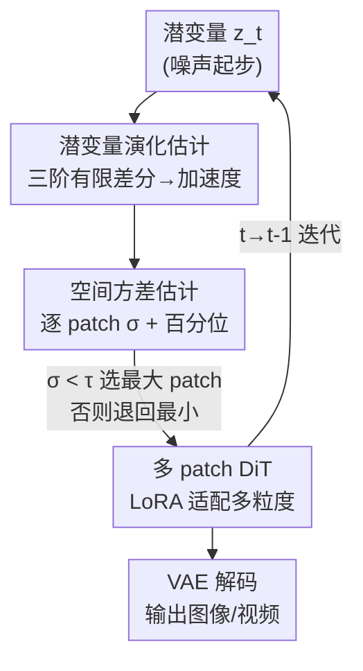

# DDiT: Dynamic Patch Scheduling for Efficient Diffusion Transformers

**会议**: CVPR 2026  
**论文**: [CVF Open Access](https://openaccess.thecvf.com/content/CVPR2026/html/Kim_DDiT_Dynamic_Patch_Scheduling_for_Efficient_Diffusion_Transformers_CVPR_2026_paper.html)  
**代码**: 未公开  
**领域**: 扩散模型 / 模型压缩  
**关键词**: 扩散 Transformer, 动态 patch, 推理加速, LoRA, 测试时调度

## 一句话总结
DDiT 发现扩散 Transformer 在去噪早期只需粗粒度、晚期才需细粒度，于是给冻结的预训练 DiT 加一个轻量 LoRA 分支让它支持多种 patch size，再用一个训练无关的调度器按"潜变量演化的加速度"在每个时间步自动挑最大可用 patch，在 FLUX-1.Dev 上做到最高 3.52× 加速、FID 几乎不掉。

## 研究背景与动机
**领域现状**：Diffusion Transformer（DiT，如 FLUX、Wan）是当前图像/视频生成的主流框架，但迭代去噪 + 全局注意力让推理极慢——Wan-2.1 在 RTX 4090 上生成一段 5 秒 720p 视频要 30 分钟。学界为此发展了特征缓存、剪枝、量化、蒸馏等一大批加速方案。

**现有痛点**：这些方法有两个共性缺陷。其一是**硬性静态削减**——固定砍掉一批权重/操作/token，可能把对某个具体输出至关重要的计算永久丢掉，导致质量明显下降。其二是**一刀切、与输入无关**——不管 prompt 是"一片蓝天"还是"一群斑马挤在一起的场景"，都用同样的计算量，无法把资源分配到真正需要的地方。

**核心矛盾**：DiT 从头到尾都用**固定大小的 patch** 做 tokenization，而注意力复杂度是 $O(N^2)$、$N = HW/p^2$，所以 patch 越小 token 越多、越慢。但去噪过程中各时间步生成的细节层次根本不同：早期在搭建粗糙的全局结构，晚期才在打磨局部纹理。用同一粒度处理所有步既浪费又不灵活。

**切入角度**：作者的关键观察是——潜变量（latent）在不同时间步以不同的"细节速率"演化。如果某个时间步潜变量流形变化缓慢，说明在生成粗结构，此时用大 patch（粗粒度）几乎不损质量却能省算力；反之变化剧烈则说明在生成细节，需退回小 patch。

**核心 idea**：把"丢弃计算"换成"动态分配计算"——在每个去噪步、针对每个 prompt，用潜变量演化的加速度作代理信号，自动选当前能用的最大 patch size，从而显式控制算力预算又尽量保住质量。

## 方法详解

### 整体框架
DDiT 要解决的是"如何让一个**已经训练好的** DiT 在推理时按需切换 patch 粒度"。它分两块：**架构侧**改造 patch embedding 层让模型能吃多种 patch size（靠 LoRA + 蒸馏微调，几乎不动主干）；**调度侧**在推理每一步用一个训练无关的打分规则决定该用多大的 patch。整体是"先让模型有能力用大 patch，再让调度器决定何时用"的两段式。

输入是 prompt 与从纯噪声开始的潜变量 $z_T$；在每个去噪时间步 $t$，调度器先看最近几步潜变量的演化加速度，挑出一个 patch size $p_t$，然后用对应的 patch-embedding 把 $z_t$ 切成 token 喂进带 LoRA 的 DiT，去噪一步、de-embed 回潜空间；如此迭代到 $z_0$ 再经 VAE 解码出图/视频。

### 关键设计

**1. 多粒度 patch 化：用 LoRA 让冻结 DiT 吃下不同大小的 patch**

痛点是预训练 DiT 的 patch-embedding 层只为固定 patch size $p$ 设计，直接换 patch 大小会破坏它已学到的潜流形。DDiT 的做法是为每个想支持的 $p_{new}$（定义为 $p$ 的正整数倍，即 $\{p, 2p, 4p, \dots\}$）新增一套专属的 patch-embedding 与 de-embedding 权重 $w^{emb}_{p_{new}} \in \mathbb{R}^{p_{new}\times p_{new}\times C\times d}$，把每个大 patch 线性投影到同一 $d$ 维 token 空间。由于 $p_{new}$ 下 patch 数 $N_{p_{new}} = HW/p_{new}^2$ 比原来小了 $(p_{new}/p)^2$ 倍，注意力一下子便宜很多——实测 $p\to 2p$ 直接带来约 3× 计算收益（token 数 $4096\to1024$）。

为了把训练成本压到最低，主干完全冻结，只在每个 transformer block 的前馈层和一个残差块里插入 rank=32 的 LoRA 分支作为"适配通路"；同时从 patch-embedding 之前拉一条残差连到 de-embedding 之后，在"原始潜流形"和"LoRA 新学的 $p_{new}$ 流形"之间做平衡。新 patch 的位置编码由原始 $p$ 的位置编码**双线性插值**得到，另加一个可学习的 patch-size 标识向量（类似位置编码，加到所有 token 上）让模型知道当前用的是哪种粒度。最后用一个蒸馏损失把冻结基模的行为迁移给 LoRA 分支（见损失函数节）。

**2. 潜变量演化估计：用三阶有限差分量化"细节速率"**

调度的核心问题是怎么判断"当前这步在生成粗结构还是细节"。DDiT 用对潜变量序列做**递增阶的有限差分**来量化演化快慢。一阶差分是相邻步位移 $\Delta z_t = z_t - z_{t+1}$；二阶差分描述位移的变化率（去噪轨迹的局部速度）$\Delta^{(2)} z_{t-1} = \Delta z_{t-1} - \Delta z_t$；三阶差分则刻画速度的变化，可解读为短时间窗内潜变量演化的"加速度"：

$$\Delta^{(3)} z_{t-1} = \Delta^{(2)} z_{t-1} - \Delta^{(2)} z_t = 2\left(\frac{\Delta z_{t-1} + \Delta z_{t+1}}{2} - \Delta z_t\right)$$

直觉是：加速度小→局部时间窗内潜流形差异小→在生成粗结构，可放心用大 patch；加速度大→流形结构差异大→在生成细节，需退回小 patch。作者用它作为"识别粗/细生成切换点"的代理信号。消融显示**三阶**比一阶/二阶更有效也更稳定（一二阶只捕捉太短期的变化），这一点与已有工作（相邻噪声预测之差与三阶有限差分相关）一致。

**3. 空间方差估计 + 阈值调度：按百分位选最大可用 patch**

加速度是逐 latent-pixel 的，还要聚合成"这一步该用多大 patch"的决策。DDiT 把 $z_{t-1}$ 按候选 patch size $p_i$ 切块，在每个 patch 内计算加速度 $\Delta^{(3)}z_{t-1}$ 的标准差 $\sigma^{p_i}_{t-1}$——方差高说明这块在生成细纹理，方差低说明潜变量平滑。聚合时**不取均值**而取**第 $\epsilon$ 百分位** $\sigma^{p_i,(\epsilon)}_{t-1}$：因为一张图常同时有纯色背景和高纹理区域，取均值会把高方差抹平、错误地选大 patch 而丢掉纹理细节；百分位既能保留跨 patch 的有效信号、又不会被少数高方差离群点带偏。

最终调度规则是：把 $\sigma^{p_i,(\epsilon)}_{t-1}$ 和预设阈值 $\tau$ 比较，**选方差仍低于阈值的最大 patch**，都不满足则退回最小 patch（即 1）：

$$p_t = \begin{cases} \max(p_i), & \text{if } \sigma^{p_i,(\epsilon)}_{t-1} < \tau \\ 1, & \text{otherwise} \end{cases}$$

$\tau$ 给了用户对速度的显式旋钮：想更快就调大 $\tau$（更容易选粗 patch），想更高质量就调小。整套调度**训练无关**、即插即用。全文默认 $\tau=0.001$、$\epsilon=0.4$。

### 损失函数 / 训练策略
只微调新增组件（多粒度 patch-embedding/de-embedding、LoRA、残差块、patch-size 标识向量），主干冻结。用蒸馏损失把冻结基模的噪声预测迁移到 LoRA 分支——设 $\hat{\epsilon}_L$、$\hat{\epsilon}_T$ 分别为 LoRA 微调模型与冻结基模的预测噪声：

$$\mathcal{L} = \lVert \hat{\epsilon}_L(z^{p_{new}}_t, t) - \hat{\epsilon}_T(z^{p}_t, t) \rVert_2^2$$

patch-embedding 权重用双线性插值投影的伪逆初始化以保住基模行为。T2I 在合成数据集 T2I-2M 上用 Prodigy 优化器（lr=1.0）微调；T2V 用 AdamW（lr=1e-4）在基模生成的合成视频上训练。两个任务都只支持 $p_{new}=2p, 4p$，但原理上可扩展到任意倍数。

## 实验关键数据

### 主实验
T2I 用 FLUX-1.Dev、T2V 用 Wan-2.1 1.3B；图像 1024×1024、50 步推理。下表为相近推理速度下与 caching 类 SOTA（TeaCache、TaylorSeer）在 COCO 的对比（FID 越低越好、CLIP/ImageReward 越高越好）：

| 方法 | 速度 (s/img) | COCO FID↓ | CLIP↑ | DrawBench ImgR↑ |
|------|--------------|-----------|-------|------------------|
| FLUX-1.Dev (50 步, 基线) | 12.0 | 33.07 | 0.314 | 1.0291 |
| TeaCache (ℓ=0.6) | 6.0 | 34.95 | 0.303 | 0.9968 |
| TaylorSeer (N=3,O=2) | 6.0 | 34.74 | 0.303 | 0.9721 |
| **DDiT** | **5.5** | **33.42** | **0.317** | **1.0284** |
| **DDiT + TeaCache (ℓ=0.4)** | **3.4** | 33.60 | 0.315 | 1.0182 |

DDiT 以 2.18× 加速做到 FID 仅比基线高 0.35、CLIP 几乎持平，在相近速度下全面优于缓存类方法；和 TeaCache 叠加后达 **3.52×** 加速且质量仍超过所有现有方法（二者互补）。T2V 上（VBench，越高越好）：

| 模型 | 速度 | VBench↑ |
|------|------|---------|
| Wan-2.1 (基线) | 1.0× | 81.24 |
| DDiT (τ=0.004) | 1.6× | 81.17 |
| DDiT (τ=0.001) | 2.1× | 80.97 |
| DDiT + TeaCache | 3.2× | 80.53 |

### 消融实验
| 配置 | FID↓ | CLIP↑ | ImageReward↑ | 说明 |
|------|------|-------|--------------|------|
| DDiT (n=1) | 34.71 | 0.2927 | 0.9782 | 一阶差分 |
| DDiT (n=2) | 34.28 | 0.3082 | 1.0128 | 二阶差分 |
| **DDiT (n=3)** | **33.42** | **0.3136** | **1.0284** | 三阶差分，最佳 |

阈值 $\tau$ 的速度–质量权衡（DrawBench）：

| 配置 | 速度 | CLIP | ImageReward |
|------|------|------|-------------|
| DDiT (τ=0.004) | 1.88× | 0.3148 | 1.0271 |
| DDiT (τ=0.001) | 2.18× | 0.3136 | 1.0284 |
| DDiT (τ=0.01) | 3.52× | 0.3082 | 1.0124 |

### 关键发现
- **差分阶数是质量关键**：从一阶到三阶，FID/CLIP/ImageReward 单调改善，三阶最优——高阶差分能捕捉更丰富、更稳定的时序动态，验证了"用加速度而非速度作调度信号"的选择。
- **$\tau$ 是干净的速度旋钮**：调大 $\tau$ 让调度器对局部变化更不敏感、更早选粗 patch，从 1.88× 到 3.52× 速度翻倍但质量只轻微下滑，说明调度对阈值鲁棒。
- **content-aware 真的发生了**：可视化显示斑马、雪地/草地等高纹理 prompt 被分配更多细 patch 步，"红苹果+黑背景"等简单 prompt 则多用粗 patch——计算被自动集中到最影响感知质量的地方。
- **人评不输基线**：用户研究中 DDiT 生成在 61% 情况下与基线观感相当、17% 反被偏好、仅 22% 弱于基线，说明大幅提速几乎无感知质量损失。

## 亮点与洞察
- **把"加速"重新定义为"分配"而非"丢弃"**：现有方法砍权重/token 是减法、可能误删关键计算；DDiT 是把同样的去噪步在粗/细粒度间重新调度，质量保留更好——这个视角转换很巧。
- **三阶有限差分当调度信号**：用潜变量演化的"加速度"而非绝对方差/速度来判断粗细生成阶段，且实证三阶最稳，给"扩散内部动力学"提供了一个可操作的代理量，可迁移到其他需要"判断去噪进度"的任务（如自适应步数、特征缓存触发）。
- **百分位聚合的小心思**：用第 $\epsilon$ 百分位代替均值聚合 patch 方差，专门对付"一图内纯色区+高纹理区共存"导致的均值抹平问题，是个易复用的细节 trick。
- **即插即用**：只加 LoRA + 多 patch-embedding，主干冻结、训练无关调度，任何现成 DiT 都能接，工程友好。

## 局限与展望
- **同一时间步内仍是单一 patch size**：当前只跨时间步变 patch、步内全图统一粒度；作者也指出步内的空间自适应 patch（背景用粗、主体用细）是自然的下一步，能进一步省算力。
- **依赖少量人工选定的阈值**：$\tau$、$\epsilon$ 靠经验调（默认 0.001/0.4），换模型/分辨率/任务是否需重调、对极端 prompt 是否稳定，文中未充分给出敏感性边界。⚠️ 自适应或自动标定 $\tau$ 会更省心。
- **需为每个支持的 patch size 单独训练适配**：虽轻量但仍要在合成数据上微调 LoRA，且只验证了 $2p/4p$；更大倍数的质量–速度曲线、以及非 $p$ 整数倍 patch 尚未覆盖。
- **质量对比含蒸馏到基模这一隐性约束**：SSIM/LPIPS 等是对"基模输出"的相似度，若基模本身有缺陷，DDiT 也会继承。

## 相关工作与启发
- **vs 缓存类（TeaCache / TaylorSeer）**：它们靠复用历史中间表示省算力，DDiT 靠改 token 粒度省算力，二者作用在不同维度、**可叠加**——叠加后 3.52×/3.2× 是单方法达不到的，这是 DDiT 最实用的卖点。
- **vs 剪枝 / 量化 / 蒸馏**：这些多是"硬性预定义削减规则"、对内容复杂度不自适应，常误删细节；DDiT 按内容与时间步动态分配，质量保留更好。
- **vs 已有 DiT 多 patch / 多分辨率方法**：先前工作要么需从头训练复杂架构、要么不能用在现成 DiT、要么用人工固定的 patch 时间表；DDiT 是通用、测试时、训练无关调度，能直接套到 off-the-shelf 预训练 DiT。

## 评分
- 新颖性: ⭐⭐⭐⭐ "动态 patch 粒度 + 三阶差分调度"角度新颖，但多 patch DiT 与 caching 已有不少前作
- 实验充分度: ⭐⭐⭐⭐ T2I/T2V 双任务、多 baseline、含用户研究与差分阶/阈值消融，较扎实
- 写作质量: ⭐⭐⭐⭐ 动机—观察—方法链条清晰，公式与可视化到位
- 价值: ⭐⭐⭐⭐⭐ 即插即用、可与缓存叠加，对落地 DiT 推理加速很实用

<!-- RELATED:START -->

## 相关论文

- [\[CVPR 2026\] Memory-Efficient Fine-Tuning Diffusion Transformers via Dynamic Patch Sampling and Block Skipping](memory-efficient_fine-tuning_diffusion_transformers_via_dynamic_patch_sampling_a.md)
- [\[CVPR 2026\] MPDiT: Multi-Patch Global-to-Local Transformer Architecture for Efficient Flow Matching](mpdit_multi-patch_global-to-local_transformer_architecture_for_efficient_flow_ma.md)
- [\[CVPR 2026\] SpotEdit: Selective Region Editing in Diffusion Transformers](spotedit_selective_region_editing_in_diffusion_transformers.md)
- [\[CVPR 2026\] DPAR: Dynamic Patchification for Efficient Autoregressive Visual Generation](dpar_dynamic_patchification_for_efficient_autoregressive_visual_generation.md)
- [\[CVPR 2026\] NAMI: Efficient Image Generation via Bridged Progressive Rectified Flow Transformers](nami_efficient_image_generation_via_bridged_progressive_rectified_flow_transform.md)

<!-- RELATED:END -->
