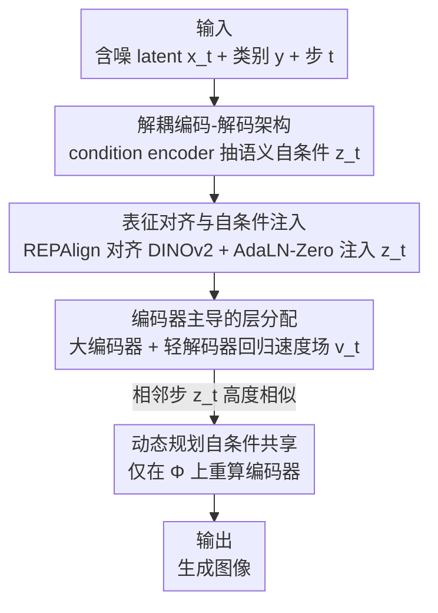

# DDT: Decoupled Diffusion Transformer

**会议**: CVPR 2026  
**论文**: [CVF Open Access](https://openaccess.thecvf.com/content/CVPR2026/html/Wang_DDT_Decoupled_Diffusion_Transformer_CVPR_2026_paper.html)  
**代码**: https://github.com/MCG-NJU/DDT  
**领域**: 扩散模型 / 图像生成  
**关键词**: 扩散 Transformer, 编码器-解码器解耦, 表征对齐, 自条件共享, 动态规划加速  

## 一句话总结
DDT 把传统"只有解码器"的扩散 Transformer 拆成一个专职提语义的 condition encoder 和一个专职回归速度场的 velocity decoder，解开了"语义编码"与"高频解码"的优化矛盾，在 ImageNet 256×256 上仅用 256 epoch 就拿到 1.31 FID（比 REPA 快约 4×），并顺带利用相邻步自条件的高度相似性做动态规划共享，把推理再提速近 3×。

## 研究背景与动机
**领域现状**：扩散 Transformer（DiT、SiT）已经把 Transformer 架构搬进扩散模型、取代了 UNet，在足够长的训练后能稳定超过卷积方案，并成为文生图、文生视频的主流骨干。但它们普遍**收敛慢**——动辄要训 800～1400 epoch，开发新模型成本极高。

**现有痛点**：当前的扩散 Transformer 是 decoder-only 的同构堆叠：每个去噪步都用**完全相同的模块**先把含噪输入编码成低频语义、再解码出高频细节。作者通过频谱视角观察到反向 SDE 生成是"从低频到高频"的自回归式细化（Fig. 3），而且大部分计算耗在 $t=0.4$ 到 $t=1.0$ 的高频细节生成上。

**核心矛盾**：在同一组参数里，"编码低频语义"和"解码高频细节"是**互相拉扯**的——编码语义时不可避免地会衰减高频信息，于是两个目标在同一模块里抢容量，形成优化困境。作者进一步用 SiT-XL/2 做时间步重分配实验（Fig. 4）：把更多计算分配到噪声更大的早期步会显著提升 FID，说明**模型的瓶颈在低频语义编码能力**，而非高频解码。

**本文目标**：在不增加推理负担的前提下，既加速收敛、又提升采样质量，回答"解耦的编码器-解码器 Transformer 能否解锁扩散模型的加速收敛与质量提升"。

**切入角度**：经典视觉算法（检测、分割）惯用"大编码器抽特征 + 轻解码器出结果"的非对称设计，而现代扩散模型却退回到 decoder-only 同构结构。作者认为这块被严重低估。

**核心 idea**：用一个**专职 condition encoder**把低频语义显式抽成"自条件"，再喂给一个**专职 velocity decoder**回归高频速度场，从架构上把两件互相打架的事拆开。

## 方法详解

### 整体框架
DDT 在标准 linear flow matching（流匹配）框架下训练，把单一去噪网络拆成两段串行模块。给定含噪 latent $x_t$、时间步 $t$、类别 $y$：condition encoder 先抽出语义自条件 $z_t$；velocity decoder 再吃 $x_t$、$t$、$z_t$ 回归出速度场 $v_t$。编码器一侧用 REPAlign（对齐预训练视觉特征 DINOv2）做直接监督、并间接接收解码器流匹配损失的回传；解码器一侧用 AdaLN-Zero 把 $z_t$ 注入。由于 $z_t$ 在相邻时间步高度相似，推理时可只在挑选出的时间步集合 $\Phi$ 上重算编码器、其余步复用，从而进一步加速。

### 关键设计

**1. 解耦的编码器-解码器架构：把"抽语义"和"出细节"分到两个专职模块**

这是 DDT 的根。针对前面"同一组参数里语义编码与高频解码互相拉扯"的矛盾，DDT 不再让每个去噪步都用同构模块包办两件事，而是显式拆成两段。condition encoder 沿用 DiT/SiT 的微设计（交替的 Attention 与 FFN 块、无长残差），把 patch 化后的含噪 token 编码成自条件特征：$z_t = \text{Encoder}(x_t, t, y)$，其中 $t$、$y$ 通过 AdaLN-Zero 逐块注入。velocity decoder 结构相同，但它**不再吃类别**（作者假设类别信息已经融进 $z_t$），只用 $t$ 和 $z_t$ 作条件来回归速度场：$v_t = \text{Decoder}(x_t, t, z_t)$，并用流匹配损失训练：

$$\mathcal{L}_{dec} = \mathbb{E}\!\left[\int_0^1 \left\| (x_{data} - \epsilon) - v_t \right\|^2 \mathrm{d}t\right]$$

这样语义编码有了专属容量、不再被高频解码挤占，编码器还能间接从解码器的流匹配损失里拿到监督，整体收敛大幅加速。

**2. 表征对齐 + 自条件注入：让 $z_t$ 在相邻时间步保持局部一致**

光把模块拆开还不够——要让自条件既"有语义"又"在相邻步稳定"（后者是后续共享加速的前提）。DDT 借用 REPA 的表征对齐：取编码器第 $i$ 层中间特征 $h_i$，用可学习投影 MLP $h_\phi$ 投影后与 DINOv2 表征 $r_*$ 做余弦对齐：

$$\mathcal{L}_{enc} = 1 - \cos\!\left(r_*,\, h_\phi(h_i)\right)$$

这条正则一方面把外部视觉先验灌进编码器、加速收敛（与 REPA 一致），另一方面强制 $z_t$ 在相邻去噪步之间高度相关。解码器端则用 AdaLN-Zero 把 $z_t$ 注入特征，进一步增强这种一致性。作者实测 $z_{t=0}$ 与 $z_{t=1}$ 的自条件余弦相似度都能高于 0.8（Fig. 5），这正是设计 4 能成立的基础。

**3. 编码器主导的非对称层分配：编码器越大，模型越大时收益越明显**

既然瓶颈在低频语义编码，那就该把参数往编码器堆。DDT 在固定总层数下系统扫了 $2{:}1$ 到 $5{:}1$ 的编码器/解码器层数比，用 $m\text{En}n\text{De}$ 记 $m$ 层编码器、$n$ 层解码器。结论是：模型越大，越偏好"激进"的编码器主导比例——Base 模型最优是 8En4De，而 Large 模型竟然偏好 20En4De 这种极端配比（Fig. 7、Fig. 8）。这一"反直觉"的发现促使作者把 XL 模型推到 22En6De 去探上限。它说明扩散 Transformer 的容量该优先喂给语义编码，而非高频解码——后者其实不需要那么多层，甚至用朴素 Conv 块也能拿到接近的结果（见消融）。

**4. 统计动态规划的自条件共享：把相邻步的编码器算力省下来**

设计 2 保证了 $z_t$ 相邻步高度冗余，这里把它兑现成推理加速。给定总步数 $N$ 和编码器算力预算 $K$，定义需要**重算**自条件的时间步集合 $\Phi$（$|\Phi|=K$，共享比例 $1-\frac{K}{N}$）：若当前步 $t \notin \Phi$ 就直接复用上一次的 $z_{t-\Delta t}$，否则才重新跑编码器。朴素做法是像 DeepCache 那样每 $\frac{N}{K}$ 步均匀重算一次（Uniform）；但作者指出 UNet 缺乏表征对齐、局部一致性更差，而 DDT 有更规整的一致性，可以做得更好。于是把"选哪些步重算"形式化成**最小和路径问题**：先用余弦距离构造自条件相似度矩阵 $S \in \mathbb{R}^{N\times N}$，让总相似代价 $-\sum_k \sum_{i} S[\Phi_k, i]$ 全局最小，用动态规划求解，状态转移为

$$\mathbf{C}_i^k = \min_{j=0}^{i}\left\{\mathbf{C}_j^{k-1} - \Sigma_{l=j}^{i}\, \mathbf{S}[j, l]\right\}$$

记录路径 $\mathbf{P}$ 后回溯即得最优 $\Phi$，求解开销只在秒级。相比均匀共享，这套统计动态规划（StatisticDP）能在同样加速比下拿到更小的 FID 损失。

### 损失函数 / 训练策略
总目标是编码器表征对齐损失 $\mathcal{L}_{enc}$ 与解码器流匹配损失 $\mathcal{L}_{dec}$ 的组合。训练用 Adam、常数学习率 0.0001、batch size 256，不用梯度裁剪和 warmup；VAE 用现成的 SD-VAE-f8d4-ft-EMA（下采样因子 8）。采样默认 Euler solver 250 步。基线本身还叠了 SwiGLU、RoPE、RMSNorm、lognorm sampling 等"improved baseline"技巧以保证对比公平。

## 实验关键数据

### 主实验
ImageNet 256×256 类条件生成，DDT-XL/2 在仅 256 epoch 下刷新 SoTA，且训练效率约为 REPA 的 4×。

| 模型 | 参数 | Epochs | FID↓ (w/ CFG) | IS↑ | 说明 |
|------|------|--------|---------------|-----|------|
| SiT-XL/2 | 675M | 1400 | 2.06 | 270.3 | decoder-only 基线 |
| REPA-XL/2 | 675M | 800 | 1.42 | 305.7 | 加表征对齐 |
| **DDT-XL/2** | 675M | 80 | 1.52 | 263.7 | 仅 80 epoch 即近 SoTA |
| **DDT-XL/2** | 675M | 256 | **1.31** | 308.1 | 新 SoTA，约 4× 加速 |
| **DDT-XL/2** | 675M | 400 | **1.26** | 310.6 | 逼近 VAE 上限 1.20 rFID |

512×512（从 256 模型微调）也拿到 1.28 FID，比 REPA 的 2.08 大幅领先（中间报告 1.90，进一步训练到 500K 步达 1.28）。

### 消融实验
400K 步、无 CFG 下不同编码器/解码器配比与解码器块类型的影响（DDT-B/2，8En4De）：

| 配置 | FID↓ | sFID↓ | IS↑ | 说明 |
|------|------|-------|-----|------|
| Improved-REPA-B/2 | 19.1 | 6.88 | 76.5 | 同尺寸 decoder-only 最强基线 |
| DDT-B/2 (8En4De) Attn+MLP | **16.32** | 6.63 | 86.0 | 默认配置，最佳 |
| DDT-B/2 (8En4De) Conv+MLP | 16.96 | 7.33 | 85.1 | 解码器换朴素 Conv 仍接近 |
| DDT-B/2 (8En4De) MLP+MLP | 24.13 | 7.89 | 65.0 | 纯 MLP 解码器明显变差 |

自条件共享加速（DDT-XL/2，w/ CFG，StatisticDP vs Uniform）：

| 共享比例 | 加速 | 策略 | FID↓ |
|----------|------|------|------|
| 0.00 | 1.0× | — | 1.31 |
| 0.50 | 1.6× | Uniform | 1.31 |
| 0.80 | 2.6× | Uniform / StatisticDP | 1.36 / **1.33** |
| 0.87 | 3.0× | Uniform / StatisticDP | 1.42 / **1.40** |

### 关键发现
- **编码器主导比例随规模越发激进**：Base 偏好 8En4De，Large 偏好 20En4De，XL 推到 22En6De——把容量喂给语义编码比喂给高频解码更划算，这是最反直觉也最有指导意义的发现。
- **解码器其实"不挑食"**：得益于解耦设计，解码器换成朴素 Conv 块（16.96 FID）仍接近默认 Attn+MLP（16.32），印证高频解码并非瓶颈。
- **共享加速近乎免费**：相邻步 $z_t$ 相似度 >0.8，共享比例 ≤0.83（约 2.7×）时 FID 几乎不掉，StatisticDP 在每个加速档都比均匀共享掉点更少。
- **额外开销极小**：DDT-XL/2 相比基线训练显存 +1.2G、单步训练 +0.01s，推理几乎持平。

## 亮点与洞察
- **用频谱视角把"收敛慢"诊断成"语义编码容量不足"**：先用时间步重分配实验（多给噪声大的步算力→FID 更好）锁定瓶颈在低频编码，再对症下架构药，诊断与解法逻辑闭环，很有说服力。
- **一个设计带出两份红利**：表征对齐既加速收敛，又顺手让相邻步自条件高度一致，从而解锁了"共享编码器"这条免费的推理加速路；架构解耦不是孤立改动，而是把训练加速和推理加速串成一条线。
- **把缓存复用从启发式升级成最优化**：以往 DeepCache 类方法靠手工均匀缓存，DDT 把"选哪些步重算"建模成最小和路径并用 DP 秒级求最优，思路可迁移到任何"相邻步特征冗余"的扩散加速场景。
- **"大编码器小解码器"这条非对称设计经验**可直接借鉴到其他生成式 Transformer 的参数分配。

## 局限与展望
- **任务范围有限**：实验只在 ImageNet 类条件生成（256/512），尚未验证文生图/文生视频这类更复杂条件下解耦架构是否同样吃香。⚠️ 作者也提到 512 上部分指标有轻微退化，归因于微调步数不足。
- **配比靠扫出来**：最优编码器/解码器层数比是经验扫描得到（且随规模变化大），缺乏可预测的理论指导，换数据集/模型规模可能要重扫。
- **自条件共享的预算选择**：共享比例 vs 质量的折中需要人工设档，虽然 DP 给出最优 $\Phi$，但 $K$ 本身仍是超参。
- **改进方向**：把解耦思想推广到文本条件扩散、或让编码器/解码器配比随训练自适应，都是自然延伸。

## 相关工作与启发
- **vs REPA**：REPA 在 decoder-only 结构上加表征对齐来增强低频编码，但模型一大就接近性能饱和；DDT 把编码和解码彻底拆开、并复用了 REPA 的对齐损失，在 XL 规模上仍持续领先（1.31 vs 1.42 FID），且收敛快约 4×。
- **vs DiT / SiT**：二者是同构 decoder-only 扩散 Transformer，DDT 指出其"语义编码 vs 高频解码"的内在优化困境，并用非对称编码器-解码器解决，本质区别在架构而非训练技巧。
- **vs DeepCache（UNet 缓存复用）**：DeepCache 用手工均匀缓存加速 UNet，但 UNet 缺表征对齐、相邻步一致性差；DDT 既有更强一致性、又用统计动态规划求最优共享策略，加速更稳、掉点更少。
- **vs MAR**：MAR 靠掩码骨干产出的语义特征克服轻量解码头的容量不足，与 DDT "把语义编码独立出来"的动机相通，但 DDT 走的是纯连续扩散的编码器-解码器解耦路线。

## 评分
- 新颖性: ⭐⭐⭐⭐⭐ 从频谱诊断到编码器-解码器解耦再到 DP 共享，一条清晰且少有人走的设计主线。
- 实验充分度: ⭐⭐⭐⭐⭐ 多尺寸系统对比 + 配比/块类型/共享策略消融 + 256/512 双分辨率 SoTA。
- 写作质量: ⭐⭐⭐⭐ 诊断—设计—验证逻辑顺，公式清楚；个别表述（如 DP 状态转移式）略需对照原文。
- 价值: ⭐⭐⭐⭐⭐ 4× 训练加速 + 近 3× 推理加速 + 新 SoTA，且"大编码器小解码器"的经验对后续模型设计有普适指导。

<!-- RELATED:START -->

## 相关论文

- [\[CVPR 2026\] DeCo: Frequency-Decoupled Pixel Diffusion for End-to-End Image Generation](deco_frequency-decoupled_pixel_diffusion_for_end-to-end_image_generation.md)
- [\[CVPR 2026\] Guiding a Diffusion Transformer with the Internal Dynamics of Itself](guiding_a_diffusion_transformer_with_the_internal_dynamics_of_itself.md)
- [\[CVPR 2026\] DiT-IC: Aligned Diffusion Transformer for Efficient Image Compression](ditic_aligned_diffusion_transformer_for_efficient.md)
- [\[CVPR 2026\] GeoRK2: Geometry-Guided Runge-Kutta Integration for Diffusion Transformer Acceleration](geork2_geometry-guided_runge-kutta_integration_for_diffusion_transformer_acceler.md)
- [\[CVPR 2026\] Decoupled Residual Denoising Diffusion Models for Unified and Data Efficient Image-to-Image Translation](decoupled_residual_denoising_diffusion_models_for_unified_and_data_efficient_ima.md)

<!-- RELATED:END -->
