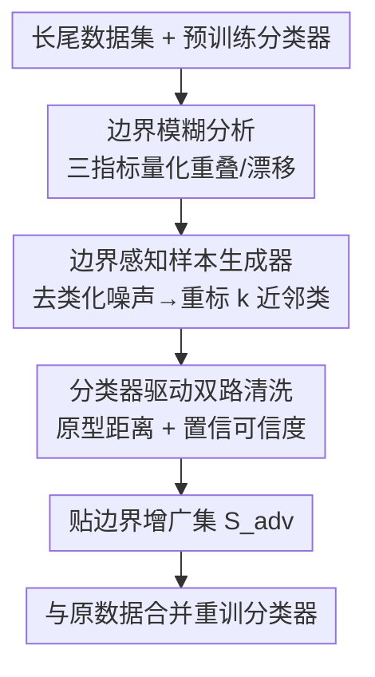

# Decision Boundary-aware Generation for Long-tailed Learning

**会议**: CVPR 2026  
**arXiv**: [2605.01468](https://arxiv.org/abs/2605.01468)  
**代码**: https://github.com/keepdigitalabc-svg/DBG (有)  
**领域**: 长尾学习 / 生成式数据增广 / 扩散模型  
**关键词**: 长尾识别, 决策边界, 扩散生成增广, 对抗样本, 数据清洗

## 一句话总结
针对"用扩散模型 + 头→尾特征迁移补长尾数据"会暗中把头类特征泄漏到尾类、模糊决策边界的问题，本文先用三个指标把这种"边界模糊"量化出来，再提出 DBG：用对抗去类化噪声把样本推到决策边界附近、重标成 $k$ 个最易混淆类，并用分类器驱动的双路清洗丢掉有害样本，在 CIFAR-LT 上对所有生成式 baseline 都能降低类间重叠、提升尾类与整体精度。

## 研究背景与动机
**领域现状**：长尾数据让分类器的决策边界偏向头类、压缩尾类，尾类精度差。近年主流做法是用扩散模型做生成式增广来补尾类样本，并进一步引入**头→尾特征迁移（head-to-tail transfer）**——借用数据丰富的头类特征去合成尾类样本，缓解生成器从长尾数据里继承的"偏向头类"偏置，让决策空间更均匀。

**现有痛点**：这些方法只盯着"让决策空间更均匀"，却几乎不分析头→尾迁移带来的副作用。本文指出：头→尾迁移在均衡决策空间的同时，会引入一种**潜在、不受控的非局部特征泄漏**——头类特征混进尾类样本，使类间分布相互纠缠，造成**类间重叠（inter-class overlap）**和**尾类分布漂移（tail drift）**。结果是一个"更均匀但高度重叠"的决策空间，尾类学习的收益被抵消。作者把这个问题命名为**边界模糊（boundary ambiguity）**。

**核心矛盾**：均匀（uniformity）和可分（separability）被混为一谈。头→尾迁移只优化了类间分布的均衡，却牺牲了类间可分性；而真正决定分类难度的是后者。没有一个平衡参照，泄漏出去的特征很难再解耦回来。

**本文目标**：(1) 把"边界模糊"这个此前只是定性观察的现象**变成可测量的量**；(2) 设计一种生成方案，主动去补**边界附近**的有效样本，把被泄漏特征糊掉的决策边界重新"修锐"。

**切入角度**：与其用头类特征"涂抹"尾类（迁移），不如换个角度——既然问题出在边界，就**直接在边界附近造样本**。作者借鉴对抗攻击：对抗噪声能在保持视觉语义的前提下把样本推过决策边界，正好可以生成"贴着边界"的信息量样本。

**核心 idea**：用对抗式的"去类化 + 重标向最近邻类"生成贴边界样本，再用分类器把生成出来的有害样本清洗掉，从而在补数据的同时把决策空间修得"既均匀又可分"。

## 方法详解

### 整体框架
DBG 的输入是长尾数据集和一个在其上训练好的分类器，输出是一份"贴边界"的增广样本集 $S_{adv}$，作为即插即用的辅助训练集与原数据合并 $\mathcal{D}_{\mathrm{aug}}=\mathcal{D}\cup\{(x,\tilde{y}):x\in S_{adv}\}$ 重训分类器。整条管线分三步：先用**边界模糊分析**这套三指标诊断头→尾迁移到底坏在哪（这是动机也是度量工具），再用**边界感知样本生成器**造贴边界样本，最后用**分类器驱动双路清洗**把其中有害的样本筛掉。前者诊断、后两者是 DBG 本体的两大组件。

### 关键设计

**1. 边界模糊的三指标量化：把"决策边界被糊掉"变成可测的数**

痛点是此前大家只能定性说"头→尾迁移让边界变模糊"，无法证明也无法对比。作者设计三个互补指标，专测决策空间的均匀性与可分性。**类间重叠度（inter-class overlap degree）**：把测试特征 $L_2$ 归一化投到单位超球 $y=z/\|z\|_2$，对每个类拟合 von Mises–Fisher 密度 $p_c(y)=C_d(\kappa_c)\exp(\kappa_c\mu_c^\top y)$，再用 Bhattacharyya 系数 $\widehat{\mathrm{BC}}(c,c')=\log(\frac{1}{m}\sum_i\sqrt{p_c(y)p_{c'}(y)})$ 测两类分布的重叠，BC 越低越可分。**离群样本率（outlier rate）**：对每个测试样本算类内最近邻距离 $d_i^{(c)}$，标准化后超过阈值 $\lambda$ 的标为离群 $o_i^{(c)}=\mathbb{I}[s_i^{(c)}>\lambda]$，类离群率 $\eta_c=\frac{1}{n_c}\sum_i o_i^{(c)}$ 反映类内分布漂移。**生成置信度（generation confidence）**：用一个改造的 CFG 引导 $\hat{\varepsilon}_{tm}=(1-s)\varepsilon_\theta(x_t,y_t,t)+s\,\varepsilon_\theta(x_t,y_d,t)$，把目标类 $y_t$ 和干扰类 $y_d$ 混着生成，再喂给均衡分类器看置信度 $Conf=\ell_{y_t}(x_g)$ 与可信度 $Cred=p_{(1)}-p_{(d)}$，二者越低说明特征纠缠越重。实验证实：引入头→尾迁移后类间重叠回升、离群率升高（尾类尤甚）、生成置信度下降——三条证据共同坐实"头→尾迁移是把双刃剑"。

**2. 边界感知样本生成器：先去类化把样本推到边界，再重标向最近邻类**

既然要补的是边界附近的信息，生成器就分两阶段做。**条件加噪（conditional noising）**：先用随机噪声把样本打到中间时间步 $x_m=\sqrt{\bar\alpha_m}x_0+\sqrt{1-\bar\alpha_m}\hat\epsilon_r$（$m=T/2$，便于改深层类特征），再在**源标签 $y_{sl}$** 引导下迭代 $K=T/10$ 步预测并抑制该类的类特有噪声 $\hat\varepsilon_c=\varepsilon_\theta(x_t,y_{sl},t)$——这一步在"擦掉类特有特征、把样本拉向边界"和"别漂离源流形太远"之间卡了个有限步数。**条件去噪（conditional denoising）**：用标准 CFG 反向去噪 $x_{t-1}=\sqrt{\bar\alpha_{t-1}}\hat{x}_0+\sqrt{1-\bar\alpha_{t-1}}\hat\varepsilon_t(x_t,t,\tilde{y})$，但**重标的目标 $\tilde{y}$ 取自与 $x_0$ 真值最易混淆的 $k$ 个类**：$\tilde{y}=\arg\max_{c\in\mathcal{C}_k(x_0)}f(x_0)$，$\mathcal{C}_k(x_0)=\mathrm{TopK}(f(x_0),k)$，$k=\lfloor C/w\rfloor$（$C$ 为总类数，$w$ 为稳定权重）。这样生成的样本既贴着边界又不发生大的语义跳变，把"最该被补强"的混淆边界喂给分类器；相比头→尾迁移粗暴地拿头类特征涂尾类，这里是有目标地补**边界**而非补**类中心**。

**3. 分类器驱动双路清洗：丢掉生成器制造的"有害硬样本"**

痛点是生成器从长尾数据继承了偏置、且生成器与分类器特征空间不对齐，会造出一批带坏类特征的对抗样本——这些硬样本非但给不了准确的边界监督，反而会进一步破坏边界。清洗用两条**并行**分支。**原型距离过滤（prototype-distance）**：先用 logit adjustment loss 在源长尾数据上训好分类器 $f_\theta$，对每类算归一化原型 $\mu_k=\frac{1}{N_k}\sum \tilde{z}(x_i)$，再算每个生成样本到目标类原型的余弦距离 $d_c(\hat{x}_0)=1-\langle \tilde{z}(\hat{x}_0),\mu_k\rangle$，落在类自适应接受区间 $[(1-l)d_c^l,(1+h)d_c^h]$ 之外的（极端离群样本、离边界过远的样本）丢掉。**置信–可信度过滤（confidence-credibility）**：按 Eq.7 算分类器对样本的置信与可信度（干扰类取第二高预测类），用按类样本数定的类阈值 $a$，**只有当样本被高置信高可信地误分到既非原类也非目标类时才删**——这条规则刻意对长尾偏置不敏感，避免把本就稀少的尾类样本误删。两路清洗后剩下的 $S_{adv}$ 才作为即插即用辅助集去修边界

### 损失函数 / 训练策略
DBG 不改分类器的损失，是即插即用的数据层方案：清洗后的 $S_{adv}$ 与原长尾数据合并后用常规流程重训分类器。超参 $w=3$、$l=0.02$、$h=0.05$（CIFAR），置信阈值 $a$ 从 0.9 线性退火到 0.5，离群阈值 $\lambda$ 在 $[2.5,3.0]$ 上取 5 个值求均值。分类器骨干用 ResNet-32（200 epoch，batch 128，初始 lr 0.1，160/180 epoch 各 ×0.1）与 ViT-B/16（100 epoch，batch 32，lr $1\times10^{-4}$，weight decay 0.01）。

## 实验关键数据

### 主实验
DBG 作为即插即用辅助集叠加到四个生成式 baseline（CBDM-based、CBDM、OCLT、DiffuLT）上，CIFAR100-LT / CIFAR10-LT、两种骨干、三档不平衡比（10/100/200），报 Head/Med/Tail/All Top-1 精度。下表取 ResNet-32 在 CIFAR100-LT、不平衡比 100 的代表性结果（%）：

| Baseline | Head | Med | Tail | All | +DBG All |
|----------|------|-----|------|-----|----------|
| CBDM-based | 66.30 | 52.85 | 25.93 | 48.81 | **50.37** |
| CBDM | 69.10 | 53.75 | 28.60 | 50.81 | **51.21** |
| OCLT | 68.70 | 52.38 | 25.73 | 49.28 | **50.25** |
| DiffuLT | 68.10 | 51.20 | 29.37 | 49.72 | **51.07** |

整体提升以"全数据集平均（AVG 列）"衡量更稳：ResNet-32/CIFAR100-LT 上 CBDM-based +DBG 平均 ↑1.57、DiffuLT ↑0.60；ViT-B/16 上增益更明显，CBDM-based +DBG 在 CIFAR100-LT ↑1.93、DiffuLT ↑2.00。提升主要落在尾类（如 CBDM-based 尾类 25.93→26.72，DiffuLT 在 ratio-200 尾类 19.13→19.43），印证"贴边界样本主要补强尾类可分性"。

| 骨干 / 数据集 | CBDM-based+DBG | DiffuLT+DBG |
|---------------|----------------|-------------|
| ResNet-32 / CIFAR100-LT (AVG) | ↑1.57 | ↑0.60 |
| ResNet-32 / CIFAR10-LT (AVG) | ↑0.65 | ↑0.30 |
| ViT-B/16 / CIFAR100-LT (AVG) | ↑1.93 | ↑2.00 |
| ViT-B/16 / CIFAR10-LT (AVG) | ↑1.61 | ↑1.51 |

唯一负向是 ResNet-32 + CBDM 在 CIFAR10-LT 上 AVG ↓0.13——作者解释为 CBDM 自带很强的尾偏置损失，已把尾类压得很好，DBG 的边界增益空间被挤掉，但整体决策空间仍更优。⚠️ 横向比较时注意不同骨干/不平衡比难度不同，AVG 是跨三档平均、不能与单档 All 直接比大小。

### 消融实验
CIFAR100-LT、不平衡比 100、ResNet-32，从零重训分类器，逐个去掉生成（Gen.）/原型距离过滤（PD.）/置信可信度过滤（CC.）：

| 配置 | Head | Med | Tail | All | 说明 |
|------|------|-----|------|-----|------|
| 标准训练（无增广） | 64.1 | 35.6 | 8.6 | 36.1 | 长尾基线 |
| CBDM-based | 66.3 | 52.8 | 25.9 | 48.8 | 生成 baseline |
| Gen. only | 66.4 | 50.5 | 23.2 | 47.0 | 只生成不清洗，反而掉点 |
| Gen.+PD. | 69.2 | 52.7 | 27.6 | 50.1 | 加原型距离过滤 |
| Gen.+CC. | 68.4 | 48.9 | 23.5 | 47.1 | 只加置信可信度过滤 |
| Full (Gen.+PD.+CC.) | **70.1** | **53.4** | **26.7** | **50.4** | 完整 DBG |

### 关键发现
- **清洗是必需而非锦上添花**：只生成不清洗（Gen. only）All 仅 47.0，比 CBDM-based 的 48.8 还低——没清洗的对抗样本确实会进一步破坏边界。两路过滤都加上才到 50.4。
- **原型距离过滤贡献最大**：Gen.+PD. 单独就到 50.1，而 Gen.+CC. 只到 47.1，去掉 PD. 掉点最猛，说明"丢离群/离边界太远的样本"是清洗的主力。
- **超参不敏感**：$h$、$l$ 在小范围变动（表 6）对整体精度影响极小（Overall 在 49.3–50.4 间），作者称已取到最优值，方法鲁棒。
- **定量验证边界质量**：注入 DBG 数据后，三指标里的类间重叠度、离群率在各 baseline 上普遍下降，t-SNE 也显示类间距增大、类内更紧凑，直接证明"边界被修锐"。

## 亮点与洞察
- **把模糊概念做成可测指标，再用指标驱动方法设计**：三指标（vMF+BC 重叠度、最近邻离群率、改造 CFG 的生成置信度）既是诊断工具也是验收标准，"先证明问题存在、再针对性解决"的科研闭环很完整，这套度量本身可复用到任何生成式长尾工作上做体检。
- **对抗攻击换个用途**：对抗噪声通常用来攻击/评测鲁棒性，这里反过来当"把样本精准推到决策边界"的工具——重标向 TopK 最易混淆类，等于专挑分类器最纠结的边界去补料，比头→尾迁移盲目涂抹头类特征更有的放矢。
- **"生成 + 清洗"的解耦思路可迁移**：生成器只管造、清洗器只管筛，且清洗器刻意设计成对长尾偏置不敏感（按类样本数定阈值、只删高置信误分到第三方类的样本）。这种"宽松生成、保守清洗、且清洗不二次引入偏置"的范式，对任何"生成数据质量参差"的增广任务都有借鉴价值。

## 局限与展望
- 作者承认：扩散模型自身继承的长尾偏置仍会削弱 DBG 生成样本的有效性——源头偏置没根治，DBG 是在下游补救。
- 实验只在 CIFAR10/100-LT 两个小数据集上验证，没有 ImageNet-LT、iNaturalist 等大规模长尾基准，泛化性证据偏弱；增益幅度整体偏小（多数 AVG 提升 <1%，且 CBDM 上偶有负向）。
- 引入了 $w/l/h/a/\lambda$ 多个超参，虽称对 $h,l$ 不敏感，但每类自适应接受区间、置信阈值退火等仍需调，且生成 + 清洗 + 重训的多阶段流程计算开销不低。
- 展望：作者拟研究自适应清洗与基于微调的方法适配，进一步修复长尾决策边界。可补的方向还有把"边界模糊三指标"做成训练时的可微正则，而非只做事后增广。

## 相关工作与启发
- **vs 头→尾迁移类方法（DiffuLT / Shao et al.）**: 它们借头类特征合成尾类、追求"均匀决策空间"，本文证明这会引入非局部特征泄漏、反而升高类间重叠；DBG 不做迁移，而是对抗式贴边界生成 + 清洗，追求"既均匀又可分"。DBG 还能叠加在这些方法之上做增益。
- **vs 对抗样本做长尾增广（Liu et al.）**: 已有工作用"向头类样本做对抗攻击"重构尾样本，本文则用对抗去类化把样本推到边界并重标向 $k$ 近邻混淆类，目标是补边界知识而非单纯重构尾样本，且额外加了双路清洗防止有害对抗样本反噬。
- **vs 纯扩散生成（CBDM）**: CBDM 用长尾数据训扩散补缺失样本，DBG 在其生成数据之外**再叠加**一份贴边界辅助集，是即插即用的正交增强，实验里对 CBDM、OCLT、DiffuLT 全部 baseline 都有效。

## 评分
- 新颖性: ⭐⭐⭐⭐ 把"边界模糊"做成可测指标并用对抗去类化补边界，视角新颖、问题诊断扎实。
- 实验充分度: ⭐⭐⭐ 覆盖两骨干/四 baseline/三不平衡比且有消融与定量边界分析，但只在 CIFAR-LT 上、增益普遍偏小、缺大规模基准。
- 写作质量: ⭐⭐⭐ 动机与度量讲得清楚，但缩写（DBG/GBT/DGB）和命名（"Generative Boundary-aware"）有多处笔误，公式排版略乱。
- 价值: ⭐⭐⭐⭐ 三指标度量工具 + "生成—清洗"解耦范式对生成式长尾增广有普适借鉴意义。

<!-- RELATED:START -->

## 相关论文

- [\[NeurIPS 2025\] CORAL: Disentangling Latent Representations in Long-Tailed Diffusion](../../NeurIPS2025/image_generation/coral_disentangling_latent_representations_in_longtailed_dif.md)
- [\[CVPR 2026\] Verify Claimed Text-to-Image Models via Boundary-Aware Prompt Optimization](verify_claimed_text-to-image_models_via_boundary-aware_prompt_optimization.md)
- [\[CVPR 2026\] Attention, May I Have Your Decision? Localizing Generative Choices in Diffusion Models](attention_may_i_have_your_decision_localizing_generative_choices_in_diffusion_mo.md)
- [\[CVPR 2026\] FabricGen: Microstructure-Aware Woven Fabric Generation](fabricgen_microstructure-aware_woven_fabric_generation.md)
- [\[CVPR 2026\] Frequency-Aware Flow Matching for High-Quality Image Generation](freqflow_frequency_aware_flow_matching.md)

<!-- RELATED:END -->
