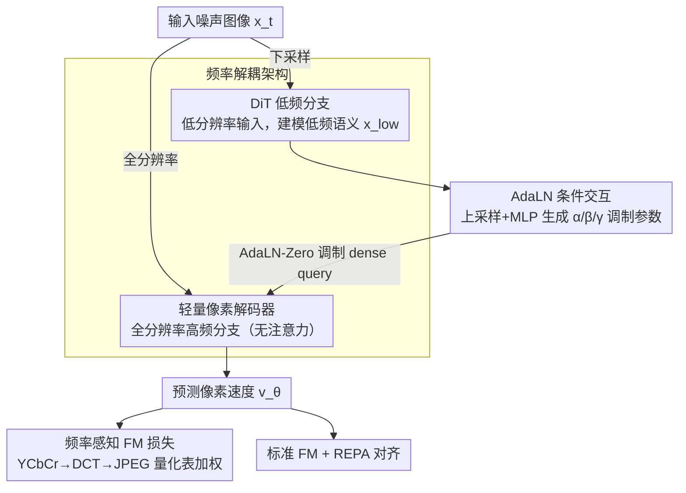

# DeCo: Frequency-Decoupled Pixel Diffusion for End-to-End Image Generation

**会议**: CVPR 2026  
**arXiv**: [2511.19365](https://arxiv.org/abs/2511.19365)  
**代码**: [https://github.com/Zehong-Ma/DeCo](https://github.com/Zehong-Ma/DeCo)  
**领域**: 图像生成  
**关键词**: 像素扩散, 频率解耦, 端到端生成, 扩散Transformer, 频率感知损失

## 一句话总结
DeCo 提出频率解耦的像素扩散框架，用轻量像素解码器处理高频细节并让DiT专注低频语义建模，配合频率感知flow matching损失，在ImageNet上达到FID 1.62（256）和2.22（512），缩小了像素扩散与潜空间扩散的差距。

## 研究背景与动机
1. **领域现状**：潜空间扩散（LDM）是主流范式，但依赖VAE的两阶段流程引入有损重建和分布偏移。像素扩散直接在像素空间端到端建模，避免VAE限制但训练和推理效率低。
2. **现有痛点**：现有像素扩散模型用单个DiT同时建模高频信号和低频语义，高频噪声难以学习且干扰低频语义学习，导致训练缓慢和生成质量不佳。
3. **核心矛盾**：DiT擅长捕捉低频语义但不善处理高频信号，而像素空间同时包含两者。
4. **本文目标**：设计更高效的像素扩散范式，解耦高低频的建模任务。
5. **切入角度**：受"高频信号在高分辨率输入上更容易重建、低频语义在低分辨率上更容易建模"的启发。
6. **核心idea**：DiT处理下采样输入专注低频语义，轻量像素解码器在全分辨率上以DiT输出为条件生成高频细节。

## 方法详解

### 整体框架
DeCo 想让像素扩散摆脱"一个 DiT 同时啃高频和低频"的负担：高频噪声本来就难学，还会拖累低频语义。它的做法是把一张图分两条路走——先把输入下采样，交给 DiT 在低分辨率上专心建模低频语义 $x_{\text{low}} = \text{DiT}(\bar{x}_t, t, y)$；再把这份语义当条件，让一个轻量像素解码器在全分辨率上补回高频细节，预测像素速度 $v_\theta(x_t, t, y) = \text{Dec}(x_t, t, x_{\text{low}})$。整套流程端到端训练，损失由标准 FM、频率感知 FM 和 REPA 对齐三项相加。

### 关键设计

**1. 频率解耦架构：让擅长低频的 DiT 别再硬学高频**

像素空间里高频和低频混在一起，而 DiT 天生擅长低频语义、不擅长高频信号，逼它同时干两件事就是前面说的训练慢、质量差的根源。DeCo 按分辨率把任务拆开：DiT 只看下采样后的输入，专注低频；高频则交给一个无注意力的轻量像素解码器，它由 $N$ 个线性块加一个投影层组成，直接在全分辨率的噪声图像上操作，以 DiT 的输出为条件补细节。这里的关键是多尺度输入——解码器拿到的是高分辨率图，天然适合处理高频；DiT 拿到的是低分辨率图，正好对应它擅长的低频。作者用 DCT 能量分析验证了这个分工确实发生了：DeCo 中 DiT 输出的高频能量明显低于 baseline，说明高频成分被成功转移到了像素解码器里。

**2. AdaLN 条件交互：把低频语义稳稳地注进解码器**

解码器要补高频，但补什么得听 DiT 的低频语义指挥，于是怎么把语义注入解码器就成了关键。DeCo 先把 DiT 输出上采样到全分辨率，再过一个 MLP 生成调制参数 $\alpha, \beta, \gamma$，用 AdaLN-Zero 的方式去调制解码器里的 dense query：

$$h_N = h_{N-1} + \alpha \cdot \text{MLP}((1+\gamma) \cdot h_{N-1} + \beta)$$

相比 UNet 那种"上采样后直接相加"的注入方式，AdaLN 的乘加调制更灵活、信号更可控，消融实验里它明显胜出。

**3. 频率感知 FM 损失：按人眼敏感度给频率分配权重**

标准 FM 损失对所有频率一视同仁，但人眼对不同频率的敏感度差很多——把训练预算平摊在那些视觉上无关紧要的高频上是种浪费。DeCo 借了一个现成的先验：JPEG 量化表本身就编码了"哪些频率视觉上重要"。具体做法是把预测速度和真值速度都转到 YCbCr 色彩空间，做 $8\times8$ DCT 变到频率域，再用 JPEG 量化表的归一化倒数当自适应权重——量化区间越小的频率越重要，权重越高。加权后在频率域算 MSE：

$$\mathcal{L}_{\text{FreqFM}} = \mathbb{E}[w\|\mathbb{V}_\theta - \mathbb{V}_t\|^2]$$

这样训练就会自动把力气花在视觉显著的频率上，而不是去抠那些没人看得出来的高频成分。

### 损失函数 / 训练策略
总损失为三项相加 $\mathcal{L} = \mathcal{L}_{\text{FM}} + \mathcal{L}_{\text{FreqFM}} + \mathcal{L}_{\text{REPA}}$，其中 REPA 提供表示对齐。推理用 50 步 Euler 采样。

## 实验关键数据

### 主实验

| 方法 | 类型 | FID↓ (256) | FID↓ (512) | IS↑ | 说明 |
|------|------|-----------|-----------|-----|------|
| DeCo | 像素扩散 | 1.62 | 2.22 | 294.6 | 像素扩散SOTA |
| DiT-XL/2 | 潜空间 | 2.27 | - | 278.2 | 需要VAE |
| REPA-XL/2 | 潜空间 | 1.42 | - | 305.5 | 当前最优LDM |
| PixelFlow | 像素扩散 | 54.33 | - | 24.67 | 多尺度方法 |
| Baseline | 像素扩散 | 61.10 | - | 16.81 | 未解耦 |

### 消融实验

| 配置 | FID↓ | 说明 |
|------|-----|------|
| DeCo完整 | 31.35 | 200K迭代 |
| w/o FreqFM | 34.12 | 频率损失有效 |
| w/o REPA | 67.55 | REPA对齐很重要 |
| Baseline | 61.10 | 无解耦 |

### 关键发现
- DeCo在400K迭代时达到2.57 FID，比baseline收敛快10倍。
- 频率解耦的关键在于多尺度输入策略和AdaLN交互，缺一不可。
- 像素解码器极其轻量（无注意力），仅增加3%参数却带来巨大收益。
- 文本到图像生成也表现优异：GenEval 0.86，DPG-Bench 81.4。

## 亮点与洞察
- **频率解耦的思路**简洁有力：让不同模块做它最擅长的事。
- **JPEG量化表作为感知先验**是一个优雅的trick，零成本引入了人眼感知知识。
- 像素扩散终于能与潜空间扩散竞争，证明VAE不是必须的。

## 局限与展望
- 在512分辨率上仍略逊于最强的LDM，但差距在缩小。
- 像素解码器的hidden dimension和层数需要调参。
- 未来可探索更强的频率解耦方案或与JiT等并行工作结合。

## 相关工作与启发
- **vs PixelFlow**: 用不同分辨率阶段的级联方式，但每个阶段仍需同时处理所有频率。DeCo在每个时间步内同时解耦。
- **vs DDT**: 在潜空间做单尺度频率解耦，DeCo是像素空间的多尺度方案。

## 评分
- 新颖性: ⭐⭐⭐⭐ 频率解耦思路清晰但不算革命性
- 实验充分度: ⭐⭐⭐⭐⭐ 256/512/T2I多场景验证，消融深入
- 写作质量: ⭐⭐⭐⭐⭐ 分析透彻，图表说服力强
- 价值: ⭐⭐⭐⭐⭐ 推动像素扩散重新成为竞争性方案

<!-- RELATED:START -->

## 相关论文

- [\[CVPR 2026\] PixelDiT: Pixel Diffusion Transformers for Image Generation](pixeldit_pixel_diffusion_transformers_for_image_generation.md)
- [\[ICML 2026\] End-to-End Autoregressive Image Generation with 1D Semantic Tokenizer](../../ICML2026/image_generation/end-to-end_autoregressive_image_generation_with_1d_semantic_tokenizer.md)
- [\[ICCV 2025\] End-to-End Multi-Modal Diffusion Mamba](../../ICCV2025/image_generation/end-to-end_multi-modal_diffusion_mamba.md)
- [\[CVPR 2026\] Bias at the End of the Score: Demographic Biases in Reward Models for T2I](bias_reward_models_t2i.md)
- [\[CVPR 2026\] DiP: Taming Diffusion Models in Pixel Space](dip_taming_diffusion_models_in_pixel_space.md)

<!-- RELATED:END -->
