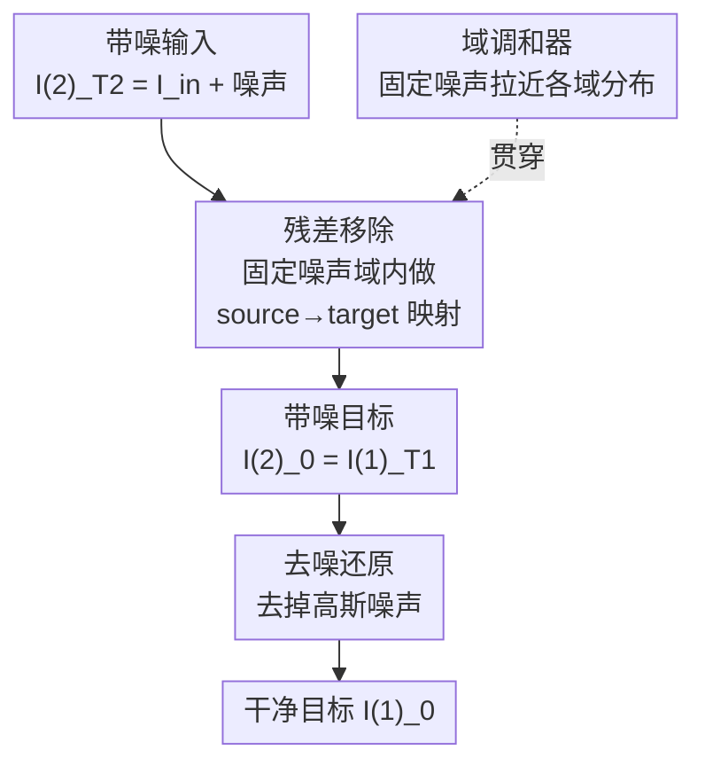

# Decoupled Residual Denoising Diffusion Models for Unified and Data Efficient Image-to-Image Translation

**会议**: CVPR 2026  
**arXiv**: [2606.01048](https://arxiv.org/abs/2606.01048)  
**代码**: https://github.com/HKU-HealthAI/DRDD (有)  
**领域**: 扩散模型 / 图像生成 / 图像恢复  
**关键词**: 图像到图像翻译, 残差扩散, 域对齐, 解耦扩散, 数据高效

## 一句话总结
DRDD 发现注入高斯噪声除了"流形抬升"还能隐式拉近不同域的特征分布（"域调和器"），于是把传统耦合扩散拆成"先加噪声做域调和 + 再做确定性残差映射"两个独立阶段，让核心 source→target 映射全程在固定噪声域里完成，从而在多任务统一恢复和少配对数据场景下又稳又省数据。

## 研究背景与动机
**领域现状**：图像到图像翻译（I2I）是把图像从源域映到目标域的基础任务，涵盖去噪、去雨、去雾、超分、风格迁移等。早期靠 GAN，后来扩散模型（SR3、WeatherDiff 等）凭质量和多样性成为主流；为了更稳地保留输入结构，RDDM、I2SB、IR-SDE 这类进阶方法不再从纯噪声起步，而是从"带噪输入图像"开始反向采样。

**现有痛点**：这些方法尽管起点不同，却共享同一个底层范式——I2I 翻译通过**单一、耦合的反向过程**完成，每一步同时去掉噪声和残差（残差 = 源图与目标图之差）。当要做**统一 I2I 翻译**（一个模型处理多个任务/多个域）时，不同任务之间存在巨大的域间隙，而且很难收集覆盖这种多样性的大规模配对数据，这两点让耦合范式举步维艰。

**核心矛盾**：作者重新审视扩散里"注入高斯噪声"的作用，发现它除了把数据移出低维流形（流形抬升）、丰富 score 估计信号外，还有一个被忽视的性质——一定量的固定高斯噪声能充当"域调和器"，隐式拉近不同域的特征分布（命题 3.1：加同一高斯噪声后两分布的 KL 散度严格变小）。但耦合扩散在反向过程中会**过早地把噪声和残差一起去掉**，于是在 source→target 映射还没完成时就侵蚀掉了这份调和红利。

**本文目标**：把"域调和"和"语义映射"在时间上分开，让调和效果贯穿核心映射全程，同时顺便提升数据效率。

**切入角度**：既然噪声的价值在于"维持一个被调和、带噪的域"，那就别让它在映射途中被去掉——把核心残差映射整段塞进固定噪声域里完成。

**核心 idea**：把传统单一耦合扩散**解耦**成两个串行独立阶段——先做随机噪声扩散（域调和 + 流形抬升），再在固定噪声域里做确定性残差扩散（学语义映射），反向过程对称地拆成"残差移除 + 去噪"两步。

## 方法详解

### 整体框架
DRDD 要解决的是"如何让噪声的域调和效果贯穿整个 I2I 映射，同时省配对数据"。它把传统那条"加噪声 + 加残差捆在一起"的前向链条拆成两段独立串行的扩散：前向先从干净目标图 $I_0^{(1)}$ 注入高斯噪声得到带噪目标 $I_{T_1}^{(1)}$（噪声扩散阶段），再以它为起点注入残差 $I_{res}=I_{in}-I_0$ 得到带噪输入 $I_{T_2}^{(2)}$（残差扩散阶段），整条前向是 $I_0^{(1)}\to I_{T_1}^{(1)}=I_0^{(2)}\to I_{T_2}^{(2)}$，终点恰好等于 $I_{in}+\bar\beta_{T_1}\varepsilon$（带噪输入）。反向过程对称解耦：从带噪输入 $I_{T_2}^{(2)}$ 出发，**先**在固定噪声域内做残差移除得到带噪目标 $I_0^{(2)}=I_{T_1}^{(1)}$（核心 source→target 映射，此时噪声一点没动），**再**做去噪把带噪目标还原成干净目标 $I_0^{(1)}$，即 $I_{T_2}^{(2)}\to I_0^{(2)}\to I_0^{(1)}$。两个阶段各由一个独立网络负责、用不同目标训练。

### 关键设计

**1. 噪声当"域调和器"：用固定噪声拉近不同域的特征分布**

统一 I2I 最大的拦路虎是不同任务/域之间的特征间隙太大，单模型很难学一张通吃的映射表。作者发现噪声不止"流形抬升"这一个用途：给两个不同分布 $P$、$Q$ 各注入同一高斯噪声 $\mathcal{N}(0,\sigma^2)$（$\sigma\neq0$）后得到 $P_\sigma$、$Q_\sigma$，则有 $D_{\text{KL}}(P_\sigma\|Q_\sigma)<D_{\text{KL}}(P\|Q)$（命题 3.1，证明见原文附录 A.1）——即注入噪声**严格缩小**两域间的分布距离，t-SNE 上能直观看到源域与目标域加噪后明显靠拢。关键在于：传统扩散用的是随时间 schedule 控制、会被反向过程逐步抹掉的噪声；而这里要的是一个**不随时间控制、固定水平**的噪声，让被调和的"带噪域"稳定存在，统一映射因此被大幅简化

**2. 解耦前向：把单一耦合扩散拆成噪声扩散 + 残差扩散两段串行**

痛点是耦合范式把"加噪声"和"加残差"混在同一条扩散里，反向时也只能同时去，调和效果在映射途中就被侵蚀。DRDD 把前向拆成两段独立阶段。噪声扩散阶段逐步注入高斯噪声：$I_t^{(1)}=I_{t-1}^{(1)}+\beta_t\varepsilon_{t-1}=I_0^{(1)}+\bar\beta_t\varepsilon$，其中 $\bar\beta_t=\sqrt{\sum_{i=1}^t\beta_i^2}$ 控制加噪速度，这一步同时承担域调和和流形抬升。随后把它的终态当残差扩散的起点（$I_0^{(2)}:=I_{T_1}^{(1)}$），残差扩散在**固定噪声域内**做确定性的 target→source 注入：$I_t^{(2)}=I_{t-1}^{(2)}+\alpha_t I_{res}=I_0^{(2)}+\bar\alpha_t I_{res}$，其中 $\bar\alpha_t=\sum_{i=1}^t\alpha_i$。当 $\bar\alpha_{T_2}=1$ 时前向终点 $I_{T_2}^{(2)}=I_{in}+\bar\beta_{T_1}\varepsilon$，正好是"带噪的输入图"。两阶段彻底独立，意味着噪声水平在残差阶段是被钉死的常量，不会再被调度抹掉

**3. 解耦反向：先在固定噪声域做残差移除，再去噪精修**

这是把"调和效果贯穿核心映射"落到采样上的关键。反向从带噪输入 $I_{T_2}^{(2)}$ 起步，**第一阶段残差移除**训练网络 $I_{res}^\theta(I_t^{(2)},t,I_{in})$ 在噪声域内预测残差，迭代式 $I_{t-1}^{(2)}=I_t^{(2)}-\alpha_t I_{res}^\theta(I_t^{(2)},I_{in},t)$，整段把 source→target 映射做完时噪声**一点没被动过**，因此域调和与流形抬升效果被完整保留，统一映射的学习被显著简化。**第二阶段去噪**才用噪声网络 $\epsilon_\theta$ 把带噪目标还原成干净目标，迭代式 $I_{t-1}^{(1)}=I_t^{(1)}-(\bar\beta_t-\sqrt{\bar\beta_{t-1}^2-\sigma_t^2})\epsilon_\theta(I_t^{(1)},t)+\sigma_t\varepsilon_t$，其中 $\sigma_t^2=\eta\beta_t^2\bar\beta_{t-1}^2/\bar\beta_t^2$，$\eta$ 控制采样是随机（$\eta=1$）还是确定（$\eta=0$）。和耦合范式"边映射边去噪"相比，DRDD 是"先映射干净、再单独去噪"，两件事互不干扰

**4. 数据高效：去噪阶段只用无配对目标域图像训练**

统一 I2I 难点之一是配对数据稀缺。DRDD 的解耦顺带带来一个红利：去噪网络的损失 $\mathcal{L}_\epsilon(\theta)=\mathbb{E}[\|\epsilon-\epsilon_\theta(I_t^{(1)},t)\|_1]$ **只依赖干净目标图像和注入的噪声，完全不需要对应的源域图像**。这意味着去噪阶段可以用海量、无配对的目标域图像来训练，还能直接拿 ImageNet 等大规模自然图像预训练权重初始化；真正吃配对数据的只有残差移除网络，损失 $\mathcal{L}_{res}(\theta)=\mathbb{E}[\|I_{res}-I_{res}^\theta(I_t^{(2)},t,I_{in})\|_1]$。配对样本被省着用在刀刃上，少配对数据下性能自然更抗跌

### 一个完整示例：一张带噪输入的反向之旅
以多任务恢复中的一张低光输入 $I_{in}$ 为例：① 采样高斯噪声 $\epsilon$，构造带噪输入 $I_{T_2}^{(2)}=I_{in}+\bar\beta_{T_1}\epsilon$ 作为反向起点；② 残差移除阶段循环 $t=T_2\dots1$，每步 $I_{t-1}^{(2)}=I_t^{(2)}-\alpha_t I_{res}^\theta(\cdot)$，逐步把"低光→正常光"的残差抠掉，得到带噪的正常光目标 $I_0^{(2)}$——整段噪声水平钉在 $\bar\beta_{T_1}$ 不变，所以低光域和正常光域在特征上一直被调和着；③ 令 $I_{T_1}^{(1)}=I_0^{(2)}$，进入去噪阶段循环 $t=T_1\dots1$，用 $\epsilon_\theta$ 把高斯噪声逐步去掉；④ 返回干净的正常光图 $I_0^{(1)}$。推理时两阶段都用 DDIM 采样、步长设为 2。

### 损失函数 / 训练策略
两个网络分开训练（见原文 Alg.1）：残差移除网络用 $\mathcal{L}_{res}=\mathbb{E}[\|I_{res}-I_{res}^\theta(I_t^{(2)},t,I_{in})\|_1]$（L1，需配对数据），去噪网络用 $\mathcal{L}_\epsilon=\mathbb{E}[\|\epsilon-\epsilon_\theta(I_t^{(1)},t)\|_1]$（L1，只需干净目标图）。推导基于 DDPM/DDIM 框架，也兼容 score-based SDE。去噪网络 U-Net 通道深度 $C=64$、倍率 $(1,2,4,8)$；推理用 DDIM、两阶段采样步长均为 2。最优噪声强度 $\bar\beta$ 由理论目标 $J(\sigma;\lambda)=\lambda\widetilde A(\sigma)+(1-\lambda)\widetilde B(\sigma)$ 求得（$A$ 是带噪源/目标域间距、$B$ 是带噪源与原源域间距，均用 MMD 度量），$\lambda=0.5$ 时最优 $\bar\beta\approx1.1\text{–}1.2$，实测在 0.8–1.3 区间稳定最优、1.0 处最佳。

## 实验关键数据

### 主实验

All-in-One-5 五任务统一恢复（SSIM↑ / LPIPS↓ / FID↓，下表为 Average 列）：

| 方法 | 类型 | SSIM↑ | LPIPS↓ | FID↓ |
|------|------|-------|--------|------|
| DA-CLIP* | 扩散 | 0.876 | 0.108 | 20.0 |
| DiffuIR* | 扩散 | 0.869 | 0.117 | 33.7 |
| AdAIR | 非扩散 | 0.909 | 0.089 | 26.1 |
| VLUNet | 非扩散 | 0.904 | 0.096 | 27.9 |
| DFPIR | 非扩散 | 0.912 | 0.081 | 24.9 |
| **DRDD (Ours)*** | 扩散 | **0.916** | **0.073** | **18.3** |

DRDD 在平均三项指标上全面领先，感知指标（LPIPS、FID）优势尤为明显（FID 18.3 vs 次优 20.0）。

MNMD 跨域单任务去噪（自建基准，含自然/医学/遥感三域，Average 列）：

| 方法 | SSIM↑ | LPIPS↓ |
|------|-------|--------|
| RDDM | 0.8406 | 0.1702 |
| IR-SDE | 0.8215 | 0.0879 |
| VLUNET | 0.9274 | 0.0784 |
| **DRDD (Ours)** | **0.9338** | **0.0553** |

跨自然、医学、遥感三个差异极大的域，DRDD 在每个域都拿到最高 SSIM、最低 LPIPS，印证"域调和"在跨域场景的有效性。

### 消融 / 扩展实验

解耦机制移植到 SDE 框架（IR-SDE → De-IRSDE，单任务 I2I）：

| 任务 | 指标 | IR-SDE (耦合) | De-IRSDE (解耦) |
|------|------|---------------|-----------------|
| Inpainting | LPIPS↓ / FID↓ | 0.0517 / 15.14 | **0.0490 / 15.10** |
| Deraining | PSNR↑ / SSIM↑ / LPIPS↓ | 27.2 / 0.856 / 0.083 | **28.1 / 0.862 / 0.076** |
| Denoise | SSIM↑ / LPIPS↓ / FID↓ | 0.833 / 0.1014 / 33.29 | 0.827 / 0.1069 / **31.87** |

解耦版在去雨、补全两任务上一致优于耦合基线，去噪任务 SSIM/LPIPS 持平但 FID 更好，说明"残差/噪声解耦"思想可移植到 DDPM/DDIM 之外的扩散范式。

### 关键发现
- **域调和是核心收益来源**：残差映射全程在固定噪声域内完成（噪声未被去掉），让不同任务/域的特征保持靠拢，统一映射学习被显著简化；这也是 DRDD 在多任务和跨域基准上同时领先的根因。
- **数据效率突出**：把训练集子采样到 75%/50%/25% 后，DRDD 在 Low-Light 和 All-in-One-3 上的相对性能跌幅明显小于基线——去噪阶段只用无配对目标图（可 ImageNet 预训练）使其在少配对数据下更抗跌。
- **噪声强度有最优区间**：理论目标 $J(\sigma;\lambda)$（$\lambda=0.5$）给出最优 $\bar\beta\approx1.1\text{–}1.2$，实验在 0.8–1.3 区间稳定最优、$\bar\beta=1.0$ 处最佳，理论与实测吻合。
- **复合退化场景更稳**：CDD-11 上 DRDD 平均 SSIM 最高，在 L+H+S、L+H+R 等复合退化场景相对 PromptIR/WGWSNet/MoCE-IR-S 优势更明显。

## 亮点与洞察
- **重新解读了噪声的作用**：把"注入高斯噪声会缩小域间 KL 散度"形式化为命题并配 t-SNE/MMD 验证，给"扩散里的噪声到底在干嘛"补上了"域调和器"这一新视角，比单纯归因于"流形抬升"更完整。
- **"先映射后去噪"的解耦最巧**：传统范式边去噪边映射，调和效果半路被侵蚀；DRDD 把核心映射整段封进固定噪声域、最后才统一去噪，是一个很干净的"时间维度上的关注点分离"，且前向终点恰好等于带噪输入，公式闭合得很漂亮。
- **数据效率是解耦的免费副产物**：去噪网络的损失天然不含源域图像，这一性质让"用海量无配对目标图 + 大模型预训练权重"成为可能，把稀缺的配对数据省给残差网络——这种"把不同子任务的数据需求拆开"的思路可迁移到其它需配对数据的生成任务。
- **范式无关**：解耦思想在 DDPM/DDIM/SDE 上都成立（De-IRSDE 验证），说明它是一条正交于具体扩散骨干的设计原则，复用门槛低。

## 局限与展望
- 引入两个独立网络 + 两阶段采样，相比单一耦合模型在结构和推理流程上更复杂；论文把 PSNR 与计算开销放在附录，正文未正面给出推理成本对比，实际部署时两阶段采样的额外开销需关注。
- "域调和器"的理论保证（命题 3.1）建立在向两分布注入**同一**高斯噪声的设定上，且只给出 KL 严格变小的定性结论；最优噪声强度仍需按 $J(\sigma;\lambda)$ 离线估计、依赖 $\lambda$ 的人为选取，跨数据集是否需要重新调 $\bar\beta$ 值得进一步验证。
- MNMD 为作者自建基准，跨域去噪的对比方法相对有限（仅 RDDM/IR-SDE/VLUNET）；在更大规模、更多任务类型的统一基准上的可扩展性有待更全面的检验。
- 残差移除网络仍需配对数据，真正"零配对"的统一 I2I 尚未达成；如何把残差阶段也部分无监督化是自然的后续方向。

## 相关工作与启发
- **vs RDDM**：RDDM 同样区分残差扩散与噪声扩散，但仍在**单一耦合**反向过程中同时去残差和去噪；DRDD 把两者在时间上彻底解耦、让残差映射整段在固定噪声域内完成，从而保住域调和效果，这是二者的根本区别。
- **vs I2SB / IR-SDE**：它们从带噪输入起步以保结构、降低不确定性，但反向仍是耦合的边映射边去噪；DRDD 指出这会过早侵蚀噪声的调和红利，并用"先映射后去噪"修正，且把该思路反向移植回 IR-SDE 得到更优的 De-IRSDE。
- **vs SR3 / WeatherDiff**：早期扩散 I2I 从纯噪声起步、仅把输入当条件，结构保持弱、不确定性高；DRDD 不仅起点是带噪输入，更把噪声升级为贯穿全程的"域调和器"。
- **启发**：把扩散过程按"语义映射 vs 噪声处理"在时间维度拆分、并按子任务的数据需求分别供给数据，是一种可迁移到其它条件生成/跨域翻译任务的范式级设计原则。

## 评分
- 新颖性: ⭐⭐⭐⭐⭐ 把噪声形式化为"域调和器"并据此提出时间维度解耦的扩散范式，视角新且自洽
- 实验充分度: ⭐⭐⭐⭐ 覆盖多任务/跨域/单任务/少数据/跨骨干多维验证，但部分成本与 PSNR 对比放在附录
- 写作质量: ⭐⭐⭐⭐⭐ 动机推导清晰，前向/反向公式闭合，图文对照到位
- 价值: ⭐⭐⭐⭐ 为统一、数据高效 I2I 提供了通用且骨干无关的解耦思路，实用性强

<!-- RELATED:START -->

## 相关论文

- [\[CVPR 2026\] MERIT: Multi-domain Efficient RAW Image Translation](merit_multi-domain_efficient_raw_image_translation.md)
- [\[CVPR 2026\] DDT: Decoupled Diffusion Transformer](ddt_decoupled_diffusion_transformer.md)
- [\[CVPR 2026\] DeCo: Frequency-Decoupled Pixel Diffusion for End-to-End Image Generation](deco_frequency-decoupled_pixel_diffusion_for_end-to-end_image_generation.md)
- [\[CVPR 2026\] Efficient and Training-Free Single-Image Diffusion Models](efficient_and_training-free_single-image_diffusion_models.md)
- [\[CVPR 2026\] DBMSolver: A Training-free Diffusion Bridge Sampler for High-Quality Image-to-Image Translation](dbmsolver_a_training-free_diffusion_bridge_sampler_for_high-quality_image-to-ima.md)

<!-- RELATED:END -->
