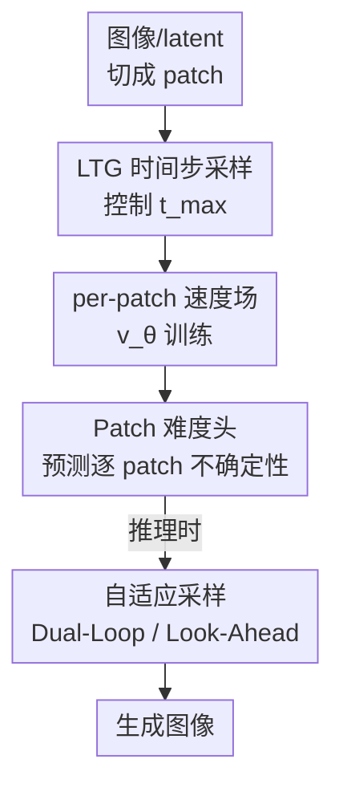

# Denoising, Fast and Slow: Difficulty-Aware Adaptive Sampling for Image Generation

**会议**: CVPR 2026  
**arXiv**: [2604.19141](https://arxiv.org/abs/2604.19141)  
**代码**: https://github.com/CompVis/patch-forcing (有)  
**领域**: 扩散模型 / 图像生成  
**关键词**: Patch-level 去噪、Diffusion Forcing、不确定性预测、自适应采样、Flow Matching

## 一句话总结
扩散/流匹配模型默认对所有 patch 用同一个时间步、均匀分配算力，本文提出 **Patch Forcing (PF)**：训练时给每个 patch 独立的噪声水平、并学一个轻量的「patch 难度头」，让置信(简单)区域先去噪、为不确定(困难)区域提供"未来"上下文，配合两个难度感知采样器在 ImageNet 256² 上把 SiT 的 FID 从 17.2 降到 9.8（XL/2，固定算力）。

## 研究背景与动机
**领域现状**：现代 diffusion / flow matching 图像生成器（DiT、SiT 等）在每个去噪步对**所有空间位置**用同一个全局时间步 $t$、同样的函数评估次数（NFE），算力在空间上是**均匀分配**的。

**现有痛点**：这种均匀分配隐含假设"图像每个区域去噪难度相同"，但自然图像高度异质——大片低频背景、饱和区域很容易；而细小结构、物体边界、小字、遮挡边界要到去噪后期才能消歧。对所有区域一视同仁，意味着在简单区浪费算力、在困难区却既给不够 refinement、也给不够 context。

**核心矛盾**：困难区域真正需要的是**更多上下文**。以往给上下文靠外部条件（depth map、文本、表示对齐 REPA），或靠 inpainting/编辑那样**借用 ground-truth** 的已知像素——但纯生成场景推理时没有任何 ground-truth 可借。

**本文目标**：让去噪过程**自己产生**上下文——不依赖外部信号、不依赖真值，靠模型内部把"已经比较确定的区域"提前推进，再用它们去引导更难的区域。

**切入角度**：作者基于 Diffusion Forcing（给序列每个元素独立噪声水平）和它在图像域的变体 SRM（Spatial Reasoning Models，先"解"简单格子再条件化解难格子），把这套机制下放到**图像 patch 级**。关键观察有三：① 上下文越多、验证 loss 越低；② 模型预测的不确定性与 patch 难度正相关；③ 给更多上下文能降低不确定性。

**核心 idea**：用 **per-patch 时间步 + 学到的难度头**，让简单 patch 先走、为困难 patch 提供自生成的上下文，从而在同样算力预算下把评估次数花在最需要的地方。

## 方法详解

### 整体框架
PF 建立在 Flow Matching 之上：插值 $\mathbf{x}_t = t\mathbf{x}_1 + (1-t)\mathbf{x}_0$（$\mathbf{x}_0$ 是噪声、$\mathbf{x}_1$ 是数据），模型 $\mathbf{v}_\theta$ 回归速度场。与标准做法不同，PF 给每个 patch 一个**独立时间步** $\mathbf{t}\in\mathbb{R}^{(H/p)\times(W/p)}$，这只需把 DiT 里 AdaLN 广播标量时间步的机制扩展成支持空间变化的时间步即可，几乎不改架构。

整条 pipeline 分训练侧与推理侧：训练侧的关键是**怎么采这堆 per-patch 时间步**（朴素均匀采样会暴露推理时不会出现的"过度信息"状态），因此引入 **LTG 采样器**控制每个样本的最大信息量；同时多学一个**难度头**预测逐 patch 不确定性。推理侧则用这个难度信号驱动**自适应采样器**——把低不确定 patch 大步推进、用其更干净的状态作为上下文条件去精修高不确定 patch。

### 关键设计

**1. LTG 时间步采样器：控制"最大信息量"而非"平均信息量"**

朴素地给每个 patch 独立采 $t_i\sim\mathcal{U}(0,1)$，会让每个样本的均值 $\bar t$ 集中在 $0.5$（Bates 分布），等于训练时几乎总有大量干净信号、而推理却从纯噪声起步——这是 naive patch-based Diffusion Forcing 的核心 train-test gap。SRM 的修法是把均值 $\bar t$ 采成均匀分布、再用递归分配生成 per-patch $t_i$，但它只约束了**平均**信息量，单样本里**最大**时间步 $t_{\max}$ 依然高概率贴近 $t=1$（图 3 左），意味着训练里几乎总有 patch 是(近乎)完全去噪的，仍泄露上下文。

PF 反其道而行，直接约束**每个样本的最大信息量**：先采一个 $t_{\max}$，再从**以 $t_{\max}$ 为中心、截断的高斯下半部分**条件采各 patch 的 $t_i$，即 $t_i\sim\text{truncate}(\mathcal{N}(t_{\max},\sigma^2))$，强制 $t_i\in[0,t_{\max}]$。这样即使没有任何信息可用，模型也训练得好，天然对齐"推理从纯噪声开始"。但若 $t_{\max}\sim\mathcal{U}(0,1)$ 会把整体时间步分布偏向低 $t$（高噪声）；于是再叠一层 Logit-Normal 采样 $t_{\max}\sim\text{LogitNorm}(m,s)$ 来平衡。两者合起来就是 **Logit-Normal Truncated Gaussian (LTG)** 采样器，既铺开各 $t_i$、又控住 $t_{\max}$，在所有时间步调度方案里拿到最优 FID。额外好处：截断高斯可**并行**采样，比 SRM 的递归分配显著更快。$\sigma=0$ 时分布退化成 Dirac delta，PF 就还原成标准 Flow Matching

**2. Patch 难度头：把方差预测重新诠释成"局部去噪难度"**

要让简单 patch 先走，得先知道哪些 patch 简单。PF 加一个轻量的**不确定性预测头**（额外参数 <0.01%），把难度建模为预测的标准差 $\sigma_\theta$，并最小化真值条件速度 $\mathbf{v}_{\text{GT}}=x_1-x_0$ 的负对数似然 (NLL)：
$$\mathcal{L}_{\text{total}}=\mathbb{E}\big[\|\mathbf{v}_{\text{GT}}-\mathbf{v}_\theta(\mathbf{x}_t,\mathbf{t})\|^2-\lambda\log\mathcal{N}(\mathbf{v}_{\text{GT}}\mid \mathbf{sg}(\mathbf{v}_\theta),\sigma_\theta^2\mathbf{I})\big]$$
其中 $\mathbf{sg}$ 是 stop-gradient（让 NLL 项只更新方差、不污染速度回归），$\lambda=0.01$（沿用 SRM）。作者明确把这个分数**重新诠释为局部 patch 难度**而非传统的认知/偶然不确定性：值越高=区域越难、越需要更多算力与上下文（全文"uncertainty"与"patch difficulty"互换使用）。论文用三组证据验证该信号靠谱：预测不确定性与验证 loss 正相关（$t=0.6$ 时 $R=0.52$，去噪越往后越 diagnostic）；用 Monte-Carlo 多次一步预测得到的经验方差与预测不确定性高度吻合；注入置信区域上下文后剩余区域不确定性直方图整体左移

**3. 难度感知自适应采样器：让置信 patch 先走、给困难 patch 当"未来"上下文**

有了难度图，推理时就能把算力动态投到最需要处。PF 提出两个采样器，都先用**不确定性阈值**挑出置信区域、再把它们前推为更难区域提供上下文。**Dual-Loop**：外层对低不确定 patch 走大步时间步更新，内层条件化它们更新后的状态、对高不确定 patch 走小步精修；两子集对齐到同一 $t$ 后**重新估计难度**再循环，让 patch 难度随时间自适应变化。**Look-Ahead**：把置信区域的上下文表示按当前 $t$ 成比例地前推到一个更"未来"的时间步（直到干净数据 $t=1$），这些更解析的表示再作为剩余不确定区域的上下文引导——对应"最优上下文量正比于 $t$"这一观察。

关键在于：这种上下文条件化是模型**自生成**的、与训练完全自洽，不引入 OOD 样本；而且与 guidance（CFG/SAG）正交——guidance 是对比预测来 steer 轨迹，PF 是把不确定 patch 暴露给一个局部更解析的表示。消融显示 patch **排序很重要**：随机挑置信 patch 传上下文(PFT-random)反而比并行基线还差，证明必须靠不确定性来排优先级

### 损失函数 / 训练策略
总损失即上面的 $\mathcal{L}_{\text{total}}$：速度回归 MSE + 权重 $\lambda=0.01$ 的 NLL 难度项。骨干沿用 SiT/DiT 的 B/L/XL 变体、参数量保持不变，时间步条件走 AdaLN，仅把"标量时间步"换成"per-token 时间步嵌入"。ImageNet 实验固定架构与 NFE 做公平对比；T2I 实验用 1.2B PFT，文本编码器为 Qwen3-1.7B，在 COYO 的 120M 图文对子集（InternVL3-2B 重标注）上训练。

## 实验关键数据

### 主实验：ImageNet 256² 固定架构 & NFE
同一骨干、同样函数评估次数下，PFT 用标准 Euler 采样已优于 SiT，再叠自适应采样器进一步提升（FID-50k，越低越好）：

| 模型 | 参数 | 采样 | FID ↓ |
|------|------|------|-------|
| SiT-B/2 | 130M | Euler | 33.0 |
| PFT-B/2 | 130M | Euler | 27.9 |
| PFT-B/2 | 130M | + look-ahead | **24.2** |
| SiT-L/2 | 458M | Euler | 18.8 |
| PFT-L/2 | 458M | Euler | 14.7 |
| PFT-L/2 | 458M | + look-ahead | **13.0** |
| SiT-XL/2 | 675M | Euler | 17.2 |
| PFT-XL/2 | 675M | Euler | 12.9 |
| PFT-XL/2 | 675M | + look-ahead | **9.8** |
| SiT-XL/2 + REPA | 675M | — | 7.9 |
| PFT-XL/2 + look-ahead + REPA | 675M | — | **6.7** |

PF 与表示对齐 (REPA) 正交：XL/2 + REPA + look-ahead 把 7.9 进一步降到 6.7。

### SOTA 对比（ImageNet 256²，含 CFG）
| 模型 | Epochs | FID↓ | sFID↓ | IS↑ | Pre.↑ | Rec.↑ |
|------|--------|------|-------|-----|-------|-------|
| DiT-XL/2 | 1400 | 2.27 | 4.60 | 278.2 | 0.83 | 0.57 |
| SiT-XL/2 | 1400 | 2.06 | 4.50 | 270.3 | 0.82 | 0.59 |
| SiT-XL/2 + REPA | 200 | 1.96 | 4.49 | 264.0 | 0.82 | 0.60 |
| PFT-XL/2 + REPA + look-ahead | 200 | 2.00 | 4.32 | **284.1** | 0.81 | 0.61 |

只训 200 epoch 即与训了 1400 epoch 的 SiT/DiT 竞争，sFID 与 IS 上更优，确认与 CFG 正交。

### 消融与分析
| 配置 | 关键发现 | 说明 |
|------|---------|------|
| LTG vs SRM Uniform-$\bar t$ | LTG 取得最优 FID | SRM 只控均值、$t_{\max}$ 仍贴近 1，留 train-test gap |
| 纯 Truncated Gaussian | 优于 SRM 但 $t$ 质量塌向小值 | 控住 $t_{\max}$ 却牺牲时间步多样性，故再叠 Logit-Normal |
| $\beta$-sharpness（SRM 调度） | $\beta=1$（最宽）最差 | 越接近并行采样越差，需高 sharpness 才超 SiT |
| PFT-random（随机挑置信 patch） | 比 PFT-parallel 还差 | 证明 patch 排序必须由不确定性驱动 |
| 增加 NFE | dual-loop / look-ahead 全程领先 | 同时超过 SiT 的 ODE 与 SDE 基线 |

### 关键发现
- **look-ahead > dual-loop > 并行**：把不确定 patch 暴露给低噪声上下文带来最大收益（XL/2 上 12.9 → 9.8）。
- **三大假设逐一证实**：上下文降 loss（图 7）、不确定性≈难度（图 8，后期 $R$ 更高）、上下文降不确定性（图 12 直方图左移）。
- **难度头几乎零成本**（<0.01% 参数）却解锁全部自适应采样能力。

## 亮点与洞察
- **"控最大信息量而非平均信息量"是点睛之笔**：同样想缩小 train-test gap，SRM 控均值留了后门，PF 改控 $t_{\max}$ 直击"训练里总有 patch 已干净"的泄露根源，而且采样还能并行、比递归分配更快——一个更简单的设计反而更对。
- **把"不确定性"重新诠释成"难度"并当调度信号用**：同一个方差预测头，传统当作 epistemic/aleatoric uncertainty，这里直接拿来排 patch 优先级，思路可迁移到任何需要"先易后难"的空间/序列生成。
- **模型自生成上下文、与 guidance 正交**：不借真值、不引 OOD，纯靠"让确定区域先走一步"造出上下文，且能叠加 REPA 与 CFG，工程上很友好。
- **T2I 上文本渲染更清晰**：相比同设置的标准 Flow Matching，PF 生成的小字更清楚——恰好印证"细小结构是困难 patch、值得多分算力"的核心直觉。

## 局限与展望
- **难度信号早期偏弱**：$t=0.2$ 时不确定性与验证 loss 的相关 $R$ 仅 0.11，去噪早期难度图不够可靠，自适应采样的收益主要来自中后期。
- **自适应采样器有额外调度开销**：dual-loop 的内外双循环、look-ahead 的前推都引入实现复杂度与阈值超参，论文主要靠固定 NFE 比公平性，但调度本身的 wall-clock 成本未充分展开。
- **T2I 仅在 120M 子集上验证**：1.2B PFT 规模与数据相比主流 T2I 仍偏小，"competitive"而非全面 SOTA，更大规模下的可扩展性待验证。
- **改进方向**：难度头若能在早期 $t$ 也给出更可靠的信号（如多步聚合或时序平滑），或把 PF 与推理缓存方法（RAS）组合，有望在更低 NFE 下进一步提速。

## 相关工作与启发
- **vs SRM (Spatial Reasoning Models)**: 同源 Diffusion Forcing 的图像化，但 SRM 控均值 $\bar t$ + 递归分配，PF 控 $t_{\max}$ + 截断高斯并行采样；PF 更简单、更快、且更匹配"从纯噪声推理"，FID 全面超 SRM。
- **vs Diffusion Forcing**: DF 给序列每帧独立噪声（时间维），PF 把异质时间步下放到图像**空间 patch 维**，并新增难度头与难度感知采样。
- **vs guidance (CFG / SAG / PAG)**: 那些方法靠推理时对比预测 steer 轨迹，PF 靠模型自生成的局部上下文条件化不确定区域，二者正交、可叠加。
- **vs REPA（表示对齐）/ 深度图等外部条件**: 外部条件从模型外注入上下文，PF 让去噪过程**内部**产出上下文；实验证明与 REPA 正交，叠加后 FID 6.7。
- **vs RAS（Region-Adaptive Sampling）等推理缓存**: RAS 是推理时按注意力缓存稳定区域、重算显著区域，偏效率；PF 是**训练时**框架，带 per-patch 时间步与难度预测，可与这类缓存互补。

## 评分
- 新颖性: ⭐⭐⭐⭐⭐ 把 Diffusion Forcing 下放到 patch 级、并用"控 $t_{\max}$"破解 train-test gap，视角新颖且自洽
- 实验充分度: ⭐⭐⭐⭐ B/L/XL 三尺度 + 与 REPA/CFG 正交性 + 三大假设逐一验证，扎实；T2I 规模偏小
- 写作质量: ⭐⭐⭐⭐⭐ "fast and slow"的比喻贯穿、图示清晰、机制讲得透
- 价值: ⭐⭐⭐⭐ 提供了 patch 级自适应去噪的可复用框架，与现有增强手段正交，落地友好

<!-- RELATED:START -->

## 相关论文

- [\[CVPR 2026\] Curriculum Group Policy Optimization: Adaptive Sampling for Unleashing the Potential of Text-to-Image Generation](curriculum_group_policy_optimization_adaptive_sampling_for_unleashing_the_potent.md)
- [\[CVPR 2026\] Region-Adaptive Sampling for Diffusion Transformers](region-adaptive_sampling_for_diffusion_transformers.md)
- [\[CVPR 2026\] Few-Step Diffusion Sampling Through Instance-Aware Discretizations](few-step_diffusion_sampling_through_instance-aware_discretizations.md)
- [\[CVPR 2026\] Precise Object and Effect Removal with Adaptive Target-Aware Attention](precise_object_and_effect_removal_with_adaptive_target-aware_attention.md)
- [\[CVPR 2026\] Adaptive Spectral Feature Forecasting for Diffusion Sampling Acceleration](adaptive_spectral_feature_forecasting_for_diffusion_sampling_acceleration.md)

<!-- RELATED:END -->
