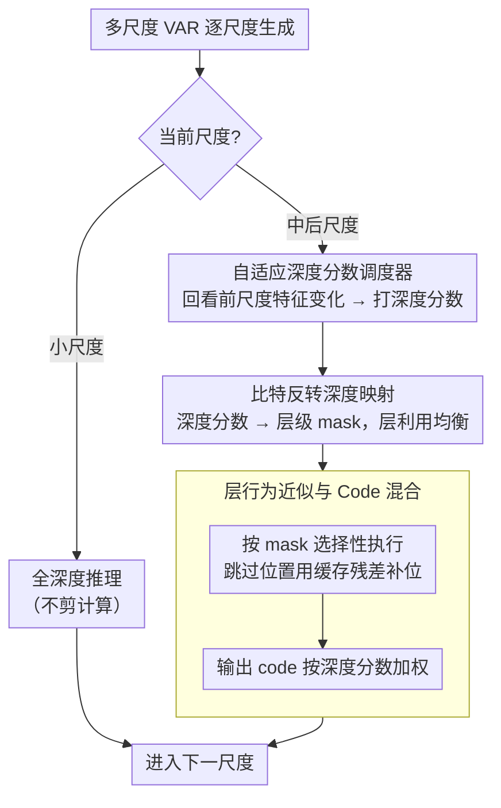

# Depth Adaptive Efficient Visual Autoregressive Modeling

**会议**: CVPR 2026  
**arXiv**: [2604.17286](https://arxiv.org/abs/2604.17286)  
**代码**: [https://github.com/STOVAGtz/DepthVAR](https://github.com/STOVAGtz/DepthVAR)  
**领域**: 图像生成  
**关键词**: 视觉自回归, 推理加速, 动态深度, 免训练, token 级计算分配

## 一句话总结

揭示了 VAR 模型中频率驱动的硬剪枝范式存在根本性局限，提出 DepthVAR，一种免训练的推理加速框架，通过自适应分配每个 token 的 Transformer 层计算深度（而非二值化的保留/剪除），实现 2.3×-3.1× 加速且质量损失极小。

## 研究背景与动机

**领域现状**：Visual Autoregressive (VAR) 模型通过"下一尺度"预测替代传统的"下一 token"预测，在文本到图像生成中显著减少了序列长度。但随着分辨率增加，每个尺度的 token 数量呈二次增长，对所有 token 统一施加全层计算造成严重浪费。

**现有痛点**：FastVAR 和 SparseVAR 等方法利用频率特征对 token 进行硬剪枝——估计高频分布后丢弃"不重要"的低频 token。然而这种方法存在根本性问题：即使使用完美的频率 mask（oracle 实验），硬剪枝仍会导致显著质量下降；更精确的频率估计也不能保证更好的生成质量（Pearson r = 0.138）。

**核心矛盾**：硬剪枝将 token 二值化为"保留/丢弃"，但实际上低频区域并非完全不需要计算，而是需要较少的计算——问题出在"全有全无"的粗粒度决策上。

**本文目标**：从硬剪枝范式转向连续的计算深度分配，让每个 token 获得与其复杂度匹配的 Transformer 层数。

**切入角度**：作者发现预训练 VAR 模型由于训练时使用 LayerDrop 正则化，天然存在深度冗余——生成质量在到达最终层之前就已经达到峰值，且不同 token 的表示在不同深度饱和。

**核心 idea**：用逐 token 的动态深度分配替代硬剪枝，通过循环旋转调度器生成非静态的深度分数，用比特反转映射转换为层级 mask 实现均衡的层利用。

## 方法详解

### 整体框架

DepthVAR 要解决的事很具体：VAR 逐尺度生成图像时，越往后尺度的 token 越多，但并非每个 token 都需要走完全部 $L$ 层 Transformer——低频、平滑区域早在中间层就已经"算够了"。既有方法（FastVAR / SparseVAR）的做法是把这些 token 整个剪掉，本文则把"剪 / 不剪"的二值决策换成"该走几层"的连续决策。

整体流程是这样转的：小尺度照常全深度推理，从某个中间尺度开始切换到动态深度模式。对每个后续尺度 $i$，先由**自适应深度分数调度器**回看前一尺度各层的特征变化，给当前每个 token 位置打一个深度分数 $\mathcal{S}_i \in [0,1]^{h_i \times w_i}$（分数越高表示这个位置越需要深算）；这个连续分数经**比特反转映射**变成一张层级 mask $\mathcal{M}_i$，告诉每一层"哪些位置这一层要算、哪些跳过"；推理时按 mask 选择性执行 Transformer 块，跳过的位置用缓存的层间残差补位以保持特征图完整；最后把输出 code 按深度分数加权混合，让一个 token 对结果的贡献和它实际花掉的计算量成正比。整个过程不改任何模型参数。

### 关键设计

**1. 自适应深度分数调度器：让"该算多深"随尺度动态变化，而非一锤定音**

最朴素的做法是直接拿前一尺度某个区域是否"重要"来决定当前尺度算多深，但这样会让同一批被判为低优先级的区域在每个尺度都被反复浅算、永远翻不了身。本文的分数来源是把前一尺度各层的绝对特征变化量逐层聚合，得到一张"决策排名图" $\mathcal{B}_i$，再归一化成百分位 $\rho_i$，最后用调度函数 $\mathcal{G}$ 把百分位映射成深度分数。关键的一笔是**循环百分位旋转** $\mathcal{G}'(\rho)$：每个尺度把映射曲线整体平移一下，使得这次被浅算的区域下次有机会被深算，避免"同一组 token 反复被更新或反复被跳过"。大尺度的总计算预算由一个参考尺度 $\mathcal{R}$ 来约束——$\mathcal{R}$ 越小，越激进地压缩深尺度的计算，加速比越高。

**2. 比特反转深度映射：把分到的层数均匀撒到全网络，而不是全挤在前几层**

拿到深度分数后要决定"这个 token 具体走哪几层"。给定深度图 $\mathcal{D}_i = \lfloor \mathcal{S}_i \cdot L \rfloor$，如果某 token 分到 $d$ 层就让它走前 $d$ 层 $\{0,1,\dots,d-1\}$，会出现一个糟糕的负载失衡：浅层几乎所有 token 都在算、深层只剩极少数 token，层利用率严重不均。本文借用 FFT 里的比特反转排列 $\pi_L$ 来散开这 $d$ 层：例如 $L=32,\ d=5$ 时选的是层 $\{0, 16, 8, 24, 4\}$ 而不是 $\{0,1,2,3,4\}$，让被选中的层尽量铺满整个深度区间。由此生成的层级 mask 为

$$\mathcal{M}_i(\ell, m, n) = \mathbf{1}\{\ell \in \mathcal{L}_i(m,n)\}$$

其中 $\mathcal{L}_i(m,n)$ 是位置 $(m,n)$ 按比特反转选出的层集合。这样每一层被剪掉的比例大致相当，没有哪一层成为闲置的"死层"。

**3. 层行为近似与 Code 混合：跳过的位置不留空洞，输出贡献按算力配比**

逐 token 跳层会带来两个隐患：被跳过的位置在该层没有新特征，后续层会接到一张"破洞"的特征图；以及浅算的 token 若和深算的 token 同等参与最终输出，质量会被拉低。本文对应给了两手。其一是缓存代理恢复——在每层 $\ell$ 只对激活位置真正跑 Transformer 块，被 mask 的位置改用前一尺度对应的层间残差（上采样后）补位：

$$r_i^\ell = \text{Layer}_\ell(r_i^{\ell-1} \odot \mathcal{M}_i(\ell)) + \text{up}(r_{i-1}^\ell - r_{i-1}^{\ell-1}) \odot (1 - \mathcal{M}_i(\ell))$$

这一步利用了相邻尺度间残差的局部稳定性，让被跳层的位置也有一份合理的代理特征，保证特征图空间完整。其二是 code 混合——最终查 codebook 时用深度分数加权 $z_i = \mathcal{S}_i \cdot \text{lookup}(p_i)$，使浅算 token 的贡献被相应削弱，避免它们以"全额话语权"污染输出。

### 一个完整示例

设 $L=32$、当前是一个深尺度、参考尺度 $\mathcal{R}=7$。调度器先回看上一尺度，把各层特征变化聚合成排名图并转成百分位：平滑的背景区域落在低百分位、纹理密集的边缘落在高百分位。经调度函数（叠加本尺度的循环旋转偏移）映射后，背景某位置拿到分数 $\mathcal{S}=0.16$、边缘某位置拿到 $\mathcal{S}=0.78$。换算深度 $\mathcal{D}=\lfloor 0.16\times32\rfloor=5$ 和 $\lfloor 0.78\times32\rfloor=24$。比特反转把背景的 5 层撒成 $\{0,16,8,24,4\}$、边缘的 24 层铺满大半网络。推理逐层进行：背景位置只在这 5 层真算、其余 27 层用上一尺度残差补位；边缘位置则几乎层层都算。最后查 codebook 时背景的输出乘以 0.16、边缘乘以 0.78——背景省下大量计算又不在特征图上留洞，边缘保持高保真，整尺度的算力就这样按需分配了。

### 损失函数 / 训练策略

完全免训练框架，不修改模型参数。所有机制都在推理时生效，通过调节参考尺度 $\mathcal{R}$、调度函数类型与参数来控制加速比。

## 实验关键数据

### 主实验

| 方法 | GenEval↑ | 延迟(ms)↓ | HPSv2↑ | 加速比 |
|------|---------|----------|-------|-------|
| Infinity 基线 | 0.7237 | 2706 | 30.47 | 1× |
| SparseVAR-0.7 | 0.7208 | 1281 | 29.76 | 2.1× |
| FastVAR | 0.7238 | 1080 | 29.93 | 2.5× |
| **DepthVAR (R=9)** | **0.7318** | 1622 | **30.29** | 1.7× |
| **DepthVAR (R=7)** | 0.7207 | 869 | 29.98 | **3.1×** |

### 消融实验

| 配置 | GenEval | 说明 |
|------|---------|------|
| 标准推理（全深度） | 0.7237 | 基线 |
| 硬剪枝 + oracle 频率 | 质量下降 | 证明硬剪枝范式的根本局限 |
| DepthVAR w/o 循环旋转 | 略低 | 固定排名导致某些区域长期欠计算 |
| DepthVAR w/o code 混合 | 下降 | 浅 token 贡献过大导致质量不均 |

### 关键发现

- 频率估计精度与生成质量的相关性极弱（r=0.138），即使 oracle mask 也无法挽救硬剪枝
- VAR 模型的生成质量在最终层之前就达峰值（早退可行），但不同 token 饱和深度差异大
- 在 HART 上的实验表明 DepthVAR 在不同 VAR 架构上均有效，具有良好的通用性

## 亮点与洞察

- 对频率驱动硬剪枝范式的根本性质疑非常有说服力——oracle 实验直接证明了问题不在于频率估计精度，而在于"全有全无"的决策范式本身。这个发现对后续 VAR 加速研究有重要指导意义
- 比特反转层分配的类比来自 FFT，将信号处理的经典技巧优雅地迁移到了深度学习的层选择问题上
- 免训练设计使方法可以即插即用到任何已训练的 VAR 模型上，实用性很强

## 局限与展望

- 虽然免训练是优点，但这也意味着模型没有机会适应稀疏计算模式，可能还有进一步优化的空间
- 缓存代理恢复假设尺度间特征变化是局部稳定的，在快速变化的区域可能引入误差
- 实验仅在 Infinity 和 HART 两个 VAR 模型上验证，对更新的 VAR 架构的适用性有待验证
- 改进方向：训练时引入深度感知正则化，或结合自回归过程中的中间结果做自适应调度

## 相关工作与启发

- **vs FastVAR/SparseVAR**: 同为 VAR 加速但采用硬剪枝范式，DepthVAR 在同等加速比下质量更优
- **vs MoD (Mixture-of-Depths)**: 同为动态深度方法但需要训练路由器，DepthVAR 完全免训练
- **vs 早退 (Early Exit)**: 早退是所有 token 统一退出，DepthVAR 是逐 token 动态深度

## 评分

- 新颖性: ⭐⭐⭐⭐ 对硬剪枝的质疑有洞察力，深度自适应分配是有意义的范式转变
- 实验充分度: ⭐⭐⭐⭐ oracle 实验和多维度对比有说服力
- 写作质量: ⭐⭐⭐⭐ 分析逻辑清晰，从观察到方法的推导自然
- 价值: ⭐⭐⭐⭐ 为 VAR 加速开辟了新路径，免训练特性增强了实用价值

<!-- RELATED:START -->

## 相关论文

- [\[CVPR 2026\] SparVAR: Exploring Sparsity in Visual Autoregressive Modeling for Training-Free Acceleration](sparvar_exploring_sparsity_in_visual_autoregressive_modeling_for_training-free_a.md)
- [\[ICML 2026\] Visual Implicit Autoregressive Modeling](../../ICML2026/image_generation/visual_implicit_autoregressive_modeling.md)
- [\[ICLR 2026\] Visual Autoregressive Modeling for Instruction-Guided Image Editing](../../ICLR2026/image_generation/visual_autoregressive_modeling_for_instruction-guided_image_editing.md)
- [\[ICLR 2026\] MVAR: Visual Autoregressive Modeling with Scale and Spatial Markovian Conditioning](../../ICLR2026/image_generation/mvar_visual_autoregressive_modeling_with_scale_and_spatial_markovian_conditionin.md)
- [\[AAAI 2026\] HACK: Head-Aware KV Cache Compression for Efficient Visual Autoregressive Modeling](../../AAAI2026/image_generation/head-aware_kv_cache_compression_for_efficient_visual_autoreg.md)

<!-- RELATED:END -->
