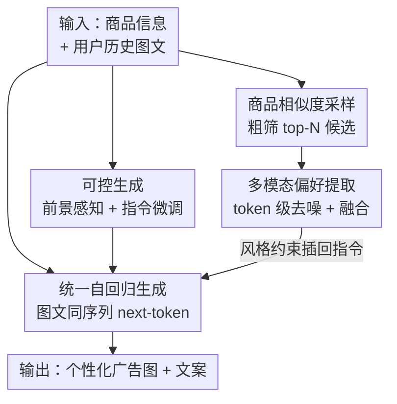

# Design Your Ad: Personalized Advertising Image and Text Generation with Unified Autoregressive Models

**会议**: CVPR 2026  
**arXiv**: [2605.12138](https://arxiv.org/abs/2605.12138)  
**代码**: https://github.com/JD-GenX/Uni-AdGen (有)  
**领域**: 图像生成 / 多模态 / 自回归生成 / 电商广告  
**关键词**: 个性化广告生成, 统一自回归模型, 图文联合生成, 用户偏好建模, 粗到细去噪

## 一句话总结
针对电商广告"图像和文案各用一套模型、且只靠群体 CTR 反映平均偏好"的问题，本文用一个统一自回归模型 Uni-AdGen 把广告图和广告文案放进同一个 next-token 预测流程里联合生成，再配一个"粗到细偏好理解模块"从用户带噪的多模态历史点击中抽取个性化兴趣，并构建了首个大规模个性化广告图文数据集 PAd1M 和背景敏感的 PBS 评测指标，在通用和个性化两种设定下都优于基线。

## 研究背景与动机

**领域现状**：电商平台普遍用"广告图 + 广告文案"组合来推商品，人工设计成本高、效率低，所以业界转向 AIGC 生成。现有主流做法是堆叠多个独立模型：先用 VLM 从商品透明图（去背景的主体图）生成背景 prompt，再用 T2I 模型（如 Flux-Fill）出图；同时用 LLM 根据商品描述和卖点写文案，图和文各走各的管线。

**现有痛点**：这种"多模型拼装"有两层问题。其一，图像和文本被完全隔离生成，系统复杂、跨模态无法协同，容易出现图文信息冗余或冲突。其二，要做"个性化"时，近期工作引入点击率（CTR）作为奖励信号去对齐用户偏好，但 CTR 只反映**群体平均偏好**，无法刻画单个用户的差异化兴趣，导致生成结果对个体而言是次优的。

**核心矛盾**：要真正个性化，就得直接从用户的历史点击行为里学偏好，但历史行为里有两类噪声彼此纠缠——**样本级噪声**（历史里混入和目标商品无关的商品，如目标是口红、历史里却有茶壶和桌子，视觉/文本风格都不匹配）和**模态级噪声**（用户在不同商品上被打动的模态不同，可能因为某个商品的"粉色背景图"点击，也可能因为另一个商品的"婴儿级"关键词点击）。只盯一个模态抽偏好必然片面、有偏。

**本文目标**：（1）把图文广告统一进单一生成流程，让两模态天然协同；（2）从带样本级和模态级噪声的多模态历史行为中，抽出精准的个体偏好来驱动个性化生成。

**切入角度**：自回归 next-token 预测范式本来就能把文本和图像 token 放进同一个序列里生成，这给"图文统一生成"提供了天然架构；在此之上再插一个去噪偏好模块，就能把"个性化"挂到统一模型上。

**核心 idea**：用一个自回归统一模型联合生成广告图文（替代多模型拼装），并用"先按商品相似度粗筛历史、再按 token 重要性细筛模态"的粗到细模块，把个体偏好从噪声历史里提纯出来注入生成。

## 方法详解

### 整体框架

任务定义：给定用户的 $L$ 条历史点击图文对 $\{(I_j, T_j)\}_{j=1}^{L}$ 和目标商品信息 $P$（透明图 $I^t$、描述 $D$、卖点 $W$），生成一对广告图文 $(I^{pred}, T^{pred})$，使其尽量贴近用户真实点击的 $(I^{GT}, T^{GT})$。

整体分两层：**通用广告生成**由统一自回归模型 Uni-AdGen 完成（基于 Janus-Pro 7B），它把结构化指令、商品描述、卖点编码进输入序列，用特殊 token `<text>...</text>` 框定文本生成段、`<image>...</image>` 框定图像生成段，输出再分别接文本解码器和 VQ-GAN 图像解码器还原成两种模态；同时图侧用"前景感知模块"注入商品结构、文侧用指令微调对齐卖点，保证生成内容的视觉和事实一致性。**个性化**则在此基础上加"粗到细偏好理解模块"：先按商品相似度从海量历史里粗采样出 top-$N$ 候选（降样本级噪声），再用相关性抽取器对图、文 token 做细粒度筛选（降模态级噪声），把提纯后的偏好 token 拼成风格约束插回指令，驱动个性化生成。

### 关键设计

**1. 统一自回归图文联合生成：一个序列里同时吐图和文，替代多模型拼装**

针对"图文各用一套模型、跨模态隔离"的痛点，Uni-AdGen 采用自回归视觉-语言架构，把多模态输入离散成 token，用 next-token 预测一次性产出广告文和广告图。模型先按指令、描述、卖点生成文本序列 $\mathbf{t}$，再以文本为条件生成图像序列 $\mathbf{g}$，两个任务联合训练。文本损失最大化文本 token 的似然 $\mathcal{L}_{text}=\sum_i \log p_\theta(\mathbf{t_i}\mid \mathbf{s}, \mathbf{t_{1:i-1}})$，图像损失则额外以已生成文本为条件 $\mathcal{L}_{img}=\sum_i \log p_\theta(\mathbf{g_i}\mid \mathbf{s}, \mathbf{t}, \mathbf{g_{1:i-1}})$，总损失 $\mathcal{L}=\lambda_{text}\mathcal{L}_{text}+\lambda_{img}\mathcal{L}_{img}$（两权重都取 1）。关键在于图像生成显式条件于文本 token，这让文案和配图在同一上下文里互相牵引，天然避免了独立生成带来的图文冗余或冲突，也省掉了 VLM→T2I→LLM 的多模型流水线

**2. 双路可控生成：前景感知保结构、指令微调保卖点**

朴素自回归模型缺乏有效控制，生成的广告图会偏离商品真实结构、文案会脱离卖点。图侧设计**前景感知模块**：商品透明图先 patchify 再过 DINOv2 前景编码器得到视觉嵌入，经 MLP 投影（"控制序列层"）对齐到自回归隐空间得到控制信号 $\mathbf{C}$，然后**每隔 4 层**用逐元素相加注入解码器——$[\mathbf{H}_l]_t=[\text{DL}_l(\mathbf{H}_{l-1})]_t+\mathbb{I}_{l\bmod 4=0}\cdot[\mathbf{C}]_t$，指示函数 $\mathbb{I}_{l\bmod 4=0}$ 只在层号被 4 整除时取 1。文侧用**指令微调**：把描述和卖点套进多样化指令模板（例如要求"文案只能用提供的卖点里的词"），并用一个 LLM 清洗训练数据、剔除"卖点推不出 ground-truth 文案"的噪声样本，让模型学到一致的生成策略。两路控制分别管住视觉一致性和事实一致性

**3. 粗到细偏好理解：先按商品相似度粗筛历史，再按 token 重要性细筛模态**

这是个性化的核心，专治用户历史里的两类噪声。**粗阶段（商品相似度采样 PSS）**降样本级噪声：从 $M$ 条历史（$M\gg N$）里按商品文本与目标描述的语义相似度做重要性采样，采样权重 $p_i=\frac{\max(s_i+\epsilon,0)}{\sum_{j=1}^{N}\max(s_j+\epsilon,0)}$（$\epsilon=10^{-6}$ 防除零）。用采样而非硬性 top-N，是因为作者观察到一些语义相似度低的历史商品（如目标是某商品、历史里的书架/口红）仍能提供有用的视觉或文本参考，概率采样能把这些多样性参考也纳进候选集。**细阶段（多模态偏好提取）**降模态级噪声：粗筛出的 $N$ 对历史图文先编码成 token，再各过一个 Transformer 相关性抽取器，通过注意力衡量 token 重要性、用输入输出嵌入的余弦相似度生成 token 级 mask，经可微的 Gumbel-Softmax + top-K 选择保留相关 token、压掉噪声——$\mathbf{e}^i=\text{TK}(\text{G}(\mathbf{e}^i_{in}\cdot\mathbf{e}^i_{out}))\cdot\mathbf{e}^i_{in}$（$i\in\{v,t\}$ 即视觉/文本）。两模态去噪后的 token 再经带残差的 FFN 和一个融合 Transformer 拼成 $[\mathbf{e}^v_{fused},\mathbf{e}^t_{fused}]$，最后以"按文本风格 `<text_ph>` 和图像风格 `<image_ph>` 生成"的风格约束插回指令尾部，驱动个性化。粗筛保证候选相关、细筛保证模态对齐，两级串联才把个体兴趣从噪声里真正提纯出来

### 损失函数 / 训练策略

基座为 Janus-Pro 7B，base 模型用 LoRA（rank=12，factor=32）微调，前景感知模块和多模态偏好提取模块全量微调；AdamW（lr=5e-5），batch size 4，单卡 NVIDIA B200。商品相似度采样取 $N=10$ 条历史，多模态偏好提取保留 top 40% 的 token；透明图 resize 到 $384\times384$、历史图 resize 到 $128\times128$。训练目标即上文的文本+图像联合似然（两权重各取 1）。

## 实验关键数据

### 主实验（通用广告生成，Table 1，500 个商品）

图像侧用 ASE / ImageReward(IR) / PickScore(PS) / 人工评估，文本侧用 m-BLEU / m-ROUGE / 人工评估。基线为"VLM(GPT-4o 或 Qwen2.5-VL)生成背景 prompt + 出图模型(ReliableAd / PosterMaker / Flux-Fill)"的拼装管线，以及 Qwen2.5 / Qwen3 / DeepSeek-R1 文本基线。

| 方法 | IR ↑ | PS ↑ | 图像人工 ↑ | m-BLEU ↑ | m-ROUGE ↑ | 文本人工 ↑ |
|------|------|------|-----------|----------|-----------|-----------|
| GPT-4o + Flux-Fill | -1.281 | 20.926 | 88.00 | – | – | – |
| GPT-4o + PosterMaker | -1.332 | 20.970 | 90.00 | – | – | – |
| Qwen2.5-VL + ReliableAd | -1.516 | 20.890 | **95.20** | – | – | – |
| Qwen3 (文本) | – | – | – | **0.562** | 0.652 | **99.60** |
| DeepSeek-R1 (文本) | – | – | – | 0.533 | 0.653 | 97.80 |
| Ours-image | -1.351 | **21.081** | 92.40 | – | – | – |
| Ours-text | – | – | – | 0.559 | 0.650 | 97.80 |
| **Ours (联合)** | **-1.244** | 21.002 | 92.60 | 0.551 | 0.654 | 98.20 |

要点：联合模型在 ImageReward 上拿到最佳（-1.244），PickScore 和人工评估排第二；ReliableAd 虽然图像人工评最高（95.20）但美学指标明显落后，PosterMaker/Flux-Fill 则反过来好看但可用性差。本文在"视觉质量"和"实用可用性"之间取得平衡。单模态变体 Ours-image / Ours-text 与联合模型表现相当，说明多模态联合训练没有牺牲单模态能力。

### 消融实验（个性化生成，Table 2，500 个用户）

图像相似度用本文提出的 PBS、文本用 BLEU/ROUGE，对照用户真实点击。消融按"逐步加组件"展开。

| 配置 | PBS ↑ | BLEU ↑ | ROUGE ↑ | 说明 |
|------|-------|--------|---------|------|
| Pigeon（图像基线） | 0.624 | – | – | 单模态偏好建模 |
| Flux-Kontext（图像基线） | 0.514 | – | – | 历史图拼网格喂入 |
| Qwen3（文本基线） | – | 0.345 | 0.580 | 历史文案插指令 |
| DeepSeek-R1（文本基线） | – | 0.373 | 0.622 | 同上 |
| Baseline（无历史） | 0.617 | 0.225 | 0.525 | Uni-AdGen 不看历史 |
| w/ history（随机历史） | 0.606 | 0.427 | 0.650 | 加历史，文本大涨 |
| w/ PSS（+商品相似度采样） | 0.622 | 0.430 | 0.652 | 降样本级噪声 |
| **Ours（+多模态偏好提取）** | **0.634** | **0.435** | **0.662** | 完整模型 |

### 关键发现
- **历史数据本身价值最大**：从 Baseline 到 w/ history，BLEU 从 0.225 跳到 0.427、ROUGE 从 0.525 到 0.650，文本对齐质量几乎翻倍，证明"用个体历史"这一步比任何去噪都更关键。
- **两级去噪逐级见效但增量较小**：PSS 把 PBS 从 0.606 提到 0.622（修正了随机历史引入的样本级噪声，注意 w/ history 的 PBS 0.606 反而低于无历史的 0.617，说明随机历史会带进无关背景），再加多模态偏好提取到 0.634；文本侧 0.652→0.662。去噪是"锦上添花"式精修，幅度不大但方向一致。
- **联合 + 去噪全面压过单模态基线**：图像 PBS 0.634 高于 Pigeon 0.624、Flux-Kontext 0.514；文本 ROUGE 0.662 高于 DeepSeek-R1 0.622，说明跨模态联合建模偏好确实比只看单模态更准。
- **PBS 指标的有效性**：在同/异背景图对上，PBS 拉开 0.421 的相似度差距，而 CLIP / DINOv3 / MoCov3 都不到 0.05，说明常规指标只盯前景主体、对背景几乎无感，而广告个性化恰恰主要体现在背景风格上。

## 亮点与洞察
- **把"个性化广告"从群体 CTR 拉到个体历史行为**：以前的范式用全体用户聚合 CTR 当奖励，本质假设大家偏好一致；本文直接对单个用户的多模态点击历史建模，思路上从"平均偏好"切到"个体偏好"，这是问题定义层面的升级，不只是模型层面的改进。
- **粗到细去噪对应两类噪声，定义清晰**：把历史行为噪声明确拆成"样本级（无关商品）"和"模态级（不同模态驱动点击）"，再分别用商品相似度采样和 token 级 Gumbel-Softmax 去治，问题-方法一一对应，可读性和可复用性都强。
- **重要性采样而非硬 top-N 的小巧思**：作者发现低相似度历史也可能含有用参考，于是用概率采样保留多样性，而不是粗暴截断——这个"别把弱相关样本一刀切掉"的直觉值得迁移到其他检索增强/历史建模任务。
- **PBS 指标补了评测的真空**：现成图像相似度指标只关心前景主体，对"同一商品不同背景"几乎无分辨力，而广告个性化的差异主要在背景；用 MoCov3 在 68 万对同商品不同背景图上训一个背景敏感编码器，是个针对性很强的评测工具贡献。
- **统一自回归注入控制的工程做法**：前景控制信号每隔 4 层做逐元素相加注入，既保结构又不淹没生成自由度，是把"可控生成"嫁接到自回归骨干上的轻量范式。

## 局限与展望
- **去噪增量偏小**：消融里 PSS 和多模态偏好提取相对 w/ history 的提升幅度有限（PBS +0.012/+0.012，ROUGE +0.002/+0.010），最大收益来自"有没有用历史"而非"去噪做得多精"，去噪模块的性价比有待进一步验证。
- **强依赖大规模私有数据**：PAd1M 来自 JD.com 的百万级用户和 850 万商品（实际 1,145,371 用户、18,923,555 点击图文），是工业级私有数据，学术界难以复现同等规模，泛化到其他平台的能力未知。
- **评测以"贴近真实点击"为代理目标**：BLEU/ROUGE/PBS 衡量的是生成内容与用户历史点击的相似度，并非直接的线上 CTR 或转化提升；论文只定性提到"CTR 微增即可带来可观收入"，缺线上 A/B 实验佐证个性化的真实商业价值。
- **若干超参较经验性**：$N=10$、top 40% token 保留率、每 4 层注入等设置偏经验，缺敏感性分析，换数据集/商品类目时是否仍最优存疑。

## 相关工作与启发
- **vs 多模型拼装管线（VLM + T2I + LLM，如 ReliableAd / PosterMaker / Flux-Fill + LLM）**：它们图文分离、系统复杂、跨模态无协同；本文用单一自回归模型把图文放进同序列，架构更简洁、天然跨模态交互，能避免独立生成的图文冗余/冲突。
- **vs CTR 驱动的个性化方法（Chen et al. / Yang et al. / Lu et al.）**：它们从全体用户聚合 CTR 导出偏好奖励，假设偏好一致、忽略个体差异；本文直接从单用户多模态历史抽偏好，做到个体级个性化。
- **vs Flux-Kontext（个性化图像基线）**：Flux-Kontext 把历史图拼成网格喂入，无法理解用户偏好、易受样本级噪声干扰（PBS 仅 0.514）；本文用粗到细去噪显式压噪，PBS 0.634。
- **vs Pigeon（单模态个性化基线）**：Pigeon 单模态建模偏好，受模态级噪声所限（PBS 0.624）；本文联合图文双模态去噪建模，更准。

## 评分
- 新颖性: ⭐⭐⭐⭐ 首个图文统一自回归广告生成 + 从个体历史建模偏好 + 新数据集/新指标，问题定义和方法都有原创性。
- 实验充分度: ⭐⭐⭐⭐ 通用/个性化双设定、多基线、逐步消融、指标有效性验证都齐，但缺线上 A/B 和超参敏感性分析。
- 写作质量: ⭐⭐⭐⭐ 两类噪声的拆解和粗到细对应讲得清晰，公式和模块定义完整。
- 价值: ⭐⭐⭐⭐ 电商广告生成有直接商业落地价值，统一自回归 + 历史去噪的范式可迁移到其他个性化生成任务。

<!-- RELATED:START -->

## 相关论文

- [\[CVPR 2026\] Premier: Personalized Preference Modulation with Learnable User Embedding in Text-to-Image Generation](premier_personalized_preference_modulation_with_learnable_user_embedding_in_text.md)
- [\[CVPR 2026\] PromptEnhancer: Taming Your Rewriter for Text-to-Image Generation via Fine-Grained Reward](promptenhancer_taming_your_rewriter_for_text-to-image_generation_via_fine-graine.md)
- [\[CVPR 2026\] Rethinking Prompt Design for Inference-time Scaling in Text-to-Visual Generation](rethinking_prompt_design_for_inference-time_scaling_in_text-to-visual_generation.md)
- [\[CVPR 2026\] Proxy-Tuning: Tailoring Multimodal Autoregressive Models for Subject-Driven Image Generation](proxy-tuning_tailoring_multimodal_autoregressive_models_for_subject-driven_image.md)
- [\[CVPR 2026\] Causal Motion Diffusion Models for Autoregressive Motion Generation](causal_motion_diffusion_models_for_autoregressive_motion_generation.md)

<!-- RELATED:END -->
