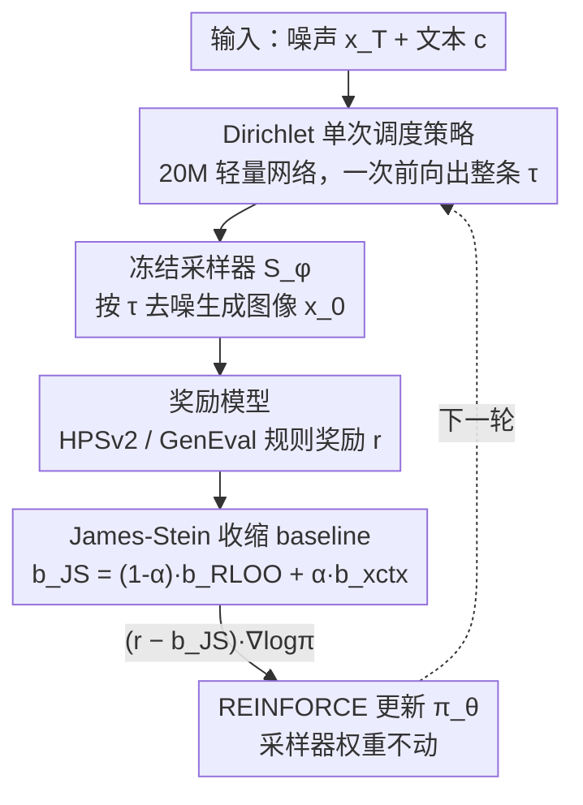

# Designing Instance-Level Sampling Schedules via REINFORCE with James-Stein Shrinkage

**会议**: CVPR2026  
**arXiv**: [2511.22177](https://arxiv.org/abs/2511.22177)  
**代码**: 待确认  
**领域**: 扩散模型 / 图像生成  
**关键词**: 采样调度, REINFORCE, James-Stein 收缩, Dirichlet 策略, 文生图后训练

## 一句话总结
不动模型权重，只为冻结的文生图采样器学一个"按 prompt 和噪声定制的采样时间表"——用单次前向的 Dirichlet 策略一口气吐出整条 schedule，并用 James-Stein 收缩做 REINFORCE 的 reward baseline 来压低梯度方差，使得 SD/Flux 在相同步数下文图对齐更好、5 步就能逼近蒸馏过的 Flux-Schnell。

## 研究背景与动机
**领域现状**：扩散 / flow-matching 文生图模型的推理质量很大程度取决于**采样时间表（sampling schedule）**——即在固定的步数预算下，如何把这几步分配到连续的去噪轨迹上。但主流生产级 backbone（SD-XL、SD-3.5、Flux）对所有输入都用**同一条全局固定的 schedule**。

**现有痛点**：一条"通用 schedule"不可能对测试时遇到的各式 prompt 都最优——不同 prompt 需要的空间/语义细节不同，不同的噪声种子也会带来不同的初始条件（"golden noise"现象就说明了 seed 敏感性）。后训练（post-training）的两条主流路线都在**动权重**：要么微调 backbone 做对齐，要么蒸馏 backbone 换取少步数效率，成本高且改变了原模型。

**核心矛盾**：作者主张存在一个被忽视的、正交于改权重的"杠杆"——**只重排采样时间线**就能榨出预训练采样器额外的生成潜力，且推理几乎零额外开销。难点在于：要按实例学 schedule，自然想到把它当策略来 RL 优化，但 schedule 是高维、开环、一次性的"前瞻计划"，REINFORCE 在这种高维空间里梯度方差极大，训不稳。

**本文目标**：(1) 设计一个**单次前向**就输出整条 schedule 的策略（避免自回归逐步预测带来的 $O(L)$ 推理开销）；(2) 给这种高维 one-shot 策略梯度配一个**可证明更优**的方差缩减 baseline。

**切入角度**：把"逐 context 的 RLOO baseline"和"跨 context 共享 baseline"看成两个极端，用 James-Stein 收缩在二者间做数据驱动的插值——既保留 context 特异性，又借用全局信息稳住估计。

**核心 idea**：用"冻结采样器 + 单次 Dirichlet 调度策略 + James-Stein 收缩 baseline 的 REINFORCE"把采样调度变成一种**模型无关的后训练手段**。

## 方法详解

### 整体框架
方法把"为每个 (噪声 $x_T$, prompt $c$) 设计采样时间表"形式化为**策略优化**问题。一个轻量策略网络 $\pi_\theta$ 在单次前向中，针对输入条件直接输出整条 schedule $\tau$（一组归一化时间步），交给**冻结**的预训练采样器 $S_\phi$ 执行得到图像 $x_0$，再用一个奖励模型（HPSv2 或 GenEval 规则奖励）打分 $r(x_0(\tau); c)$。优化目标是最大化期望奖励

$$J(\theta) = \mathbb{E}_{\tau \sim \pi_\theta(\cdot \mid x_T, c)}\big[\, r(x_0(\tau); c) \,\big].$$

由于整条 schedule 是一个高维"动作"、且奖励只在终端给出，直接用 REINFORCE 梯度方差极大。本文的核心贡献因此落在两处：(a) 用 **James-Stein 收缩 baseline** 把梯度估计的方差/MSE 压到可证明低于 RLOO；(b) 把策略实例化为 **Dirichlet 单次调度器**，用一个 simplex 上的连续分布优雅地表示"把单位区间切成 $L{+}1$ 段"的调度动作。训练时全程不加 KL 约束、策略从零初始化，以便干净地凸显框架本身的效果。

### 关键设计

**1. 单次 Dirichlet 调度策略：把整条时间表当成一个 simplex 动作**

针对"自回归逐步预测下一个时间步会带来 $O(L)$ 推理开销"这个痛点，本文不再逐步决策，而是把**整条去噪 schedule 当作一个联合动作一次性采样**。具体地，令 $\tau \sim \text{Dirichlet}(\alpha_\theta(x_T, c))$，策略网络输出 $L{+}1$ 个非负参数 $\alpha_\theta \in \mathbb{R}^{L+1}_+$。每个分量 $\tau_t$ 是一段非负区间，simplex 约束 $\sum_{t=1}^{L+1}\tau_t = 1$ 保证这些区间恰好划分单位区间 $[0,1]$；再用累加 $\tilde t_\ell = \sum_{j=1}^{\ell}\tau_j$、$t_\ell = 1 - \tilde t_\ell$ 转成严格递减的时间序列 $1 = t_0 > t_1 > \cdots > t_L > t_{L+1} = 0$。第 $L{+}1$ 段 $\tau_{L+1}$ 充当**可学习的"停止边距"**，让策略动态调节有效采样视野。

这个参数化天然满足 simplex 约束、在合法 schedule 上定义了一个光滑分布、还避免了逐步离散决策；相比 $O(L)$ 的逐步 RL，单次 Dirichlet 策略把策略梯度开销摊销为常数。策略网络本身很轻（20M 参数，<采样器网络的 1%）：噪声 $x_T$ 经多尺度卷积块提特征，与预训练文本嵌入 $c$ 做 cross-attention 融合，再经 MLP 投到 $L{+}1$ 个通道，最后用 `softplus` + 一个小常数偏移（$10^{-3}$）保证输出严格为正、Dirichlet 参数合法且梯度数值稳定。

**2. 方差-最优 baseline 与 RLOO 的重新诠释：先讲清"理想 baseline 长什么样"**

REINFORCE 梯度 $\nabla_\theta J = \mathbb{E}[(r(\tau) - b)\nabla_\theta \log \pi_\theta(\tau)]$ 对任意与 $\theta$ 无关的 baseline $b$ 都无偏，但 $b$ 的选择直接决定方差。作者先推出**方差-最优 baseline**（命题 3.1）：

$$b^{*} = \frac{\mathbb{E}\!\left[r(\tau)\,\|\nabla_\theta \log \pi_\theta(\tau)\|^2\right]}{\mathbb{E}\!\left[\|\nabla_\theta \log \pi_\theta(\tau)\|^2\right]}.$$

它在高维策略下无法精确算，但当策略接近确定性（同一 context 内 $\nabla_\theta \log \pi_\theta$ 变化很小）时分子分母解耦，近似为**该 context 的条件均值奖励** $b^* \approx \mathbb{E}_{\tau}[r(\tau)\mid x_T, c]$。这一步把"最优 baseline"和"contextual mean reward"挂上钩，于是常用的 **per-context RLOO**（对每个 context 抽 $K_c$ 条 rollout、用留一法平均 $b_{\text{RLOO}}^{(c,i)} = \frac{1}{K_c-1}\sum_{j\neq i} r^{(c,j)}$）就可被理解为 $b^*$ 的一个 within-context 蒙特卡洛近似。问题是：当每 context 的 rollout 数很小（本文实际只用 2）或不同 prompt 的奖励量纲差别大时，RLOO 是个很噪的均值估计。另一极端是**跨 context baseline** $b_{\text{xctx}}$（对整个 mini-batch 除当前样本外全平均），方差小但忽略了 context 间系统性的奖励尺度差异，会对某些 prompt 过/欠补偿。

**3. James-Stein 收缩 baseline：在 RLOO 与跨 context 之间做可证明更优的插值（核心贡献）**

这是全文的核心。作者用**随机效应（random effects）**视角建模奖励：$r^{(c,i)} = \mu_c + \varepsilon^{(c,i)}$，$\varepsilon^{(c,i)}\sim\mathcal{N}(0,\sigma^2)$；$\mu_c = \mu_0 + \xi^{(c)}$，$\xi^{(c)}\sim\mathcal{N}(0,\delta^2)$。其中 $\sigma^2$ 是 context 内奖励方差，$\delta^2$ 刻画 context 间异质性（即 prompt 难度差异）。该模型下隐变量均值 $\mu_c$ 的后验均值会**自适应地把经验均值 $\bar r_c$ 朝全局均值 $\mu_0$ 收缩**，收缩强度 $\alpha_c^* = \frac{\sigma^2/K_c}{\sigma^2/K_c + \delta^2}$——rollout 数 $K_c$ 越小、或 context 越同质（$\delta^2$ 小），收缩越强。

由于 $(\sigma^2,\delta^2)$ 未知，用经验估计代入就得到 **JS reward baseline**，它正好是前面两个 baseline 的凸组合：

$$b_{\text{JS}}^{(c,i)} = (1-\hat\alpha_c)\, b_{\text{RLOO}}^{(c,i)} + \hat\alpha_c\, b_{\text{xctx}}^{(c,i)}, \qquad \hat\alpha_c = \frac{\hat\sigma^2/(K_c-1)}{\hat\sigma^2/(K_c-1) + \hat\delta^2}.$$

两个 baseline 都用留一法（排除同一样本 $(c,i)$）算，所以 JS 仍保持 REINFORCE 梯度无偏。$\hat\alpha_c \to 0$ 时退回 RLOO，$\hat\alpha_c \to 1$ 时趋向跨 context baseline，是个数据驱动的折中。方差分量用两条 baseline 的统计量估：$\hat\sigma^2$ 由各奖励围绕 $b_{\text{RLOO}}$ 的离散度算，$\hat\delta^2$ 用一个矩估计（MoM）去偏——$\hat\delta^2 = \max\!\big(0,\ \frac{1}{B-1}\sum_c(\bar r_c - b_{\text{xctx}}^{(c,\cdot)})^2 - \hat\sigma^2/\bar K\big)$，减去 $\hat\sigma^2/\bar K$ 把 context 内噪声从 context 间估计中剔除，$\max(0,\cdot)$ 保证非负。每轮迭代重新估这些量，开销可忽略。

理论上（定理 3.2，要求 $B\geq 3$ 个 context）：(i) JS baseline 对 $\mu_c$ 的 MSE **严格低于**无偏的 RLOO baseline；(ii) $b_{\text{JS}}$ 恰是 $\mu_c$ 的经验贝叶斯后验均值，因此是 $b_{\text{RLOO}}$ 与 $b_{\text{xctx}}$ 的 MSE-最优凸组合。换言之，对任意有限 $K_c$，JS 都能在不引入偏差的前提下拿到更低方差——这正是它能稳住高维 one-shot 策略梯度、并带来下游生成提升的根本原因。⚠️ 公式转写自 PDF，细节以原文为准。

### 损失函数 / 训练策略
训练就是带 JS baseline 的 REINFORCE（Algorithm 1）：每轮抽 $B$ 个 context，每个 context 抽 $K_c$ 条 schedule，执行采样器拿奖励 $r^{(c,i)}$，算出 detach 掉的 $b_{\text{JS}}^{(c,i)}$，再用 $\frac{1}{BK_c}\sum (r^{(c,i)} - b_{\text{JS}}^{(c,i)})\nabla_\theta\log\pi_\theta(\tau^{(c,i)}\mid c)$ 平均更新策略。关键超参/设定：rollout 数统一用 2；小模型（SD-XL、SD-3.5M）batch size 32，大模型（SD-3.5L、Flux-Dev）batch size 16；步数预算 $L\in\{5,10,20,40,80\}$。刻意**不加 KL 约束/正则、策略从零初始化**，以保持实验干净可解释。

## 实验关键数据

### 主实验
在 HPD v2（约 100K 训练 prompt + 3200 held-out 测试 prompt）上以 HPSv2 为奖励，对四个 backbone × 五种步数预算对比"默认 schedule / 跨 context RLOO（XCTX）/ RLOO / Ours(JS)"，Flux 额外加一个 TPDM 式 PPO 变体。JS 在所有 backbone、所有步数下都拿到最高对齐分，**低预算（$L\leq 20$）增益最大**：

| Backbone | 方法 | L=5 | L=10 | L=20 | L=40 | L=80 |
|----------|------|-----|------|------|------|------|
| SD-XL | Default | 18.25 | 25.47 | 27.69 | 28.52 | 28.55 |
| SD-XL | Ours (JS) | **24.22** | **26.89** | **27.98** | **28.53** | **28.66** |
| SD3.5-L | Default | 24.24 | 28.04 | 29.85 | 30.43 | 30.61 |
| SD3.5-L | Ours (JS) | **26.28** | **28.88** | **29.98** | 30.41 | **30.64** |
| Flux-Dev | Default | 23.73 | 28.06 | 29.88 | 30.84 | 31.04 |
| Flux-Dev | RLOO | 26.48 | 30.41 | 30.77 | 30.92 | 31.10 |
| Flux-Dev | Ours (JS) | **29.21** | **30.86** | **31.12** | **31.23** | **31.36** |

**5 步逼近蒸馏模型**（HPSv2 on HPDv2，Flux-Dev）：JS 在仅 5 步下几乎追平专门蒸馏出来的 Flux-Schnell，说明不蒸馏的 backbone 本身就藏着可观的少步数能力。

| Default | TPDM PPO | Cr. RLOO | RLOO | Ours (JS) | Flux-Schnell |
|---------|----------|----------|------|-----------|--------------|
| 23.73 | 15.73 | 26.92 | 26.48 | **29.21** | 29.42 |

### 消融实验
主表里的 baseline 对比本身就是核心消融——同一套架构/优化设定，只换 reward baseline，性能差异全部来自 baseline 选择：

| 配置（Flux-Dev, L=5） | HPSv2 | 说明 |
|------|-------|------|
| Default 固定 schedule | 23.73 | 不学调度的下界 |
| TPDM 式 PPO（自回归逐步） | 15.73 | 逐步预测在该设定下反而崩，且 $O(L)$ 开销 |
| Cross-Context RLOO（全局池化） | 26.92 | 方差小但忽略 context 尺度差异 |
| RLOO（逐 context 留一） | 26.48 | rollout 仅 2 时估计很噪 |
| **Ours (JS) 收缩** | **29.21** | 两者凸组合，方差/MSE 可证明更低 |

细粒度对齐上，文本渲染（Flux-Dev，固定步数）JS 把 OCR-Recall 从 49.77 提到 **58.58**；GenEval（40 步）整体分 SD3.5-M 0.62→**0.68**、Flux-Dev 0.64→**0.70**，其中 Counting 提升最猛（Flux 0.58→**0.77**）。

### 关键发现
- **JS 的优势在低预算/高奖励异质场景最明显**：步数少时采样方差主导、baseline 估计噪声大，收缩带来的方差缩减收益最大；步数大到离散化误差消失时 JS 仍一致领先，只是差距缩小。
- **rollout 只有 2 时 RLOO 最脆弱**，正是 JS 借跨 context 信息救场的地方；这与定理 3.2"任意有限 $K_c$ 都严格优于 RLOO"吻合。
- **大预算下全局偏好分（HPSv2）差距会变窄，但细粒度能力差距仍大**：即便 40 步够用，重排 schedule 仍显著改善文本渲染笔画完整度、减少字符丢失，并提升计数等对象级正确性——说明全局分掩盖了细粒度收益。
- 自回归的 TPDM-PPO 在本设定下反而劣于默认（15.73 < 23.73），佐证"单次前向 + 重排固定预算"这条路与"逐步早停求效率"目标不同、且更稳。

## 亮点与洞察
- **把"采样调度"立成一种独立的后训练杠杆**：不碰权重、不蒸馏，只重排时间线就能在相同步数下提升对齐、在 5 步逼近蒸馏模型——模型无关、推理几乎零额外开销，和蒸馏正交可叠加。这个 framing 本身很有迁移价值。
- **把 schedule 当 simplex 上的单次 Dirichlet 动作**很优雅：天然满足递减/划分约束、提供光滑可微分布、把逐步 RL 的 $O(L)$ 开销摊成常数，还顺手用第 $L{+}1$ 段学一个"停止边距"。
- **James-Stein 收缩 baseline 是可即插即用的通用方差缩减原语**：它把 RLOO 与跨 context baseline 统一为经验贝叶斯后验均值，可证明 MSE 严格优于 RLOO、保持无偏、几乎零额外计算。这套东西不止用于 schedule 学习，作者明确指向 RLHF 等长视野 one-shot 策略梯度都能直接换上。
- **"预训练采样器本就有少步数潜力"**这个观察很有启发：少步数能力未必非要靠蒸馏重训，合理重排既有预算就能解锁相当一部分。

## 局限与展望
- 作者承认：调度器架构很简单、奖励类型有限（只用了 HPSv2 与 GenEval 规则奖励），更丰富的策略和更广的目标留待将来。
- **近似依赖"策略接近确定性"假设**：方差-最优 baseline 退化为 contextual mean 这步建立在 $\nabla_\theta\log\pi_\theta$ 在 context 内变化很小之上，训练早期策略熵大时该近似的紧致程度存疑。⚠️ 以原文为准。
- 随机效应模型假设奖励**高斯**、context 间同方差，真实奖励模型（HPSv2/规则奖励）分布可能偏斜或重尾，$\hat\delta^2$ 的矩估计在小 batch 下也可能不稳（故用 $\max(0,\cdot)$ 兜底）。
- 评测高度依赖 HPSv2/OCR/GenEval 这些自动指标，缺少大规模人评；且"5 步逼近 Schnell"只在 HPSv2 单一奖励、Flux-Dev 单一 backbone 上给出，跨奖励/跨架构的普适性还需更多验证。
- 展望：自适应早停做动态步数预算、多目标/过程级奖励（组合性、美学、安全）、把 JS 收缩推广到 RLHF 及视频/flow/3D 生成管线。

## 相关工作与启发
- **vs TPDM（自回归调度）**：TPDM 用内部 latent + 当前时间**自回归地**预测下一步，目标是早停/变长采样求效率，推理需 $O(L)$ 次策略调用；本文是**单次前向**输出整条 schedule、目标是固定预算下质量-步数 Pareto 前沿，推理常数开销。同设定下本文显著更强（且 TPDM-PPO 在主表里甚至劣于默认）。
- **vs 蒸馏类少步数方法（Progressive/Consistency Distillation、Flux-Schnell）**：它们重训/蒸馏 backbone 换少步数，成本高且改了模型；本文不重训、只重排既有预算，是正交且互补的路线，5 步即可逼近蒸馏结果。
- **vs RLOO / 跨 context baseline**：RLOO 是逐 context 留一均值（$b^*$ 的 within-context MC 近似），跨 context 是全局池化；本文证明二者分别是 JS 收缩的两个极端，JS 的经验贝叶斯凸组合可证明 MSE 更低。
- **vs DDPO / DPOK / Diffusion-DPO（RL 对齐扩散）**：这些把去噪 latent 序列当动作来微调生成器权重；本文把**整条 schedule** 当一个高维开环计划、且**不动权重**，并针对由此暴露的高方差问题给出原理化的方差缩减方案。

## 评分
- 新颖性: ⭐⭐⭐⭐⭐ "重排采样时间线作后训练杠杆 + James-Stein 收缩 baseline"两个点都新颖且互补，理论与应用兼具。
- 实验充分度: ⭐⭐⭐⭐ 覆盖 4 个 backbone × 5 种步数 + 文本渲染/GenEval 细粒度，baseline 对比扎实；缺人评、奖励类型偏少。
- 写作质量: ⭐⭐⭐⭐ 动机清晰、理论推导（命题/定理）与工程实现衔接好；公式密集，部分需结合附录。
- 价值: ⭐⭐⭐⭐⭐ 模型无关、即插即用、推理零额外开销，且 JS baseline 可外溢到 RLHF 等更广的策略梯度场景。

<!-- RELATED:START -->

## 相关论文

- [\[CVPR 2026\] Few-Step Diffusion Sampling Through Instance-Aware Discretizations](few-step_diffusion_sampling_through_instance-aware_discretizations.md)
- [\[NeurIPS 2025\] Instance-Level Composed Image Retrieval](../../NeurIPS2025/image_generation/instance-level_composed_image_retrieval.md)
- [\[CVPR 2025\] ILIAS: Instance-Level Image Retrieval At Scale](../../CVPR2025/image_generation/ilias_instance-level_image_retrieval_at_scale.md)
- [\[ECCV 2024\] Rejection Sampling IMLE: Designing Priors for Better Few-Shot Image Synthesis](../../ECCV2024/image_generation/rejection_sampling_imle_designing_priors_for_better_few-shot_image_synthesis.md)
- [\[CVPR 2026\] Mixture of States: Routing Token-Level Dynamics for Multimodal Generation](mixture_of_states_routing_token-level_dynamics_for_multimodal_generation.md)

<!-- RELATED:END -->
