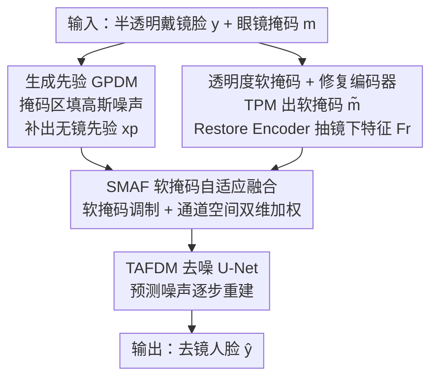

# Diff-SemiER: Transparency-Aware Adaptive Fusion Diffusion Model with Generative Prior for Semi-Transparent Eyeglasses Removal

**会议**: CVPR 2026  
**论文**: [CVF Open Access](https://openaccess.thecvf.com/content/CVPR2026/html/Li_Diff-SemiER_Transparency-Aware_Adaptive_Fusion_Diffusion_Model_with_Generative_Prior_for_CVPR_2026_paper.html)  
**代码**: https://github.com/JiahaoLi03/Diff-SemiER  
**领域**: 扩散模型 / 图像生成与修复  
**关键词**: 半透明眼镜去除, 扩散模型, 生成先验, 软掩码自适应融合, 人脸修复  

## 一句话总结
针对"半透明墨镜"这种镜片下既有残留可见信息、又被部分遮挡的难题，Diff-SemiER 用一条**生成先验扩散分支（GPDM）**先补出结构合理的无镜人脸，再用一条**透明度感知融合扩散分支（TAFDM）**配合软掩码把"生成内容"和"镜下真实细节"在通道+空间双维度上自适应融合，从而在不同遮挡程度下都能既保身份又保细节，在合成集和真实集上全面超过现有方法。

## 研究背景与动机
**领域现状**：眼镜去除（eyeglasses removal）想从被眼镜遮挡的人脸里恢复清晰眼部，以提升人脸识别、表情分析、关键点检测等下游任务。现有工作主要分两类——图像翻译类（把"戴镜/不戴镜"当成两个域学跨域映射）和图像修复类（用掩码定位镜片区域、再做遮挡补全）。

**现有痛点**：这些方法几乎只处理两个极端——**全透明眼镜**（遮挡只在镜框、眼部信息基本完整）和**不透明墨镜**（镜片完全挡死、只能纯生成）。而现实里大量的是介于两者之间的**半透明墨镜**：镜片有部分透射率，眼睛被遮但仍透出一部分真实纹理。翻译类方法靠全局分布对齐，缺乏对镜片内"可见度逐点变化"的细粒度建模，结果模糊、丢身份；修复类方法用**二值掩码**把整个镜片区域一刀切当成"完全缺失"，于是直接丢掉了镜下那点宝贵的真实信息，导致身份漂移和细节缺失。

**核心矛盾**：作者点明，半透明场景的真正难点**不是生成能力不够，而是"生成自由度"与"利用可见信息"之间的平衡**。遮挡轻时应多用镜下真实细节（别瞎生成），遮挡重时应多靠生成先验（别硬抠那点残影），而二值掩码无法表达这种连续变化的透射率。

**本文目标**：构造一个能随遮挡程度动态调节的框架，既不浪费镜下可见信息、又在重遮挡时保留足够生成自由度，并解决"没有半透明配对数据集"的问题。

**核心 idea**：把任务拆成"结构生成"和"细节修复"两个子问题——先用一条**不以半透明图为条件**的生成先验分支补出干净人脸结构，再用一条**透明度软掩码调制的自适应融合分支**把生成特征与镜下真实特征按逐点透射率融合，用"软掩码"替代"二值掩码"来表达连续透射率。

## 方法详解

### 整体框架
Diff-SemiER 是一个**双扩散分支**框架。输入是戴半透明墨镜的人脸 $y$ 及其眼镜掩码 $m$，输出是去镜后的高保真人脸 $\hat y$。整条推理管线是：

1. **生成先验分支 GPDM**：把 $y$ 中眼镜掩码区域填成标准高斯噪声得到条件 $\tilde x$，让一个独立训练的条件扩散模型在"看不到镜下信息"的前提下补出一张结构合理、语义连贯的无镜人脸 $x_p$，作为后续修复的**全局生成先验**。
2. **透明度预测模块 TPM**：从输入预测一张**透明度软掩码** $\tilde m$，逐点刻画镜片透射率（哪里透得多、哪里透得少）。
3. **修复编码器 Restore Encoder**：从原始半透明图 $y$ 里抽取镜下真实可见特征 $F_r$。
4. **融合扩散分支 TAFDM**：一个去噪 U-Net，在每个反向步 $t$ 从噪声输入 $x_t$ 和先验 $x_p$ 抽生成特征 $F_g$；再由 **SMAF 软掩码自适应融合模块**在多个尺度上、受 $\tilde m$ 调制地把 $F_g$ 和 $F_r$ 融合后送入解码器预测噪声 $e_t$，逐步重建出 $\hat y$。

支撑这一切的还有一个**离线数据引擎**：透射率数据合成方法，造出 25,000 对"干净脸 ↔ 半透明戴镜脸"的配对数据用于训练评测。下图是推理期的模型管线（数据合成属离线训练数据构建，不在此图内）：

### 关键设计

**1. 任务解耦 + 生成先验 GPDM：先补结构，别让镜下噪声拖累生成**

作者发现，如果直接把半透明图当条件喂给扩散模型，对高透明镜片还行（可见信息多），但在强遮挡下镜下信息太少，模型反而被这点残缺信息"绑住"，生成出模糊或扭曲的结果。于是把任务解耦成"结构生成"和"细节修复"两步：GPDM 训练时**刻意不用半透明图作条件**，而是把眼镜掩码区域填成标准高斯噪声构成条件 $\tilde x$，逼模型最大化生成能力、学出结构合理的无镜人脸。它是一个条件扩散模型，反向过程为 $p_\theta(x_{0:T}\mid\tilde x)=p(x_T)\prod_{t=1}^{T}p_\theta(x_{t-1}\mid x_t,\tilde x)$，前向加噪 $x_t=\sqrt{\bar\alpha_t}\,x_0+\sqrt{1-\bar\alpha_t}\,\epsilon$，去噪器预测 $e_t=\epsilon_\theta(x_t,\tilde x,t)$，训练损失为

$$L_{GPDM}=\mathbb{E}_{x_0,t,\epsilon}\,\bigl\|\epsilon_\theta(x_t,\tilde x,t)-\epsilon\bigr\|_F^2.$$

这样产出的 $x_p$ 是一张"干净的猜测"，专门给重遮挡场景提供全局语义参考——后续分支可以在它之上再去补真实细节，而不必从零生成。

**2. 透明度软掩码 + 修复编码器：用连续透射率替代二值掩码，把镜下真实信息捡回来**

二值掩码把镜片区一刀切成"全缺失"，于是镜下透出的真实眼睛纹理被白白丢掉、身份随之漂移。本文改用 TPM 预测一张取值连续的**透明度软掩码** $\tilde m$，逐点表示该位置透出多少真实信息；同时引入**修复编码器**从原图 $y$ 抽取镜下可见特征 $F_r$。两者配合，使得"哪里该信任镜下真实纹理、哪里该信任生成内容"有了逐点的、可微的依据——这正是 GPDM 单独做不到的（它只生成、不利用残留信息）。⚠️ 论文对 TPM 的内部结构着墨很少，仅说明它输出 $\tilde m$ 来调制后续融合，具体网络细节以原文为准。

**3. SMAF 软掩码自适应融合：通道+空间双维度动态加权，遮挡轻多用真实、遮挡重多用生成**

标准融合（拼接或相加）对透射率变化"一视同仁"，容易产生伪影或丢细节。SMAF 在软掩码 $\tilde m$ 引导下，为每个特征生成跨通道、跨空间的动态融合权重。它先用软掩码调制修复特征 $\tilde F_r=F_r\odot\tilde m$，得到初步融合 $F=F_g+\tilde F_r$，再分别算空间注意力和通道注意力：

$$W_s=\mathrm{Conv}_{7\times7}\bigl([F^s_{GAP},F^s_{GMP},m]\bigr),\quad W_c=\mathrm{Conv}_{1\times1}\bigl(\max(0,\mathrm{Conv}_{1\times1}(F^c_{GAP}))\bigr),$$

相加得到粗权重 $W_t=W_s+W_c$；为提升融合自适应性，再经**通道洗牌（channel shuffle）+ 分组卷积**细化出最终动态权重图 $W=\mathrm{Sigmoid}\bigl(\mathrm{GConv}_{7\times7}(\mathrm{CS}[F,W_t])\bigr)$（分组数等于通道数 $C$）。最后只在眼镜掩码区做自适应融合、非镜区保留生成特征以保证背景一致：

$$\hat F=\mathrm{Conv}_{1\times1}\Bigl(\tilde F_r\odot W+F_g\odot(1-W)\Bigr)\odot M_g+F_g\odot(1-M_g).$$

这套"由粗到细 + 双维加权"的机制让融合是**内容自适应**的：低遮挡处 $W$ 偏向真实特征 $\tilde F_r$ 保细节，高遮挡处偏向生成特征 $F_g$ 保结构。实验还表明，即便预测的软掩码有明显偏差，SMAF 仍能靠双维重加权 + 生成先验把误差吸收掉。TAFDM 整体的反向过程以 $y,x_p,m$ 为条件 $p_\phi(x_{0:T}\mid y,x_p,m)$，损失为 $L_{TAFDM}=\mathbb{E}_{x_0,t,\epsilon}\|\epsilon_\phi(x_t,y,x_p,m,t)-\epsilon\|_F^2$。

**4. 透射率数据合成：用"径向渐变 Alpha"造出真实感的半透明配对数据**

现有人脸数据集（CelebA、MeGlass）虽含眼镜样本，但没有半透明配对真值，无法训练。作者先标注区分镜片/镜框、训分割网络抽出精确掩码，再两步合成：先按掩码做像素级融合造**不透明戴镜图** $I_{syn}^s=I_{g\text{-}free}\odot(1-M_g)+I_s\odot M_g$；再用一个**径向渐变 Alpha 模块**生成动态透明通道 $\alpha$——它是一个可控的径向渐变矩阵，靠"像素到镜片中心的距离 + 预设渐变策略"调制透明度（离边缘越远越不透），经轮廓提取、逐点透明度计算、高斯模糊三步得到自然渐变。最终半透明图为

$$I_{syn}^{semi}=I_{g\text{-}free}\odot M_l\odot\alpha+I_{syn}^s\odot(1-M_l)+I_{syn}^s\odot M_l\odot(1-\alpha),$$

其中 $\alpha\in[0,1]$ 控制镜片透明度。由此造出 25,000 对样本（GPDM 用 10,000 对、TAFDM 用 15,000 对），并额外合成 1,000 对作 FFHQ-Test。这个 $\alpha$ 不只是造数据——它本质就是训练时透射率软掩码的监督来源，让"软掩码"这一核心 idea 有了可学的真值。

## 实验关键数据

### 主实验
在合成集 FFHQ-Test（1,000 对）上，Diff-SemiER 在全部 5 个指标上都拿到最优，尤其是衡量身份保持的 IDD（ArcFace 特征角距离）：

| 方法 | FID↓ | PSNR↑ | SSIM↑ | LPIPS↓ | IDD↓ |
|------|------|-------|-------|--------|------|
| Pix2Pix (GAN) | 67.55 | 30.57 | 0.9253 | 0.0589 | 0.752 |
| ERGAN (GAN) | 56.83 | 28.18 | 0.9093 | 0.0441 | 0.831 |
| MAT (Transformer) | 49.91 | 31.95 | 0.9576 | 0.0176 | 0.734 |
| Palette (Diffusion) | 47.63 | 33.99 | 0.9726 | 0.0125 | 0.651 |
| RDDM (Diffusion) | 47.65 | 35.33 | 0.9764 | 0.0115 | 0.576 |
| Resfusion (Diffusion) | 47.57 | 35.30 | 0.9774 | 0.0110 | 0.582 |
| **Ours** | **47.45** | **36.16** | **0.9802** | **0.0094** | **0.534** |
| GT | 46.44 | ∞ | 1 | 0 | 0 |

在三个**真实世界**数据集（无配对真值，只用 FID）上同样最优或次优：

| 方法 | FFHQ | CelebA-HQ | CelebA |
|------|------|-----------|--------|
| RDDM | 66.21 | **99.53** | 61.82 |
| Resfusion | 67.40 | 100.45 | 62.92 |
| **Ours** | **66.13** | 99.80 | **61.60** |

此外 50 人用户研究（每集 50 样本、共 150）中，Diff-SemiER 在与 5 个方法的两两对比里都被大比例偏好，例如对最强基线 Resfusion 在 FFHQ 上为 30.68% / 69.32%（对方更好 / 本文更好）。

### 消融实验
四个变体在 FFHQ-Test 上：

| 配置 | PSNR↑ | SSIM↑ | LPIPS↓ | IDD↓ | 说明 |
|------|-------|-------|--------|------|------|
| only GPDM | 33.66 | 0.9714 | 0.0137 | 0.682 | 只用生成先验，结构完整但丢纹理丢身份 |
| w/o Generative Prior | 35.79 | 0.9794 | 0.0101 | 0.581 | 去掉先验，高遮挡下过度依赖残留特征致模糊伪影 |
| only Soft Mask | 35.64 | 0.9790 | 0.0110 | 0.563 | 只靠软掩码，性能过度依赖掩码精度 |
| w/o Soft Mask | 36.10 | 0.9797 | 0.0096 | 0.543 | SMAF 去掉软掩码调制，高频细节恢复不稳 |
| **Diff-SemiER (full)** | **36.16** | **0.9802** | **0.0094** | **0.534** | 完整模型全指标最优 |

### 关键发现
- **生成先验对"身份"贡献最大**：只用 GPDM 时 IDD 高达 0.682（最差），说明纯生成虽然结构对但身份漂移严重；去掉生成先验（w/o Generative Prior）则在高遮挡下出现模糊伪影——两者缺一不可，先验管"重遮挡兜底"，融合管"轻遮挡用真实"。
- **软掩码调制让融合更鲁棒**：去掉软掩码调制（w/o Soft Mask）PSNR/IDD 都略降；而图 8 显示即使预测软掩码有明显偏差，SMAF 仍能靠通道+空间双维重加权 + 生成先验把误差吸收，这是它比"只用软掩码"更稳的关键。
- **失败场景**：极端头部姿态下镜片区会严重畸变，恢复质量下降（图 9），作者计划在训练集补充更多此类样本。

## 亮点与洞察
- **把"半透明"问题重新定义为平衡问题**：作者一句"难点不是生成能力，而是生成自由度与可见信息利用的平衡"直接点破要害，后面所有设计都围绕这个矛盾展开，逻辑非常干净。
- **"软掩码替二值掩码"是可迁移的小切口**：凡是"部分遮挡/半透明/逐点可信度不同"的补全任务（去水印、去反光、去阴影、薄云去除）都可借鉴——用连续透射率掩码 + 双维自适应融合，比一刀切的二值掩码更细腻。
- **数据合成的 $\alpha$ 一举两得**：径向渐变 Alpha 既造了配对训练数据，又天然成了透明度软掩码的监督真值，让"软掩码"这个核心模块有真值可学，设计上很经济。
- **解耦"生成"与"修复"为两条扩散分支**：先验分支不看条件专注生成、融合分支专注利用真实，避免了"单分支既要又要"被弱信息拖累——这种"先猜全局、再补局部"的双扩散结构可迁移到其他重遮挡修复。

## 局限与展望
- 作者承认：**极端头部姿态**会让镜片区严重畸变、恢复质量明显下降（图 9），需靠扩充训练样本缓解。
- ⚠️ **真实集只用 FID 评测**：因为真实半透明样本没有配对无镜真值，PSNR/SSIM/IDD 无法在真实集上算，"身份保持更好"在真实场景缺乏定量直接证据，只能靠用户研究和合成集间接支撑。
- **TPM 细节披露不足**：透明度预测模块如何训练、其软掩码精度如何，论文交代很少；而消融显示"only Soft Mask"性能"过度依赖掩码精度"，说明 TPM 质量是潜在瓶颈，却没有单独的 TPM 精度分析。
- **多分支多扩散推理成本**：GPDM 先采样出先验、TAFDM 再多步去噪并多尺度融合，推理开销与延迟论文未报告，实用部署需评估。

## 相关工作与启发
- **vs 图像翻译类（Pix2Pix、ERGAN）**：它们把戴镜/不戴镜当两个域学全局映射，缺乏对镜内可见度逐点变化的细粒度建模，结果模糊、身份漂移；本文用软掩码 + 修复编码器显式利用镜下真实信息，IDD 从 0.75~0.83 降到 0.534。
- **vs 二值掩码修复类（MAT、Palette 及常规扩散 inpainting）**：它们用二值掩码把镜片区当全缺失、丢掉镜下残留信息；本文核心区别就是用**连续透射率软掩码**表达"部分可见"，并用 SMAF 在通道+空间双维自适应融合，而非简单拼接/相加。
- **vs 残差先验扩散（RDDM、Resfusion）**：它们用残差先验在低遮挡下恢复部分眼部细节，但高遮挡下崩坏（缺纹理、畸变）；本文额外引入独立 GPDM 生成先验给重遮挡兜底，因此在合成与真实集上都更稳，对 Resfusion 在 FFHQ-Test 上 IDD 0.534 vs 0.582。

## 评分
- 新颖性: ⭐⭐⭐⭐ 把半透明眼镜去除重定义为"生成 vs 利用可见信息"的平衡问题，用软掩码 + 双分支扩散 + 双维自适应融合切入，角度清晰但模块多为已有注意力/扩散组件的组合。
- 实验充分度: ⭐⭐⭐⭐ 合成集 5 指标 + 三真实集 FID + 用户研究 + 四变体消融较完整，但真实集缺配对真值只能用 FID、TPM 与推理成本未单独分析。
- 写作质量: ⭐⭐⭐⭐ 动机和公式交代清楚、图文对应好，TPM 内部结构披露偏少。
- 价值: ⭐⭐⭐⭐ 填补半透明墨镜去除空白并开源代码与数据合成方法，"软掩码替二值掩码"思路对一类部分遮挡修复任务有迁移价值。

<!-- RELATED:START -->

## 相关论文

- [\[CVPR 2026\] Precise Object and Effect Removal with Adaptive Target-Aware Attention](precise_object_and_effect_removal_with_adaptive_target-aware_attention.md)
- [\[CVPR 2026\] CaReFlow: Cyclic Adaptive Rectified Flow for Multimodal Fusion](careflow_cyclic_adaptive_rectified_flow_for_multimodal_fusion.md)
- [\[CVPR 2026\] Denoising, Fast and Slow: Difficulty-Aware Adaptive Sampling for Image Generation](denoising_fast_and_slow_difficulty-aware_adaptive_sampling_for_image_generation.md)
- [\[CVPR 2026\] Streaming Diffusion Model for Fast Infrared and Visible Video Fusion](streaming_diffusion_model_for_fast_infrared_and_visible_video_fusion.md)
- [\[NeurIPS 2025\] Diff-ICMH: Harmonizing Machine and Human Vision in Image Compression with Generative Prior](../../NeurIPS2025/image_generation/diff-icmh_harmonizing_machine_and_human_vision_in_image_compression_with_generat.md)

<!-- RELATED:END -->
