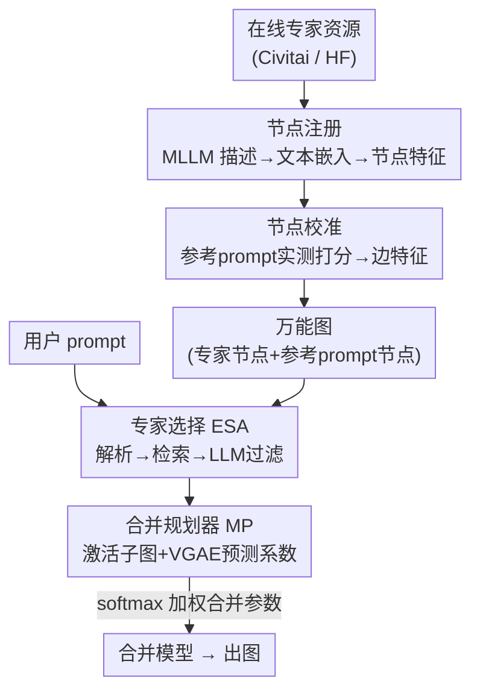

# DiffGraph: An Automated Agent-driven Model Merging Framework for In-the-Wild Text-to-Image Generation

**会议**: CVPR 2026  
**论文**: [CVF Open Access](https://openaccess.thecvf.com/content/CVPR2026/html/Li_DiffGraph_An_Automated_Agent-driven_Model_Merging_Framework_for_In-the-Wild_Text-to-Image_CVPR_2026_paper.html)  
**代码**: [项目页](https://zhuoling.site/DiffGraph)  
**领域**: 文本生成图像 / 模型合并 / Agent  
**关键词**: 模型合并, 扩散专家模型, LLM Agent, 图自编码器(VGAE), in-the-wild T2I  

## 一句话总结
DiffGraph 把网上海量的扩散专家模型（checkpoint / LoRA）组织成一张"万能图"，再用两个 LLM agent 解析用户 prompt、动态激活子图，并用一个变分图自编码器（VGAE）预测各专家的合并系数，从而免训练、免测试时优化地按需合并任意数量专家，在 DABench / DiffusionDB 上的人类偏好指标全面领先。

## 研究背景与动机
**领域现状**：扩散大模型在大规模预训练后，开发者用自己的小数据微调出大量"专家模型"（checkpoint 或 LoRA），分享在 Civitai、Hugging Face 等平台上，形成了一个不断膨胀的在线专家生态。把多个专家合并（model merging）就能组合技能，比如"特定角色 + 特定画风"。

**现有痛点**：已有合并方法基本只能处理**预先给定的、数量固定的小专家集**，换一组专家或换数量就要重训练或测试时优化。更近期的灵活方法（K-LoRA、AutoLoRA、LoRA.rar）虽然能免训练换组合，但它们**直接把专家的模型参数矩阵当输入特征**去预测合并系数。

**核心矛盾**：在线专家即便来自同一底模，也可能用千差万别且不断翻新的微调策略、不同数据、不同配置训练出来，参数层面存在巨大且复杂的异质性（甚至架构都不同，checkpoint vs LoRA）。**以参数为输入特征的方法天然泛化不到这种异质、海量、随时间演化的真实在线资源**，而且大多仍被限制在固定数量或需要人工指定要合并几个专家。

**本文目标**：做到 (1) 自动采集、管理、利用大规模在线专家；(2) 部署后免重训、免测试时优化地为不同用户 prompt 合并**不同专家、甚至不同数量**的专家；(3) 能无缝扩展到新涌现的专家。

**切入角度**：作者的关键观察是——**图天然能编码异质实体及其关系**。于是不再把专家当参数矩阵，而是把每个专家当成图里的一个节点，用"文本描述编码"和"在参考 prompt 上的实测质量分"来刻画它的能力，让能力表示落在一个可解释、与"出图质量"目标对齐的共享空间里。

**核心 idea**：用一张"专家能力图" + 两个 LLM agent + 一个 VGAE，把"该合并谁、各占多大权重"变成"在图上选子图 + 预测边权重"的问题。

## 方法详解

### 整体框架
DiffGraph 由三个部件协作：两个 LLM 驱动的 agent —— **图构建 Agent（GCA）** 和 **专家选择 Agent（ESA）**，外加一个 **VGAE 合并规划器（MP）**。整条流水线分两大步：

1. **万能图构建（离线，一次性）**：GCA 自动爬取在线专家，把每个专家登记为一个**专家节点**，并通过"节点注册"（文本描述 → 节点特征）和"节点校准"（在参考 prompt 上实测打分 → 边特征）两套互补机制丰富节点/边特征，构成一张可本地轻量存储的万能图。
2. **动态子图激活（在线，每条 prompt 一次）**：ESA 解析用户 prompt、检索并过滤出真正需要的 CKPT/PEFT 专家；MP 以选中专家节点为中心激活子图、把用户 prompt 临时插进去当节点，再用训练好的 VGAE 编码子图上下文、预测"用户 prompt 节点 ↔ 各专家节点"的边权重作为合并系数，最后按系数把专家参数加权合成最终模型出图。

整张万能图只需构建一次（论文里 2319 个专家、4×A100 跑 29 小时），新专家加入只需 1.2 分钟、免训练；推理时按需激活子图，避免把无关专家一股脑塞进去拖累质量。

### 关键设计

**1. 节点注册与校准：用"文本能力描述 + 实测质量分"取代原始参数刻画专家**

这是为了绕开"参数异质性"这个核心障碍。**节点注册（Node Registration）**针对"参数矩阵当特征泛化不了"的痛点：对每个采集到的专家，先在图里登记为孤立节点，再用 MLLM（如 GPT-4o）读它主页上的用法说明和示例 prompt，生成一段简洁的技能描述，用文本嵌入模型（all-MiniLM-L6-v2）编码成**节点特征**。这种文本特征还能直接拿来按用户需求做高效的"嵌入相似度预筛选"。

但纯文本描述只是定性、可能不准，反映不出专家真实的出图能力。于是**节点校准（Node Calibration）**补上定量视角：构造一组有代表性的**参考 prompt** $\{r_j\}_{j=1}^{N_r}$ 作为图里的另一类节点（参考 prompt 节点），让每个专家在所有参考 prompt 上实际出图，并用多指标（CLIP Score、ImageReward、Aesthetic Score、PickScore、HPSv2）打分，把这些分数拼接成连接"专家节点 ↔ 参考 prompt 节点"的**边特征**。为保证参考 prompt 足够多样，作者按名词/介词/形容词等语言特征对候选 prompt 排序、挑最有代表性的。两套机制合力把所有专家映射进一个**共享、可解释、与"最大化出图质量"目标对齐的能力空间**——这正是后续 VGAE 只需学一个简单映射就能工作的根本原因。GCA 还会周期性监控平台，用同样两套机制免训练地增删节点，让图始终与生态同步。

**2. 专家选择 Agent（ESA）：让 LLM 从上千专家里"分角色"选出该合并的少数几个**

痛点是：在线专家成千上万，既不可能全塞进合并过程（算力上不可行、无关专家还会掉质量），也不可能把所有专家描述一次喂给 LLM（超 token 限制）。ESA 用"检索 + 过滤 + 分角色"三步解决。它先把用户 prompt $p$ 解析成一段精简摘要 $s$（抓住主体与整体画风），把 $s$ 编码后与专家节点特征算相似度，检索 top-$K_1$ 个 **CKPT 专家**候选（CKPT 是完整扩散模型，决定主体与整体风格）；同时以 chain-of-thought 方式把 $p$ 拆成若干语义成分（角色、场景等），为每个成分推断需要的视觉属性 $\{a_m\}_{m=1}^{N_a}$（如画角色要细化眼睛嘴唇、画场景要调光照），每个属性 $a_m$ 再检索 top-$K_2$ 个 **PEFT 专家**候选（PEFT/LoRA 提供细粒度个性化控制）。

但纯嵌入检索会混进"看着相关其实不相关"的专家（"红发女子肖像"可能把"红色羽毛火烈鸟专家"也召回），还会重复选到技能相似的冗余专家。于是 ESA 再加一道 **LLM 过滤**：让 LLM 逐一审阅候选专家描述、评估与解析出的生成需求是否对齐，最终敲定要合并的专家集合 $M_{exp}=\{M_{ckpt}, M_{peft}\}$，其中 CKPT 数 $N_{ckpt}$ 与 PEFT 数 $N_{peft}$ **由 LLM 自动决定**——这正是"不同 prompt 可合并不同数量专家"的来源。把 CKPT/PEFT 当作"底座 vs 细节"两类互补角色分开选，是这一步的关键。

**3. VGAE 合并规划器（MP）：在激活子图上用变分图自编码器预测每个专家的合并系数**

有了选中的专家，还要决定"各占多大权重"。MP 激活以选中专家节点及其一跳邻居（参考 prompt 节点）为中心的子图 $G=(V,E,X,\mathcal{E})$，节点集 $V=\{v_p, V_{ref}, V_{exp}\}$ 含临时插入的用户 prompt 节点 $v_p$，子图上的节点特征 + 边特征共同给出对各专家能力的丰富上下文刻画。然后用一个 VGAE 编码上下文、预测"用户 prompt 节点 ↔ 各专家节点"的边权重 $w\in\mathbb{R}^{|V_{exp}|}$ 当合并系数：

$$w = f(G;\theta) = \mathrm{Dec}(w\mid H)\,\mathrm{Enc}(H\mid G)$$

编码器把子图编码成隐变量 $H=[h_p^\top; H_{exp}]$，每个隐向量服从高斯 $\mathrm{Enc}(h_i\mid G)=\mathcal{N}(h_i\mid \mu_i, \mathrm{diag}(\sigma_i^2))$，其中 $\mu=\mathrm{GNN}_\mu(G;\theta_\mu)$、$\log\sigma=\mathrm{GNN}_\sigma(G;\theta_\sigma)$ 用两层 GCN 实现。解码器对每个专家输出系数 $w_i\in[0,1]$。一个值得注意的细节：因为 §3.3 的强化学习训练需要**概率式**预测而非确定值，作者把 $w_i$ 建模为 $(0,1)$ 上的 **Beta 分布** $w_i\sim\mathrm{Beta}(\alpha_i,\beta_i)$；为避免多峰 Beta 采到不稳定的系数，强制 $\alpha_i,\beta_i>1$（让分布单峰），具体做法是 FFN 预测实值 $a_i,b_i$ 后令 $\alpha_i=1+e^{a_i},\ \beta_i=1+e^{b_i}$。测试时直接取期望 $w_i=\frac{\alpha_i}{\alpha_i+\beta_i}$ 作确定性系数。

拿到 $w$ 后按类型 softmax 加权合并：CKPT 部分 $W=\sum_{i=1}^{N_{ckpt}}\mathrm{softmax}(w_{ckpt})_i\cdot W_i$，PEFT 部分 $\Delta W=\sum_{j=1}^{N_{peft}}\mathrm{softmax}(w_{peft})_j\cdot \Delta W_j$，最终合并模型参数 $\overline{W}=W+\Delta W$。把"挑权重"放到这种以文本/分数特征为输入的图自编码器上，而不是直接吃参数矩阵，是它能泛化到异质在线专家的关键。

### 损失函数 / 训练策略
框架里**唯一可学的就是这个轻量 VGAE** $f(\cdot;\theta)$，$\theta=\{\theta_{enc},\theta_{dec}\}$。训练时从训练集（与参考 prompt 不重叠）随机采 prompt 模拟用户输入，直接以"出图质量"为目标：$\arg\max_\theta \mathbb{E}_{\theta\sim\Omega}[u(I,p)]$，$u$ 是图像质量评估指标、$I$ 是用系数 $w$ 合成模型后生成的图。由于完整去噪过程的计算图太深、梯度难回传，作者用 **policy gradient** 近似优化：

$$\nabla_\theta\mathbb{E}_{\theta\sim\Omega}[u(I,p)] \approx \frac{1}{B}\sum_{b=1}^{B} u(I_b,p_b)\,\nabla_\theta P(w_b)$$

其中 $B$ 是 batch size，$P(w_b)$ 是 $w_b$ 被采样的概率。优化器 AdamW（beta=(0.9,0.99)，初始 lr=1e-2）。

## 实验关键数据

### 主实验
两个底模（SD15、FLUX.1 Dev），在 DABench 测试集与 DiffusionDB 上评测，指标含 ImageReward(IR)、HPSv2.1(HPS)、Aesthetic(AS)、PickScore(PS)、CLIP Score(CS)。下表摘录 SD15 上的 DABench / DiffusionDB 结果（IR / HPS / AS）：

| 方法 | DABench IR ↑ | DABench HPS ↑ | DiffusionDB IR ↑ | DiffusionDB HPS ↑ |
|------|------|------|------|------|
| Direct(SD15) | -18.27 | 23.88 | 14.83 | 23.74 |
| Diffusion Soup | -3.81 | 25.55 | 33.79 | 25.64 |
| Model Swarms | 17.74 | 25.90 | 50.62 | 26.63 |
| AutoLoRA | 26.51 | 27.41 | 35.62 | 25.56 |
| DiffAgent（单专家） | 29.94 | 27.83 | 52.65 | 27.52 |
| **Ours fixed**（去 ESA，固定 13 专家集） | 23.14 | 28.37 | 54.83 | 27.67 |
| **Ours（完整）** | **73.11** | **30.06** | **85.40** | **29.48** |

完整版在 IR 上大幅领先（SD15 上 73.11 vs 次优 DiffAgent 29.94）。即便只用受限的"固定专家集 + 去掉 ESA"变体（Ours fixed），也已稳定超过 Diffusion Soup / DARE / Model Swarms，作者归因于"图视角"本身的优势。值得注意的是 K-LoRA / LoRA.rar / AutoLoRA 这三种**参数依赖**方法在大规模在线专家下提升有限，甚至不如单专家的 DiffAgent，印证了"参数当特征泛化不动异质资源"的判断。FLUX 上趋势一致（Ours IR 在 DABench/DiffusionDB 达 136.62 / 148.75，均为最高）。

### 消融实验
四组消融（SD15 / DABench，指标 IR）：

| 模块 | 配置 | IR ↑ | 说明 |
|------|------|------|------|
| 图构建 | w/o registration | 31.04 | 节点特征置零 |
| 图构建 | w/o calibration | 11.92 | 删掉所有边特征，掉得最狠 |
| 图构建 | Learnable calibration | 19.63 | 边特征改可学嵌入，仍远不如实测分 |
| ESA | w/o ESA（MP 直接对全图选 top-10） | 16.12 | 没有 agent 选专家 |
| ESA | Random activation（随机激活 10 个） | 15.36 | 随机选专家 |
| MP | w/o MP（等权合并） | 13.29 | 不预测系数 |
| MP | Parameter-based merging | 26.62 | 把节点特征换回模型参数喂 VGAE |
| MP | **Ours（full）** | **73.11** | 完整模型 |

### 关键发现
- **节点校准（边特征/实测质量分）贡献最大**：去掉后 IR 从 73.11 崩到 11.92，远比去掉节点注册（31.04）严重；说明"定量实测能力"比"定性文本描述"更关键。
- **把节点特征换回原始模型参数（Parameter-based merging）只有 26.62**，远低于用文本/分数特征的 73.11，直接验证了核心主张——参数不是好的专家能力表示。
- **ESA 不可或缺**：去掉或随机激活专家都掉到 ~15–16，说明"选对该合并谁"和"算对权重"同等重要。
- **可扩展性**（Tab.2）：仅用 2023 前资源训练、再把 2023–2025 新专家免训练注册进来的变体（Ours 2023→2025，IR=69.64）逼近全量重训的 Ours 2025（73.11），且超过其它方法在 2025 设定下的结果，证明能真正无缝扩展到演化中的专家生态。

## 亮点与洞察
- **"换表示"而非"换网络"**：最"啊哈"的地方是把模型合并从"吃参数矩阵"彻底换成"吃文本描述 + 实测质量分"。参数异质性是死结，而能力的文本/分数表示落在一个与出图质量对齐的共享空间，VGAE 只需学个简单映射——这一步换表示比堆更大网络更解题。
- **图视角统一了"选谁 + 各占多少"**：专家选择=激活子图、合并系数=预测边权重，把两个本来割裂的问题装进同一张图里，而且天然支持"不同 prompt 不同数量专家"。
- **Beta 分布建模合并系数**：为配合 policy gradient 的概率式训练，用单峰 Beta（强制 $\alpha,\beta>1$）建模 $w_i$、测试取期望，是个干净的可迁移 trick——任何"要对连续权重做 RL、又怕采样不稳"的场景都能借。
- **CKPT/PEFT 分角色**：把"底座质量"与"细节控制"拆给两类专家、由 LLM 各自定数量，这个工程化拆分简单但实测很关键。

## 局限与展望
- **重度依赖闭源 LLM/MLLM**：GCA、ESA 都用 GPT-4o，节点描述质量、专家过滤准确性都系于此；描述写偏或过滤判断错会直接传导到合并结果，论文未系统分析对更弱 LLM 的鲁棒性。⚠️ 训练用 RL（policy gradient）以质量分为奖励，存在"过拟合自动指标、与真实人类偏好脱节"的风险，需结合定性图佐证。
- **参考 prompt 集是隐含瓶颈**：节点校准的整个能力空间建立在一组参考 prompt 上，若参考集覆盖不到某类需求，新专家的边特征可能刻画不准；扩展性虽好，但能力刻画的"坐标系"是否够全是关键变量。
- **质量评估指标即奖励**：IR/HPS/AS/PS/CS 既是边特征又是训练奖励，存在评估与优化目标耦合、自我强化的隐忧。
- **改进方向**：可探索用开源 MLLM 降本、引入人类反馈细化奖励、或让参考 prompt 集随生态自适应扩展。

## 相关工作与启发
- **vs Diffusion Soup / Model Swarms / DARE**：它们在**固定小专家集**上找一个统一合并方案（贪心搜索 / 粒子群 / 参数稀疏化），面向所有测试 prompt 共用；DiffGraph 为每条 prompt 动态选不同专家、不同数量，且面向海量在线资源。
- **vs K-LoRA / AutoLoRA / LoRA.rar**：它们以**专家参数矩阵**为输入特征预测合并，受限于固定/指定数量，且泛化不动异质在线专家；DiffGraph 改用文本+实测分的图表示，免训练扩展、数量由 LLM 自动定。
- **vs DiffAgent**：DiffAgent 微调 LLM 为单条 prompt 路由**一个**最合适的在线专家（选一个，不合并）；DiffGraph 是选一组并合并，且组合与权重都自动决定，IR 大幅更高。
- **启发**：当底层实体异质到"原始表示根本没法用"时，先把它们投影到一个与最终目标对齐的可解释表示空间，往往比硬上更强的模型更有效——这个思路可迁移到"异质 checkpoint 路由"、"工具/插件选择"等任意"从海量异质组件里按需组合"的任务。

## 评分
- 新颖性: ⭐⭐⭐⭐⭐ 首个从图视角、用 agent 自治管理海量在线专家做模型合并的框架，"换表示"思路解题很准。
- 实验充分度: ⭐⭐⭐⭐ 两底模两 benchmark + 五项消融 + 可扩展性测试，覆盖到位；但 RL 奖励=自动指标，缺与人类偏好的独立验证。
- 写作质量: ⭐⭐⭐⭐ 动机—方法—消融逻辑清晰，三部件分工讲得明白；部分实现细节推到 Supplementary。
- 价值: ⭐⭐⭐⭐⭐ 直面真实在线专家生态的 in-the-wild 需求，免训练扩展性强，工程落地价值高。

<!-- RELATED:START -->

## 相关论文

- [\[CVPR 2026\] AutoDebias: An Automated Framework for Detecting and Mitigating Backdoor Biases in Text-to-Image Models](autodebias_automated_framework_for_debiasing_text-to-image_models.md)
- [\[CVPR 2026\] Disentangling to Re-couple: Resolving the Similarity-Controllability Paradox in Subject-Driven Text-to-Image Generation](disentangling_to_re-couple_resolving_the_similarity-controllability_paradox_in_s.md)
- [\[CVPR 2025\] coDrawAgents: A Multi-Agent Dialogue Framework for Compositional Image Generation](../../CVPR2025/image_generation/codrawagents_a_multi-agent_dialogue_framework_for_compositional_image_generation.md)
- [\[CVPR 2026\] ParaUni: Enhance Generation in Unified Multimodal Model with Reinforcement-driven Hierarchical Parallel Information Interaction](parauni_enhance_generation_in_unified_multimodal_model_with_reinforcement-driven.md)
- [\[CVPR 2026\] IntroSVG: Learning from Rendering Feedback for Text-to-SVG Generation via an Introspective Generator-Critic Framework](introsvg_learning_from_rendering_feedback_for_text-to-svg_generation_via_an_intr.md)

<!-- RELATED:END -->
