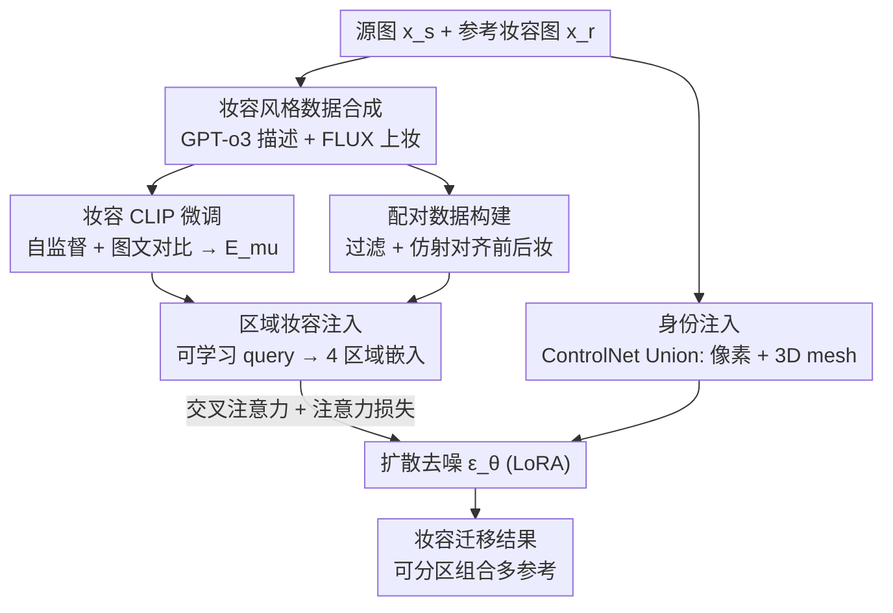

# Diffusion-Based Makeup Transfer with Facial Region-Aware Makeup Features

**会议**: CVPR 2026  
**论文**: [CVF Open Access](https://openaccess.thecvf.com/content/CVPR2026/html/Gao_Diffusion-Based_Makeup_Transfer_with_Facial_Region-Aware_Makeup_Features_CVPR_2026_paper.html)  
**代码**: 未公开  
**领域**: 扩散模型 / 图像编辑  
**关键词**: 妆容迁移, 扩散模型, 区域可控, CLIP 微调, ControlNet  

## 一句话总结
针对扩散妆容迁移里"现成 CLIP 抓不住妆容、且妆容被整体注入丧失分区可控性"两大痛点，FRAM 先用合成数据微调出一个专门的"妆容 CLIP 编码器"，再用可学习的人脸区域 query 从中抽出按区域分离的妆容特征、配合注意力损失注入扩散模型，首次让扩散方法支持把不同参考图的"皮肤/眼睛/嘴唇"妆容分区组合，同时在全局妆容迁移上取得身份保持与妆容一致性的更好平衡。

## 研究背景与动机
**领域现状**：妆容迁移（makeup transfer）要把参考图的妆容搬到源人脸上、同时保住源人脸身份。随着大规模文生图扩散模型成熟，近期主流做法是把源图（身份条件）和参考图（妆容条件）一起注入扩散去噪模型来控制采样，常用现成基础模型（如 CLIP）来编码参考图的妆容特征注入去噪网络（代表作 Stable-Makeup）。

**现有痛点**：作者点出两个具体问题。其一，CLIP 这类基础模型是为通用任务在自然图像上预训练的，并不擅长捕捉"妆容风格"这种细粒度的人脸属性——它更关注内容和语义，妆容差异容易被忽略。其二，现有方法把参考图的妆容特征**作为一个整体**注入去噪模型，做的是"全局妆容迁移"，完全无视了"分区域妆容"（眼影、唇彩、腮红各属不同人脸区域）这一事实，导致没法做"区域定向迁移"——比如想要 A 图的眼妆、B 图的唇妆，现有扩散方法做不到。

**核心矛盾**：妆容本质是"分区域、内容无关"的风格信息，而通用编码器给出的是"整体、内容耦合"的特征。用一个全局向量既表达不出区域结构，又混入了人脸内容，于是身份保持与妆容一致性之间反复打架（实验里 Stable-Makeup 妆容好但身份差，MAD/Gorgeous 身份好但妆容差）。

**本文目标**：分解成两件事——(1) 造一个真正懂妆容的编码器；(2) 让妆容特征按人脸区域分离并可分区注入。

**切入角度**：既然现成数据缺标注、CLIP 不懂妆容，那就**合成带标注的妆容数据**来专门微调出"妆容 CLIP"；既然妆容天然分区域，那就借鉴人脸表征学习里"用可学习 query 探测特征"的思路，让一组 query 各自负责一个人脸区域，把整体妆容特征拆成"区域妆容嵌入"。

**核心 idea**：用合成数据微调出专用妆容编码器 + 用可学习区域 query 把妆容特征按人脸区域拆开注入（注意力损失对齐人脸解析掩码），把"全局不可控的妆容迁移"变成"区域可控的妆容迁移"。

## 方法详解

### 整体框架
FRAM 是一个两阶段的扩散妆容迁移框架。输入是一张参考妆容图 $x_r$ 和一张源身份图 $x_s$，输出是"穿上参考妆容、但保住源身份"的人脸。去噪模型 $\epsilon_\theta$ 在 VAE 隐空间工作：训练时给 $x_r$ 加高斯噪声得到 $x_t$，让 $\epsilon_\theta$ 预测噪声去重建，期间把 $x_s$ 的身份特征和 $x_r$ 的妆容特征作为条件注入。

整套流程拆成两个阶段。**阶段 1（妆容 CLIP 微调）**先解决"没有懂妆容的编码器"：用 GPT-o3 生成 50 种妆容文字描述，喂给 SOTA 文驱编辑模型（FLUX.1-Kontext-dev）给 FFHQ 人脸上妆，造出"带标注的妆容风格数据"，再用自监督 + 图文对比学习把一个 CLIP 视觉编码器微调成专用妆容编码器 $E_{mu}$。**阶段 2（身份 + 区域妆容注入）**先把阶段 1 的编辑图整理成"上妆前/后配对"，再学习把身份与妆容注入扩散模型：妆容侧用可学习区域 query 去查询 $E_{mu}$ 抽出 4 个区域妆容嵌入，经交叉注意力注入并用注意力损失对齐人脸区域；身份侧用一个 ControlNet Union 同时编码源图像素信息与 3D mesh 结构。

### 关键设计

**1. 妆容 CLIP 微调：用合成标注数据造一个真正懂妆容的编码器**

针对"现成 CLIP 抓不住妆容"这一痛点。现有妆容数据集既没标签也没文字描述，于是作者先合成数据：让 GPT-o3 写出 50 种从淡到浓、风格各异的妆容描述（如"Dewy minimalist""Smoky seductress"），再用 FLUX.1-Kontext-dev 按"给这个人上妆、保持五官表情发型不变"的模板给 FFHQ 人脸上妆，得到一批已知妆容标签的人脸图。然后用两个目标微调 CLIP 视觉编码器 $E_{mu}$。自监督部分：对同一张图做 TPS、随机裁剪、翻转、仿射等增广得到两个"内容变了但妆容不变"的视图，用 InfoNCE 拉近两视图、推远其他样本，逼 CLIP 忽略人脸结构、只保留妆容这类高层语义：

$$\mathcal{L}_{ssl} = -\log \frac{\exp(f_s(z_{i,1}, z_{i,2})/\tau)}{\sum_{a \in I(i,1)} \exp(f_s(z_{i,1}, z_a)/\tau)}$$

其中 $f_s$ 是余弦相似度，$\tau$ 是温度。图文对比部分：再用 CLIP 文本编码器编码妆容描述（模板"Photography of a person with makeup. The makeup is [makeup]"），把图像嵌入和**同妆容**的文本嵌入对齐：

$$\mathcal{L}_{text} = -\frac{1}{|P|} \sum_{p \in P} \log \frac{\exp(f_s(z_{i,1}, z^{text}_p)/\tau)}{\sum_{a \in I} \exp(f_s(z_{i,1}, z^{text}_a)/\tau)}$$

总目标 $\mathcal{L}_{clip} = \mathcal{L}_{ssl} + \mathcal{L}_{text}$，只用预训练 CLIP 初始化并微调最后一层。和只在自然艺术图上做图像对比的 CSD 不同，这里额外引入妆容描述的文本监督，因而学到的是"内容无关的妆容特征"。消融显示妆容 KNN 分类精度从现成 CLIP 的 61.7% 提到 88.2%。

**2. 人脸区域可学习 query + 注意力损失：把妆容拆成可分区注入的区域嵌入**

针对"妆容被整体注入、无分区可控性"这一痛点，也是本文最大卖点。作者借鉴人脸表征学习，用 $N$ 个可学习 token $\{q_n\}_{n=1}^N$ 作为 query，把 $E_{mu}(\hat{x}_r)$ 的特征当 key/value，经一个 CLIP projector（结构同 InstantID）预测出 $N$ 个"区域妆容嵌入"$\{f_n\}_{n=1}^N$，每个对应一个人脸区域（$N{=}4$：皮肤、眼睛、鼻子、嘴）。这些嵌入像 IP-Adapter 的图像 prompt 一样经交叉注意力注入 $\epsilon_\theta$。关键在怎么让每个 $f_n$ 真的"只管一个区域"：用注意力损失把 $f_n$ 的平均交叉注意力图 $\bar{A}_n$ 对齐到人脸解析模型 FaRL 产出的区域二值掩码 $M_n$：

$$\mathcal{L}_{attn} = \frac{1}{NUV} \sum_{n=1}^N \sum_{u,v} \big[ \mathrm{FL}(\bar{A}_n[u,v], M_n[u,v]) + \mathrm{DICE}(\bar{A}_n[u,v], M_n[u,v]) \big]$$

即用分割里常见的 focal loss + dice loss 监督注意力图落在对应区域。这样训练后，每个 query 自动学会"引导模型给对应人脸区域上妆"，推理时**无需掩码**就能分区控制——于是可以从参考 1 取皮肤嵌入、参考 2 取眼睛、参考 3 取嘴，拼成一组新嵌入注入，实现多参考图的区域定向妆容组合（这是此前扩散方法做不到的）。

**3. ControlNet Union 双线身份注入：像素外观 + 3D mesh 结构一并保身份**

针对妆容迁移里"上了妆还要保住源身份"的硬约束。不同于 Stable-Makeup 用两个 ControlNet，FRAM 用单个 ControlNet Union 当身份编码器 $E_{id}$，在一个网络里同时编码源图 $x_s$ 的像素级外观信息，以及从 $x_s$ 用 3DDFA-V3 重建出的 3D mesh $x_m$ 提供的面部结构指引（$E_{id}$ 用空文本作 prompt）。消融很有说服力：只给像素、去掉 3D，身份还行但结构差；只给 3D、去掉像素，ID 分直接崩到 0.048；两者都有才同时锁住外观和脸型。

### 损失函数 / 训练策略
总目标是扩散损失加注意力损失：$\mathcal{L} = \mathcal{L}_{diff} + \mathcal{L}_{attn}$，其中 $\mathcal{L}_{diff} = \mathbb{E}_{x_0,t,\epsilon}\|\epsilon - \epsilon_\theta(x_t, t, C)\|_2^2$，$C$ 是包含 prompt、身份、妆容特征的条件集合。由于妆容特征经交叉注意力注入，作者只对去噪模型 $\epsilon_\theta$ 的交叉注意力层加 LoRA 微调；LoRA 层、CLIP projector、身份编码器 $E_{id}$ 联合更新。此外，阶段 2 的配对数据构建里有个易忽略但关键的细节：先用 GPT-5 过滤掉不真实/身份表情不一致的编辑图，再针对"编辑图人脸与源图人脸空间不对齐导致合成图扭曲"的问题，基于 JMLR 预测的人脸关键点做**仿射变换**把生成妆容人脸替换进源图（而非前人的直接 blend），最后按 FaRL 掩码 IoU 滤掉牙齿/眼睛错位的对——这套对齐被作者作为优于"直接丢弃错位样本"的并行工作的依据。

## 实验关键数据

### 主实验
在 MT、Wild-MT、CPM-real 三个数据集上用 5 个指标评测：CSD（妆容风格相似度）、ID（身份保持，用对妆容鲁棒的 BlendFace）、SSIM（结构相似）、L2-M（非编辑区差异，越低越好）、Aes（美学分）。下表取 MT 数据集结果（红/蓝为第一/第二名）：

| 方法 | 类型 | CSD ↑ | ID ↑ | SSIM ↑ | L2-M ↓ | Aes ↑ |
|------|------|-------|------|--------|--------|-------|
| CSD-MT | GAN | 0.434 | 0.585 | 0.424 | 0.146 | 4.50 |
| MAD | 扩散(训练free) | 0.328 | 0.535 | 0.805 | 0.003 | 4.26 |
| Gorgeous | 扩散 | 0.417 | 0.652 | 0.896 | 0.003 | 4.70 |
| SHMT | 扩散 | 0.498 | 0.372 | 0.811 | 0.012 | 4.86 |
| Stable-Makeup | 扩散 | 0.527 | 0.413 | 0.864 | 0.006 | 5.10 |
| **FRAM (本文)** | 扩散 | **0.536** | 0.587 | 0.880 | **0.002** | **5.25** |

关键观察：MAD/Gorgeous 身份强（ID 高）但妆容抓不住（CSD 低）；Stable-Makeup 妆容一致性强但身份差；FRAM 在不牺牲图像质量的前提下，取得了身份保持与妆容一致性的更好平衡（CSD 最高、ID 0.587 仅次于纯身份导向的方法、Aes 最高）。用户研究里 10 人对 20 组打分，FRAM 被选为最佳的比例 58.5%，远超 Stable-Makeup 16%、CSD-MT 20.5%、SHMT 5%。

### 消融实验
CLIP 微调目标消融（CPM-real，Acc 为妆容 KNN 分类精度）：

| SSL | Text | Acc ↑ | CSD ↑ | ID ↑ | Aes ↑ | 说明 |
|-----|------|-------|-------|------|-------|------|
| ✕ | ✕ | 61.7 | 0.461 | 0.459 | 4.88 | 现成 CLIP |
| ✓ | ✕ | 80.3 | 0.506 | 0.425 | 4.86 | 仅自监督 |
| ✕ | ✓ | 86.9 | 0.508 | 0.406 | 4.79 | 仅图文对比 |
| ✓ | ✓ | **88.2** | **0.528** | 0.429 | **4.95** | 完整 |

身份/妆容注入模块消融：

| LoRA | Pixel | 3D | CSD ↑ | ID ↑ | SSIM ↑ | 说明 |
|------|-------|----|-------|------|--------|------|
| ✓ | ✓ | ✕ | 0.510 | 0.403 | 0.775 | 去 3D mesh |
| ✓ | ✕ | ✓ | 0.587 | 0.048 | 0.333 | 去像素，身份崩 |
| ✕ | ✓ | ✓ | 0.467 | 0.652 | 0.810 | 去 LoRA，妆容掉 |
| ✓ | ✓ | ✓ | 0.528 | 0.429 | 0.797 | 完整 |

注意力损失消融：加上 $\mathcal{L}_{attn}$ 后 CSD 从 0.518 升到 0.528、ID 从 0.416 升到 0.429，更重要的是交叉注意力图可视化显示注意力被引到了对应人脸区域，从而解锁区域定向迁移。

### 关键发现
- 妆容 CLIP 是核心增益来源之一：仅靠现成 CLIP，妆容分类精度只有 61.7%，自监督和图文对比各自都能大幅提分，合起来到 88.2%，妆容一致性同步最优。
- 身份注入里像素信息不可或缺：去掉像素只留 3D mesh，ID 分从 0.429 暴跌到 0.048（脸型对了但人不像了），说明 3D mesh 管结构、像素管外观，二者缺一不可。
- 注意力损失数值提升不大但功能性质变：它对 CSD/ID 只是小幅提升，真正价值在于把"整体妆容"变成"分区可控"，这是定量指标体现不出来的能力。

## 亮点与洞察
- **用 LLM + 编辑模型造训练数据来补"领域专用编码器"的缺口**：当现成基础模型不懂某个细分属性、又缺标注数据时，GPT 生成描述 + 文驱编辑模型合成图像，能廉价造出带标签数据微调出专用编码器。这套"描述→上妆→对比学习"管线可迁移到任何"风格/属性"类编辑任务。
- **可学习 query + 注意力对齐掩码 = 推理时免掩码的区域控制**：训练时用人脸解析掩码监督注意力图，把"区域知识"蒸进 query，推理就不再依赖掩码——这是把分割先验注入生成、换取测试时灵活性的巧妙做法。
- **首次让扩散妆容迁移支持多参考区域组合**：从不同参考图各取一个区域嵌入拼接注入，实现"A 的眼妆 + B 的唇妆"，这是 GAN 时代才有、扩散时代一直缺的能力。
- **仿射对齐替代直接 blend 解决配对数据扭曲**：用关键点仿射把生成妆脸对齐源脸再替换，比并行工作"直接丢弃错位样本"更省数据也更不失真。

## 局限与展望
- 整条管线重度依赖外部大模型（GPT-o3 生成描述、FLUX 上妆、GPT-5 过滤、3DDFA-V3 重建、FaRL/JMLR 解析），合成数据质量与可复现性受这些黑盒模型影响，迁移到无法访问这些模型的场景会受限。⚠️ 论文未公开代码，复现门槛较高。
- 区域固定为皮肤/眼睛/鼻子/嘴 4 个，更精细的妆容元素（如卧蚕、眼线、高光层次）能否进一步细分到更多 query 未验证。
- ID 分（0.587）虽在扩散方法里领先，但仍低于强身份导向的 Gorgeous（0.652），极端浓妆下身份保持是否稳定值得关注；论文也承认是在做"身份与妆容的平衡"而非两者都最优。
- 评测主要在人脸正面/常规姿态数据集，大姿态、遮挡、跨域（卡通/绘画）虽给了定性例子，但缺系统定量评估。

## 相关工作与启发
- **vs Stable-Makeup**: 都用 ControlNet + CLIP 注入身份与妆容，但 Stable-Makeup 直接用现成 CLIP 且把妆容整体注入、用两个 ControlNet；FRAM 微调出专用妆容 CLIP、用区域 query 分区注入、用单个 ControlNet Union 同时编码像素与 3D mesh，因而既妆容更准又支持分区控制。
- **vs Gorgeous**: Gorgeous 用 textual inversion 把妆容学成文本嵌入，每个新妆容概念都要重学一个 token；FRAM 用妆容 CLIP 编码器直接编码，免去为每种妆容学新 token。
- **vs SHMT**: SHMT 用现有妆容数据集做自监督学身份与妆容注入；FRAM 合成"上妆前后"配对图做有监督学习，数据多样性更高。
- **vs SCGAN/RamGAN**: 这些 GAN 方法也做区域妆容发现（图像级或特征级聚合，依赖掩码），但都是为 GAN 量身定制；FRAM 把区域感知思路搬到扩散模型，用 query 查询妆容 CLIP 注入区域特征。

## 评分
- 新颖性: ⭐⭐⭐⭐⭐ 首次实现扩散妆容迁移的区域定向控制，妆容专用 CLIP + 区域 query 注意力对齐是清晰且原创的组合。
- 实验充分度: ⭐⭐⭐⭐ 三数据集五指标 + 用户研究 + 三组消融较完整，但缺大姿态/跨域的定量评估，代码未放。
- 写作质量: ⭐⭐⭐⭐⭐ 痛点—方法—验证逻辑顺畅，公式与图示清楚，消融针对性强。
- 价值: ⭐⭐⭐⭐ 区域可控妆容迁移有明确应用价值，数据合成与免掩码区域控制的范式可迁移到其他人脸编辑任务。

<!-- RELATED:START -->

## 相关论文

- [\[ECCV 2024\] Toward Tiny and High-quality Facial Makeup with Data Amplify Learning](../../ECCV2024/image_generation/toward_tiny_and_high-quality_facial_makeup_with_data_amplify_learning.md)
- [\[CVPR 2026\] High-Fidelity Diffusion Face Swapping with ID-Constrained Facial Conditioning](high-fidelity_diffusion_face_swapping_with_id-constrained_facial_conditioning.md)
- [\[CVPR 2026\] Mitigating Memorization in Text-to-Image Diffusion via Region-Aware Prompt Augmentation and Multimodal Copy Detection](mitigating_memorization_in_texttoimage_diffusion_v.md)
- [\[CVPR 2026\] Compositional Text-to-Image Generation Via Region-aware Bimodal Direct Preference Optimization](compositional_text-to-image_generation_via_region-aware_bimodal_direct_preferenc.md)
- [\[CVPR 2026\] Region-Adaptive Sampling for Diffusion Transformers](region-adaptive_sampling_for_diffusion_transformers.md)

<!-- RELATED:END -->
