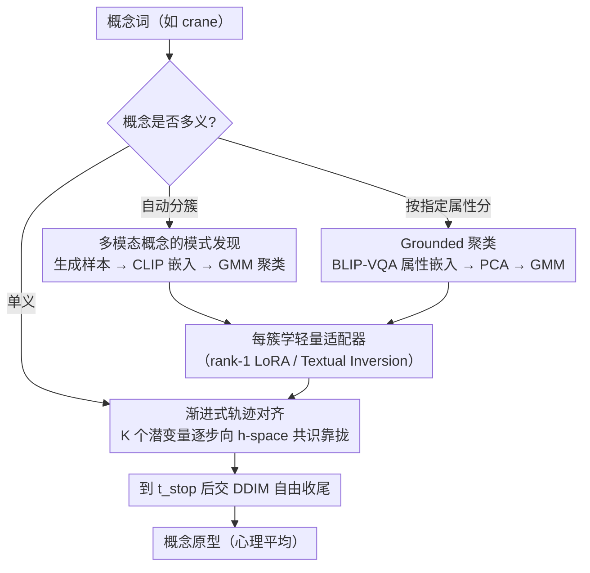

# Diffusion Mental Averages

**会议**: CVPR 2026  
**arXiv**: [2603.29239](https://arxiv.org/abs/2603.29239)  
**代码**: [项目页面](https://diffusion-mental-averages.github.io)  
**领域**: Image Generation / Diffusion Models  
**关键词**: 扩散模型, 概念原型, 轨迹对齐, 语义平均, 模型偏见分析

## 一句话总结

提出 Diffusion Mental Averages (DMA)，通过在扩散模型的语义空间中对齐多个去噪轨迹，从预训练扩散模型中提取概念的"心理平均"原型图像——首次实现一致、逼真的概念平均可视化。

## 研究背景与动机

当人们想象"鸟"时，脑海中会浮现一只典型的小鸟（如麻雀），而非鸵鸟或珍稀物种。这种"心理原型"反映了我们的经验偏好。类似地，扩散模型在训练后也应该隐含地编码了每个概念的"典型表示"——但如何可视化它？

现有方法的局限：

**像素空间平均**：需要空间对齐，对齐后细节仍会被平均掉，产生模糊且不真实的结果。对抽象概念（如"自由"）根本无法空间对齐

**语义空间平均**：在 AE/VAE/GAN 中可以编码→平均→解码，但扩散模型**没有显式的语义瓶颈层**。语义信息分散在不同时间步中，且没有直接的解码器

**数据集蒸馏方法**（D4M, MGD3）：面向下游任务优化，产生的原型不自然或不一致

**选择性方法**：从集合中选代表样本，但样本总数有限，无法超越已有生成

核心挑战：扩散模型的语义信息**分布在整个去噪轨迹**中——从早期的粗粒度布局到晚期的细粒度细节，无法在单一层面进行简单平均。

## 方法详解

### 整体框架

扩散模型把一个概念的语义信息摊开在整条去噪轨迹上——早期时间步定全局布局，晚期时间步刻细节——所以没法像 VAE 那样在某一层"编码→平均→解码"。DMA 的破题方式是把"求平均"重新定义成"让一群轨迹对齐"：同时跑 K 个噪声潜变量，强迫它们在去噪的每一步都向同一个语义共识靠拢，等所有轨迹都收敛了，随便解码其中一个就是这个概念的"心理平均"原型。对齐的"标尺"是 U-Net 瓶颈层（h-space），因为前人已证明这一层的语义近似线性可加，平均它才有意义。

### 关键设计

**1. 渐进式轨迹对齐：在去噪的每一步逐步逼出语义共识，而不是事后硬平均**

像素平均之所以糊，是因为它在最终图像上一刀切；DMA 改成在轨迹中途、沿着扩散本身"先粗后细"的节奏一点点统一语义。具体地，先初始化 $K=1000$ 个噪声潜变量 $\{\mathbf{z}_k^{(0)}\}_{k=1}^K$，然后在每个时间步 $t$ 算出它们的平均 h-space 激活作为当前共识目标：

$$\bar{A}^{(t)} = \frac{1}{K}\sum_{k} H(\mathbf{z}_k^{(t)})$$

再把每个潜变量往这个共识上拉——以 $\min_{\mathbf{z}_i^{(t)}} \|H(\mathbf{z}_i^{(t)}) - \bar{A}^{(t)}\|_2^2$ 为目标做 300 次 Adam 迭代，优化完再用 DDIM 采样推进到下一步。因为早期时间步主导全局结构、晚期主导细节，这个"边走边对齐"的过程天然就是先统一构图、再统一纹理。一直对齐到 cutoff $t_{stop}=10$ 即停，剩下几步交给标准 DDIM 自由收尾——这样既锁住了概念骨架，又保留了真实图像该有的细节随机性，避免过度对齐把图压成一团模糊。

**2. 多模态概念的模式发现：一个词有多种典型形态时，先分簇再各自求平均**

"狗"有金毛也有吉娃娃，"crane"既是鸟也是吊车，硬把它们平到一起只会得到四不像。DMA 的处理是先放开生成一批样本、取它们的 CLIP 嵌入用 GMM 聚类，把概念劈成若干语义子区域，再在每个簇内单独做轨迹对齐。这里有个跨空间的细节：聚类放在 CLIP 空间而非 h-space，是因为 CLIP 更稳、更适合分离模式；但 CLIP 和 h-space 语义并不对齐，没法直接把"某个簇"喂给对齐过程。于是每个簇额外学一份轻量适配器——Textual Inversion 嵌入或 rank-1 LoRA——把扩散模型的条件引导到对应子区域，相当于在 CLIP 的"分簇结论"和 h-space 的"对齐战场"之间架了一座桥。

**3. Grounded 聚类：让用户指定按哪个属性来分**

自动聚类未必切在用户关心的维度上。Grounded 聚类允许显式指定分割属性——比如"医生"按肤色分、"狗"按品种分——做法是用 BLIP-VQA 针对该属性提问、拿到属性聚焦的嵌入，再做 PCA 降维后 GMM 聚类。这样模式发现就从"模型自己觉得像不像"转成"沿用户给定的语义轴切分"，也顺带成了探测模型偏见的可控入口。

### 一个例子：给 "crane" 求心理平均

直接对 "crane" 平均会得到"鸟"和"吊车"的混合怪物。走 DMA 的流程：先生成一批 crane 样本、取 CLIP 嵌入做 GMM，自然分出"鸟"和"建筑吊车"两个簇；各自学一份 LoRA 把条件锁到对应语义；然后在每个簇内放 1000 个潜变量做渐进式轨迹对齐——前 990 步里每个时间步都把所有潜变量往 h-space 共识拉（各 300 次迭代），到 $t_{stop}=10$ 停手交给 DDIM 收尾。最终"鸟"簇收敛出一只典型的鹤、"吊车"簇收敛出一台典型的塔吊，两个原型各自内部高度一致（从不同随机种子出发几乎重合）。这就解释了为什么 DMA 能既"代表"又"不糊"：糊来自跨模式硬平均，DMA 用聚类先把它躲开了。

### 损失函数 / 训练策略

- 核心优化目标极其简洁：$\mathcal{L} = \|H(\mathbf{z}_k^{(t)}) - \bar{A}_t\|_2^2$
- 使用 Adam 优化器，学习率 $2 \times 10^{-2}$，每个时间步每个潜变量优化 300 次迭代
- CFG scale = 7.0，DDIM 采样 20 步
- LoRA 方案：rank-1 LoRA，2000步训练，学习率 $10^{-4}$，CFG 降至 3.0
- Textual Inversion：3000步训练，学习率 $10^{-2}$
- 完整优化约需 10 小时（RTX 4080）

## 实验关键数据

### 主实验

12 个概念（动物、人物、物体、抽象），每组 1000 个样本，10 组重复：

| 方法 | Consistency (CLIP) ↓ | Consistency (DreamSim) ↓ | Representativeness (CLIP) ↓ | ImageReward ↑ |
|------|---------------------|-------------------------|---------------------------|--------------|
| GANgealing | 0 | 0 | 0.386 | -0.684 |
| Avg VAE | 0 | 0 | 0.473 | -2.262 |
| D4M | 0.168 | 0.274 | 0.197 | 0.823 |
| MGD3 | 0.180 | 0.319 | 0.195 | 0.755 |
| **DMA (Ours)** | **0.031** | **0.032** | **0.179** | **1.002** |

- GANgealing 和 Avg VAE 一致性为 0（设计如此），但结果模糊不真实
- DMA 在一致性、代表性和图像质量上全面最优

### 消融实验

| 配置 | 说明 |
|------|------|
| 不同 cutoff $t_{stop}$ | 越大对齐越充分但计算越贵，10步足够 |
| LoRA vs Textual Inversion | LoRA 更好地保留颜色和形状，TI 容量有限 |
| 不同 SD 变体 | 各变体产生风格/偏好不同的原型，验证了方法的泛化性 |
| DiT 架构 | 使用 final transformer block 替代 h-space，同样有效 |

### 关键发现

- **一致性极高**：DMA 从不同随机种子出发收敛到几乎相同的原型，一致性比 D4M/MGD3 好 5-10 倍
- **可揭示模型偏见**：如"soldier"在 SD1.5/Realistic Vision 中总是男性，PixelArt 更中性，Animerge 生成女性卡通
- **抽象概念可行**：对"freedom"一致生成自由女神像，对"Italy"一致生成威尼斯运河，而基线方法无法处理
- **模式发现有效**：对"crane"可分离出"鸟"和"建筑吊车"两种语义模式

## 亮点与洞察

1. **全新研究问题**：首次提出从扩散模型中提取"心理平均"的概念——不是生成多样样本，而是找到概念的"最典型"表示
2. **理念精妙**：将"平均"转化为"轨迹对齐"，完美契合扩散模型从粗到细的生成范式
3. **模型探针工具**：DMA 可作为分析扩散模型内部概念表示和偏见的新工具，具有广泛的分析应用价值
4. **方法通用性**：从 SD1.5 到 DiT 架构均可工作，说明语义层级结构是扩散模型的共性而非特定架构的产物
5. **模式发现 + 条件适配的组合**应对多义词概念，是一个优雅的解决方案

## 局限与展望

1. **计算成本高**：1000个潜变量 × 20个时间步 × 300次优化 = 约10小时（RTX 4080），实际应用受限
2. **依赖 h-space 的存在**：对非 U-Net 架构（如 DiT）需要手动寻找类似的语义层，缺乏自动化方法
3. **CFG 和样本数影响结果**：高变化概念需更多样本，高 CFG 提高一致性但减少多样性
4. **聚类依赖外部编码器**：继承了 CLIP/BLIP 的偏见
5. **评估主观性**：代表性指标依赖于特定嵌入空间的选择

## 相关工作与启发

- **Kwon et al.**：发现 U-Net 瓶颈层（h-space）具有线性语义性质，是本文的关键基础
- **GANgealing**：在 GAN 中通过空间对齐做像素平均，但依赖预训练 GAN 且无法处理抽象概念
- **D4M / MGD3**：利用扩散模型做数据集蒸馏的最新工作，但面向分类任务而非概念总结
- **Textual Inversion / LoRA**：作为轻量级模型适配方法，在这里被创新性地用于跨空间语义对齐
- 启示：扩散模型的时间步维度蕴含了从抽象到具体的语义层级，这种结构可以被更多任务利用

## 评分

- 新颖性: ⭐⭐⭐⭐⭐ — 全新问题定义，"心理平均"概念极具启发性
- 实验充分度: ⭐⭐⭐⭐ — 多概念、多变体、多架构实验全面，但计算成本未深入分析
- 写作质量: ⭐⭐⭐⭐⭐ — 故事线流畅，从认知科学类比引入，可视化丰富
- 价值: ⭐⭐⭐⭐ — 作为分析工具和概念可视化方法很有意义，但实际应用场景有限

<!-- RELATED:START -->

## 相关论文

- [\[NeurIPS 2025\] GenIR: Generative Visual Feedback for Mental Image Retrieval](../../NeurIPS2025/image_generation/genir_generative_visual_feedback_for_mental_image_retrieval.md)
- [\[CVPR 2026\] Reviving ConvNeXt for Efficient Convolutional Diffusion Models](reviving_convnext_for_efficient_convolutional_diffusion_models.md)
- [\[CVPR 2026\] Visual Diffusion Models are Geometric Solvers](visual_diffusion_models_are_geometric_solvers.md)
- [\[CVPR 2026\] Learnability-Guided Diffusion for Dataset Distillation](learnability-guided_diffusion_for_dataset_distillation.md)
- [\[CVPR 2026\] Elucidating the SNR-t Bias of Diffusion Probabilistic Models](dcw_snr_t_bias_diffusion.md)

<!-- RELATED:END -->
