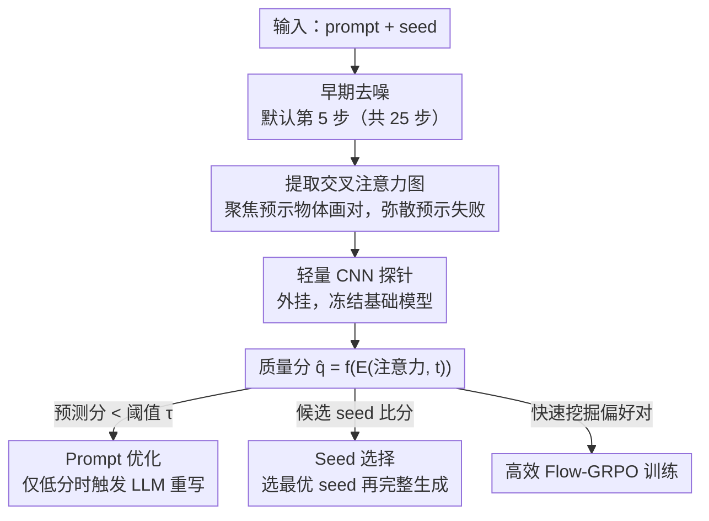

# Diffusion Probe: Generated Image Result Prediction Using CNN Probes

**会议**: CVPR 2026  
**arXiv**: [2602.23783](https://arxiv.org/abs/2602.23783)  
**代码**: 无  
**领域**: 扩散模型 / 图像质量预测  
**关键词**: 扩散模型, 探针, 交叉注意力, 早期质量预测, 生成加速

## 一句话总结

发现扩散模型早期去噪步骤的交叉注意力分布与最终图像质量高度相关，提出 Diffusion Probe——用轻量CNN从早期注意力图预测生成结果质量，实现在完成10%去噪即可预筛选低质量生成路径，加速 Prompt 优化、Seed 选择和 GRPO 训练。

## 研究背景与动机

**领域现状**：T2I 扩散模型面临一个核心效率瓶颈——质量不可预测。

**现有痛点**：用户常需多次尝试（换 prompt / seed）才能获得满意结果，而每次尝试都要跑完全部去噪步骤。

**核心矛盾**：学术方法如 IC-Edit（重复生成）、Flow-GRPO（多候选排序）同样依赖完整生成，开销随采样数线性放大。

**解决思路**：现有早期预测方法要么计算开销大（ICEdit 需 72B VLM 解码），要么不可自动化（PromptCharm 依赖人工解读注意力图）；本文的核心发现是——扩散模型早期交叉注意力图中已隐含最终图像质量的预测信号：注意力分散 / 碎片化的 token 对应的物体，在最终图像中往往缺失或失真。

## 方法详解

### 整体框架

T2I 扩散模型最大的效率痛点是「质量要跑完整条去噪链才知道」——换 prompt、换 seed 都得等 25 步全部走完才能判断好坏。本文发现答案其实早就写在去噪早期的交叉注意力里：在默认第 5 步（共 25 步）取出中间层的交叉注意力图 $\mathcal{A}$，连同时间步嵌入一起喂给一个轻量 CNN 探针 $E_\theta$，直接回归出一个标量质量分 $\hat{q} = f_\theta(E_\theta(\mathcal{A}, t))$。探针离线训练好之后，这个早期分数就能用来在 prompt 优化、seed 选择、GRPO 训练里提前砍掉注定失败的生成路径。

### 关键设计

**1. 从早期注意力读成败：注意力是否聚焦预示物体能否被渲染对**

这是整套方法的立论基础——如果早期注意力和最终质量无关，探针就无从谈起。作者对 FLUX 做了系统审计，得到两个互补现象：(a) 即便还在高噪声阶段，语义显著的物体 token 也已经诱导出尖锐、局部化的高注意力区域，说明物体定位在去噪极早期就已成形；(b) 一旦最终图像出问题（物体缺失、扭曲、语义错位），对应 token 的早期注意力图就明显弥散、碎片化。于是「注意力聚焦 → 物体会被画对，注意力弥散 → 大概率失败」成了一个能被 CNN 直接读出的信号。

**2. 即插即用的轻量 CNN 探针：不动基础模型一个参数**

有了信号还得有读它的廉价工具。探针由若干 DownBlock（含残差层）加 OutputLayer（归一化 + 池化 + 卷积）堆成，对 UNet（如 SDXL）取编码器最后 10 个 block 的注意力、对 DiT（如 FLUX）取中间连续 10 个 block，架构极轻且完全外挂——基础模型权重一律冻结。训练目标就是把探针输出对齐预训练奖励模型（如 ImageReward）在完整图像上的评分：

$$\mathcal{L} = \|\hat{q} - q\|_2^2$$

其中 $q$ 是奖励模型给完整生成图的质量分。这样探针学到的是「用早期注意力近似最终奖励」，零侵入、可挂到任何带注意力的 T2I 模型上。

**3. 把「早期预测替代完整生成」用到三个下游环节**

探针真正的价值在于把一次昂贵的完整生成评估换成一次廉价的早期预测，三个场景共用这条逻辑：(a) **Prompt 优化**——只有预测分低于阈值 $\tau$ 时才调用 LLM 重写 prompt，省掉大量无谓的 LLM 调用；(b) **Seed 选择**——候选 seed 只跑 $T_0 \ll T$ 步，用探针挑出最优 seed 再做一次完整生成；(c) **高效 Flow-GRPO 训练**——用探针预测快速挖掘偏好对 $(x^+, x^-)$，替代完整生成来加速策略收敛。

### 损失函数 / 训练策略

- MSE 回归损失，标签来自 ImageReward 预训练奖励模型
- 训练数据 15K prompts（MS-COCO），评估 5K prompts（与训练不相交）
- 针对数据不平衡对低分样本过采样
- 默认提取步 $t=5$（25 步中的第 5 步）：从 $t=1$ 到 $t=5$ 预测精度提升最大，之后边际递减

## 实验关键数据

### 主实验（预测精度，1024×1024分辨率）

| 基础模型 | 步数 | SRCC↑ | AUC-ROC↑ | KTC↑ | PCC↑ |
|----------|------|-------|----------|------|------|
| SDXL | 5 | 0.73 | 0.86 | 0.57 | 0.72 |
| SDXL | 10 | 0.76 | 0.89 | 0.61 | 0.75 |
| FLUX | 5 | 0.76 | 0.88 | 0.60 | 0.75 |
| FLUX | 10 | **0.79** | **0.91** | **0.64** | **0.78** |
| Qwen-Image | 10 | 0.72 | 0.87 | 0.56 | 0.71 |

跨架构（UNet/DiT）一致性强，AUC>0.9 说明分类判别效果优异。

### 消融实验（下游任务效果）

| 模型 | 任务 | 方法 | CLIP Score↑ | ImageReward↑ | Aesthetic↑ |
|------|------|------|-------------|-------------|------------|
| SDXL | Prompt优化 | Baseline | 28.31 | 0.71 | 5.13 |
| SDXL | Prompt优化 | **+Probe** | 30.24 | 0.72 | 5.29 |
| SDXL | Prompt优化 | +LLM | 30.80 | 0.73 | 5.34 |
| FLUX | Seed选择 | Random | 31.37 | 1.02 | 5.67 |
| FLUX | Seed选择 | **+Probe** | 31.41 | 1.06 | **5.79** |

Probe在Prompt优化上接近LLM效果但开销极低；Seed选择显著提升美学分。

### 关键发现

- 探针预测精度在第5步即达到接近峰值水平（PCC 0.75 vs 峰值 0.78），仅占总步数20%
- 跨三种不同架构（UNet/DiT）的一致性验证了方法的模型无关性
- Flow-GRPO训练中探针使高质量样本比例提升2.5×，收敛曲线更平滑
- 注意力图弥散程度与物体渲染失败模式（缺失、扭曲、属性错位）直接对应

## 亮点与洞察

- 将 LLM probing 范式首次引入扩散模型——"用探针诊断生成轨迹"是全新视角
- 核心洞察优雅：早期注意力集中=物体将被正确渲染，早期注意力弥散=生成将失败
- 探针与基础模型完全解耦，零侵入性，适用于任何带注意力的T2I模型
- 实际应用场景丰富且切合需求（prompt迭代、seed筛选、RL训练加速）

## 局限与展望

- 仅验证了预测 ImageReward 这一指标，对其他质量维度（如文本渲染质量、空间关系）的预测能力待验证
- 探针需要为每个基础模型单独训练，泛化到新模型需重新数据收集
- 当前选择提取步$t$和block层是手动选定的，可能对不同模型不最优
- MSE损失对排序不敏感，可探索排序损失或对比学习
- 对提示极简或极复杂的场景，注意力模式可能不具有相同的预测力

## 相关工作与启发

- 与 DAAM（注意力归因可视化）的区别：DAAM 做事后分析，Probe 做预测
- 与 Attend-and-Excite 等注意力操纵方法互补——后者改善注意力，前者预测注意力效果
- 与 ICEdit 的早期预测对比：ICEdit 需解码+VLM（72B），Probe 仅需轻量CNN
- probing 范式在 NLP 中已成熟（探针预测语言属性），扩展到视觉生成是自然延伸
- 可与 DPCache 等加速方法组合使用——先预筛再加速

## 评分

- 新颖性: ⭐⭐⭐⭐ 首次将probing引入扩散模型，注意力质量关联是有价值的发现
- 实验充分度: ⭐⭐⭐⭐ 三个模型×多个步数×三种下游任务，验证充分
- 写作质量: ⭐⭐⭐⭐ 动机清晰，可视化直观，实验组织有序
- 价值: ⭐⭐⭐⭐ 实用价值高，尤其对需要大量采样的场景（RL训练、agent生成）
- 价值: 待评

<!-- RELATED:START -->

## 相关论文

- [\[CVPR 2026\] Diversity over Uniformity: Rethinking Representation in Generated Image Detection](diversity_over_uniformity_rethinking_representation_in_generated_image_detection.md)
- [\[CVPR 2026\] Attribution as Retrieval: Model-Agnostic AI-Generated Image Attribution](attribution_as_retrieval_modelagnostic_aigenerated.md)
- [\[CVPR 2026\] FVAR: Next-Focus Prediction for Visual Autoregressive Modeling](fvar_next-focus_prediction_for_visual_autoregressive_modeling.md)
- [\[CVPR 2026\] Markovian Scale Prediction: A New Era of Visual Autoregressive Generation](markovian_scale_prediction_a_new_era_of_visual_autoregressive_generation.md)
- [\[ICML 2026\] Latent Diffusion Pretraining for Crystal Property Prediction](../../ICML2026/image_generation/latent_diffusion_pretraining_for_crystal_property_prediction.md)

<!-- RELATED:END -->
