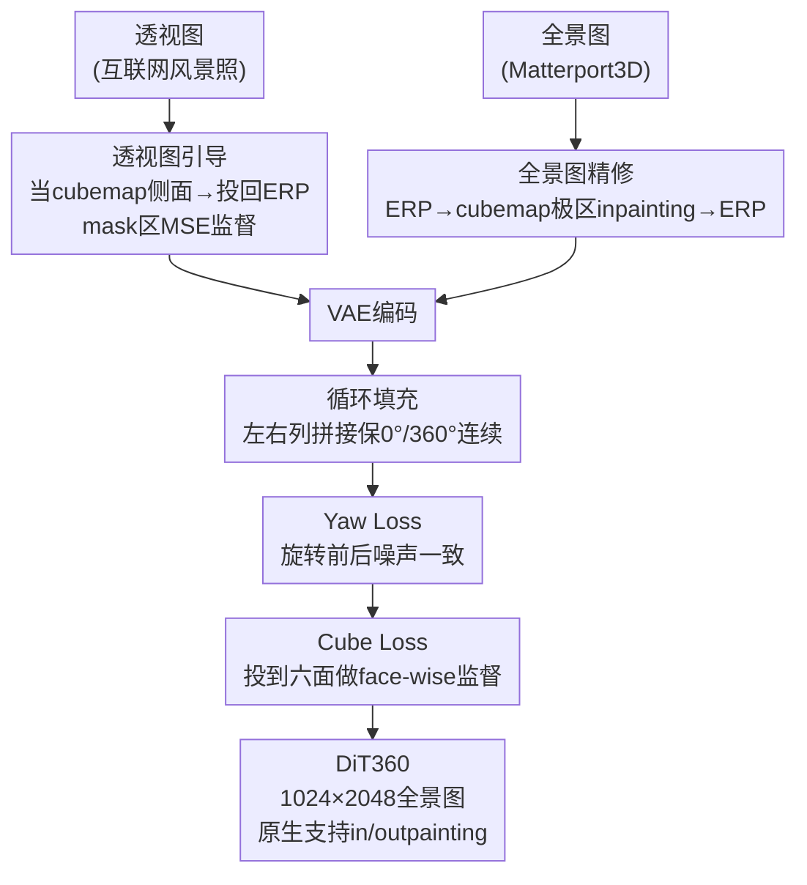

# DiT360: High-Fidelity Panoramic Image Generation via Hybrid Training

**会议**: CVPR 2026  
**论文**: [CVF Open Access](https://openaccess.thecvf.com/content/CVPR2026/html/Feng_DiT360_High-Fidelity_Panoramic_Image_Generation_via_Hybrid_Training_CVPR_2026_paper.html)  
**代码**: https://github.com/Insta360-Research-Team/DiT360  
**领域**: 扩散模型 / 全景图像生成  
**关键词**: 全景图生成, DiT/Flux, 混合训练, 等距柱状投影(ERP), Cubemap监督

## 一句话总结
DiT360 不在模型结构上做文章，而是用「透视图 + 全景图混合训练」补足真实全景数据稀缺的短板：在 VAE 前的图像层用透视图引导和全景图精修注入跨域知识，在 VAE 后的 token 层用循环填充 + yaw loss + cube loss 强化几何一致性，最终在 Matterport3D 上 11 项指标多数第一（FID 42.88）。

## 研究背景与动机

**领域现状**：全景图像生成（360° 全视野）是空间智能、AR/VR、自动驾驶的关键能力。主流做法绕着「全景的特殊表示」做模型设计——要么直接在等距柱状投影（ERP）上训扩散模型保全局连续性，要么借助 cubemap（CP）把球面切成六个透视面、用透视先验对齐球面几何，还有一类是拼接多张透视视图。

**现有痛点**：这些方法都卡在两个老毛病上：(1) **几何保真度**——ERP 在极区（天花板/地板）有严重畸变，模型学不准畸变模式，拼接法又会在视图接缝处产生不连续；(2) **感知真实感**——真实世界高质量全景数据极度稀缺，模型只能过度依赖仿真/渲染数据，生成结果带着「渲染味」，不够照片级真实。即便有 YouTube 等平台的 360° 素材，直接拿来训练也不现实，因为全景数据需要领域专属清洗（地平线校正、美学过滤），这块基本没人做。

**核心矛盾**：问题的根源不在模型不够强，而在**数据**——真实全景数据又少又脏（极区模糊），而真实感最好的透视图（互联网海量风景照）又不在全景域里，两者无法直接混用，因为透视图没有全景的球面几何与畸变结构。

**本文目标**：在全景数据有限的前提下，怎么把「透视域的照片级真实感」和「全景域的几何结构」同时灌进一个模型。拆成两个子问题：① 怎么把稀缺脏的全景数据洗干净并用好；② 怎么把海量透视图的真实感知识迁移到全景域而不破坏全景几何。

**切入角度**：作者把视角从「设计更好的全景算子」转到「设计更好的混合训练范式」——既然单一数据源都有缺陷，那就在**不同表示层级**（图像层 / token 层）分别融合两个域的优势。

**核心 idea**：用「跨域混合训练」代替「专用模型设计」——图像层做域间转换与正则（透视图引导 + 全景图精修），token 层做几何感知监督（循环填充 + yaw loss + cube loss），让一个标准 DiT（Flux）在多个表示层级上同时吸收两个域的知识。

## 方法详解

### 整体框架

DiT360 建在 Flux（一个开源 DiT 变体，带 RoPE 旋转位置编码 + flow-based 调度器）之上，训练时只更新注入 attention 层的 LoRA 模块。整个框架是一个**双分支混合训练管线**：透视分支负责注入照片级真实感，全景分支负责保几何一致性，两者的核心干预分别落在 VAE 之前的**图像层**和 VAE 之后的**token 层**两个表示层级上。

具体走一遍：透视分支拿互联网高质量风景图，先把它当作 cubemap 的一个侧面、再投影回 ERP 表示并配上 mask，只在 mask 区域施加 MSE 监督（图像层·透视图引导）；全景分支拿 Matterport3D，先把极区模糊的 ERP 转成 cubemap、对上下面的中心区做 inpainting 精修再投回 ERP（图像层·全景图精修），洗干净后进入 VAE。进入 token 层后，对全景输入的 noisy token 施加三重几何监督：循环填充保左右边界（0°/360°）连续、yaw loss 保旋转一致、cube loss 保畸变结构准确。最终训练损失 = Flux 原始 MSE + cube loss + yaw loss 的加权和。

> 说明：图像层两个模块（透视图引导、全景图精修）作用在 VAE 之前，token 层三个模块（循环填充、yaw loss、cube loss）作用在 VAE 之后的潜空间噪声上；为压缩高度图中把三个 token 层监督画成串行，实际它们是并行叠加在同一份全景 token 上的损失项。

### 关键设计

**1. 全景图精修：把脏的真实全景数据洗成可训练的干净数据**

Matterport3D 是少数大规模高保真真实全景数据集，但它在极区（天花板/地板）经常有模糊，直接拿来训练会把这种退化传染给生成结果。作者的做法是借「透视域 inpainting 成熟」这一点绕开问题：先把 ERP 全景转成 cubemap，对模糊最严重的上下两个面的中心区域固定一个二值 mask（$H=W=1024$ 时，$M(u,v)=0$ if $256 \le u,v < 768$ 否则 $1$），把中心区替换成白图得到 $I_{\text{mask}} = I \odot M + (1-M)\cdot I_{\text{miss}}$，再用现成 inpainting 模型重建出 $\hat I$，最后投回 ERP 空间。

这一步本质是**图像质量正则**：既清掉了极区伪影、得到更清晰的训练图，又保留了全景固有的畸变特性（只补中心、不动结构）。消融里它带来的提升最直观——在精修数据上训练 BRISQUE 10.25 / IS 1.60，未精修时直接劣化到 BRISQUE 24.91 / IS 1.41，说明数据脏不脏几乎决定下限。

**2. 透视图引导：用海量真实透视图给全景域注入照片级真实感**

全景数据再怎么洗也就那么多，真实感的天花板被数据量压死了。作者把互联网高质量透视图当作 cubemap 的一个**侧面**，投回 ERP 表示并配上对应 mask，训练时只在 mask 区域施加来自 Flux 的 MSE 损失：

$$L_{\text{perspective}} = L_{\text{MSE}}(\epsilon \odot M,\ \hat\epsilon_\theta \odot M)$$

只用侧面而不用上下面，是因为上下面对应天/地这类罕见视角，数据集里几乎覆盖不到。这里有个关键的工程细节：mask 外的黑色区域在噪声预测时会被 outpaint 以维持图像完整性，而由于 Flux 用的是显式位置编码、每个 token 只关注局部邻域，配合 mask 约束的监督，**梯度不会从透视区泄漏到无关全景区**，保证训练目标稳健。这一步让模型见到更多样的真实场景，把「照片级真实感」这个被以往工作忽视的维度补了上来——消融里它主要提升对视觉风格敏感的 QA$_{\text{quality}}$ 和 QA$_{\text{aesthetic}}$。

**3. 位置感知循环填充：从位置编码层面强制 0°/360° 边界连续**

全景图横向覆盖完整 360°，ERP 的左右边对应物理上周期相连的 0°/360° 经度，必须无缝衔接。以往的 padding 策略只当数据增强、不显式约束跨边界一致；circular denoising 又只在推理时做渐进融合、容易留下明显伪影。DiT360 的做法是在 token 层做显式约束：VAE 压缩 + 噪声注入后，把潜 token 从 $X_t \in \mathbb{R}^{N \times d}$ reshape 成 $\mathbb{R}^{H \times W \times d}$，沿宽度维做循环填充——取首列 $X_0$ 和末列 $X_{-1}$ 拼到两端：

$$\tilde X_t = [X_{-1},\ X_t,\ X_0] \in \mathbb{R}^{H \times (W+2) \times d}$$

同样的拼接也应用到位置编码上，这样模型被显式引导去学习**跨边界相邻列之间的连续性**。关键在于它利用了 Flux 显式位置编码与图像内容的对齐关系，相比纯推理时融合要稳得多，消融里它对 FID 和 BRISQUE 的改善最明显（boundary consistency 是全景生成最核心的硬指标）。

**4. Yaw Loss + Cube Loss：在潜噪声空间补旋转一致性与畸变结构**

这是 token 层的另外两重几何监督，作者把它们和原始 MSE 组成混合损失：

$$L_{\text{pano}} = L_{\text{MSE}} + \lambda_1 L_{\text{cube}} + \lambda_2 L_{\text{yaw}}$$

**Yaw loss** 针对全景的旋转不变性：全景图绕 yaw 轴（垂直轴）旋转任意角度后仍是合法全景，模型预测应当对旋转保持一致。随机选一个旋转角 $a$，对目标噪声特征和预测噪声分别旋转后求 MSE：$\epsilon_{\text{yaw}} = \text{Rotate}(X_t - \epsilon, a)$，$\epsilon_{\theta,\text{yaw}} = \text{Rotate}(\epsilon_\theta, a)$，$L_{\text{yaw}} = \mathbb{E}[\|\epsilon_{\theta,\text{yaw}} - \epsilon_{\text{yaw}}\|_2^2]$。它不是简单加样本，而是强制**同一张图不同旋转版本之间的一致性约束**，提升全局旋转鲁棒性与结构连贯（消融里 FAED 最优）。

**Cube loss** 针对极区畸变：直接在 ERP 上监督会让模型「照搬」相似的畸变外观、而非学到精确结构，导致极区细节出错。作者把采样噪声和预测噪声都投到 cubemap 六个面上做 face-wise 监督：$\epsilon_{\text{cube}} = \text{CubeMap}(X_t - \epsilon)$，$\epsilon_{\theta,\text{cube}} = \text{CubeMap}(\epsilon_\theta)$，$L_{\text{cube}} = \mathbb{E}[\|\epsilon_{\theta,\text{cube}} - \epsilon_{\text{cube}}\|_2^2]$，把透视先验迁到全景域来保畸变结构（消融里 FID$_{\text{pole}}$、FID$_{\text{equ}}$ 显著下降）。

值得注意的是，两个 loss 都直接作用在**潜噪声空间**而非潜 token 空间。作者的解释是：扩散目标里噪声和语义高度耦合，噪声预测本身就编码了丰富的空间与结构信息，足以做空间监督；且在噪声空间操作能与 flow-based 调度器对齐，提升训练稳定性。⚠️ 这一选择更多是经验性结论，作者称完整分析放在补充材料。

### 损失函数 / 训练策略

整体训练只更新 Flux.1-dev attention 层里的 LoRA 模块（base 冻结）。透视分支用 $L_{\text{perspective}}$（mask 区 MSE），全景分支用 $L_{\text{pano}} = L_{\text{MSE}} + \lambda_1 L_{\text{cube}} + \lambda_2 L_{\text{yaw}}$，默认 $\lambda_1 = \lambda_2 = 0.5$。训练分辨率 1024×2048。得益于 DiT 的可扩展性 + 内置 mask/inpainting 机制，DiT360 **无需额外微调**即可通过 inversion 的特征替换支持 inpainting 和 outpainting；但它是 mask-conditioned 的（需要用户从相机位姿给出 mask），不直接支持无 mask 的常规 image-to-panorama。

## 实验关键数据

### 主实验

在 Matterport3D 验证集上对比 8 个代表性 baseline（PanFusion / MVDiffusion / SMGD / PAR / WorldGen / Matrix-3D / LayerPano3D / HunyuanWorld），覆盖 11 项指标。DiT360 在多数指标第一：

| 指标 | DiT360 | 次优方法 | 说明 |
|------|--------|----------|------|
| FID↓ | **42.88** | SMGD 46.72 | 整体保真度第一 |
| FID$_{\text{clip}}$↓ | **41.60** | SMGD 45.04 | 第一 |
| FID$_{\text{equ}}$↓ | **24.77** | PAR 27.39 | 第一 |
| BRISQUE↓ | **10.25** | Matrix-3D 16.37 | 无参考画质，大幅领先 |
| NIQE↓ | **3.72** | LayerPano3D 3.79 | 第一 |
| IS↑ | **1.60** | MVDiffusion 1.58 | 第一 |
| QA$_{\text{aesthetic}}$↑ | **4.19** | LayerPano3D 3.93 | 美学第一 |
| FAED↓ | 2.91 | HunyuanWorld 2.91 | 并列第一 |
| CS↑ (CLIP Score) | 34.68 | HunyuanWorld 34.73 | 略低于最优 |
| QA$_{\text{quality}}$↑ | 4.69 | LayerPano3D 4.73 | 略低于最优 |

> ⚠️ 原文还报了 FID$_{\text{pole}}$（极区 FID），但该列 SMGD 报 5.69 异常偏低，疑似不同方法训练数据/口径不一致（原文也注明部分方法在私有数据上训练、FID 仅供参考），不宜直接横比，以 FID/FID$_{\text{clip}}$/FID$_{\text{equ}}$ 等口径一致的指标为准。作者承认 CLIP Score 和 Q-Align quality 略逊最优，归因于这两个指标本为透视图设计、未必反映全景质量。

### 消融实验

逐模块加到 Flux+LoRA baseline 上（Tab. 2）：

| 配置 | FAED↓ | IS↑ | BRISQUE↓ | FID↓ | 说明 |
|------|-------|-----|----------|------|------|
| Flux + LoRA | 3.23 | 1.51 | 17.02 | 46.69 | baseline |
| w/ 循环填充 | 3.04 | 1.54 | 13.61 | 43.71 | 边界一致性↑，FID/BRISQUE 改善最明显 |
| w/ cube loss | 3.01 | 1.57 | 15.68 | 44.40 | 极区畸变↓（FID$_{\text{pole}}$/FID$_{\text{equ}}$ 降） |
| w/ yaw loss | 2.98 | 1.56 | 15.96 | 44.63 | 旋转一致性↑，FAED 最优 |
| w/ 透视图引导 | 2.95 | 1.48 | 16.94 | 46.03 | 提升 QA quality/aesthetic |
| **Ours (全部)** | **2.91** | **1.60** | **10.25** | **42.88** | 组合最强 |

数据精修与系数消融（Tab. 3/4）：$\lambda_1=\lambda_2=0.5$ 在 IS（1.60）和 BRISQUE（10.25）上最优；增大 $\lambda$ 会更拟合训练数据、FID 略升而多样性略降。精修数据 vs 未精修数据：BRISQUE 10.25 vs 24.91、IS 1.60 vs 1.41——数据清洗是收益最大的单点。

### 关键发现
- **数据 > 模型**：未精修数据让 BRISQUE 从 10.25 暴涨到 24.91，是所有消融里跌幅最大的，印证了「真实全景数据稀缺脏污才是核心瓶颈」的立论。
- **四个模块各管一维**：循环填充主攻边界（FID/BRISQUE）、cube loss 主攻极区畸变（FID$_{\text{pole/equ}}$）、yaw loss 主攻旋转一致（FAED）、透视图引导主攻风格细节（QA），分工清晰、互不替代。
- **CLIP/Q-Align 在全景上失真**：作者明确指出这两个透视图指标不完全适用于全景评估，是少数没拿第一的原因，提醒读者全景评测体系本身待完善。

## 亮点与洞察
- **「换数据范式」而非「换模型结构」**：在一众堆叠全景专用算子的工作里，DiT360 把矛盾重新定义到数据层，用混合训练把透视域真实感和全景域几何分别在两个表示层级注入——这个 reframing 本身比具体模块更有启发。
- **透视图当 cubemap 侧面投回 ERP**：用极简的几何变换 + mask 约束把任意互联网风景照变成可监督的全景训练样本，且靠 Flux 显式位置编码的局部性天然阻断梯度泄漏，是个很可复用的跨域数据增强 trick。
- **在潜噪声空间施加几何辅助损失**：yaw/cube loss 不在像素或 token 空间、而在 noise 空间做旋转/投影一致性约束，既对齐 flow-based 调度器又稳定训练，可迁移到任何带几何对称性的扩散生成任务（如球面、柱面、对称结构）。
- **训练时洗数据、推理时白送应用**：内置 mask+inpainting 机制让模型不额外训练就支持 in/outpainting，是数据精修设计顺带的红利。

## 局限与展望
- **依赖用户提供 mask**：in/outpainting 是 mask-conditioned 的，需要从相机位姿给出 mask，不支持无 mask 的常规 image-to-panorama，落地时多一道约束。
- **评测体系受限**：CLIP Score、Q-Align quality 本为透视图设计，用在全景上会失真，作者自己也承认这点；FID$_{\text{pole}}$ 等指标在不同训练数据下口径不一，横比意义有限——全景生成缺一套公认的评测标准。
- **极区仍靠 inpainting 兜底**：全景图精修是用现成 inpainting 模型补极区，补出来的内容是「合理幻觉」而非真实，对几何精度要求极高的场景（如重建/测量）可能不够。⚠️ 这是我的推断，原文未深入讨论。
- **没在结构上根治畸变**：cube loss 是「监督层面」缓解极区畸变，并未改变 ERP 表示本身的非均匀采样问题，理论上限仍受表示约束。

## 相关工作与启发
- **vs ERP 直接训练类（PanFusion / SMGD / PAR）**：他们直接在等距柱状投影上训扩散模型保全局连续，但卡在边界一致性和极区畸变；DiT360 用循环填充 + cube loss 显式补这两点，且额外引入透视数据救真实感，FID 从 SMGD 的 46.72 降到 42.88。
- **vs cubemap/拼接类（MVDiffusion 等）**：他们靠多透视面对齐球面几何，但面间接缝不连续、计算开销大；DiT360 只把 cubemap 当作监督手段（cube loss）和数据转换桥梁，不在推理时拼接，避免接缝问题。
- **vs 大量合成数据类（LayerPano3D / HunyuanWorld）**：他们用海量仿真数据撑几何保真度，但生成结果「渲染味」重、感知真实感差；DiT360 反其道用真实透视图灌真实感，在 QA$_{\text{aesthetic}}$（4.19 vs 3.93/3.85）和 BRISQUE 上明显更好。
- **vs 循环去噪（circular denoising）**：他们只在推理时渐进融合左右边界、易留伪影；DiT360 在训练时从位置编码层面显式约束，从根上解决而非事后修补。

## 评分
- 新颖性: ⭐⭐⭐⭐ 把全景生成的瓶颈从模型设计 reframe 到数据混合训练，透视图投回 ERP 的跨域增强很巧；但单个模块（循环填充/cube/yaw）多是已有思路的全景化组合。
- 实验充分度: ⭐⭐⭐⭐ 11 项指标 + 8 个 baseline + 逐模块/系数/数据三组消融 + 用户研究，相当扎实；FID$_{\text{pole}}$ 等指标口径不一是小瑕疵。
- 写作质量: ⭐⭐⭐⭐ 双层级（图像/token）的组织清晰，公式与动机交代到位；部分关键分析（noise 空间选择、cube loss 机理）推到补充材料略可惜。
- 价值: ⭐⭐⭐⭐ 为 3D 场景生成、开放世界环境提供了强 baseline，开源 + 即插 in/outpainting，实用性高。

<!-- RELATED:START -->

## 相关论文

- [\[CVPR 2026\] MMFace-DiT: A Dual-Stream Diffusion Transformer for High-Fidelity Multimodal Face Generation](mmface-dit_a_dual-stream_diffusion_transformer_for_high-fidelity_multimodal_face.md)
- [\[CVPR 2026\] FontCrafter: High-Fidelity Element-Driven Artistic Font Creation with Visual In-Context Generation](fontcrafter_high-fidelity_element-driven_artistic_font_creation_with_visual_in-c.md)
- [\[CVPR 2026\] FastHybrid: Accelerating Hybrid Autoregressive Image Generation with Lookahead and Guided Decoding](fasthybrid_accelerating_hybrid_autoregressive_image_generation_with_lookahead_an.md)
- [\[CVPR 2026\] PROMO: Promptable Outfitting for Efficient High-Fidelity Virtual Try-On](promo_promptable_virtual_tryon_efficient.md)
- [\[CVPR 2026\] MatPedia: A Universal Generative Foundation for High-Fidelity Material Synthesis](matpedia_a_universal_generative_foundation_for_high-fidelity_material_synthesis.md)

<!-- RELATED:END -->
