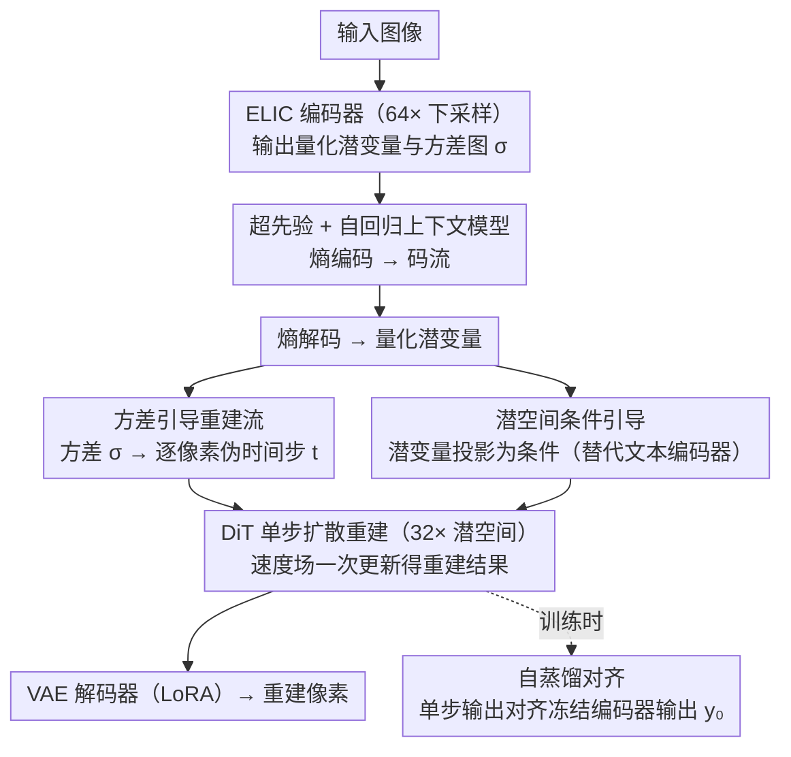

# DiT-IC: Aligned Diffusion Transformer for Efficient Image Compression

**会议**: CVPR 2026  
**arXiv**: [2603.13162](https://arxiv.org/abs/2603.13162)  
**代码**: [项目页](https://njuvision.github.io/DiT-IC/)  
**领域**: 图像压缩 / 生成模型  
**关键词**: diffusion transformer, image compression, one-step diffusion, flow matching, latent alignment, variance-guided

## 一句话总结

将预训练文生图DiT（SANA）适配为高效单步图像压缩解码器，通过方差引导重建流（像素级自适应去噪强度）、自蒸馏对齐（编码器潜变量做蒸馏目标）、潜空间条件引导（替代文本编码器）三种对齐机制，在32×下采样的深层潜空间中实现SOTA感知质量（BD-rate DISTS -87.88%），解码快30倍且16GB笔电显存可重建2K图像。

## 研究背景与动机

**领域现状**：基于扩散模型的图像压缩在感知保真度上表现出色（PerCo、DiffEIC、ResULIC、StableCodec），但受限于多步采样开销和高内存消耗。现有方法普遍使用U-Net架构，其层级下采样迫使扩散在浅层潜空间（8×下采样）操作。传统VAE编解码器可在更深潜空间（16×-64×）工作。

**现有痛点**：

1. U-Net多步扩散在8×浅层潜空间操作，计算和内存负担沉重（如DiffEIC 50步需12.4s）
2. 单步方法（StableCodec、OSCAR）仍依赖U-Net，无法原生在深层潜空间扩散
3. 直接将生成式DiT移植到压缩潜空间会严重退化——生成目标（从纯噪声）与重建目标（从结构化量化潜变量）根本失配

**核心矛盾**：扩散模型的生成先验有利于感知重建，但"从纯噪声迭代去噪"的范式与"从已知结构化潜变量单步重建"的压缩需求根本失配。

**本文目标** 让扩散在极度紧凑的深层潜空间（32×）中高效工作，将多步迭代折叠为确定性单步变换。

**切入角度**：三种"对齐"机制桥接生成与压缩——对齐去噪强度（方差→时间步）、对齐多步→单步（自蒸馏）、对齐条件方式（文本→潜变量）。

**核心 idea**：压缩量化潜变量已靠近数据流形，其空间方差自然编码了局部"去噪需求"——用方差映射到伪时间步即可将迭代去噪折叠为单步自适应重建。

## 方法详解

### 整体框架

这篇论文想把一个本来用于"从纯噪声画图"的预训练文生图模型（SANA，一个 DiT），改造成"从已知量化潜变量一步重建图像"的压缩解码器——难点在于两种任务的起点根本不同，硬搬过来会严重退化。整条流水线是：一张图先经 ELIC 风格编码器压到 64× 下采样的编码空间，配超先验加自回归上下文模型（上下文模型用轻量 DepthConvBlock）做熵编码得到码流；解码端把潜变量送进工作在 32× 深层潜空间的 DiT，**一步**完成扩散重建，再由解码器映回像素。适配只动很少参数：VAE decoder 用 LoRA rank 32、DiT 用 LoRA rank 64，且 DiT 采用 NoPE（无位置编码），天然支持任意分辨率泛化（4096² 仍稳定）。

### 关键设计

**1. 方差引导重建流：用编码器已有的方差当"逐像素去噪强度"，把多步去噪压成一步**

标准扩散需要从一个统一的全局时间步逐步去噪，但压缩潜变量上的量化噪声是空间异质的——平坦区域噪声小，只需轻微修正；纹理区域噪声大，需要更强去噪。用单一全局时间步要么过度平滑细节、要么修不干净。关键观察是：编码器为了熵建模本来就会预测一张方差图 $\boldsymbol{\sigma}$，它恰好编码了每个位置"还差多少才到干净流形"。于是把方差经一个可微映射投成逐像素的伪时间步 $t = \mathcal{F}(\text{proj}_\theta(\boldsymbol{\sigma})) \in \mathbb{R}^{H \times W}$，再用速度场做一次确定性更新即得重建 $\hat{\mathbf{y}} = \tilde{\mathbf{y}} - \mathbf{v}_\theta(\tilde{\mathbf{y}}, t)$。因为方差是编码器的现成副产物，这步几乎零额外成本，却让"去噪强度"随空间自适应，从而把原本的多步迭代折叠成一次前向。

**2. 自蒸馏对齐：没有多步教师轨迹可蒸馏，就把冻结编码器的输出当成单步目标**

把生成式扩散蒸成单步通常要一个走完多步的教师轨迹做监督，但压缩场景里根本不存在这样一条轨迹。这里换一个思路：冻结编码器后，它输出的量化潜变量 $\mathbf{y}_0$ 本身就已经很靠近数据流形，足以充当单步重建的自监督目标。训练时固定编码器、只联合优化 DiT 与解码器，用一个带 margin 的余弦对齐损失把单步输出拉向 $\mathbf{y}_0$：

$$\mathcal{L}_{\text{distil}} = \mathbb{E}\Big[1 - m - \frac{\langle \hat{\mathbf{y}}, \mathbf{y}_0 \rangle}{\lVert\hat{\mathbf{y}}\rVert_2 \,\lVert\mathbf{y}_0\rVert_2}\Big]$$

margin $m$ 留出容差、避免过度贴合而丢掉生成先验。这样既稳住了单步训练，又不需要任何外部教师模型。

**3. 潜空间条件引导：用压缩潜变量自己当条件，推理时彻底丢掉文本编码器**

SANA 原本靠文本 prompt 提供条件，但在重建任务里文本既低效又会引入随机性（同一张图不该因 prompt 漂移而改变重建）。这里用一个轻量投影把压缩潜变量映进文本嵌入空间 $c_{\text{lat}} = \text{Proj}_\psi(\hat{y})$，让潜变量自身充当条件。为了让这个投影学到有意义的语义，训练阶段用 InternVL 给图像生成文本、取其文本嵌入 $c_{\text{text}}$，再用一个 CLIP 风格的对比损失 $\mathcal{L}_{\text{cond}}$ 把 $c_{\text{lat}}$ 对齐到 $c_{\text{text}}$；推理时只用潜变量条件，无需再跑文本编码器。潜变量本就携带丰富语义结构，所以这层替换在省掉文本分支的同时不损失条件信息。

### 损失函数 / 训练策略

两阶段隐式比特率剪枝（IBP）：Stage 1用 $\lambda_{\text{base}} \in \{0.1, 0.5\}$，100K iter，256² patches，batch 32；Stage 2用 $\lambda_{\text{target}} \in \{0.5-16.0\}$，60K iter，512² patches，batch 16，加入对抗损失。总损失 $= \lambda\mathcal{R} + \mathcal{D} + \mathcal{L}_{\text{align}} + \lambda_{\text{adv}}\mathcal{L}_{\text{adv}}$，其中 $\mathcal{D} = \lambda_1\text{MSE} + \lambda_2\text{LPIPS} + \lambda_3\text{DISTS}$。AdamW lr=1e-4，EMA 0.999，两块RTX Pro 6000。

## 实验关键数据

### 主实验

**BD-rate对比（vs PerCo基准，↓更好，三数据集平均）**

| 方法 | 扩散步数 | 潜空间 | 延迟(1024²) | LPIPS BD-rate↓ | DISTS BD-rate↓ |
|------|---------|--------|------------|----------------|----------------|
| PerCo (ICLR'24) | 20 | f8 | 8.8s | 0.00% | 0.00% |
| DiffEIC (TCSVT'24) | 50 | f8→f16 | 12.4s | -36.14% | -33.72% |
| ResULIC (ICML'25) | 4 | f8→f32 | 0.83s | -62.27% | -65.64% |
| StableCodec (ICCV'25) | 1 | f8→f64 | 0.34s | -79.19% | -83.95% |
| OSCAR (NeurIPS'25) | 1 | f8→f64 | 0.32s | -19.04% | -58.38% |
| **DiT-IC** | **1** | **f32→f64** | **0.15s** | **-83.65%** | **-87.88%** |

### 消融实验

**关键设计消融（BD-rate DISTS，相对完整DiT-IC）**

| 配置 | DISTS BD-rate | 说明 |
|------|-------------|------|
| 完整DiT-IC | 0.00% | 基准 |
| 去掉对抗损失 | -1.80% | 对抗损失增强感知锐度 |
| 去掉DISTS损失 | +5.69% | DISTS对人类感知对齐至关重要 |
| DiT从头训练 | +32.45% | 预训练权重极其关键 |
| LoRA rank 16/16 | +13.92% | rank不足限制适配 |
| 全量微调 | +8.05% | 小batch扰乱预训练分布 |

### 关键发现

- LPIPS和DISTS两个感知指标上三数据集均全面领先
- 4096²分辨率下扩散延迟比StableCodec降低95%（10.3s→0.47s）
- 预训练权重至关重要：从头训练DISTS BD-rate差32.45%
- LoRA rank 32/64最优，全量微调反而更差（小batch扰乱分布）
- 用户研究56.8%偏好DiT-IC vs 27.5%偏好StableCodec
- INT8量化后4GB显存可运行，消费级GPU可部署

## 亮点与洞察

- 首次将DiT用于图像压缩并全程在32×深层潜空间操作，打破U-Net架构瓶颈
- 三种对齐机制各解决一个实际问题且设计简洁——方差→时间步利用编码器已有信息、自蒸馏无需外部教师、潜变量条件消除文本编码器
- 方差-时间步的像素级自适应映射特别直觉——量化噪声的空间异质性天然编码局部"去噪需求"
- NoPE设计使模型自然支持分辨率泛化，4096²依然稳定

## 局限与展望

- 极低码率（<0.01 bpp）时纯潜空间条件信息可能不足，辅助文本先验可能有益
- 训练数据仅150K图像，更大规模数据可能进一步提升
- 未探索编码器联合微调，当前冻结编码器理论上有提升空间
- 对抗蒸馏（ADD）等技术未集成，可进一步增强感知真实感
- 低码率下语义一致性仍有改进余地

## 相关工作与启发

- **vs StableCodec**：同为单步扩散压缩，StableCodec用U-Net在f8扩散，DiT-IC用DiT在f32深层空间，4096²分辨率下快25倍
- **vs ResULIC**：4步减到1步的同时BD-rate更好，验证单步充分性
- **vs OSCAR**：OSCAR用图像级码率-时间步映射，DiT-IC扩展到像素级方差-时间步，粒度更精细
- **启发**："对齐"范式值得在超分、修复等低层视觉推广；自蒸馏思路对加速扩散推理有参考意义

## 评分

- 新颖性: ⭐⭐⭐⭐ 首个DiT图像压缩框架，三种对齐机制各有创意，方差-时间步映射直觉优雅
- 实验充分度: ⭐⭐⭐⭐⭐ 三数据集多指标多基线+消融+用户研究+延迟分析+分辨率泛化
- 写作质量: ⭐⭐⭐⭐ 每个设计都有消融支撑，图示直观，结构清晰
- 价值: ⭐⭐⭐⭐⭐ 单步低延迟低显存的SOTA感知压缩，具备真实部署价值

<!-- RELATED:START -->

## 相关论文

- [\[CVPR 2026\] MMFace-DiT: A Dual-Stream Diffusion Transformer for High-Fidelity Multimodal Face Generation](mmface-dit_a_dual-stream_diffusion_transformer_for_high-fidelity_multimodal_face.md)
- [\[CVPR 2026\] MPDiT: Multi-Patch Global-to-Local Transformer Architecture for Efficient Flow Matching](mpdit_multi-patch_global-to-local_transformer_architecture_for_efficient_flow_ma.md)
- [\[CVPR 2026\] Denoising, Fast and Slow: Difficulty-Aware Adaptive Sampling for Image Generation](denoising_fast_and_slow_difficulty-aware_adaptive_sampling_for_image_generation.md)
- [\[CVPR 2026\] DDT: Decoupled Diffusion Transformer](ddt_decoupled_diffusion_transformer.md)
- [\[CVPR 2026\] Guiding a Diffusion Transformer with the Internal Dynamics of Itself](guiding_a_diffusion_transformer_with_the_internal_dynamics_of_itself.md)

<!-- RELATED:END -->
