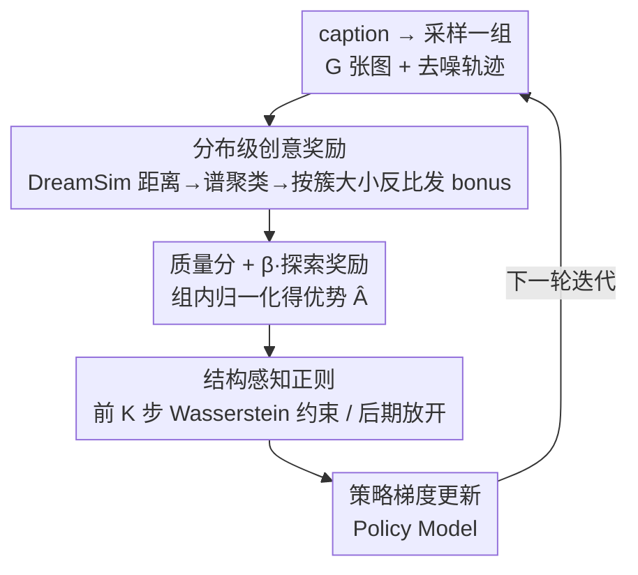

# DiverseGRPO: Mitigating Mode Collapse in Image Generation via Diversity-Aware GRPO

**会议**: CVPR 2026  
**论文**: [CVF Open Access](https://openaccess.thecvf.com/content/CVPR2026/html/Liu_DiverseGRPO_Mitigating_Mode_Collapse_in_Image_Generation_via_Diversity-Aware_GRPO_CVPR_2026_paper.html)  
**代码**: 论文仅给出 Project Page，未公开明确仓库链接（待确认）  
**领域**: 扩散模型 / 对齐RLHF  
**关键词**: GRPO, 模式坍缩, 图像多样性, 谱聚类奖励, Wasserstein正则  

## 一句话总结
针对用 GRPO 对扩散模型做 RLHF 后出现的「生成模式坍缩」（脸都一样、构图都一样），DiverseGRPO 从奖励建模和去噪动力学两个角度下手——用谱聚类给同一 caption 的样本分组、按簇大小反比发"探索奖励"，再把后期均匀的 KL 正则换成只压前期去噪步的 Wasserstein 约束，在质量持平的前提下把语义多样性提升 13%~18%，刷出新的质量-多样性 Pareto 前沿。

## 研究背景与动机
**领域现状**：Flow-GRPO、DanceGRPO 等把 LLM 里的 GRPO 搬到 flow matching / 扩散模型上做偏好对齐，靠组内样本相对打分推动生成质量提升，已经成了图像 RLHF 的主流路线。后续工作（MixGRPO、Flow-CPS、TempFlowGRPO、BranchGRPO）大多在抠优化效率、稠密奖励、采样一致性。

**现有痛点**：这些方法在训练后期会"越练越像"——同一提示词生成的图人脸、姿态、构图高度同质化，创意场景（数字艺术、广告、游戏设计）几乎不能用。这就是模式坍缩（mode collapse），现有 GRPO 路线普遍忽略了它。

**核心矛盾**：作者把坍缩拆成两个互相独立的根因。其一在**奖励建模**：传统 GRPO 用单样本质量分当奖励信号，奖励模型只会孤立打分、看不到样本之间的分布关系，于是模型被推向少数高分模式。把条件分布拆成 $K$ 个语义模式 $\pi_\theta(x\mid p)=\sum_{k=1}^K w_k\pi_\theta^k(x\mid p)$，期望奖励 $J(\theta)=\sum_k w_k\bar r_k$ 在优化下服从复制子动力学 $\frac{dw_k}{dt}=w_k(\bar r_k-\mathbb{E}_j[\bar r_j])$——平均奖励略高的模式权重自我强化地越滚越大，最终只剩唯一的高奖励模式存活（$w_k\to 1$），分布退化成单峰。其二在**生成动力学**：扩散去噪轨迹对多样性的敏感度严重不均，作者测得前 1/3 的去噪步贡献了约 66% 的多样性变化，可早期方差 $\sigma_t^2$ 最大、KL 惩罚被方差稀释得最弱——恰好在最该约束的时候约束最松。

**本文目标**：不改采样策略、不改架构，而是同时修好「奖励信号」和「正则预算」两件事，把质量-多样性的可达边界往外推。

**核心 idea**：用**分布级**奖励（按语义簇大小给探索 bonus）代替单样本奖励，并把**均匀** KL 正则换成**前期重、后期放**的结构感知 Wasserstein 约束。

## 方法详解

### 整体框架
DiverseGRPO 沿用 Flow-GRPO 的训练骨架（prompt → 采一组 $G$ 张图 → 算组内相对优势 → 策略梯度更新），但在两个位置动刀：**采样后打分阶段**插入"分布级创意奖励"，**计算策略损失阶段**把 KL 正则换成"结构感知正则"。一次迭代的数据流是：给定 caption 采出一组图 → 用 DreamSim 算两两感知距离并谱聚类成若干语义簇 → 按簇大小反比给每张图发探索奖励、叠加到质量分上 → 用组内归一化得到优势 → 在策略损失里对前 $K$ 个早期去噪步施加 Wasserstein 约束、后期完全放开 → 更新策略。

### 关键设计

**1. 分布级创意奖励：让奖励看见"整组样本"而非孤立单张**

这一项直接针对"单样本奖励驱动模式坍缩"的根因。做法分三步。第一步**感知距离**：对同一 caption 生成的一组图 $\{x_1,\dots,x_n\}$，用 DreamSim（对齐人类视觉相似判断的模型）算两两距离，得到 $n\times n$ 的距离矩阵 $D$（对角线为 0）。第二步**谱聚类**：用高斯核把距离转成亲和度 $A_{ij}=\exp(-d_{ij}^2/2\sigma^2)$，构造度矩阵 $D_{ii}=\sum_j A_{ij}$ 与归一化拉普拉斯 $L=D^{-1/2}AD^{-1/2}$，对 $L$ 做特征分解取最小若干特征值对应的特征向量、再 k-means，把一组图切成 $k$ 个语义簇，每个簇代表一种视觉模式。第三步**奖励分配**：簇越小代表模式越罕见、越该鼓励，给簇 $C_k$ 中图 $x_i$ 发的探索奖励与簇大小成反比

$$E_i=\sqrt{\frac{N}{n_k}}$$

其中 $n_k$ 是该簇样本数、$N$ 是同 caption 的总样本数；开根号是为了软化这个权重、在"奖励多样性"和"训练稳定"之间折中。最终奖励把质量分和探索奖励线性叠加：$R_i=Q_i+\beta\cdot E_i$，$\beta$ 控制多样性 bonus 的强度，再走标准组内归一化优势 $\hat A_t^i=(R(x_0^i,c)-\text{mean})/\text{std}$。妙处在于：它不是在采样端硬塞噪声，而是从奖励的源头改写了复制子动力学——罕见模式被持续"补贴"，就不会被高奖励模式吞掉。

**2. 结构感知 Wasserstein 正则：把正则预算砸到最该约束的早期去噪步**

这一项针对"早期去噪定多样性、但 KL 惩罚被方差稀释得最弱"的错配。原始 KL 正则（式 6）形如 $D_{KL}=\frac{\|\bar x_{t+\Delta t,\theta}-\bar x_{t+\Delta t,\mathrm{ref}}\|^2}{2\sigma_t^2\Delta t}$，分母里有 $\sigma_t^2$。问题就出在这个分母：去噪早期 $\sigma_t^2$ 大、把惩罚压小，正好在该保多样性时约束最松；去噪后期 $\sigma_t^2$ 小、把惩罚放大，反而在只该精修细节时过度束缚、压制了奖励驱动的提升。作者的修法干脆把分母里的方差去掉，对前 $K$ 步改用 Wasserstein 距离约束

$$L_{\text{reg}}(t)=\begin{cases}\|\bar x_{t+\Delta t,\theta}-\bar x_{t+\Delta t,\mathrm{ref}}\|_2^2, & t\le K,\\[2pt] 0, & t>K.\end{cases}$$

也就是早期 $K$ 步施加一个不被方差削弱的强约束，逼模型保住语义覆盖和结构多样性；后期完全撤掉正则，让策略放手往高奖励、高保真去优化。这把"多样性预算"花在了刀刃上：早期管住模式分布、后期管好画质，两端各司其职。

> ⚠️ 原文把式 14 的条件写作 $x_t>K$/$t>K$ 混用，这里按"前 K 个去噪步施加约束、之后放开"的语义统一表述，符号细节以原文为准。

### 损失函数 / 训练策略
整体目标仍是 Flow-GRPO 的 clip 形式（式 1–2），把其中的 $-\beta D_{KL}$ 替换成上面的 $L_{\text{reg}}(t)$。优势用组内归一化（式 3），SDE 采样按 Flow-GRPO 把确定性 ODE 转成保边际密度的随机 SDE（式 5）引入探索噪声。训练全程 LoRA 微调：rank $r=32$、$\alpha=64$、学习率 $3\times10^{-4}$、clip range $1\times10^{-4}$。SD3.5-M 训练 10 步 / 评测 40 步、CFG 4.5；Flux.1-dev 训练 6 步 / 评测 28 步、CFG 3.5。

## 实验关键数据

### 主实验
在两种扩散骨干（SD3.5-M、Flux.1-dev）× 两种偏好奖励（PickScore、HPSv3）上对比 baseline Flow-GRPO（baseline 去掉了 KL 项，否则质量提升太慢没法比 Pareto）。多样性指标 DreamSim/BeyondFID/SSIM 越高越好、FID 越低越好；质量看 CLIP、ImageReward、PickScore、UnifiedReward。

| 骨干 / 奖励 | 方法 | DreamSim↑ | FID↓ | BeyondFID↑ | PickScore↑ |
|------------|------|-----------|------|-----------|-----------|
| SD3.5-M / PickScore | Flow-GRPO | 0.1278 | 56.21 | 0.0667 | 0.8809 |
| SD3.5-M / PickScore | **Ours** | **0.1517** | **43.12** | **0.1895** | 0.8837 |
| Flux.1-dev / PickScore | Flow-GRPO | 0.1382 | 68.75 | 0.0766 | 0.8750 |
| Flux.1-dev / PickScore | **Ours** | **0.1575** | **62.51** | **0.1059** | 0.8779 |
| SD3.5-M / HPSv3 | Flow-GRPO | 0.1625 | 34.04 | 0.0971 | 0.8445 |
| SD3.5-M / HPSv3 | **Ours** | **0.1851** | **29.82** | **0.1646** | 0.8462 |

要点：DreamSim 多样性提升 +13.9%~+18.8%，FID 同步下降（坍缩更轻），BeyondFID 大幅跳升（SD3.5/PickScore 上 +184%）；与此同时 PickScore 等质量分不降反略升——多样性的提升不是靠牺牲质量换来的。

### 消融实验
| 配置 | 质量-多样性表现 | 说明 |
|------|----------------|------|
| Flow-GRPO（baseline） | 多样性快速坍缩 | 单样本奖励 + 均匀/无 KL |
| 仅 SA-Reg | 多样性改善 | 早期 Wasserstein 约束已能缓解坍缩 |
| SA-Reg + 创意奖励（Full） | 质量-多样性最优 | 两项叠加把多样性进一步显著拉高 |

### 关键发现
- **两项设计互补**：SA-Reg 单独就能拉高多样性，但叠上创意奖励后多样性指标再显著上一个台阶——前者从去噪动力学端保住模式分布，后者从奖励端主动鼓励发现新模式，两者作用机制不同所以可叠加。
- **超参趋势**：创意系数 $\beta$ 越大多样性越高，但 $\beta=5$ 相对 $\beta=3$ 的增益在后期趋于饱和（探索-利用达到平衡）；SA-Reg 步数 $K$ 越大多样性越好但算力成本上升、边际收益递减。
- **效率与稳定**：聚类开销很小（组大小约 24，且 DreamSim 特征预计算复用），整体效率与 PickScore 相当；同等正则预算下，baseline 要 1280 次迭代才能达到的质量，本文 400 次即可，且坍缩再降 9%。训练 700 步后本文多样性稳定在约 0.15，而 baseline 从 0.13 一路掉到 0.10。

## 亮点与洞察
- **把"模式坍缩"形式化成复制子动力学**：用 $\frac{dw_k}{dt}=w_k(\bar r_k-\mathbb{E}_j[\bar r_j])$ 这一行把"为什么单样本奖励必然走向单峰"讲透了，结论很硬——坍缩不是采样问题而是奖励目标的内禀缺陷，所以必须改奖励本身。这个视角可迁移到任何用组内相对奖励的 RLHF 场景。
- **"多样性预算"这个观察很巧**：早期去噪步贡献 66% 多样性变化，却被 KL 分母里的 $\sigma_t^2$ 稀释得约束最弱——指出了"该紧的时候松、该松的时候紧"的结构性错配，去掉方差分母（KL→Wasserstein）这一步改动极小但正中要害。
- **按簇大小反比发奖励 + 开根号软化**：$\sqrt{N/n_k}$ 既奖励了稀有模式又避免极端权重把训练带崩，是个可复用的"分布感知奖励"配方。

## 局限与展望
- 作者承认训练初期会因丢弃低质样本而短暂掉多样性，要 700 步后才稳定；早期阶段的折中没有专门处理。
- 多样性的判定全程依赖 DreamSim 和谱聚类的语义切分，簇数 $k$、高斯核宽 $\sigma$、$\beta$、$K$ 这些超参对结果影响不小，论文给了趋势但没给自适应方案——换数据域可能要重调。
- 评测主要在 SD3.5-M / Flux 两个骨干、PickScore/HPSv3 两个奖励上，是否在更大模型或视频生成上同样成立未验证（自己发现的局限）。
- 改进方向：把"按簇大小发奖励"做成随训练自适应的预算调度，或把 Wasserstein 的早晚期切换点 $K$ 与去噪轨迹的实际多样性敏感度挂钩、而非固定常数。

## 相关工作与启发
- **vs Flow-GRPO / DanceGRPO**：它们把 GRPO 搬到 flow matching、专注优化效率，但用单样本奖励、均匀 KL，必然坍缩；本文在同一骨架上换奖励、换正则，是对它们的"补丁"而非另起炉灶。
- **vs DivPO（LLM 端防坍缩）**：DivPO 在线挑"高质稀有"做正例、"常见低质"做负例来保多样性，是在样本选择层面操作；本文不挑样本，而是用谱聚类的分布结构直接重塑奖励，更适配图像的连续视觉模式。
- **vs DiADM / Ding et al.（图像多样性）**：DiADM 靠伪无条件特征解耦质量与多样性、Ding 等用多阶段对比学习推断多样性度量，都偏重且训练复杂；本文只在奖励和正则两处轻量改动，无需额外多阶段训练。

## 评分
- 新颖性: ⭐⭐⭐⭐⭐ 从奖励建模 + 去噪动力学双视角拆解坍缩，复制子动力学和"多样性预算"两个分析都新颖且落到了具体设计上。
- 实验充分度: ⭐⭐⭐⭐ 两骨干×两奖励交叉验证、消融与超参分析完整，但缺更大模型/视频场景与人评。
- 写作质量: ⭐⭐⭐⭐ 动机推导清晰、公式给全；个别正则条件符号略有混用。
- 价值: ⭐⭐⭐⭐⭐ 直击 GRPO 图像 RLHF 的实用痛点，质量不降的前提下显著提多样性，且训练更省，迁移性强。

<!-- RELATED:START -->

## 相关论文

- [\[CVPR 2026\] GRPO-Guard: Mitigating Implicit Over-Optimization in Flow Matching via Regulated Clipping](grpo-guard_mitigating_implicit_over-optimization_in_flow_matching_via_regulated_.md)
- [\[CVPR 2026\] Taming Preference Mode Collapse via Directional Decoupling Alignment in Diffusion Reinforcement Learning](taming_preference_mode_collapse_via_directional_decoupling_alignment_in_diffusio.md)
- [\[CVPR 2026\] Style-GRPO: Semantic-Aware Preference Optimization for Image Style Transfer Guided by Reward Modeling](style-grpo_semantic-aware_preference_optimization_for_image_style_transfer_guide.md)
- [\[ICML 2026\] Escaping Mode Collapse in LLM Generation via Geometric Regulation](../../ICML2026/image_generation/escaping_mode_collapse_in_llm_generation_via_geometric_regulation.md)
- [\[CVPR 2026\] Fine-Grained GRPO for Precise Preference Alignment in Flow Models](fine-grained_grpo_for_precise_preference_alignment_in_flow_models.md)

<!-- RELATED:END -->
