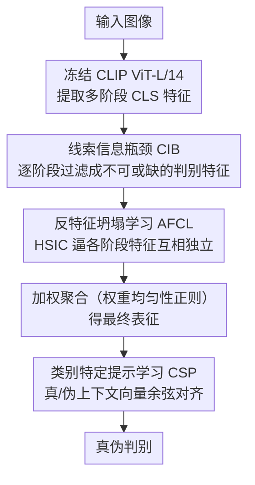

# Diversity over Uniformity: Rethinking Representation in Generated Image Detection

**会议**: CVPR 2026  
**arXiv**: [2603.00717](https://arxiv.org/abs/2603.00717)  
**代码**: [GitHub](https://github.com/Yanmou-Hui/DoU)  
**领域**: 图像取证 / AI生成图像检测  
**关键词**: 生成图像检测, 特征坍塌, 表征多样性, 信息瓶颈, CLIP

## 一句话总结

提出反特征坍塌学习框架 AFCL，通过信息瓶颈过滤无关特征并抑制不同伪造线索之间的过度重叠，保持判别表征的多样性和互补性，在跨模型生成图像检测上取得显著提升。

## 研究背景与动机

现有生成图像检测器的核心问题并非特征不足，而是**表征同质化**：模型在训练过程中倾向于将多源信息压缩为少数显著的判别模式，形成"快捷路径"式的决策。这种特征坍塌现象导致：

- 判别能力集中于少数主成分方向（有效秩仅1-2）
- 检测精度在少量主成分后即饱和，无法利用额外特征
- 当生成方法或图像分布变化时，性能急剧下降

作者通过 UMAP 可视化和主成分分析实验验证了这一假说：预训练模型的特征空间本身包含丰富的判别线索，但经过训练后被压缩到极低秩的子空间。引入表征异质性约束后，检测器能有效利用更多主成分，泛化能力显著提升。

## 方法详解

### 整体框架

AFCL 的出发点是：生成图检测器的瓶颈不是特征不够，而是训练把多源线索压成了少数几个判别方向（有效秩仅 1-2），换个生成器就失效。框架基于冻结的 CLIP ViT-L/14 提取多阶段 CLS 特征，每阶段特征先过 CIB 模块做信息瓶颈过滤、再由 AFCL 模块强制去相关，最后用加权聚合和类别特定提示学习完成真伪判别——核心是一路守住表征的多样性和互补性。

### 关键设计

**1. 线索信息瓶颈（Cue Information Bottleneck, CIB）：把每条线索过滤成不可或缺的判别信息**

要避免特征坍塌，先得让每条线索都「干净且不可替代」。CIB 对每阶段特征做信息瓶颈：最大化与标签 $y$ 的互信息、同时最小化与输入 $x$ 的互信息，

$$\max_{\{\mathrm{CIB}_i\}} \sum_{i=1}^{N} [I(\tilde{v}_i; y) - \beta I(\tilde{v}_i; x)]$$

经变分下界推导出可优化的 CIB 损失：

$$\mathcal{L}_{\mathrm{CIB}} = \sum_{i=1}^{N} D_{\mathrm{KL}}[p(y|\tilde{\mathcal{V}}) \| p(y|\tilde{\mathcal{V}} \setminus \tilde{v}_i)]$$

它度量「抽掉第 $i$ 条线索后预测会变多差」，从而逼每条线索都携带不可或缺的判别信息，得到纯化且互补的特征集合。

**2. 反特征坍塌学习（Anti-Feature-Collapse Learning, AFCL）：用 HSIC 逼各阶段特征互相独立**

纯化之后还要防止不同阶段的线索过度重叠塌成同一方向。AFCL 用 Hilbert-Schmidt 独立性准则（HSIC）作核度量，强制各阶段特征统计独立：

$$\mathcal{L}_{\mathrm{AFCL}} = \frac{1}{N(N-1)} \sum_{i \neq j} \mathrm{HSIC}(\tilde{v}_i, \tilde{v}_j)$$

其中 $\mathrm{HSIC}(\tilde{v}_i, \tilde{v}_j) = \frac{1}{(B-1)^2} \mathrm{Tr}(K_i H K_j H)$。核方法比简单正交约束更灵活，能捕捉非线性依赖。此外再加一项权重均匀性正则 $\mathcal{L}_{\mathrm{reg}} = (\sum_{i=1}^{N} \alpha_i^2 - 1/N)^2$，防止聚合时权重又坍缩到少数线索上。

**3. 类别特定提示学习（Class-Specific Prompt Learning, CSP）：为真/伪各学一组上下文向量对齐**

判别端不用固定分类头，而是为「真实」和「伪造」各学一组可训练的上下文向量，用余弦相似度把最终视觉表征 $\tilde{v}_{\mathrm{final}}$ 对齐到对应文本原型 $e_c$：

$$s_c = \frac{\tilde{v}_{\mathrm{final}} \cdot e_c}{\|\tilde{v}_{\mathrm{final}}\| \|e_c\|}$$

再用交叉熵损失 $\mathcal{L}_{\mathrm{CSP}}$ 优化，让多样化的线索能灵活对齐到类别语义上。

### 损失函数 / 训练策略

总损失为四项联合优化：

$$\mathcal{L} = \mathcal{L}_{\mathrm{CSP}} + \lambda_1 \mathcal{L}_{\mathrm{CIB}} + \lambda_2 \mathcal{L}_{\mathrm{AFCL}} + \lambda_3 \mathcal{L}_{\mathrm{reg}}$$

- 骨干：CLIP ViT-L/14（冻结）
- 优化器：Adam，学习率 $1 \times 10^{-4}$，batch size 512
- 训练数据：GenImage 的 SD v1.4 子集
- 采用 early stopping 防止过拟合

## 实验关键数据

### 主实验

| 数据集/指标 | 本文(AFCL) | VIB-Net | CLIPping | 提升(vs VIB-Net) |
|------------|-----------|---------|----------|-----------------|
| 平均 AP | 99.52% | 96.13% | 87.32% | +3.39% |
| 平均 ACC | 92.81% | 87.13% | 87.81% | +5.68% |
| 跨模型 ACC | 90.02% | — | — | — |

评估覆盖 21 个生成模型（UniversalFakeDetect 11个 + GenImage 7个 + AIGI-Holmes 6个），涵盖 GAN 和扩散模型两大范式。

### 消融实验

| 配置 | 平均ACC | 跨模型ACC | 平均AP | 说明 |
|------|---------|----------|--------|------|
| Baseline | 87.81% | 85.56% | 87.32% | 无CIB/AFCL/reg |
| +CIB | 89.72% | 85.99% | 99.38% | 信息瓶颈过滤 |
| +AFCL+reg | 91.60% | 91.15% | 99.40% | 去相关+正则化 |
| 全部 | **92.81%** | **90.02%** | **99.52%** | 所有组件协同 |

### 关键发现

- 本方法的有效秩达到 **67.38**，远高于 CNNDet（1.37）和 VIB-Net（1.92）
- 解释90%方差所需主成分数仅比预训练骨干少26个，而其他检测器减少数百个
- 仅用 0.1% 数据（320样本）即可达到 80.98% ACC / 90.81% AP
- 在 JPEG 压缩和高斯模糊干扰下保持最优鲁棒性

## 亮点与洞察

- **问题诊断精准**：通过有效秩和主成分分析，定量揭示"特征坍塌"是泛化瓶颈的根因，而非信息量不足
- **HSIC去相关**：用核方法度量特征独立性，比简单正交约束更灵活，能捕捉非线性依赖
- **信息纯化+多样性双管齐下**：CIB 去噪 + AFCL 去相关，二者互补缺一不可

## 局限与展望

- 仅在 SD v1.4 上训练，未验证在更大规模多源训练时的优势是否保持
- 多阶段特征数 $N$ 的选择对结果的影响未深入讨论
- 对视频生成（如 Sora）的检测能力未涉及

## 相关工作与启发

- 与 VIB-Net 的变分信息瓶颈机制互补：VIB-Net 压缩冗余但未处理跨层坍塌
- DRCT/Bias-Free 通过去偏操作间接缓解，本文直接从表征结构入手，更具根本性
- 启发：可将 AFCL 的反坍塌思路迁移到其他需要泛化的判别任务（如 deepfake 视频检测、跨域分类）

## 评分

- 新颖性: ⭐⭐⭐⭐ 从表征坍塌角度重新审视检测问题，视角新颖且有理论支撑
- 实验充分度: ⭐⭐⭐⭐ 21个生成模型、消融完整、鲁棒性/少样本实验充分
- 写作质量: ⭐⭐⭐⭐ 动机分析和可视化令人信服，论述清晰
- 价值: ⭐⭐⭐⭐ 对生成图像检测领域有重要启示，AFCL思想可广泛迁移

<!-- RELATED:START -->

## 相关论文

- [\[CVPR 2026\] Training-free Detection of Generated Videos via Spatial-Temporal Likelihoods](training-free_detection_of_generated_videos_via_spatial-temporal_likelihoods.md)
- [\[AAAI 2026\] CausalCLIP: Causally-Informed Feature Disentanglement and Filtering for Generalizable Detection of Generated Images](../../AAAI2026/image_generation/causalclip_causally-informed_feature_disentanglement_and_filtering_for_generaliz.md)
- [\[NeurIPS 2025\] Epistemic Uncertainty for Generated Image Detection](../../NeurIPS2025/image_generation/epistemic_uncertainty_for_generated_image_detection.md)
- [\[CVPR 2026\] SynthRGB-T: Language-Vision Guided Image Translation for Diversity Synthesis](synthrgb-t_language-vision_guided_image_translation_for_diversity_synthesis.md)
- [\[AAAI 2026\] Aggregating Diverse Cue Experts for AI-Generated Image Detection](../../AAAI2026/image_generation/aggregating_diverse_cue_experts_for_ai-generated_image_detec.md)

<!-- RELATED:END -->
