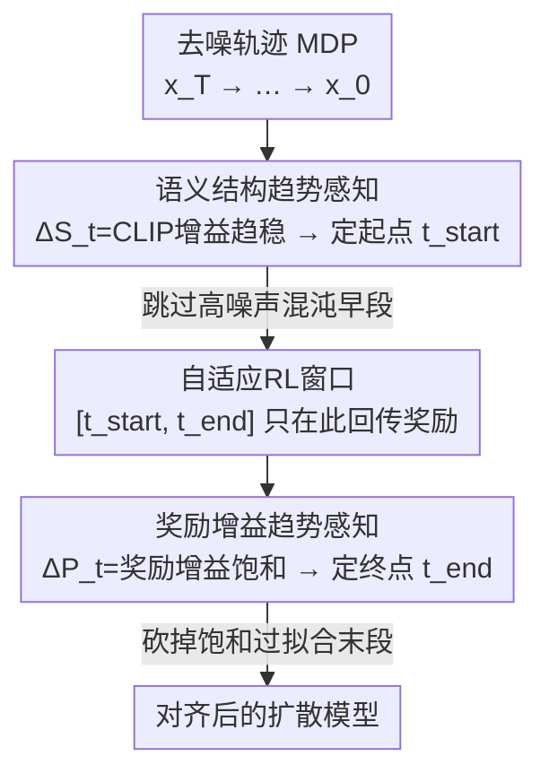

# Do Less, Achieve More: Do We Need Every-Step Optimization for RL Fine-tuning of Diffusion Models?

**会议**: CVPR 2026  
**论文**: [CVF Open Access](https://openaccess.thecvf.com/content/CVPR2026/html/Yan_Do_Less_Achieve_More_Do_We_Need_Every-Step_Optimization_for_CVPR_2026_paper.html)  
**代码**: 无  
**领域**: 扩散模型 / RLHF对齐  
**关键词**: 扩散模型RL微调, 自适应时间步, 奖励回填, 奖励黑客, 即插即用  

## 一句话总结
针对扩散模型 RL 微调"把最终奖励平均回填到每一步去噪"导致的高方差与奖励黑客问题，本文提出 AdaScope——通过感知去噪过程中的语义结构演化与奖励增益趋势，自适应地只在"结构已成形、奖励仍在涨"的中段时间步上做 RL，相比 SOTA 性能提升 66% 同时计算成本砍掉 59%。

## 研究背景与动机

**领域现状**：扩散模型靠重建目标（拟合数据分布）训练，生成质量很强，但天然不带"人类偏好 / 任务意图"这类目标导向约束。主流的做法是用 RL 微调：把美学评分、PickScore 等偏好奖励当 reward，把去噪过程建模成 MDP，用策略梯度（DDPO / DPOK / D3PO / TDPO 等）把生成结果往高奖励方向推。

**现有痛点**：偏好奖励只有在去噪**完全跑完、生成最终图像之后**才能算出来（$t=T-1$ 才有 reward，中间所有时间步 reward=0），这是典型的稀疏奖励。为了让中间每一步都有梯度，几乎所有方法都用同一个妥协：把最终那个标量奖励**原样平均回填到全部去噪步**，即 $R_{\text{real}}(s_t,a_t)\triangleq r(x_0,z),\ \forall t$。

**核心矛盾**：这种"全程等频回填"埋了两个雷。其一是**时间因果错配**——早期去噪图像还是一团噪声、结构剧烈变动，却被强行赋予一个跟它实际贡献几乎无关的最终奖励，导致策略梯度方差极大、梯度方向近乎随机。其二是**奖励黑客被放大**——晚期去噪其实已经收敛、相邻潜变量高度相关，继续优化偏好奖励边际收益趋零，反而会让模型去过拟合奖励模型的漏洞（拉高对比度、锐化到失真）来骗高分。两者叠加，既伤生成质量又白烧算力，正是标题说的"做得更多、收获更少"。

**本文目标**：不再对整条去噪轨迹一视同仁地训，而是问一个问题——RL 到底只在哪段时间步上做才有用？把这段"高价值区间" $[t_{\text{start}}, t_{\text{end}}]$ 自适应地找出来。

**切入角度**：作者观察到 RL 微调的效果随去噪阶段差异巨大（图 1）：早段结构混沌、不确定性过高；中段结构稳定且奖励还在改善；末段奖励饱和、过拟合风险上升。只有中段这个"中等不确定性"窗口值得训。

**核心 idea**：用**语义结构趋势**判定何时介入（跳过混沌早段），用**奖励增益趋势**判定何时收手（砍掉饱和末段），把 RL 集中到中间这段窗口——"少做"（更少去噪步参与优化）反而"多得"（质量和效率双赢）。

## 方法详解

### 整体框架
AdaScope 是一个**即插即用插件**，套在任意现有扩散 RL 微调方法（DDPO / DPOK / D3PO / TDPO）之上，不改其策略梯度算法，只改"在哪些去噪步上回传奖励"。整条流程是：先把去噪过程形式化为 MDP（状态 $s_t=(z, x_{T-t})$、动作 $a_t=x_{T-t-1}$、奖励只在终点非零）；然后在采样的同时，沿去噪轨迹**在线**监测两条信号——重建图与提示的语义对齐度、以及重建图的偏好奖励；用前者的变化趋势定出 RL 起点 $t_{\text{start}}$，用后者的变化趋势定出终点 $t_{\text{end}}$；最终只在窗口 $[t_{\text{start}}, t_{\text{end}}]$ 内做策略梯度更新，窗口之外的步直接跳过。其背后有一条理论支撑：相邻时间步潜变量的不确定性随生成单调下降（Lemma 1），这正是"早段该跳过、末段该终止"的依据。

### 关键设计

**1. 伴随 Pearson 相关视角：给"分阶段训练"找理论依据**

要论证"凭什么早段该跳、末段该停"，作者先从理论上刻画去噪轨迹里相邻潜变量的相关性。Theorem 1（前向—反向一致性）说明：当扩散模型训练充分、反向生成遵循 score-based SDE 时，前向加噪过程与反向生成过程的单点及联合分布一致，于是**可以用容易计算的前向过程的相关性来代表生成过程的相关性**。在此基础上 Theorem 2 给出相邻时间步分量间相关系数的闭式（含 $\bar\alpha_t$、协方差 $\Sigma$ 等），并推出 Lemma 1：

$$1-\mathrm{Corr}\!\left(x^{r,(i)}_t,\ x^{r,(i)}_{t+\tau}\right)\ \text{随生成过程单调递减}$$

也就是说，越往后去噪，相邻潜变量越相关、"不确定性"越小（图 1 绿色曲线实测吻合）。这条结论直接支撑了分阶段策略：早段不确定性高、奖励归因混乱，不值得训；末段不确定性趋零、奖励早已饱和，再训只会过拟合。它不是 pipeline 里的一个处理步骤，而是后面两个自适应判据的合法性来源。

**2. 语义结构趋势感知：自适应定 RL 起点 $t_{\text{start}}$**

针对"早段结构混沌、奖励归因错配"这个痛点，作者要让 RL **跳过结构尚未成形的早段**。做法是：对相邻两步 $x_t, x_{t-1}$，先用 Eq.1 各自一步重建出干净估计 $\hat x_0(x_t)$，再用 CLIP Score 衡量它与提示 $z$ 的语义对齐度 $f(x_t)\triangleq \mathrm{CLIP}(\hat x_0(x_t), z)$，定义**结构增益**

$$\Delta S_t = f(x_{t-1}) - f(x_t)$$

然后在线监测 $\Delta S_t$ 的变化趋势：一旦它的二阶变化趋于零（$\lim_{\Delta t\to 0}\frac{\Delta S_{t+\Delta t}-\Delta S_t}{\Delta t}\to 0$），说明在当前提示下语义结构已经稳定下来，此即合适的介入点：

$$t_{\text{start}} = \min\Big\{t \ \Big|\ \lim_{\Delta t\to 0}\tfrac{\Delta S_{t+\Delta t}-\Delta S_t}{\Delta t}\to 0\Big\}$$

从 $t_{\text{start}}$ 开始做 RL，能保证奖励回传时图像语义骨架已经搭好，从而把"动作—奖励归因错配"降到最低。关键是这个点**随提示自适应**，而非全局拍一个固定步数——不同 prompt 结构成形的快慢本就不同。

**3. 奖励增益趋势感知：自适应定 RL 终点 $t_{\text{end}}$**

针对"末段奖励饱和、继续训放大奖励黑客"这个痛点，作者要让 RL **在边际收益归零时自动收手**。对称地，对相邻两步的重建图算偏好分 $g(x_t)\triangleq \mathrm{Reward}(\hat x_0(x_t), z)$（Reward 可换成美学分、人类偏好等任意下游目标），定义**偏好增益**

$$\Delta P_t = g(x_{t-1}) - g(x_t)$$

当 $\Delta P_t$ 的变化也趋于稳定（$\lim_{\Delta t\to 0}\frac{\Delta P_{t+\Delta t}-\Delta P_t}{\Delta t}\to 0$），意味着在偏好维度上模型已经榨不出明显提升、优化进入饱和，再训就是过拟合 / 奖励黑客的温床，于是终止：

$$t_{\text{end}} = \min\Big\{t \ \Big|\ \lim_{\Delta t\to 0}\tfrac{\Delta P_{t+\Delta t}-\Delta P_t}{\Delta t}\to 0\Big\}$$

与设计 2 合起来，RL 微调区间就是 $[t_{\text{start}}, t_{\text{end}}]$——只把策略梯度花在"语义已成形、奖励仍在涨"的高价值段。它和设计 2 是同一套"监测某信号的二阶趋势趋稳即触发"的机制，一个盯结构（CLIP）、一个盯奖励（Reward），一头切早段、一头切末段，共同定义了那个自适应窗口。

## 实验关键数据

实验在 SD v1.5（主）及 v1.4 / v2.1-turbo / XL 上，用 HPSv2-photo、Pick-a-Pic（500 prompts）、simple animals 三套提示集，奖励涵盖 AES / PickScore / JPEG 压缩性 / 多目标 AES+PS；评测用 AES、PS、ImageReward、CLIP（对齐）、IS / LPIPS（多样性）。基线为 DDPO / DPOK / D3PO / TDPO 四个 SOTA。8×H20 GPU。

### 主实验：作为插件的效率与质量（SDv15, simple animal）

| 基座方法 | Time-PB(min)↓ | 达PickScore=22耗时(h)↓ | AES↑ | LPIPS↑ |
|----------|---------------|------------------------|------|--------|
| DDPO | 4.55 | 13.2 | 0.624 | 0.294 |
| **DDPO + Ours** | **2.65** | **5.37** | **0.679** | **0.295** |
| DPOK | 5.63 | 14.0 | 0.639 | 0.301 |
| **DPOK + Ours** | **3.71** | **6.76** | 0.651 | 0.300 |
| D3PO | 5.06 | 15.9 | 0.599 | 0.294 |
| **D3PO + Ours** | **3.19** | **9.07** | **0.647** | **0.297** |
| TDPO | 6.37 | 12.7 | 0.529 | 0.287 |
| **TDPO + Ours** | **4.17** | **7.14** | **0.624** | 0.287 |

四个基线挂上 AdaScope 后，单 batch 耗时和"达到目标奖励所需时间"几乎都被砍掉一半左右，同时 AES（美学）、LPIPS（多样性）等质量指标普遍上升——论文据此给出"性能 +66%、计算成本降到 59%"的总结性数字。TDPO 这种原本不太稳（CLIP 一度为负、AES 仅 0.529）的方法受益尤其明显。

### 消融实验：自适应 vs 固定窗口（Table 2 + 图 7）

| 配置 | 起点步 | 终点步 | 耗时 | 说明 |
|------|--------|--------|------|------|
| V1 | 5 | 32 | 2.45 | 固定窗口（取 Ours 的平均值） |
| V2 | 5±5 | 35 | 2.27–3.18 | 起点给区间、终点固定 |
| V3 | 5 | 35±5 | 2.27–3.18 | 起点固定、终点给区间 |
| **Ours** | **5.3** | **31.8** | **2.62** | 按 prompt 自适应选窗口 |

由于方法本身组件极简，消融重点就放在"固定窗口 vs 动态窗口"。结论是：无论怎么取固定窗口（甚至给起点/终点留浮动区间）都达不到自适应策略的 SOTA 表现，说明**最优优化窗口应当随具体 prompt 而变**，这正是 AdaScope 自适应判据的价值所在。

### 关键发现
- **少训反而更准（样本效率）**：图 4 显示，在**相同被优化样本数**下 AdaScope 的奖励学习反而更优——这超出"省算力"预期，证明扔掉过度不确定（早段）和过度确定（末段）的样本、只留中等不确定段，对奖励学习本身就是增益。
- **分布更分散、更不易奖励黑客**：图 8 用 DINOv2 特征 + t-SNE 可视化，DDPO 生成结果聚成更紧的簇（Silhouette 系数更高 = 多样性被压窄），而 AdaScope 保持更宽的生成分布——侧面印证它抑制了"骗奖励导致的模式坍缩"。
- **跨基座可迁移**：在 SDv1.4 / v2.1 / XL 上均有提升；SDXL 收益相对小，作者归因于大参数量基座本身鲁棒性高（⚠️ 此为作者推测）。

## 亮点与洞察
- **把"奖励稀疏"问题反过来用**：别人为补稀疏奖励而全程回填，本文反而承认"不是每一步都该训"，用结构/奖励的二阶趋势把无效步直接裁掉——质量与算力同向改善（罕见的"双赢"），思路上很反直觉。
- **零侵入插件**：不碰底层策略梯度，只改"在哪些步回传奖励"，因此能直接叠加到 DDPO/DPOK/D3PO/TDPO 任意一个上，工程落地成本极低，是很好的可复用 trick。
- **判据统一且无需训练**：起点用 CLIP 增益、终点用 Reward 增益，本质都是"监测某信号变化率趋稳即触发"，无额外可学习模块，几乎零超参，简洁优雅。
- **理论与现象自洽**：Lemma 1 推出的"不确定性单调下降"与图 1 实测曲线吻合，把工程直觉钉在了可推导的相关性结论上。

## 局限与展望
- **判据依赖外部打分器**：$t_{\text{start}}$ 用 CLIP、$t_{\text{end}}$ 用奖励模型，二者本身的偏置会传导进窗口选择；若奖励模型本就有漏洞，"奖励增益饱和"未必等于"质量到顶"。
- **导数趋零的阈值未明示**：$\lim_{\Delta t\to 0}\to 0$ 在离散去噪步上实际怎么判定（阈值、平滑、最小步长）正文未详述，复现需看补充材料（⚠️ 以原文/附录为准）。
- **大基座收益变小**：SDXL 上提升有限，作者归因于基座鲁棒，但也可能意味着在更强模型上"裁步"的边际价值下降，方法对小/中等基座更友好。
- **改进方向**：可探索把窗口选择从"两条标量趋势"升级为更细粒度的逐步价值估计，或与 KL 正则（DPOK 那一路）联合，从"裁时间步"和"约束分布"两个维度同时压奖励黑客。

## 相关工作与启发
- **vs 全程回填类（DDPO / D3PO 等）**：它们把最终奖励等频回填到所有去噪步以缓解稀疏奖励，本文指出这破坏时间因果、放大早段方差与末段奖励黑客；AdaScope 只在自适应窗口内回传，既省算力又提质量。
- **vs DPOK（KL 正则一路）**：DPOK 用 KL 约束让策略别偏离原模型流形来抑制奖励黑客，但没解决计算开销；本文从"裁掉低价值时间步"切入，同时拿到抗奖励黑客和省算力，且可与 KL 约束正交叠加。
- **vs TDPO（逐步偏好）**：TDPO 引入时间步级别的优化但仍覆盖全程；本文进一步论证"全程"本身不必要，把优化集中到中段，TDPO 挂上 AdaScope 后稳定性显著改善。

## 评分
- 新颖性: ⭐⭐⭐⭐⭐ "不是每一步都该做 RL"这个反直觉切入 + 相关性理论支撑，角度新且自洽
- 实验充分度: ⭐⭐⭐⭐ 4 基线 ×3 数据集 ×4 基座 ×多奖励 + 分布可视化，覆盖广；但导数判据细节与多目标结果留在补充材料
- 写作质量: ⭐⭐⭐⭐ 动机—理论—机制—实验链条清晰，图 1 把核心观察讲得很直观
- 价值: ⭐⭐⭐⭐⭐ 零侵入插件、质量与算力双赢，对所有扩散 RL 微调方法都能直接复用

<!-- RELATED:START -->

## 相关论文

- [\[CVPR 2026\] Reward Sharpness-Aware Fine-Tuning for Diffusion Models](reward_sharpness-aware_fine-tuning_for_diffusion_models.md)
- [\[CVPR 2026\] RealUnify: Do Unified Models Truly Benefit from Unification? A Comprehensive Benchmark](realunify_do_unified_models_truly_benefit_from_unification_a_comprehensive_bench.md)
- [\[ICCV 2025\] Less is More: Improving Motion Diffusion Models with Sparse Keyframes](../../ICCV2025/image_generation/less_is_more_improving_motion_diffusion_models_with_sparse_keyframes.md)
- [\[CVPR 2026\] CRAFT: Aligning Diffusion Models with Fine-Tuning Is Easier Than You Think](craft_aligning_diffusion_models_with_finetuning_is_easier_than_you_think.md)
- [\[CVPR 2026\] Towards Fine-Grained Attribution: Instance-Aware Preference Optimization for Aligning Diffusion Models](towards_fine-grained_attribution_instance-aware_preference_optimization_for_alig.md)

<!-- RELATED:END -->
