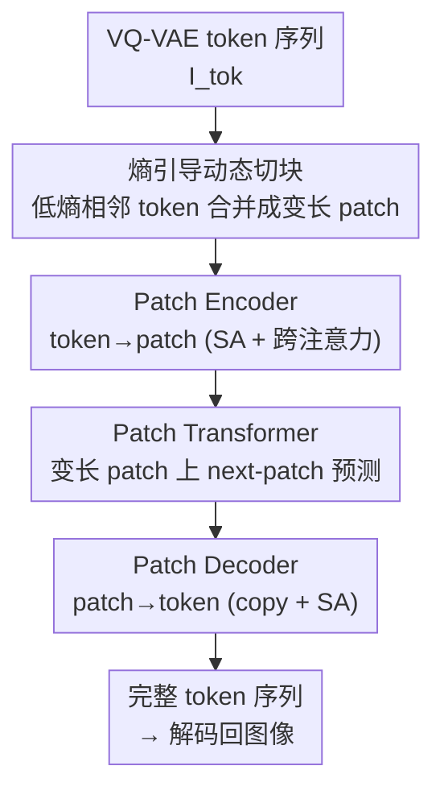

# DPAR: Dynamic Patchification for Efficient Autoregressive Visual Generation

**会议**: CVPR 2026  
**论文**: [CVF Open Access](https://openaccess.thecvf.com/content/CVPR2026/html/Srivastava_DPAR_Dynamic_Patchification_for_Efficient_Autoregressive_Visual_Generation_CVPR_2026_paper.html)  
**代码**: https://github.com/dsrivastavv/DPAR  
**领域**: 图像生成  
**关键词**: 自回归图像生成, 动态切块, 熵引导token合并, 高效Transformer, VQ-VAE  

## 一句话总结
DPAR 用一个轻量熵模型算出每个图像 token 的「下一 token 预测熵」，把低信息区域（天空、墙面）的相邻 token 动态合并成变长 patch、高信息区域保留 token 级粒度，让 decoder-only 自回归 Transformer 在「更少的 patch」上做 next-patch 预测，从而在 ImageNet 256/384 上减少 1.81×/2.06× token 数、最高省 40.4% 训练 FLOPs，同时 FID 反而最高提升 29.6%。

## 研究背景与动机

**领域现状**：解码器自回归（decoder-only AR）图像生成正在追平甚至超越扩散模型。主流做法（如 LlamaGen）是用 VQ-VAE 把图像编码成 2D 离散 token 网格，按光栅顺序拍平成 1D 序列，然后像语言模型一样用 next-token prediction（NTP）逐 token 生成。这条路线的吸引力在于能和语言模型无缝拼成统一的多模态生成框架。

**现有痛点**：固定长度 tokenization 的 token 数随分辨率**二次增长**——256×256 在 16× 下采样下是 256 个 token，1024×1024 就是 4096 个，token 数和注意力上下文长度都涨 16×，计算和显存开销爆炸。已有的缓解手段各有硬伤：1D tokenizer（TiTok、One-D-Piece）确实把 token 数压下去了，但丢掉了 2D 空间结构，而 outpainting / inpainting 这类零样本编辑恰恰依赖 2D 结构；token 合并方法（Token-Shuffle 等）则按**固定比例**静态合并，会把高信息区域也一并压掉，造成细节丢失、生成质量下降。

**核心矛盾**：「减少 token 数」和「保留 2D 结构 + 不损高信息区域」之间存在 trade-off。固定比例的静态合并无法区分一张图里哪块是均匀的天空、哪块是密集的纹理，于是要么压得不够（省不了多少），要么压过头（细节糊掉）。

**切入角度**：作者观察到，图像里大量低信息区域（天空、墙面）本就能用更少的 token 表示而不损信息。如何判断「某个区域信息量低」？借鉴 NLP 里的 Byte Latent Transformer（BLT）——它用「下一字节预测熵」来动态合并字节。作者把这个思路搬到 VQ-VAE token 层：均匀区域的下一 token 选择少、模式单一，预测熵低；纹理密集区域下一 token 不确定性大，预测熵高。于是熵就成了一个天然的、无监督的「信息量」探测器。

**核心 idea**：用一个轻量无监督 AR 模型的 **next-token 预测熵** 作为合并准则，把低熵（低信息）相邻 token 合并成变长 patch、高熵区域保留 token 级粒度，让自回归 Transformer 在变长 patch 序列上生成，既保留 2D 空间结构、又按信息含量自适应分配算力。

## 方法详解

### 整体框架

DPAR 的输入是一张图像经 VQ-VAE 得到的 1D token 序列 $I_{tok}=[x_0,\dots,x_{T-1}]$ 和条件 $C$（类别/prompt），输出是逐 patch 自回归生成的完整 token 序列（再解码回图像）。整条 pipeline 由四个组件串起来：先用**熵模型**给每个 token 算预测熵 → **动态切块**按熵把相邻 token 划成变长 patch → **Patch Encoder** 把每个 patch 内的 token 聚合成一个 patch 表示 → **Patch Transformer**（计算主力）在 patch 序列上做 next-patch 自回归预测 → **Patch Decoder** 把预测出的 patch 还原回逐个 token。

关键点：自回归主干只在「数量更少的 patch」上跑注意力（256 token 变约 142 个 patch），而注意力是二次复杂度，所以省下大量算力；编码器/解码器都刻意做得很浅（单层 encoder + 3~6 层 decoder），把算力预算尽量留给 patch transformer。整套改动对标准 decoder 架构是「最小侵入」的，因此仍兼容多模态生成框架。

### 关键设计

**1. 熵引导的动态切块：用预测熵决定哪里该合并**

这是 DPAR 的核心创新，直接对准「静态合并会压掉高信息区」的痛点。作者先训练一个**轻量、无条件**（$C=\emptyset$）的 GPT 式 AR 模型作为熵模型 $\mathcal{E}_\phi$（实现里是 111M 的 LlamaGen-B），用它给每个 token 算下一 token 预测熵：

$$e_i = \mathcal{H}(x_{<i};\,\mathcal{E}_\phi) = -\sum_{c=0}^{V-1}\mathcal{E}_\phi(x_i=c\mid x_{<i})\,\log\mathcal{E}_\phi(x_i=c\mid x_{<i})$$

切块规则是贪心的：从第一个 token 起逐个判断，若当前 token 的熵 $e_i \le H_{Th}$ 就把它并入当前 patch $P_m$，一旦 $e_i > H_{Th}$ 就另起一个新 patch。首 token 强制 $e_0=+\infty$ 保证它独立成块。在此之上加两条约束：① **最大 patch 长度** $P_{max}$，防止在大片均匀区无限合并导致信息丢失；② **行边界重置**——每行结尾强制断开，因为光栅展开时行边界处的图像特征本就不连续，跨行合并不合理。$H_{Th}$ 和 $P_{max}$ 共同决定平均 patch 长度 $P_{avg}=\mathbb{E}[T/M]$，256 分辨率下取 $H_{Th}=7.8,\,P_{max}=4$ 得到 $P_{avg}=1.81$。这样均匀区被合并、纹理区保持 token 粒度，算力分配自然向高信息区倾斜。消融显示熵门控、最大长度、行重置三者全开 FID 最好（见下文 Table 3）。

**2. Patch Encoder：把一个 patch 内的多个 token 压成一个表示**

切块只是给出了「哪些 token 归一组」，还需要把每组 token 真正聚合成一个和单 token 同维度的 patch 向量。Patch Encoder 沿用 BLT 的 local encoder 思路、做得很轻（单层）：先在 token 间做带 2D RoPE 的因果自注意力，得到每个 token 的隐表示 $h_{x_i}$；再做一次**跨注意力**，以 patch 为 query、以该 patch 跨度内的 token 为 key/value：

$$h_{P_m} = \mathrm{CA}\!\bigl(z_{P_m},\, H^{tok}_{s_m:f_m}\bigr),\quad \forall P_m\in I_{patch}$$

得到 patch 表示序列 $H_{patch}=[h_{P_0},\dots,h_{P_{M-1}}]$。这里用 cross-attention 而非简单平均，是为了让每个 patch 自适应地从其包含的若干 token 里抽取最有信息的内容，而不是机械均值。

**3. Patch Transformer + Dynamic RoPE：在变长 patch 上做自回归（算力主力）**

这是整条 pipeline 里最重、也是省算力的关键环节。它是 decoder-only 模型，沿用 LlamaGen 的 LLaMA 架构（因果自注意力 + MLP），条件于 $C$，在 patch 表示 $H_{patch}$ 上预测下一个 patch 表示 $\hat{H}_{patch}$。因为它处理的是「数量更少的 patch」而非全部 token，而注意力是序列长度的二次复杂度，所以注意力计算量大幅下降——这正是 DPAR 省 FLOPs 的来源。与标准 token 级 Transformer 用 2D RoPE 不同，这里每个 patch 含的 token 数是变长的，作者改用 **Dynamic RoPE** 来给变长 patch 编码位置（细节在附录，⚠️ 正文未展开，以原文为准）。为高效处理变长 patch、避免 padding 到最大长度，作者用 xformers 实现了 packed 版 LlamaGen。

**4. Patch Decoder：把生成的 patch 还原成逐个 token**

生成是在 patch 粒度做的，但最终要的是 token（才能解码成图）。Patch Decoder 同样借鉴 BLT 的 local decoder、保持轻量：先做一个 **copy 操作**——把每个预测出的 patch 状态 $\hat{h}_{P_m}$ 复制回它对应的所有 token 位置，再经归一化 + 线性投影叠加到编码阶段的 token 隐表示上：

$$\tilde{h}_{x_i} = h_{x_i} + \mathrm{Linear}\!\bigl(\mathrm{Norm}(\hat{h}_{P_m})\bigr),\quad \forall i\in P_m$$

随后在 token 间再做一次带 2D RoPE 的因果自注意力，最后用线性输出头映射到下一 token 概率 $\hat{P}_{tok}$，用于训练的交叉熵和采样。这样一来，「patch 内每个 token 各自是什么」由解码器在 token 粒度补全，patch 只负责承载粗粒度的全局信息。

### 损失函数 / 训练策略

训练目标就是标准的 token 级交叉熵（见 Algorithm 1）：切块 → 编码得 $H_{tok},H_{patch}$ → patch transformer 自回归出 $\hat{H}_{patch}$ → 解码出 $\hat{P}_{tok}$ → 对真值 token 算交叉熵

$$\mathcal{L}_{CE} = -\sum_{t=0}^{T-1}\log\hat{p}_t(x_t)$$

注意 loss 仍在**完整 token 序列**上计算，patch 只是中间的高效表示。训练用 8×A100、batch 256、300 epoch、AdamW（lr 1e-4 恒定、无 scheduler）、CFG drop 0.1；token 和熵值离线预计算以省去 on-the-fly 开销。推理时（Algorithm 2）逐 token 生成、动态判断是否起新 patch，并支持调大推理阈值 $H^{inf}_{Th}$ 换取更大 patch、进一步提速。

## 实验关键数据

数据集为 ImageNet 类别条件生成，主指标 FID-50K，辅以 IS、Precision/Recall。主要和同 tokenizer 的 LlamaGen 对比（其它工作 tokenizer / token 顺序 / 训练范式不同，直接比不公平）。

### 主实验

| 模型 | #Params | FID↓ | IS↑ | Steps | 说明 |
|------|---------|------|-----|-------|------|
| LlamaGen-B | 111M | 5.46 | 193.6 | 256 | 256 基线 |
| DPAR-B (cfg=2.1) | 120M | **3.98** | 250.6 | 142 | 同档省 token |
| LlamaGen-XL | 775M | 3.39 | 227.1 | 256 | 256 基线 |
| DPAR-XL (cfg=2.0) | 789M | **2.67** | 281.7 | 142 | — |
| LlamaGen-384-B | 111M | 6.09 | 182.5 | 576 | 384 基线 |
| DPAR-384-B (cfg=2.1) | 120M | **4.29** | 254.5 | 280 | FID 相对降 29.6% |
| LlamaGen-384-XXL | 1.4B | 2.34 | 253.9 | 576 | 384 基线 |
| DPAR-384-XXL (cfg=1.75) | 1.4B | **2.30** | 287.4 | 280 | — |

在两个分辨率、所有模型尺寸上，DPAR 的 FID 都优于同参数量的 LlamaGen，384 分辨率 Base 档 FID 相对提升达 29.6%；同时采样步数（patch 数）从 256→142、576→280 明显减少。FLOPs 方面，DPAR-XL 在 384 分辨率下相比 LlamaGen-XL 减少 **40.4%** 训练 FLOPs，主要得益于免 padding 的 packed patch transformer。token 数在 256/384 分别压缩 1.81×/2.06×，且随分辨率呈次二次增长（Figure 4 中最高省 60% token）。

### 消融实验

切块三个二元设计的消融（DPAR-L，256px，50 epoch；全关 = 固定长度 $P_{static}=1.81$ 的静态切块）：

| 熵门控 | 最大 patch 长 | 行边界重置 | FID↓ |
|:---:|:---:|:---:|:---:|
| × | × | × | 3.58 |
| ✓ | × | × | 3.91 |
| ✓ | ✓ | × | 3.45 |
| ✓ | ✓ | ✓ | **3.32** |

超参敏感性（固定另一项）：

| 超参 | 取值 → FID-50K |
|------|----------------|
| $H_{Th}$（$P_{max}=4$） | 7.6→3.36 / 7.7→3.41 / **7.8→3.32** / 7.9→3.46 / 8.0→3.43 |
| $P_{max}$（$H_{Th}=7.8$） | 1→3.73 / 2→3.42 / **4→3.32** / 6→3.49 / 8→3.41 / 16→3.61 |

### 关键发现

- **只开熵门控反而更差**（3.58→3.91）：单靠熵、不限最大 patch 长会在大片均匀区过度合并、信息丢失；必须叠加 $P_{max}$ 和行重置才在 3.32 拿到最优。这说明「熵是好准则，但要配硬约束」。
- **$P_{max}$ 存在甜点**：从 1 增到 4 时 FID 改善，再往上（6/8/16）退化——合并过头损细节。$H_{Th}=7.8$、$P_{max}=4$ 联合最优。
- **动态训练带来对 patch 边界的鲁棒表示**（Table 5）：DPAR-L 用 $H^{train}_{Th}=7.8$ 训练，推理阈值从 7.8 调到 8.1（patch 变大）时 FID 仅从 3.32 微升到 3.39；而静态模型同样调整下 FID 从 3.58 暴涨到 25.59。即 DPAR 训练出的表示能在推理期自由换更大 patch 进一步提速而几乎不掉点。
- **学到更强的全局表示**：线性探测 DPAR-L 的全局图像特征达 37.82% top-1 / 61.15% top-5，比 LlamaGen-L（32.62% / 56.61%）高约 5pp，佐证「patch 要跨变长跨度追踪未来 token」逼出了更强的全局表征。

## 亮点与洞察
- **把 NLP 的熵切块迁移到图像 token 层**：BLT 在字节层用预测熵动态合并，DPAR 首次证明同一准则能用在 VQ-VAE token 上区分高/低信息区——这是一个干净的跨模态思想迁移，且无监督、不需额外标注。
- **「省算力反而提质量」的反直觉结果**：通常压缩 token 会掉点，但 DPAR 在压 1.8~2× token 的同时 FID 还更好，原因在于变长 patch 逼出了更强的全局表示（线性探测 +5pp 佐证），而非单纯做了个 efficiency trade-off。
- **训练/推理解耦的鲁棒性可复用**：「训练期固定阈值、推理期可调大 patch 几乎不掉点」是个很实用的性质——部署时可按算力预算无痛调档，这种「训一次、推理期可伸缩」的设计思路能迁移到其它 token 合并/剪枝方法。
- **最小侵入、兼容多模态**：只在标准 decoder 外挂轻量 encoder/decoder，patch transformer 仍是 LLaMA，因此能直接塞进统一多模态生成框架。

## 局限与展望
- **依赖一个额外的熵模型**：需要先训练（或预跑）一个 111M 无条件 AR 模型来产熵，并离线预计算全数据集的 token+熵，增加了 pipeline 复杂度和一次性预处理成本；论文未充分讨论熵模型质量对最终生成的影响边界。
- **只验证了光栅顺序 + ImageNet 类别条件**：作者明确说本方法与随机顺序方法（RandAR/RAR）、VAR 等正交但未实验，也未做文本到图像；是否在更大规模、文生图上同样有效仍待验证。
- **推理加速尚未完整落地**：结论里坦言为这套 encoder-decoder 架构设计专门的 KV-Cache 策略仍是 future work——目前主打的是训练 FLOPs 下降，推理端真实墙钟加速还没给充分数据。⚠️ Dynamic RoPE 的具体机制正文未展开（在附录），复现需查原文。
- **改进思路**：把熵切块直接和随机顺序生成、多尺度（VAR）结合；或让熵模型与主模型联合/在线更新，省去离线预处理。

## 相关工作与启发
- **vs LlamaGen**：DPAR 直接以 LlamaGen 为底座，复用其 VQ tokenizer 和 LLaMA 主干，区别在于在主干前后挂上熵切块 + 轻量 encoder/decoder，让主干在变长 patch 而非定长 token 上跑。结果是更少 token、更省 FLOPs，FID 反而更好。
- **vs BLT（NLP）**：思想直接来自 BLT 的「下一字节预测熵动态合并」，但 BLT 切的是文本字节、DPAR 切的是 VQ-VAE 图像 token，并额外引入行边界重置等图像专有约束，证明熵准则跨模态可用。
- **vs 1D tokenizer（TiTok / One-D-Piece）**：1D 方案压缩率高但丢 2D 结构、损零样本编辑；DPAR 保留 2D token 网格、只在其上动态合并，兼得「变长压缩」和「2D 结构」。
- **vs 静态 token 合并（Token-Shuffle 等）**：它们按固定比例合并、会压掉高信息区；DPAR 按熵自适应，只合并低信息区，消融里静态切块（3.58）明显劣于动态（3.32），推理可扩展性差距更大（25.59 vs 3.39）。
- **vs NPP**：NPP 也用 patch 但只在训练早期用大静态 patch、推理不用 patch；DPAR 训练和推理全程用动态 patch，且推理期 patch 可伸缩。

## 评分
- 新颖性: ⭐⭐⭐⭐⭐ 首次把 next-token 预测熵用于 VQ-VAE token 层的动态切块，跨模态迁移干净且打开了「按信息量分配算力」的自回归图像生成新维度
- 实验充分度: ⭐⭐⭐⭐ ImageNet 256/384 多尺寸 + 切块/超参/推理可扩展性消融扎实，但只限光栅顺序+类别条件，缺文生图与推理墙钟加速数据
- 写作质量: ⭐⭐⭐⭐⭐ 动机—方法—消融逻辑清晰，算法伪码 + 公式完整，图示直观
- 价值: ⭐⭐⭐⭐⭐ 最小侵入、兼容多模态、训练省 40% FLOPs 还提质量，对统一多模态自回归生成有直接实用价值

<!-- RELATED:START -->

## 相关论文

- [\[CVPR 2026\] DDiT: Dynamic Patch Scheduling for Efficient Diffusion Transformers](ddit_dynamic_patch_scheduling_for_efficient_diffusion_transformers.md)
- [\[ICLR 2026\] Pyramidal Patchification Flow for Visual Generation](../../ICLR2026/image_generation/pyramidal_patchification_flow_for_visual_generation.md)
- [\[CVPR 2026\] Mirai: Autoregressive Visual Generation Needs Foresight](mirai_autoregressive_visual_generation_needs_foresight.md)
- [\[CVPR 2026\] Depth Adaptive Efficient Visual Autoregressive Modeling](depthvar_depth_adaptive_var.md)
- [\[CVPR 2026\] Memory-Efficient Fine-Tuning Diffusion Transformers via Dynamic Patch Sampling and Block Skipping](memory-efficient_fine-tuning_diffusion_transformers_via_dynamic_patch_sampling_a.md)

<!-- RELATED:END -->
