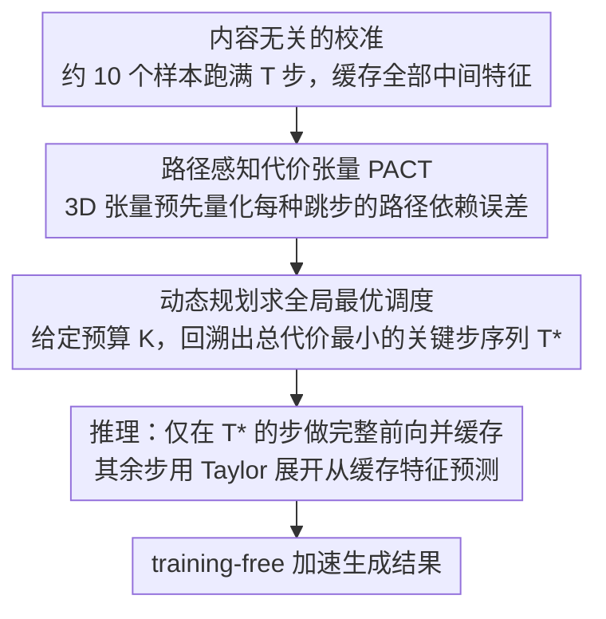

# Denoising as Path Planning: Training-Free Acceleration of Diffusion Models with DPCache

**会议**: CVPR 2026  
**arXiv**: [2602.22654](https://arxiv.org/abs/2602.22654)  
**代码**: [https://github.com/argsss/DPCache](https://github.com/argsss/DPCache)  
**领域**: 扩散模型  
**关键词**: 扩散模型加速, 特征缓存, 动态规划, 路径规划, training-free

## 一句话总结
将扩散模型采样加速形式化为全局路径规划问题，通过构建路径感知代价张量 (PACT) 并使用动态规划选择最优关键时间步序列，实现 training-free 的 4.87× 加速且生成质量超越全步基线。

## 研究背景与动机

1. **领域现状**：扩散模型（特别是 DiT 架构）在图像和视频生成中取得了巨大成功，但多步迭代采样带来的巨大计算开销严重阻碍了实际部署。缓存方法作为 training-free 的加速方案备受关注——核心思路是复用或预测相邻时间步之间高度相似的中间特征。

2. **现有痛点**：现有缓存方法存在两个根本问题：(1) **固定调度策略**（如 DeepCache）不考虑局部特征动态，在关键过渡区域造成严重偏差；(2) **局部自适应策略**（如 TeaCache、SpeCa）做贪心的短视决策，可能跳过关键时间步，导致不可逆的轨迹漂移和误差累积。

3. **核心矛盾**：缓存加速中的关键决策——"在哪些时间步做完整计算、在哪些时间步用缓存预测"——本质上是一个全局优化问题，但现有方法都只在局部做出这个决策，完全忽略了去噪轨迹的全局结构。

4. **本文目标** 设计一种全局最优的采样调度策略，使得在给定计算预算（K 步）下，选出的关键时间步序列能最小化整条去噪轨迹的总偏差。

5. **切入角度**：作者观察到去噪轨迹的形状在很大程度上与生成内容无关，主要由扩散模型本身决定。因此可以在少量校准样本上预计算最优调度，然后应用到任意输入。

6. **核心 idea**：将扩散采样加速重新表述为路径规划问题，用 3D 路径感知代价张量捕捉跳步误差的路径依赖性，再用动态规划精确求解全局最优调度。

## 方法详解

### 整体框架
DPCache 想回答缓存加速里最核心却一直被局部处理的那个问题：在 T 步去噪里，到底该在哪几步老老实实做完整前向、哪几步直接用缓存特征预测，才能在固定预算下让整条轨迹偏差最小。它把这个决策从"逐步贪心"抬升到"全局规划"，整条流水线分三段。先是**校准**：拿约 10 个样本跑满 T 步去噪，把所有时间步的中间特征都缓存下来，据此算出一个路径感知代价张量 PACT，把"从某一步跳到另一步会引入多大误差"全部预先量化。接着是**最优调度选择**：给定目标步数 $K < T$，用动态规划在 PACT 上挑出一条总路径代价最小的关键时间步序列 $\mathcal{T}$。最后是**推理**：真正生成时只在 $\mathcal{T}$ 里的时间步做完整前向并缓存，其余步用 Taylor 展开等方法从缓存特征预测输出。关键在于调度只需在校准期算一次，之后任意输入都直接复用同一份 $\mathcal{T}$。

### 关键设计

**1. 路径感知代价张量 PACT：让跳步误差带上"前因"**

现有缓存方法用一个 2D 代价矩阵衡量"从 $j$ 跳到 $k$ 损失多大"，但这忽略了一个事实——预测出的特征依赖于之前缓存的是哪一步的状态，跳步误差是**有路径依赖的**。DPCache 因此把代价升成 3D 张量 $\mathcal{C} \in \mathbb{R}^{(T+1) \times (T+1) \times (T+1)}$，$\mathcal{C}[i,j,k]$（$i>j>k$）表示"在上一个关键时间步是 $i$ 的前提下，从 $j$ 跳到 $k$"所累积的误差。它不是只看终点偏差，而是把这一跳跨过的每个中间步的预测偏差都加起来：

$$\mathcal{C}[i,j,k] = \sum_{\tau=k}^{j-1} \|h_\tau^L - h_{pred,\tau}^L(i,j)\|_1$$

这个累积形式让大跨度跳步天然地承担更高代价——一步跨得越远、跨过的中间预测越多，攒下的偏差就越大，于是那些看着局部省事、实则把轨迹带歪的大跳步会被自动惩罚。多出来的那一维 $i$ 正是 2D 矩阵丢掉的"前因"，没有它，调度优化只能基于不准确的误差估计来选步。

**2. 动态规划求全局最优调度：在指数空间里精确求解**

选出 $K$ 个关键步的组合数是指数级的，贪心或启发式都只能逼近。DPCache 注意到 PACT 已经把"每一跳带前一关键步条件的代价"都备好了，这正好是一个最短路径式的序列决策问题，可以用动态规划精确求解。它维护代价表 $D[m,k]$（用 $m$ 个关键步走到时间步 $k$ 的最小累积代价）和回溯表 $P[m,k]$，递推为

$$D[m,k] = \min_{j>k}\; D[m-1,j] + \mathcal{C}[P[m-1,j],\, j,\, k]$$

注意递推里取代价时用了 $P[m-1,j]$，也就是上一关键步——这一步正好把 PACT 的路径依赖维度接了进去。同时强制前 $M=3$ 个时间步必须入选，保护早期那段决定大结构的关键去噪动态不被跳过。整体复杂度 $O(KT^2)$、空间 $O(KT)$，对 $K<T=50$ 的典型设置开销可忽略，且只在校准期跑一次。打个比方，给 $T=50$、$K=9$，DP 会从 50 个候选步里回溯出形如"0,1,2 必选 + 后续 6 个最省代价的步"的序列，而不是像固定调度那样每隔几步硬切一刀。

**3. 内容无关的校准：一次预计算，处处复用**

前两步要成立，前提是这份在少量样本上算出的调度能泛化到任意输入。作者的依据是一个经验观察：去噪轨迹的**形状**主要由扩散模型本身决定，跟具体生成什么内容关系不大。于是校准只需约 10 个随机样本——实验里甚至只用 1 个样本，得到的调度序列和生成质量都几乎一样；连把校准用的 prompt 数据集从 DrawBench 换成 PartiPrompts，选出的关键步也不变。这把校准开销压到了一次性、可忽略的量级，实际部署时无需为每个新 prompt 重新规划。

### 损失函数 / 训练策略
DPCache 完全 training-free。校准阶段只跑标准前向推理收集特征，不涉及任何梯度或参数更新。预测步骤与具体缓存预测方法解耦，可直接套用 TaylorSeer 的 Taylor 展开、HiCache 的 Hermite 多项式等，默认用 2 阶 Taylor 预测——也就是说 DPCache 只负责"何时预测"，把"预测什么"留给现成方法。

## 实验关键数据

### 主实验（FLUX.1-dev, DrawBench）

| 方法 | 加速比 | ImageReward↑ | CLIP Score↑ | PSNR↑ | SSIM↑ |
|------|--------|-------------|-------------|-------|-------|
| 50 steps (baseline) | 1.00× | 0.979 | 17.40 | - | - |
| DPCache (K=13) | 3.54× | **1.007** | **17.34** | **21.65** | **0.8106** |
| DPCache (K=9) | 4.87× | **0.958** | **17.33** | **18.77** | **0.7117** |
| TeaCache (对标K=13) | 3.42× | 0.934 | 17.17 | 16.31 | 0.6812 |
| TaylorSeer (对标K=13) | 3.51× | 0.939 | 17.31 | 16.95 | 0.6922 |
| SpeCa (对标K=13) | 3.62× | 0.975 | 17.27 | 18.35 | 0.6773 |

### HunyuanVideo (VBench)

| 方法 | 加速比 | VBench Score↑ | PSNR↑ | 内存(GB) |
|------|--------|--------------|-------|----------|
| 50 steps | 1.00× | 80.93 | - | 60.22 |
| DPCache (K=11) | 4.05× | **80.35** | **23.11** | 60.58 |
| DPCache (K=9) | 4.75× | **80.23** | **21.04** | 60.58 |
| TaylorSeer | 3.87× | 80.33 | 18.53 | 84.47 |
| SpeCa | 4.05× | 80.26 | 20.09 | 84.47 |

### 消融实验 (PACT, FLUX K=13)

| 代价维度 | 累积误差 | ImageReward↑ | PSNR↑ | SSIM↑ |
|---------|---------|-------------|-------|-------|
| 2D | ✘ | 1.001 | 20.87 | 0.7881 |
| 2D | ✔ | 0.977 | 19.46 | 0.7605 |
| 3D | ✘ | 0.998 | 21.05 | 0.7952 |
| **3D** | **✔** | **1.007** | **21.65** | **0.8106** |

### 关键发现
- **超越全步基线**：在 FLUX 上 3.54× 加速时 ImageReward 不降反升 (+0.028)，4.87× 加速时仍大幅优于其他方法 (+0.031)。这说明全局最优调度实际上"净化"了原始轨迹中的冗余步。
- **PACT 的 3D 路径依赖性至关重要**：3D+累积误差相比 2D 在 PSNR 上提升 0.78，证实路径依赖建模的必要性。但 2D+累积误差反而最差（0.977），因为 2D 的误差估计本身不准确，累积后会误导调度选择。
- **校准极其鲁棒**：1 个样本就能得到竞争力结果，不同数据集之间的调度方案完全一致——去噪轨迹形状确实与内容无关。
- **内存优势明显**：DPCache 仅缓存最后一层特征，在 HunyuanVideo 上仅增加 0.36GB，而 TaylorSeer/SpeCa 需要缓存所有层，增加 24.25GB。

## 亮点与洞察
- **将采样加速重新表述为路径规划问题**是本文最关键的贡献。这不仅仅是换了个框架，而是揭示了"固定/局部调度 → 全局调度"带来的质的飞跃——PSNR 提升 2-5 dB，SSIM 提升 0.1+。这个路径规划视角可以迁移到任何涉及序列决策的加速场景中。
- **用极少校准样本即可泛化**的发现非常实用——说明去噪轨迹的全局结构是模型的固有属性而非数据属性，为一次性预计算打下理论基础。
- **3D 代价张量 vs 2D 代价矩阵**的对比消融设计精妙，清楚地证明了路径依赖性不能被忽略。

## 局限与展望
- 当前 PACT 的构建复杂度为 $O(T^3)$，对于步数很多的模型（T >> 50）可能成为瓶颈，虽然只需一次性计算。
- 方法假设去噪轨迹形状与内容无关，但在极端分布外的 prompt 下是否仍成立值得进一步验证。
- 仅缓存最后一层特征；如果在不同层使用不同的调度策略（层级自适应调度），可能进一步提升性能。
- 与步数蒸馏（如 DMD、一致性模型）等训练方法的结合尚未探索，两者可能互补。

## 相关工作与启发
- **vs DeepCache**: DeepCache 使用固定间隔的缓存策略，不考虑不同时间步的重要性差异，DPCache 通过全局优化自动识别关键时间步。
- **vs TeaCache**: TeaCache 的局部自适应策略虽比固定策略好，但贪心决策会跳过关键步导致不可逆漂移，DPCache 的全局视角彻底解决了这个问题。
- **vs TaylorSeer**: TaylorSeer 提出了基于 Taylor 展开的特征预测，DPCache 直接复用其预测方法但替换了调度策略，证明"预测什么"不如"何时预测"重要。

## 评分
- 新颖性: ⭐⭐⭐⭐ 路径规划视角新颖，PACT 的 3D 设计有理论深度
- 实验充分度: ⭐⭐⭐⭐⭐ 三个模型（DiT/FLUX/HunyuanVideo）、三个任务、完整消融，压倒性地优于所有基线
- 写作质量: ⭐⭐⭐⭐ 逻辑清晰，图示直观，算法描述规范
- 价值: ⭐⭐⭐⭐⭐ 即插即用的 training-free 加速框架，兼顾效率与质量，实用性极强

<!-- RELATED:START -->

## 相关论文

- [\[CVPR 2026\] Just-in-Time: Training-Free Spatial Acceleration for Diffusion Transformers](just-in-time_training-free_spatial_acceleration_for_diffusion_transformers.md)
- [\[CVPR 2026\] Adaptive Spectral Feature Forecasting for Diffusion Sampling Acceleration](adaptive_spectral_feature_forecasting_for_diffusion_sampling_acceleration.md)
- [\[CVPR 2026\] TAP: A Token-Adaptive Predictor Framework for Training-Free Diffusion Acceleration](tap_a_token-adaptive_predictor_framework_for_training-free_diffusion_acceleratio.md)
- [\[CVPR 2026\] TC-Padé: Trajectory-Consistent Padé Approximation for Diffusion Acceleration](tc-padé_trajectory-consistent_padé_approximation_for_diffusion_acceleration.md)
- [\[CVPR 2026\] SparVAR: Exploring Sparsity in Visual Autoregressive Modeling for Training-Free Acceleration](sparvar_exploring_sparsity_in_visual_autoregressive_modeling_for_training-free_a.md)

<!-- RELATED:END -->
