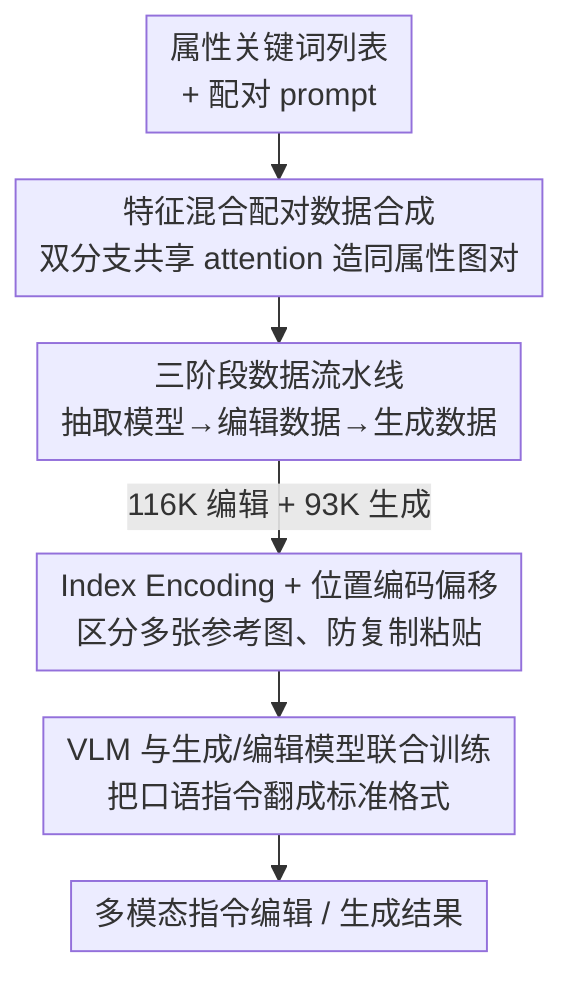

# DreamOmni2: Multimodal Instruction-based Generation and Editing

**会议**: CVPR 2026  
**论文**: [CVF Open Access](https://openaccess.thecvf.com/content/CVPR2026/html/Xia_DreamOmni2_Multimodal_Instruction-based_Generation_and_Editing_CVPR_2026_paper.html)  
**代码**: https://github.com/dvlab-research/DreamOmni2 (有)  
**领域**: 图像生成 / 扩散模型  
**关键词**: 多模态指令编辑, 主体驱动生成, 抽象属性, 特征混合数据合成, 统一生成编辑模型

## 一句话总结
DreamOmni2 把"指令编辑"和"主体驱动生成"升级成**带参考图的多模态指令任务**，既能引用具体物体也能引用材质/姿态/发型/风格这类抽象属性；它用一套三阶段合成数据流水线造出训练对，再给统一编辑模型 Flux Kontext 加上 index encoding + 位置编码偏移和 VLM 联合训练，使其支持多参考图输入并读懂复杂口语指令，在自建 benchmark 上人评胜过 GPT-4o / Nano Banana。

## 研究背景与动机
**领域现状**：统一的图像生成+编辑模型（如 Flux Kontext、Qwen-Image-Edit）很火——一个模型里既能按指令改图、又能做主体驱动生成，简化了用户流程也降低了部署成本。

**现有痛点**：当前主流做法有两条互补的局限。一是**纯文字指令的编辑**：当用户说"把这个包改成跟那条裙子一样的花纹"，"裙子的复杂花纹"根本没法用文字描述清楚，必须配参考图；而且要引用的往往不是物体，而是材质、姿态、发型、设计风格这类**抽象属性**，更难言传。二是**主体驱动生成**：现有方法（DreamBooth、IP-Adapter、UNO 等）几乎只会把**具体物体/人**搬到新图里，几乎没人研究怎么引用图里的抽象属性。

**核心矛盾**：这两个新任务的真正瓶颈不在模型结构，而在**训练数据不存在**。传统编辑数据流水线只造"指令+源图+目标图"三元组，没法把参考图作为编辑条件；传统主体生成数据流水线靠分割/检测模型抠物体，既处理不了抽象属性，也搞不定被遮挡的物体。

**本文目标**：正式提出两个任务——**多模态指令编辑**与**多模态指令生成**（都支持文+图指令、都覆盖具体物体与抽象属性），并同时解决两件事：(1) 怎么造数据；(2) 怎么改模型框架让它吃得下多张参考图、读得懂复杂指令。

**核心 idea**：用一个**特征混合（Feature Mixing）**方案榨干基座 T2I 模型自身的能力造配对数据，再用造出来的"抽取模型"自举出三阶段数据；框架侧用 index/位置编码区分多张参考图，并把 VLM 和生成编辑模型联合训练当成"指令翻译器"。

## 方法详解

### 整体框架
DreamOmni2 由两大块拼起来：**数据侧**——一条三阶段合成流水线，从零造出 116K 条多模态编辑数据 + 93K 条生成数据；**模型侧**——在统一基座 Flux Kontext 上加 LoRA，引入 index encoding、位置编码偏移和 VLM 联合训练。数据侧的关键在于"先用特征混合造配对图 → 训出一个能抽取任意属性的抽取模型 → 用抽取模型+编辑模型反复自举出编辑/生成训练对"，是一个**逐级 bootstrapping** 的过程。模型侧则解决"基座只能吃一张图"和"基座听不懂口语指令"两个工程缺口。

### 关键设计

**1. 特征混合（Feature Mixing）配对数据合成：让 T2I 模型自己造"同属性图对"**

要训练"抽取属性"的模型，得先有大量**两张图共享同一抽象属性/同一物体**的配对样本，但直接生成这种对子很难。本文用一个双分支结构（源分支 + 目标分支）同时跑同一个 DIT，在 attention 层把两条分支的特征**混在一起**：目标分支的 attention 用拼接后的 K、V，公式为

$$\text{Attn}_{tar}(\vec{Q},\vec{K},\vec{V})=\text{softmax}\!\left(\frac{\vec{Q}\vec{K}^{\top}}{\sqrt{d}}\right)\vec{V}$$

其中 $\vec{Q}=[\vec{Q}^{n}_{tar};\vec{Q}^{t}_{tar}]$，而 $\vec{K}=[\vec{K}^{n}_{tar};\vec{K}^{t}_{tar};\vec{K}^{n}_{src}]$、$\vec{V}=[\vec{V}^{n}_{tar};\vec{V}^{t}_{tar};\vec{V}^{n}_{src}]$——即目标分支额外吃进了**源分支同层的 noise 特征** $\vec{K}^{n}_{src}, \vec{V}^{n}_{src}$（上标 $n$ 为 noise、$t$ 为 text，$[;]$ 是 token 维拼接）。这样目标图在生成时被源图的视觉特征"牵引"，两张图自然共享同一属性。配对 prompt 由穷举属性关键词、再用 DouBao 合成。相比 UNO 的"拼贴（diptych）把两张图塞进一张"做法，特征混合是**两个分支独立出图**：不砍分辨率、不会在中缝串色、成功率和质量都更高——这是后续整条数据流水线的地基。

**2. 三阶段自举数据流水线：用抽取模型把编辑/生成数据滚出来**

有了配对图还不够，多模态编辑数据需要"源图 + 指令 + 参考图 + 目标图"四元组，得有人去造。本文把流水线拆成三级、级级复用上一级产物。**阶段一**用阶段零的配对数据训出一个**抽取模型**：输入源图 + 一句"把某属性/某人参照源图"的简单描述，它学会把该属性/外观从源图迁到目标图上，相当于一个能抠出**抽象概念、被遮挡物体**的通用抽取器（比分割/检测灵活得多）。**阶段二**造编辑数据：先用 T2I（关键词→LLM 组 prompt）或真实图库得到目标图，用抽取模型按某关键词抽出参考图，再用现成编辑模型 [Kontext] 把目标图里那个关键词改成别的东西得到源图，最后 LLM 生成编辑指令，凑成四元组。**阶段三**造生成数据：用抽取模型从阶段二的源图再抠出若干参考图，配上阶段二的参考图，组成"多张参考图 + 指令 → 目标图"的生成元组。整条链子只靠基座模型自举，不依赖人工标注，最终覆盖 1~5 张参考图的多样场景。

**3. Index Encoding + 位置编码偏移：让 DIT 吃得下多张参考图、不"复制粘贴"**

统一基座 Kontext 只能处理单张输入图。多参考任务里用户习惯说"image 1""image 2"，但 DIT 里光靠位置编码区分不出参考图的**序号**。本文给位置编码的通道加一个 **index encoding**：第 $n$ 张图的编码写成 $(x,\,y,\,n)$，让模型知道"哪张图对应指令里的第几号"。但只加序号还不够——多张图若共用同一套 $(x,y)$ 坐标，模型会把参考图像素直接搬过来产生 copy-and-paste 伪影。于是再做**位置编码偏移**：第 $n$ 张图的 x 坐标按前面所有图的宽度累加偏移，编码为 $(x+w_1+\dots+w_{n-1},\,y,\,n)$，把各参考图在位置空间里**错开**。消融（Tab. 5）显示 index encoding 管"认对图"、位置偏移管"不抄像素"，两者缺一不可。

**4. VLM 与生成/编辑模型联合训练：把口语指令翻成模型听得懂的标准格式**

训练时用的指令都是规整的固定格式，但真实用户指令往往口语化、逻辑跳跃，存在分布 gap，模型直接读会掉点。本文把一个 **Qwen2.5-VL 7B** 和生成/编辑模型**联合训练**：VLM 学会把复杂用户指令翻译成训练时用的**预定义标准格式**再喂给生成模型——编辑任务输出"用户指令 + 精炼图像描述"，生成任务直接输出精炼图像描述。消融（Tab. 4）里只训生成模型不加 VLM（Scheme 2）、或只训 VLM 不联合（Scheme 3）都明显不如两者联合（Scheme 4），说明"造数据"和"翻译指令"是两个独立增益、必须叠加。

### 损失函数 / 训练策略
基座为 Flux Kontext，编辑与生成各训一套 **LoRA**（因为二者区别仅在是否保持源图一致性，且用户指令常不指明改图还是生成，分开训让用户自选）；检测到参考图就激活 LoRA，从而保留 Kontext 原生编辑能力。Qwen2.5-VL 7B 以 lr $=1\times10^{-5}$ 微调约 10 A100 小时；两套 LoRA 以 batch 16、lr $=5\times10^{-6}$ 训练，约 384 A100 小时。

## 实验关键数据

评测用自建 **DreamOmni2 benchmark**（真实图、覆盖具体物体 + 全局/局部抽象属性），由 Gemini 2.5、Doubao 1.6 和专业工程师三方打成功率（5 人评 >3 人通过即算成功，需同时满足"遵循指令 / 一致性 / 无明显畸变"三条）。

### 主实验：多模态指令编辑成功率
| 方法 | 具体物体 Human↑ | 抽象属性 Human↑ | 具体物体 Gemini↑ | 抽象属性 Gemini↑ |
|------|------|------|------|------|
| GPT-4o（闭源） | 0.561 | 0.579 | 0.683 | 0.720 |
| Nano Banana（闭源） | 0.537 | 0.329 | 0.683 | 0.646 |
| Qwen-Image-Edit-2509 | 0.220 | 0.043 | 0.268 | 0.049 |
| Omnigen2 | 0.293 | 0.031 | 0.220 | 0.043 |
| Kontext（基座） | 0.098 | 0.012 | 0.049 | 0.018 |
| **DreamOmni2 (Ours)** | **0.610** | **0.683** | 0.585 | 0.585 |

开源模型在抽象属性上几乎全军覆没（Human 多为 0），DreamOmni2 把抽象属性人评做到 0.683、**反超 GPT-4o 与 Nano Banana**；具体物体也在所有开源模型里第一、人评胜过两个商业模型。生成任务（Tab. 3）结论类似：人评同为 0.610/0.683，超过 Nano Banana、与 GPT-4o 相当。

### 消融一：数据 vs VLM 的联合训练（编辑/生成 Doubao 成功率）
| 方案 | 训生成/编辑模型 | 训 VLM | 编辑·具体 | 编辑·抽象 | 生成·具体 | 生成·抽象 |
|------|:---:|:---:|------|------|------|------|
| Scheme 1（基座 Kontext） | ✗ | ✗ | 0.122 | 0.012 | 0.375 | 0.122 |
| Scheme 2（仅本文数据） | ✓ | ✗ | 0.366 | 0.317 | 0.458 | 0.344 |
| Scheme 3（仅 VLM 翻译） | ✗ | ✓ | 0.244 | 0.342 | 0.542 | 0.478 |
| **Scheme 4（联合，Ours）** | ✓ | ✓ | **0.659** | **0.628** | **0.667** | **0.633** |

### 消融二：多图编码方案（Doubao 成功率）
| 方案 | Index Enc | 位置偏移 | 编辑·具体 | 编辑·抽象 | 生成·具体 | 生成·抽象 |
|------|:---:|:---:|------|------|------|------|
| Scheme 1 | ✗ | ✗ | 0.244 | 0.281 | 0.292 | 0.222 |
| Scheme 2 | ✗ | ✓ | 0.463 | 0.543 | 0.542 | 0.511 |
| Scheme 3 | ✓ | ✗ | 0.342 | 0.390 | 0.417 | 0.456 |
| **Scheme 4（Ours）** | ✓ | ✓ | **0.659** | — | — | — |

### 关键发现
- **抽象属性是真正的护城河**：开源 SOTA 在抽象属性编辑上 Human 成功率几乎为 0，DreamOmni2 做到 0.68——本文造数据时显式覆盖材质/姿态/风格/字体等局部+全局属性，是这块领先的根因。
- **数据增益与 VLM 增益正交**：单独加数据（Scheme 2）或单独加 VLM 翻译（Scheme 3）都只到中段，两者联合才跳到 0.66，说明"模型不会做"和"模型听不懂"是两个独立瓶颈。
- **index encoding 与位置偏移分工明确**：前者负责"认对是第几张图"，后者负责"别把参考图像素抄过来"，去掉任一项多图任务都明显掉点。
- 作者指出 GPT-4o / Nano Banana 常引入参考图之外的意外改动、且 GPT-4o 会让图发黄，这些瑕疵 VLM 评分器不易察觉，故人评更能体现 DreamOmni2 的一致性优势。

## 亮点与洞察
- **特征混合 vs 拼贴造数据**：用双分支共享 attention 的 K/V 来"牵引"目标图生成同属性图对，绕开了 UNO 拼贴砍分辨率、中缝串色的硬伤——这套"让 T2I 自己产配对监督"的思路可迁移到任何缺配对数据的属性迁移任务。
- **抽取模型自举数据流水线**：先训一个通用抽取器，再用它反复抠参考图把编辑/生成数据滚出来，把"需要分割检测"的数据瓶颈变成"基座模型自给自足"，是整篇最聪明的工程闭环。
- **LoRA 即插即用**：检测到参考图才激活 LoRA、保留 Kontext 原生能力，编辑/生成分两套 LoRA 让用户自选"保不保源图一致性"，是很实用的产品化设计。
- **把 VLM 当指令翻译层**：不改生成模型的指令格式，而是让 VLM 把口语翻成标准格式，弥合训练/真实指令分布差——这个解耦思路对任何"训练指令规整、线上指令脏"的系统都通用。

## 局限与展望
- **强依赖商业基座与外部模型**：数据流水线用到 DouBao 组 prompt、Kontext 当编辑器、Qwen2.5-VL 当翻译，整体性能被这些组件上限锁死；换弱基座效果未知。
- **算力成本高**：两套 LoRA 约 384 A100 小时，复现门槛不低。
- **评测半依赖 VLM 打分**：作者自己也承认 VLM 评分器抓不到"发黄/细微不一致"这类瑕疵，故同时上了人评；但人评样本规模有限，抽象属性"成功"的判定本身较主观。⚠️ 标准格式的具体模板放在补充材料，正文未给，复现需查 supplementary。
- 局部/全局抽象属性的边界、以及 1~5 张参考图时的退化规律，正文未做更细的拆解。

## 相关工作与启发
- **vs InstructPix2Pix / DreamVE（指令编辑）**：它们只靠语言指令，复杂花纹/材质这类细节说不清；本文加入参考图，把编辑从"纯文字"扩到"文+图"，并覆盖抽象属性。
- **vs DreamBooth / IP-Adapter / UNO（主体驱动生成）**：前者要逐主体微调、后者用视觉编码器或拼贴注入，且都聚焦**具体物体**；本文把可引用对象扩展到任意抽象属性，并用特征混合替代拼贴造数据。
- **vs OmniContext / Kontext（统一模型 benchmark）**：OmniContext 虽支持多参考但只测具体物体组合、不含编辑与抽象属性；本文提出首个同时覆盖"编辑+生成 × 具体+抽象 × 多参考"的 benchmark。

## 评分
- 新颖性: ⭐⭐⭐⭐⭐ 把抽象属性引入多模态指令编辑/生成是真问题，特征混合+三阶段自举数据是扎实的新方法
- 实验充分度: ⭐⭐⭐⭐ 主表+两组消融齐全、三方评测，但部分关键格式在补充材料、部分指标未给全栏
- 写作质量: ⭐⭐⭐⭐ 动机清晰、数据流水线讲得明白，公式记号略密需对照图
- 价值: ⭐⭐⭐⭐⭐ 数据自举思路与可即插的 LoRA 设计实用，benchmark 推动新任务发展

<!-- RELATED:START -->

## 相关论文

- [\[CVPR 2026\] OmniGen2: Towards Instruction-Aligned Multimodal Generation](omnigen2_towards_instruction-aligned_multimodal_generation.md)
- [\[CVPR 2026\] CompBench: Benchmarking Complex Instruction-guided Image Editing](compbench_benchmarking_complex_instruction-guided_image_editing.md)
- [\[CVPR 2026\] SliderEdit: Continuous Image Editing with Fine-Grained Instruction Control](slideredit_continuous_image_editing_with_fine-grained_instruction_control.md)
- [\[CVPR 2026\] Kontinuous Kontext: Continuous Strength Control for Instruction-based Image Editing](kontinuous_kontext_continuous_strength_control_for_instruction-based_image_editi.md)
- [\[CVPR 2026\] Proxy-Tuning: Tailoring Multimodal Autoregressive Models for Subject-Driven Image Generation](proxy-tuning_tailoring_multimodal_autoregressive_models_for_subject-driven_image.md)

<!-- RELATED:END -->
