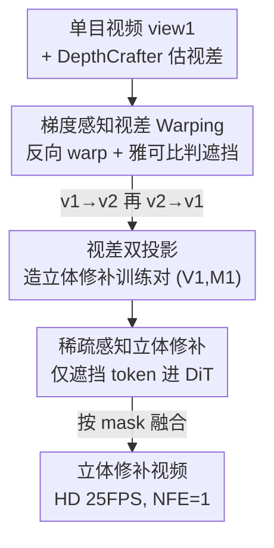

# DreamStereo: Towards Real-Time Stereo Inpainting for HD Videos

**会议**: CVPR 2026  
**论文**: [CVF Open Access](https://openaccess.thecvf.com/content/CVPR2026/html/Huang_DreamStereo_Towards_Real-Time_Stereo_Inpainting_for_HD_Videos_CVPR_2026_paper.html)  
**代码**: 无（ByteDance，截至论文未公开）  
**领域**: 扩散模型 / 视频生成 / 立体视频  
**关键词**: 单目转立体, 立体修补, 反向 warping, 稀疏 token, 实时扩散  

## 一句话总结
DreamStereo 把"单目视频转立体视频"建模成一个**遮挡区域修补**问题，用梯度感知的反向 warping 造出干净的训练数据、再用"只让遮挡区域的 token 参与扩散计算"的稀疏策略，把 768×1280 HD 立体修补做到单卡 A100 上 25 FPS 实时（NFE=1，PSNR 30.5 dB）。

## 研究背景与动机
**领域现状**：AR/VR 设备催热了立体（左右眼带视差）内容，但拍立体视频的多目设备很贵，海量内容仍是单目的。主流"单目转立体"思路是：先估深度，把左视图按视差 warp 到右视图位置，warp 后右视图会在物体边缘出现一条条"空洞"（被前景遮挡、原视图看不到的区域），再用扩散模型把这些空洞**修补（inpaint）**出合理内容。

**现有痛点**：① **数据难造**。这类方法吃"立体修补数据集"，而真立体视频既贵、不同数据的双目投影规则又不统一，质量参差。TrajectoryCrafter 提出从单目视频用 double reprojection 造数据，但它用的是**前向 warping（forward warping）**——把源像素一个个"扔"到目标坐标，在多层背景处会产生错位、在物体边缘产生散落的飞点（fly-point），mask 也是破碎的，直接污染数据质量和下游修补效果。② **计算冗余**。遮挡区只占每帧很小一块，但现有方法对**全帧所有像素一视同仁**地跑扩散，绝大多数本不需要改的像素也参与了 $O(N^2)$ 的注意力计算，导致推理极慢，根本谈不上实时。

**核心矛盾**：立体修补本质是个"局部任务"（只改边缘那一小撮被遮挡像素），却被现有方法当成"全局任务"来算；同时前向 warping 这一基础工具天生会破坏边缘连续性，让数据和推理两头都崩。

**本文目标**：(a) 不依赖真立体视频、从单目数据造出几何一致、mask 干净的立体修补对；(b) 让扩散只在该改的地方算，把 HD 立体修补推进实时。

**核心 idea**：用**反向 warping + 坐标映射梯度**得到平滑边缘与遮挡 mask（GAPW），以此造数据（PBDP），再用同一套 mask 去**稀疏化 DiT 的 token**（SASI）——一条 mask 串起"数据干净"和"算得快"两件事。

## 方法详解

### 整体框架
DreamStereo 是一条三段串行的 pipeline：**GAPW（怎么 warp）→ PBDP（怎么造数据）→ SASI（怎么快速修补）**。给一段单目视频，先用 DepthCrafter 估视差，用 GAPW 把它正向 warp 到第二视角、再反向 warp 回来拿到输入视角下的遮挡 mask，这一来一回就构成一对训练样本（PBDP）；训练/推理时，把带遮挡的视频送进基于 Wan2.1 的扩散 DiT，但只让落在遮挡 mask（及其膨胀边带）内的 token 真正参与计算（SASI），最后把修补结果按 mask 与原图融合输出。三个组件共用同一张 GAPW mask，是这套方法能自洽的关键。

### 关键设计

**1. 梯度感知视差 Warping（GAPW）：用反向 warping 的雅可比梯度同时拿到平滑像素和准确遮挡 mask**

这是全文的地基，针对前向 warping 在物体边缘"飞点 + 破碎 mask"的痛点。前向 warping 把源像素 $I(x,y)$ 经变换 $T(x,y;D,C)$ 直接搬到目标位置 $I'(x',y')\leftarrow I(x,y)$，没被任何源像素覆盖的地方就成了空洞（遮挡区），但多层背景处会错位、边缘像素散落。GAPW 反过来做：对每个目标像素 $(x',y')$ 用逆变换 $T^{-1}$ 找回源坐标，再插值取值 $I'(x',y')=\mathrm{Interpolate}(I,x,y)$，天然连续、无飞点。

更妙的是遮挡判定：它对坐标映射求**雅可比矩阵** $\mathbf{J}_T(x',y')$，描述像素在 $x/y$ 方向的形变；遮挡像素恰好出现在形变剧烈的地方，于是用阈值 $\delta$ 即可得 mask $M(x',y')=\|\mathbf{J}_T(x',y')\|_2>\delta$。双目系统只在 $x$ 方向 warp，可简化为 $M(x',y')=\left|\frac{\partial x'}{\partial x}\right|>\delta$。因为梯度是连续的，得到的遮挡区也是平滑连片的，而不是前向 warping 那种零碎噪点——这就是后面数据和稀疏化都能成立的前提。

**2. 视差双投影（PBDP）：两次 GAPW 投影，从单目视频造出带遮挡 mask 的立体修补对，不需要真立体视频**

针对"立体数据贵且不一致"的痛点。思路是借鉴 TrajectoryCrafter 的 reprojection，但把里面的前向 warping 全换成 GAPW。给单目视频 $V_1$（view1），先估视差 $D_1$，第一次投影 $\mathbf{V}_2,\mathbf{D}_2=\mathrm{GAPW}(\mathbf{V}_1,\mathbf{D}_1;v1\!\to\!v2)$ 得到第二视角的视频和视差；再用 $V_2$ 第二次投影回来 $\mathbf{V}_1',\mathbf{M}_1=\mathrm{GAPW}(\mathbf{V}_2,\mathbf{D}_2;v2\!\to\!v1)$，重建出 view1 并拿到**输入视角下的遮挡 mask** $M_1$。修补任务只需要"目标视频 + 对应 mask"作为训练对，于是把 $(V_1,M_1)$ 加入数据集。

为什么这样比 TrajectoryCrafter 好：后者前向 warping 会在多层背景处引入错位伪影、mask 破碎，污染数据；GAPW 给出的 mask 干净且几何一致（论文 Fig.4 直观对比）。而且数据来源是海量单目视频，可轻松 scale up——这是它能"无真立体视频"训练的根本原因。

**3. 稀疏感知立体修补（SASI）：只让遮挡 token 进 DiT，70%+ token 直接丢掉，换来 10.7× 加速**

针对"全帧统一计算导致极慢"的痛点，也是全文最重要、最直接带来实时性的设计。方法建在 WanVideo 上：一个 DiT 去噪器 $D_\theta$ + 一个 3D VAE。先用 VAE 编码器把目标视频和带遮挡视频压进 latent：$\mathbf{z}_0=\mathcal{E}(\mathbf{V}),\ \mathbf{z}^m=\mathcal{E}(\mathbf{V}^m)$，每个含 $t\times h\times w$ 个 token；mask 下采样成 $m$ 对齐 latent 形状。关键一步是 **mask-based token selection**：对 $m$ 做核大小为 $k$ 的膨胀 $\Phi(m,k)$ 保留遮挡区及一圈边带，再用选择函数 $\mathcal{S}$ 只挑出这部分 token：$(\hat{\mathbf{z}}_0,\hat{\mathbf{z}}^m,\hat{m})=\mathcal{S}((\mathbf{z}_0,\mathbf{z}^m,m),\Phi(m,k))$。

修补走 flow matching：前向加噪 $\hat{\mathbf{z}}_t=(1-\sigma_t)\hat{\mathbf{z}}_0+\sigma_t\boldsymbol{\epsilon}$，去噪器学速度场 $v=\boldsymbol{\epsilon}-\hat{\mathbf{z}}_0$，训练目标

$$\mathcal{L}=\left\|D_\theta(\hat{\mathbf{z}}_t,\hat{\mathbf{z}}^m,\hat{m},t)-\mathbf{v}\right\|_2$$

推理时多步更新 $\hat{\mathbf{z}}_{t-1}=\hat{\mathbf{z}}_t+D_\theta(\cdot)\cdot(\sigma_{t-1}-\sigma_t)$，最后按 mask 融合还原全图 $\mathbf{V}=\mathcal{B}(\mathcal{D}(\mathcal{B}(\hat{\mathbf{z}}_0,\mathbf{z}^m,m)),\mathbf{V}^m,\mathbf{M})$。因为 DiT 注意力是 $O(N^2)$，token 数 $N$ 一降速度急升：膨胀核 $k=3$ 时只有 **25.6%** 的 token 参与计算，DiT 提速 **10.7×**。值得注意的是训练阶段仍用 100% dense token，稀疏化**只在推理时启用**做加速——这避免了稀疏训练带来的分布偏移。

### 损失函数 / 训练策略
基于 Wan2.1-1.3B，DiT 用 LoRA 微调，另蒸馏一个轻量 3D-aware VAE 加速编解码。两阶段训练在 OpenVid 上：Stage 1 用随机 mask 做通用修补预训练（10k 步，batch 12）；Stage 2 用 §3.2 的 PBDP 在三种分辨率（1280×720、720×1280、768×768）造出 56k×3 的伪立体修补数据、最大视差从 [0.3, 0.8] 随机采样（2.5k 步，batch 2）。4×A100，学习率 $4\times10^{-5}$。把 $z_t,\hat{m},\hat{z}^m$ 沿通道拼接送入去噪器，新增通道权重零初始化以兼容预训练权重。

## 实验关键数据

### 主实验
HD-100（768×1280，真实 4K 网络视频，100 样本）上对比立体修补质量与延迟（ms/帧）：

| 方法 | NFE | 延迟↓ | PSNR↑ | SSIM↑ | LPIPS↓ |
|------|-----|-------|-------|-------|--------|
| ProPainter†（非扩散） | 1 | 668.1 | 28.30 | 0.927 | 0.052 |
| VACE-1.3B | 8 | 2779.1 | 25.38 | 0.859 | 0.095 |
| ZeroStereo | 50 | 2024.7 | 24.73 | 0.771 | 0.094 |
| StereoCrafter | 8 | 716.5 | 23.99 | 0.782 | 0.142 |
| **Ours** | 1 | **40.1** | **30.48** | 0.900 | 0.053 |
| **Ours (blended)** | 1 | **40.1** | **32.65** | **0.948** | **0.026** |

单步推理（NFE=1）下 40.1ms/帧 ≈ 25 FPS，PSNR/感知质量同时领先；其中 blended 变体借 GAPW 的干净 mask 在原分辨率做几何对齐融合，再涨一截。ZeroStereo 强依赖扩散步数，NFE 从 50 降到 8 会暴跌。

跨域 2D-to-3D 转换（Dynamic Replica 合成集 + SVD 真实 AVP 集，均有 GT 右视图）：

| 方法 | NFE | Replica PSNR↑ | Replica LPIPS↓ | SVD PSNR↑ | SVD LPIPS↓ |
|------|-----|---------------|----------------|-----------|------------|
| Deep3D† | 1 | 17.11 | 0.252 | 19.32 | 0.224 |
| StereoCrafter | 8 | 17.93 | 0.226 | 24.68 | 0.199 |
| ZeroStereo | 50 | 23.08 | 0.105 | 23.81 | 0.148 |
| **Ours (blended)** | 1 | **29.17** | **0.057** | **25.30** | **0.113** |

两个数据集上 PSNR/SSIM/LPIPS 全面最优，且只用 1 步。

### 消融实验

数据构造策略（固定架构/dense 推理/576×1024/NFE=8，隔离数据变量）：

| 数据策略 | PSNR↑ | SSIM↑ | LPIPS↓ |
|----------|-------|-------|--------|
| Random Mask | 26.64 | 0.906 | 0.092 |
| TrajectoryCrafter（前向 warping） | 31.14 | 0.923 | 0.047 |
| **Ours（GAPW 双投影）** | **32.48** | **0.933** | 0.049 |

稀疏化加速（HD-100 576×1024，固定 NFE=4，调膨胀核与时间步幅，r=保留 token 比例）：

| Dilate | Stride | r (%) | DiT 延迟↓ | PSNR↑ | SSIM↑ | LPIPS↓ |
|--------|--------|-------|-----------|-------|-------|--------|
| baseline | — | 100.0 | 380.9 | 32.48 | 0.933 | 0.049 |
| — | — | 13.7 | 18.51 | 29.84 | 0.916 | 0.063 |
| 3 | — | 25.6 | 35.7 | 32.01 | 0.931 | 0.051 |
| 5 | — | 36.1 | 58.4 | 32.31 | 0.932 | 0.050 |
| 5 | 10 | 78.2 | 42.7 | 32.36 | 0.932 | 0.050 |

### 关键发现
- **数据构造是最大增益来源之一**：把 Random Mask 换成 GAPW 双投影数据，PSNR 从 26.64 → 32.48（+5.8 dB），且优于 TrajectoryCrafter 的 31.14，直接印证"前向 warping 的脏 mask 拖累修补"这一动机。
- **稀疏化几乎零损**：token 保留率从 100% 砍到 25.6% 时，PSNR 仅 32.48→32.01、SSIM/LPIPS 基本不动，延迟却从 380.9 降到 35.7 ms（约 10.7×）；甚至砍到 13.7% 才明显掉点（PSNR 29.84）。论文最终取 dilate=5、$r\approx35\%$ 作折中默认。
- **宽基线鲁棒**（Tab.5，768×1280，NFE=1）：最大视差从 0.02 增到 0.08（遮挡区扩大、模拟更宽人眼基线），PSNR 仅从 32.18 缓降到 29.91，未崩，说明单步模型对大基线立体仍稳。

## 亮点与洞察
- **一张 mask 串起三件事**：GAPW 的雅可比 mask 既用来造数据（PBDP）、又用来稀疏化推理（SASI），还用来做输出融合（blended 变体）。同一信号被复用三次，方法高度自洽，这是它比"各模块各拿一套先验"的拼装式方法更优雅的地方。
- **把"局部任务"真正当局部算**：用任务结构（遮挡只占小块）直接削 token，而不是去蒸馏/量化模型，省的是 $O(N^2)$ 的注意力，trick 可迁移到任何"只改局部"的视频编辑/补全任务（如水印去除、局部重绘）。
- **稀疏只在推理用、训练保持 dense**：规避了稀疏训练的分布漂移，是个简单但务实的工程选择，值得借鉴。
- **用雅可比范数判遮挡**：把"哪里是遮挡"从启发式空洞检测，变成对坐标映射形变量的可微度量，干净且有几何意义。

## 局限与展望
- 依赖单目深度估计器（DepthCrafter）的质量：深度错了，GAPW 的 warp 和 mask 都会错，论文未深入分析深度误差的传播影响。⚠️ 此为笔者推断。
- 伪立体数据的"最大视差"是从 [0.3, 0.8] 人为采样的，真实人眼基线场景下的泛化仍以代理指标（PSNR 等）衡量，缺乏主观立体观感的用户研究。
- 稀疏化收益强依赖遮挡区"小且集中"这一前提；若视差极大、遮挡区占比显著上升，token 保留率被迫升高，实时优势会缩水（Tab.5 已现 PSNR 下滑趋势）。
- 代码与 56k×3 伪数据集未公开，复现成本较高。

## 相关工作与启发
- **vs TrajectoryCrafter**：两者都"双重 reprojection 从单目造数据"，但 TrajectoryCrafter 用前向 warping，边缘飞点 + 破碎 mask；本文换成反向+梯度的 GAPW，mask 干净几何一致，数据策略消融上直接领先（32.48 vs 31.14）。
- **vs StereoCrafter / ImmersePro 等基于真立体视频的方法**：它们吃昂贵且投影规则不一的真立体数据；本文完全用单目视频造伪立体对，可 scale，且质量更高。
- **vs ZeroStereo 等 training-free 改 latent 的方法**：那类方法强依赖扩散步数（NFE=50→8 暴跌），且有 domain gap；本文 NFE=1 即实时且最优。
- **vs 通用视频修补（ProPainter / VACE）**：通用方法对全帧统一处理、慢且立体一致性差；本文用稀疏 token + 立体专用数据，质量与速度双赢。

## 评分
- 新颖性: ⭐⭐⭐⭐ 用雅可比梯度统一"warp 质量 + 遮挡判定 + token 稀疏"是漂亮的洞察，但各组件多为已有思路（反向 warping、flow matching、token 剪枝）的巧妙组合。
- 实验充分度: ⭐⭐⭐⭐ 三测试集 + 数据/稀疏/视差三组消融，证据链完整；缺主观立体观感的用户研究。
- 写作质量: ⭐⭐⭐⭐ 动机—方法—实验逻辑清晰，公式与图配合到位。
- 价值: ⭐⭐⭐⭐⭐ 把 HD 立体修补推进单卡实时（25 FPS），对 AR/VR 内容生产有直接落地意义。

<!-- RELATED:START -->

## 相关论文

- [\[CVPR 2026\] FlashDecoder: Real-Time Latent-to-Pixel Streaming Decoder with Transformers](flashdecoder_real-time_latent-to-pixel_streaming_decoder_with_transformers.md)
- [\[CVPR 2026\] PortraitDirector: A Hierarchical Disentanglement Framework for Controllable and Real-time Facial Reenactment](portraitdirector_a_hierarchical_disentanglement_framework_for_controllable_and_r.md)
- [\[CVPR 2026\] StreamAvatar: Streaming Diffusion Models for Real-Time Interactive Human Avatars](streamavatar_streaming_diffusion_models_for_real-time_interactive_human_avatars.md)
- [\[CVPR 2026\] From Inpainting to Layer Decomposition: Repurposing Generative Inpainting Models for Image Layer Decomposition](from_inpainting_to_layer_decomposition_repurposing_generative_inpainting_models_.md)
- [\[CVPR 2026\] NanoSD: Edge Efficient Foundation Model for Real Time Image Restoration](nanosd_edge_efficient_foundation_model_for_real_time_image_restoration.md)

<!-- RELATED:END -->
