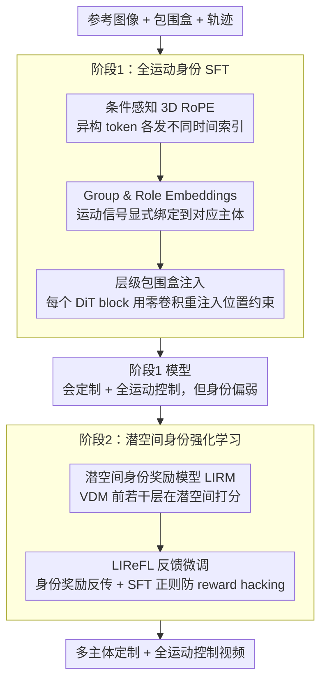

# DreamVideo-Omni: Omni-Motion Controlled Multi-Subject Video Customization with Latent Identity Reinforcement Learning

**会议**: CVPR 2026  
**arXiv**: [2603.12257](https://arxiv.org/abs/2603.12257)  
**代码**: [项目页](https://dreamvideo-omni.github.io)  
**领域**: 图像生成  
**关键词**: 视频定制生成, 多主体身份保持, 全运动控制, 潜空间强化学习, DiT

## 一句话总结

提出 DreamVideo-Omni，通过两阶段渐进训练范式（全运动身份监督微调 + 潜空间身份奖励反馈学习），在单一 DiT 架构中首次统一实现多主体定制与全粒度运动控制（全局包围盒 + 局部轨迹 + 相机运动）。

## 研究背景与动机

**领域现状**：大规模扩散模型在文本到视频生成方面取得突破，但真实应用场景要求在生成高保真视频的同时精确控制多主体身份和多粒度运动。现有方法要么只关注主体定制（如 ConsisID、VideoMage），要么只关注运动控制（如 Tora、Wan-Move），鲜有统一框架。

**痛点**：当前统一尝试面临三大瓶颈——(a) **运动控制粒度有限**：大多仅依赖单一信号（包围盒/深度图/稀疏轨迹），无法同时控制全局位置、局部动态和相机运动；(b) **控制歧义**：多主体场景中，模型无法辨别哪个运动信号对应哪个主体；(c) **身份退化**：引入运动控制后，身份保真度下降，因为身份保持要求像素一致性而运动控制要求像素动态变化，传统扩散重建损失无法调和此矛盾。

**核心矛盾**：身份保持（鼓励像素级静态一致）与运动控制（要求像素动态演变）目标天然对立，标准扩散损失不足以同时满足两者。

**要解决什么**：在单一框架中同时实现多主体定制 + 全运动控制（全局 + 局部 + 相机），且不牺牲身份保真度。

**切入角度**：(a) 将运动信号显式绑定到对应主体消除歧义；(b) 用基于人类偏好的强化学习（而非重建损失）来优化身份保持，因为身份评估本质上是主观的感知对齐。

**核心 idea**：两阶段范式——第一阶段用结构化三元组 ⟨参考主体, 全局包围盒, 局部轨迹⟩ 联合训练，引入 group/role embeddings 消除歧义；第二阶段训练潜空间身份奖励模型（LIRM）在潜空间直接计算身份奖励，绕过 VAE 解码器进行高效强化学习。

## 方法详解

### 整体框架

DreamVideo-Omni 想在一个模型里同时干两件传统上互相打架的事：既要让生成视频里的多个主体长得和参考图一致（身份保持要求像素静态不变），又要精确控制每个主体往哪走、怎么动、相机怎么转（运动控制要求像素动态演变）。它建在 Wan2.1-1.3B 的 T2V DiT 之上，把整个流程拆成两个阶段，原因是这两个目标用同一种损失硬塞会互相拉扯——所以先用监督学习把"控制"学透，再单独用强化学习把被牺牲掉的"身份"补回来。

第一阶段是全运动身份 SFT：把参考图像、包围盒、轨迹三类异构条件统一塞进 DiT，让它一次性学会单/多主体定制、全局位置控制、局部轨迹控制和相机控制。第二阶段是潜空间身份强化学习：先单独训一个能在潜空间打分的身份奖励模型 LIRM，再用 Reward Feedback Learning 拿这个奖励去微调第一阶段的模型，专门把身份保真度往上提。

### 关键设计

**1. 条件感知 3D RoPE：让一串混杂的异构 token 各归各位**

把视频帧、参考图像、轨迹、padding 这些性质完全不同的东西直接拼成一长串送进 DiT，位置编码会乱套——参考图像本该是"一张静态的脸"，却被当成视频时间轴上的某一帧。这个设计的做法是给每类 token 发不同的时间索引：视频帧用正常的顺序索引 $t \in [0, T-1]$；参考图像统一钉死在一个特殊索引 $t_{\text{ref}}$ 上，模型一看就知道它是静态条件而非动态帧；padding 用无效索引 $t_{\text{pad}}$ 让模型直接忽略；轨迹则继承对应视频帧的索引，保证它和要控制的那一帧时空对齐。这一步是整个架构的地基——消融里去掉它训练直接崩溃，R-DINO 从 0.499 暴跌到 0.139、Face-S 掉到 0.039，等于身份和控制全废。

**2. Group & Role Embeddings：把每个运动信号显式绑到它该控制的那个主体**

多主体场景最大的麻烦是歧义：画面里有两个人，包围盒 A 和轨迹 B 到底归谁？模型自己分不清。解法是给每个控制单元 ⟨参考主体, 包围盒, 轨迹⟩ 发一个唯一的 group embedding，同一组里的三样东西共享同一个 group id，相当于贴上"这是第 1 号主体的全套料"的标签；再叠一个 role embedding 区分组内角色——参考图像是"外观资产"，包围盒和轨迹是"运动引导"，让模型知道前者管长相、后者管动作。比如两主体各自带 bbox+轨迹时，group 1 的轨迹只会牵动 group 1 的主体，不会串到 group 2。去掉这套绑定，多主体 mIoU 从 0.532 掉到 0.459、EPE 从 6.80 飙到 20.69（接近 3× 退化），运动信号彻底错配。

**3. 层级包围盒注入：把位置约束逐层喂进去，而不是只在门口塞一次**

包围盒是控制全局位置的强信号，但只在输入层和噪声潜变量融合一次，信息走到深层就被稀释了。这个设计在每个 DiT block 的输出都用一个独立的零卷积把包围盒潜表示重新注入一遍：

$$\bm{h}_0 = \bm{z}_t + \mathcal{Z}_{\text{in}}(\bm{z}_{\text{box}}), \qquad \bm{h}_{l+1} = \text{Block}_l(\bm{h}_l) + \mathcal{Z}_l(\bm{z}_{\text{box}})$$

每层的零卷积 $\mathcal{Z}_l$ 初始为零、训练中逐渐学出该层需要的位置修正量，既保证训练初期不破坏预训练权重，又让位置约束在整条深度上持续生效。只在输入层融合远远不够——去掉逐层注入，多主体 mIoU 从 0.532 暴跌到 0.289。

**4. 潜空间身份奖励模型（LIRM）：用一个懂运动的打分器替掉打不准的重建损失**

身份保真本质是主观感知判断（"这还是不是同一个人"），标准扩散重建损失只会逼像素对齐，反而和运动控制打架。这个设计干脆训一个专门给身份打分的奖励模型：拿预训练视频扩散模型（VDM）的前 8 层当 backbone，参考图像特征作 Query、生成视频特征作 Key/Value 做交叉注意力，最后接一个 MLP 头吐出一个标量奖励。训练数据是约 27.5K 对人工标注的视频 win-lose 偏好对，用 BCE 损失学会"哪个视频身份更像参考图"。

> ⚠️ LIRM backbone 取"VDM 前 8 层"的层数、约 27.5K 标注对规模等具体数字以原文为准。

选 VDM 而不是 CLIP/DINO 这类静态图像编码器，是因为身份判断要在"主体正在动"的视频上做，VDM 自带时空先验、能在运动下仍认出同一身份；而整个奖励在潜空间算、不走 VAE 解码，省掉了视频级 ReFL 最大的一笔开销，让它真正跑得起来。

### 损失函数 / 训练策略

- **Stage 1 损失**：加权扩散损失 $\mathcal{L}_{\text{sft}} = \mathbb{E}[(1 + \lambda_1 \mathbf{M}) \cdot \|\epsilon - \epsilon_\theta(\bm{z}_t, \mathcal{C}, t)\|_2^2]$，其中 $\lambda_1=2$ 加强前景区域学习。
- **Stage 2 损失**：$\mathcal{L} = \mathcal{L}_{\text{sft}} + \lambda_2 \mathcal{L}_{\text{LIReFL}}$，$\lambda_2=0.1$。LIReFL 从高斯噪声初始化，先无梯度去噪到随机中间步 $t_m$，再执行一步有梯度去噪，冻结 LIRM 计算奖励并反向传播。SFT 损失作为正则化防止 reward hacking。
- **训练规模**：Stage 1 在 64×A100 上训练 40K 步；LIRM 训练 4K 步；LIReFL 微调 3.4K 步（16×A100）。

## 实验关键数据

### 主实验

**表1：DreamOmni Bench 联合定制+运动控制对比**

| 方法 | R-CLIP↑ | R-DINO↑ | Face-S↑ | mIoU↑ | EPE↓ | CLIP-T↑ |
|------|---------|---------|---------|-------|------|---------|
| DreamVideo-2 | 0.731 | 0.429 | 0.157 | 0.212 | 24.05 | 0.297 |
| **DreamVideo-Omni** | **0.739** | **0.499** | **0.301** | **0.558** | **9.31** | **0.308** |

**表2：运动控制对比（单主体 / 多主体）**

| 方法 | 单主体 mIoU↑ | 单主体 EPE↓ | 多主体 mIoU↑ | 多主体 EPE↓ |
|------|-------------|------------|-------------|------------|
| Tora (1.1B) | 0.163 | 31.74 | 0.162 | 32.84 |
| Wan-Move (14B) | 0.507 | 14.43 | 0.541 | 9.02 |
| **DreamVideo-Omni (1.3B)** | **0.558** | **9.31** | **0.570** | **6.08** |

1.3B 参数的 DreamVideo-Omni 全面超越 14B 的 Wan-Move。

### 消融实验

**表3：各组件消融（单主体模式）**

| 配置 | R-DINO↑ | Face-S↑ | mIoU↑ | EPE↓ |
|------|---------|---------|-------|------|
| w/o Cond-Aware 3D RoPE | 0.139 | 0.039 | 0.274 | 30.22 |
| w/o Group & Role Emb. | 0.486 | 0.254 | 0.524 | 26.24 |
| w/o Hierarchical BBox | 0.508 | 0.257 | 0.400 | 31.84 |
| Stage 1 Only | 0.483 | 0.251 | 0.556 | 10.53 |
| w/o LIReFL (Stage2 SFT only) | 0.487 | 0.266 | 0.561 | 10.01 |
| **Full Model** | **0.499** | **0.301** | **0.558** | **9.31** |

### 关键发现

1. **Condition-Aware 3D RoPE 是根基**：去掉后所有指标灾难性下降，训练直接崩溃。
2. **Group/Role Embeddings 对多主体至关重要**：去掉后多主体 EPE 从 6.80 涨至 20.69（3× 退化）。
3. **层级注入 vs 输入级融合差距巨大**：多主体 mIoU 从 0.532 降至 0.289。
4. **LIReFL 有效提升身份保真度**：同样是 Stage 2 训练，纯 SFT 增益有限，LIReFL 在多主体 Face-S 上额外提升 0.013，R-DINO 提升 0.012。
5. **全时间步奖励 > 最后 3 步**：在所有时间步施加奖励反馈比仅在最后 3 步去噪时效果更好。
6. **涌现能力**：尽管基于 T2V 模型训练，自然涌现零样本 I2V 生成和首帧条件轨迹控制能力。
7. **用户研究**：在联合任务中总体质量偏好率达 89.2%（vs DreamVideo-2 的 10.8%）。

## 亮点与洞察

- **首个多主体定制+全运动控制统一框架**：一个 DiT 同时处理主体外观、全局运动、局部动态和相机运动。
- **Group/Role Embeddings 的绑定机制**：简洁优雅地解决多主体控制歧义问题，对每个 ⟨主体, 包围盒, 轨迹⟩ 三元组分配 group embedding，将信号显式绑定到主体。
- **潜空间奖励学习**：避免 VAE 解码的巨大开销，使视频级 ReFL 真正可行；VDM backbone 比 CLIP/DINO 更适合评估运动下的身份一致性。
- **相机运动 = 背景轨迹**：不需要额外 3D 相机参数，直接复用轨迹控制机制来控制相机运动，减少训练开销。
- **数据集（2.12M）和 Benchmark（1027 视频）**均为社区新贡献。

## 局限与展望

1. 基于 1.3B 模型，视频质量上限受限于 base model 能力，可扩展到更大模型。
2. 分辨率仅 480×832、49 帧，距离高清长视频还有距离。
3. LIRM 的人工标注（27.5K 对）成本较高，可探索自动化偏好数据生成。
4. 相机运动控制通过背景轨迹间接实现，对精确 3D 相机参数控制可能不够精细。
5. 多主体超过 2-3 个时的扩展性和质量需要更多验证。

## 相关工作与启发

- **DreamVideo-2**：前作，仅支持单主体+包围盒控制，本文全面升级。
- **Wan-Move**：14B 参数的 I2V 轨迹控制模型，本文 1.3B 即超越，说明架构设计>参数规模。
- **IPRO / Identity-GRPO**：类似的身份强化学习思路，但在像素空间计算奖励开销大，且仅限最后去噪步反馈。本文的潜空间方案更高效且可全时间步反馈。
- **PRFL**：同期的潜空间奖励建模工作，但面向通用视频质量，本文聚焦身份保持。
- **启发**：(1) 潜空间奖励学习的范式可推广到其他视频控制任务；(2) Group/Role embedding 的显式绑定思路可用于其他多条件生成场景。

## 评分

⭐⭐⭐⭐⭐ 工程和方法完成度极高的系统性工作：首次统一多主体定制与全运动控制，两阶段范式设计合理，消融充分，数据集和 Benchmark 均有贡献，1.3B 超越 14B 的结果令人印象深刻。

<!-- RELATED:START -->

## 相关论文

- [\[CVPR 2026\] Tiny Inference-Time Scaling with Latent Verifiers](tiny_inference-time_scaling_with_latent_verifiers.md)
- [\[CVPR 2026\] HiFi-Inpaint: Towards High-Fidelity Reference-Based Inpainting for Generating Detail-Preserving Human-Product Images](hifi-inpaint_towards_high-fidelity_reference-based_inpainting_for_generating_det.md)
- [\[CVPR 2026\] PSR: Scaling Multi-Subject Personalized Image Generation with Pairwise Subject-Consistency Rewards](psr_scaling_multi-subject_personalized_image_generation_with_pairwise_subject-co.md)
- [\[CVPR 2026\] PureCC: Pure Learning for Text-to-Image Concept Customization](purecc_pure_learning_for_text-to-image_concept_customization.md)
- [\[CVPR 2026\] When Identities Collapse: A Stress-Test Benchmark for Multi-Subject Personalization](when_identities_collapse_a_stress-test_benchmark_for_multi-subject_personalizati.md)

<!-- RELATED:END -->
