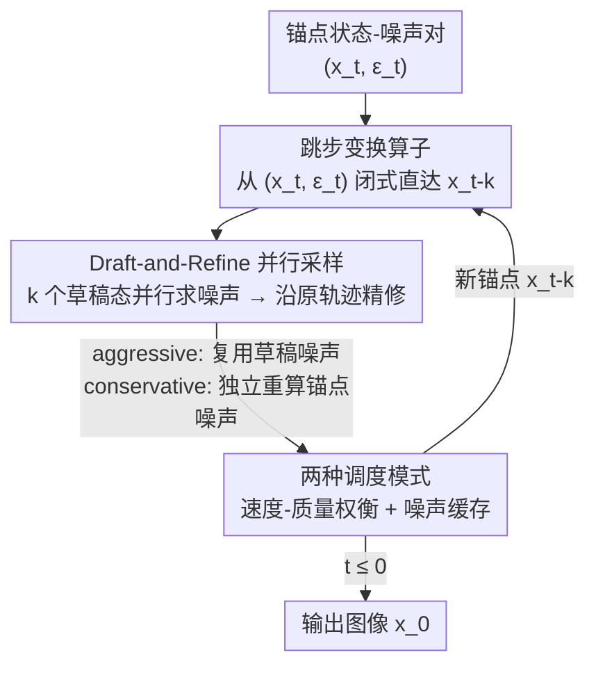

# DRiffusion: Draft-and-Refine Process Parallelizes Diffusion Models with Ease

**会议**: CVPR 2026  
**论文**: [CVF Open Access](https://openaccess.thecvf.com/content/CVPR2026/html/Bai_DRiffusion_Draft-and-Refine_Process_Parallelizes_Diffusion_Models_with_Ease_CVPR_2026_paper.html)  
**代码**: 未公开（论文未给出仓库链接）  
**领域**: 扩散模型 / 推理加速  
**关键词**: 扩散模型, 并行采样, 推理加速, 跳步变换, draft-and-refine

## 一句话总结
DRiffusion 把扩散采样里"跳过中间时间步"这件事形式化成一个**局部算子**，先用它一次性草拟出未来 $k$ 个时间步的近似状态、把这些草稿**并行**喂进原始去噪网络求噪声，再沿原轨迹精修，从而在不改预训练模型/采样器的前提下用 $n$ 张卡换来 1.4×–3.7× 的墙钟加速，且 FID/CLIP 几乎不掉。

## 研究背景与动机
**领域现状**：扩散模型靠"从纯噪声一步步去噪"产出高保真内容，但这个迭代过程天生串行——第 $t-1$ 步必须等第 $t$ 步的网络前向算完才能开始，几十步串起来导致采样延迟很高，难以用在交互式场景。

**现有痛点**：加速路线各有硬伤。蒸馏、Rectified Flow 这类"减步数"方法在激进压缩步数时画质明显下降，蒸馏还会显著损失生成多样性。并行化是一条正交、互补的路，但现有实现都受限：系统级方法（DistriFusion、AsyncDiff）从计算视角切入，强绑定 U-Net / Transformer 的具体结构、且额外显存随设备数膨胀；数学方法（ParaDiGMS 等）把扩散重写成 SDE/ODE 再设计可并行的求解器，往往与现有框架兼容性差，且可能偏离原模型的采样分布。

**核心矛盾**：扩散采样**串行的本质**就在于"要算第 $t-k$ 步的噪声，得先有第 $t-k$ 步的状态，而该状态又要靠逐步去噪才能拿到"。系统级方法绕到这条序列之外找可并行的零件，数学方法干脆重定义整条采样路径——都没回答一个更根本的问题：**原始框架里到底有没有内在的并行性可挖？**

**本文目标**：在不改预训练网络、不换采样器、不偏离原采样分布的前提下，把扩散推理的主瓶颈（网络前向）合并成单次并行步。

**切入角度**：作者注意到一个简单的数学事实——从 $(x_t, \varepsilon_t)$ 直接预测出某个更早状态 $x_{t-k}$（跳过中间步）在 DDPM/DDIM/ODE 三套框架里都有闭式解。如果把这种"跳步"从全局调度里抽出来、做成一个**可按需调用的局部算子**，就能先把未来若干步的状态"草拟"出来，于是网络前向就能并行了。

**核心 idea**：用跳步算子草拟未来状态作为并行提案（draft），并行求出它们的噪声后再沿原去噪轨迹精修（refine），把串行的网络评估塞进一个并行步。

## 方法详解

### 整体框架
DRiffusion 的输入是当前锚点时间步 $t$ 上的状态-噪声对 $(x_t, \varepsilon_t)$，输出是采样得到的图像 $x_0$。核心循环是一个 **draft-and-refine** 块：在锚点处用跳步算子一口气草拟出 $x_{t-1}, x_{t-2}, \dots, x_{t-k}$，把这 $k$ 个草稿态**并行**送进同一个噪声预测网络得到对应噪声，再用这些噪声沿标准去噪更新逐个精修，最后落到一个精修后的 $x_{t-k}$ 作为下一轮锚点。每轮把 $k$ 步的网络前向压成一次并行评估，于是延迟从 $O(\text{步数})$ 降到 $O(\text{步数}/n)$ 量级（$n$ 为设备数）。

整个方法可拆成三段递进：先把"跳步"做成算子（让并行成为可能），再用它搭出 draft-and-refine 流水线（实现并行），最后给出两种调度模式权衡速度与质量。三者顺序对应下面三个关键设计。

### 关键设计

**1. 跳步变换算子：把"跨多步直达"形式化成可按需调用的局部原语**

并行化卡在采样的串行性上，而作者发现这串行其实可以局部破开。所谓跳步变换，是指不走中间步、直接从 $(x_t, \varepsilon_t)$ 预测出未来状态 $x_{t-k}$。从连续时间看这本就是"在更长区间上积分"的自然操作，但现有框架只在**全局**层面行使这种自由（ODE 靠全局离散化时间表、DDIM 靠重选时间步子序列），无法在采样过程中临时跳一步。本文的贡献是把它**算子化**——在 DDPM/DDIM/Euler 三套框架里各推一遍闭式更新，使其成为不改底层机制、可随时调用的局部算子。

具体地，DDPM 因为反向步来自贝叶斯公式，跳步目标 $q(x_{t-k}\mid x_t, x_0)=\dfrac{q(x_t\mid x_{t-k})\,q(x_{t-k}\mid x_0)}{q(x_t\mid x_0)}$ 三项都是高斯，可直接配出闭式高斯：

$$x_{t-k}\mid x_t, x_0 \sim \mathcal{N}\!\left(\mu'(x_t, x_0),\ \sigma_{t,k}^2 I\right),\quad \sigma_{t,k}^2=\frac{\left(1-\tfrac{\alpha_t}{\alpha_{t-k}}\right)(1-\alpha_{t-k})}{1-\alpha_t}$$

它恰好是单步规则的"$k$ 步类比"。DDIM 是非马尔可夫的，反向步靠的是边缘一致性 $p(x_{t-k}\mid x_0)=\int p(x_{t-k}\mid x_t)\,p(x_t\mid x_0)\,dx_t$，由此推出 $x_{t-k}\sim\mathcal{N}\big(\sqrt{\alpha_{t-k}}\,x_0+\sqrt{1-\alpha_{t-k}-\sigma_{t,k}^2}\,\hat\varepsilon_t,\ \sigma_{t,k}^2 I\big)$；此处原本的 DDIM $\sigma_t$ 对应 $\sigma_{t,1}$，$k>1$ 的方差是额外超参，取确定性采样（零方差）或沿用 DDPM 方差都能无缝平移。ODE/Euler 框架最直接——跳步等价于取更大的数值积分步长 $x_{t-k}=x_t+(\sigma_{t-k}-\sigma_t)\,v_\theta(x_t,\sigma_t)$。三套推导让"任意两个扩散状态之间直连"成为可能，正是后面并行的地基。

**2. Draft-and-Refine 并行采样：草稿态当并行提案、再沿原轨迹精修**

有了跳步算子，作者就能问"能不能同时算多个时间步的噪声"。原本不行——那需要在没走完去噪轨迹的情况下拿到这些时间步的状态。draft-and-refine 的办法是：在锚点 $t$ 用跳步算子为多个 $k$ 值生成草稿态 $x_{t-1}^d,\dots,x_{t-k}^d$（它们与真实去噪轨迹对齐，只是因步长大而略不精确），把这 $k$ 个草稿**并行**喂进噪声预测器拿到噪声估计 $\varepsilon_{t-1},\dots,\varepsilon_{t-k}$，再用这些噪声执行标准去噪更新得到精修态。草稿在这里是"并行提案"，精修把它们拉回原轨迹，于是把主瓶颈——网络前向——合并成单个并行步。

这套机制能成立，靠两个经验观察顶住"大步长会因噪声预测不准而掉画质"的老问题：其一，轻微感知退化不等于表征坏掉，图像/latent 往往保留了大部分语义与结构信息；其二，噪声预测器泛化够好，能把"可信样本的邻域"映射到合理结果。所以即便草稿用了较大步长，精修后仍能给出足够高质量的输出。和系统级方法的根本区别在于：DRiffusion 只改采样过程、不碰模型结构，因此额外显存与加速档位**解耦**（实测仅 +186~226MB，几乎不随设备数涨），而 AsyncDiff 把子网络拆到多卡、显存随设备/步长一路涨到 +574MB。

**3. 两种调度模式：用噪声缓存换"是否多省一次前向"的速度-质量权衡**

并行块里各噪声地位并不对称——那个被用来草拟多个草稿的噪声，因为覆盖了更大步长，比别的更"吃重"。围绕要不要为它单独算一次精确噪声，作者给出两档模式（以 DDIM 更新为例）：

- **Aggressive（激进）**：每轮把锚点噪声 $\varepsilon_t$ 直接复用去草拟全部 $k$ 个草稿，并行求出 $\varepsilon_{t-1\dots t-k}$ 后精修。关键技巧是 $\varepsilon_{t-k}$ 虽在并行中算出却没用于本轮更新，于是**缓存**它带进下一轮当锚点噪声，省掉下轮开头那次前向。初始化只需在 $t=T$ 算一次 $\varepsilon_T$，此后每块省一次评估、吞吐拉满。理想墙钟加速可达 $k\times$（延迟约 $O(1/n)$，$n$ 为设备数）。
- **Conservative（保守）**：每轮在锚点 $x_t$ 上**独立**重算一次当前噪声——它来自精修态 $x_t$ 而非草稿，更准；用它复刻激进版的并行流程，并且因为不必缓存噪声给下轮，可顺手用 $\varepsilon_{t-k}$ 把 $x_{t-k}$ 再往前推一步到 $x_{t-k-1}$。代价是多一次独立前向，加速上限降为 $\tfrac{k+1}{2}\times$（延迟约 $O(2/(n+1))$）。

两档构成清晰的速度-质量旋钮：要极速选激进、要更稳的画质选保守，二者都不改预训练权重和采样器。

### 损失函数 / 训练策略
本方法是**纯推理期**的并行采样框架，不引入任何训练、微调或蒸馏，直接套在现成预训练扩散模型（SD2.1 / SDXL / SD3）上即可，因此没有损失函数。

## 实验关键数据

### 主实验
在 MS-COCO 2017 验证集（5000 张，每张取第一条 caption）上，跨 SD2.1（小 U-Net）、SDXL（大 U-Net）、SD3（Transformer flow-matching）三种模型评测，指标为 FID、CLIP，并辅以 PickScore、HPSv2.1；效率用至多 4 张 V100 测稳态延迟。下表摘取 SD2.1 与 SD3 的代表配置：

| 模型 | 模式 | 设备数 | 延迟(s) | 加速比 | FID ↓ | CLIP ↑ | Pick ↑ | HPSv2.1 ↑ |
|------|------|--------|---------|--------|-------|--------|--------|-----------|
| SD2.1 | original | 1 | 5.96 | – | 23.63 | 26.29 | 21.79 | 26.62 |
| SD2.1 | conservative | 4 | 2.42 | 2.5× | 23.47 | 26.30 | 21.75 | 26.49 |
| SD2.1 | aggressive | 4 | 1.66 | 3.6× | 23.24 | 26.27 | 21.69 | 26.34 |
| SD3 | original | 1 | 11.25 | – | 31.03 | 26.56 | 22.57 | 29.14 |
| SD3 | aggressive | 3 | 3.81 | 3.0× | 29.73 | 26.50 | 22.12 | 28.20 |
| SD3 | aggressive | 4 | 3.00 | 3.7× | 29.08 | 26.46 | 21.95 | 27.64 |

整体加速 1.4×–3.7×，CLIP 跨所有配置最多掉 0.16，Pick/HPSv2.1 的平均跌幅仅 0.17 / 0.43；FID 甚至偶尔略好（作者归因于统计波动而非真实提升）。延迟实测中激进模式贴近理论下界 $O(1/n)$、保守模式贴近 $O(2/(n+1))$。

### 与 AsyncDiff 对比（SDXL，按相近加速比分组）
| 方法 | 设备数 | 加速比 ↑ | 额外显存 ↓ | FID ↓ | CLIP ↑ | Pick ↑ |
|------|--------|----------|------------|-------|--------|--------|
| Stable Diffusion | 1 | – | +0MB | 24.02 | 26.67 | 22.43 |
| AsyncDiff (N=2,S=1) | 2 | 1.6× | +494MB | 24.13 | 26.60 | 22.34 |
| **DRiffusion (consv., 2 dev)** | 2 | 1.5× | **+186MB** | **23.87** | 26.60 | 22.37 |
| AsyncDiff (N=3,S=2) | 4 | 3.4× | +554MB | 24.25 | 26.54 | 22.02 |
| **DRiffusion (aggr., 4 dev)** | 4 | 3.6× | **+222MB** | 24.14 | 26.54 | **22.26** |

匹配加速档位下 DRiffusion 的 PickScore 一致优于 AsyncDiff 与减步基线，平均把 PickScore 退化差距缩小 **48.6%**、最激进 4 卡档缩小 **58.5%**；显存仅 +186~226MB（AsyncDiff 高达 +574MB）。在 32GB 节点上 DRiffusion 能跑 SDXL batch=5，AsyncDiff 同设置 OOM。

### 关键发现
- **显存与加速档解耦是核心优势**：因只改采样过程、不拆模型结构，额外显存几乎不随设备数/步长增长，避免了系统级方法的显存膨胀与 OOM 瓶颈。
- **SD3 激进 4 卡是唯一明显失分点**（HPSv2.1 掉 1.50）：因为 SD3 默认仅 28 步，步数本就少，最大步长的激进跳步放大了近似误差——说明本方法更依赖"步数预算充足"才能激进加速。
- **质量退化可控**：草稿略糙但精修把它拉回原轨迹，使 FID/CLIP 这类整体指标几乎不动，只有更敏感的偏好分在极限加速下小幅下滑。

## 亮点与洞察
- **把"跳步"从全局调度降格为局部算子**，是整篇的支点：同一个数学事实别人当全局时间表用，作者当成可随时调用的原语，并行性就被解锁了——视角的转换比新公式更值钱。
- **draft-and-refine 的"草稿当并行提案、精修拉回轨迹"**思路，和投机解码（speculative decoding）里"草稿模型 + 验证"异曲同工，可迁移到任何带串行迭代的生成式推理。
- **激进模式的噪声缓存 trick**很巧：并行中顺带算出的 $\varepsilon_{t-k}$ 本会浪费，缓存下来当下轮锚点噪声，每块净省一次前向，几乎零成本。
- **纯推理期、即插即用、不动权重**，与蒸馏/Rectified Flow 正交，可叠加使用，工程落地门槛低。

## 局限与展望
- **加速依赖多设备**：1.4×–3.7× 是用 2~4 张 GPU 换来的，单卡场景拿不到收益；本质是"以算力换延迟"而非降低总计算量。
- **步数预算少时激进模式吃亏**：SD3（28 步）激进 4 卡 HPSv2.1 掉 1.50，提示步数少的快采样器上激进档需谨慎。
- ⚠️ **草稿态的方差超参（$k>1$ 的 $\sigma_{t,k}$）选择**：论文称取零方差或沿用 DDPM 方差即可无需调参，但未系统消融不同方差对画质的影响，实际部署可能仍需验证（以原文为准）。
- **缺代码与更大分辨率/视频的验证**：评测集中在 MS-COCO 文生图，未见视频/3D 等长轨迹场景，且未公开实现。

## 相关工作与启发
- **vs AsyncDiff（系统级并行）**：AsyncDiff 把噪声网络的不同子模块拆到多卡异步执行，强绑模型结构、显存随设备数膨胀（+494~574MB）；DRiffusion 只改采样过程、与结构无关，匹配加速比下质量更高、显存仅 +186~226MB。
- **vs DistriFusion（patch 并行）**：DistriFusion 把图像切 patch、各 patch 并行算噪声并复用上一步结果维持一致性，仍是空间维度的系统级切分；DRiffusion 在时间维度上并行（跨时间步），两者正交。
- **vs ParaDiGMS（数学并行）**：ParaDiGMS 用 Picard 迭代解 ODE、靠反复迭代收敛来并行多步；DRiffusion 不重定义采样路径、不迭代收敛，靠闭式跳步 + 一次精修，更贴近原模型分布、与现有框架兼容性更好。
- **vs 蒸馏 / Rectified Flow（减步）**：那类方法压缩步数会牺牲画质/多样性且需重训；DRiffusion 不减步、不训练，且与它们正交可叠加。

## 评分
- 新颖性: ⭐⭐⭐⭐ 把已知的跳步事实算子化并据此解锁时间维并行，视角新颖、推导扎实，但单个数学组件本身不算全新
- 实验充分度: ⭐⭐⭐⭐ 覆盖三类架构 + 与 AsyncDiff/减步基线的分组对比、含显存与延迟标度，较完整；缺视频/高分辨率与方差消融
- 写作质量: ⭐⭐⭐⭐ 动机递进清晰、三框架推导自洽，draft-and-refine 讲得直观
- 价值: ⭐⭐⭐⭐ 即插即用、不动权重、显存友好，对交互式扩散部署有实用价值，但收益绑定多卡

<!-- RELATED:START -->

## 相关论文

- [\[ICML 2025\] Review, Remask, Refine (R3): Process-Guided Block Diffusion for Text Generation](../../ICML2025/image_generation/review_remask_refine_r3_process-guided_block_diffusion_for_text_generation.md)
- [\[CVPR 2026\] ProcessMaker: A Generalized Process Visualization Framework with Adaptive Sequence Steps on Diffusion Transformers](processmaker_a_generalized_process_visualization_framework_with_adaptive_sequenc.md)
- [\[CVPR 2026\] Reviving ConvNeXt for Efficient Convolutional Diffusion Models](reviving_convnext_for_efficient_convolutional_diffusion_models.md)
- [\[CVPR 2026\] Visual Diffusion Models are Geometric Solvers](visual_diffusion_models_are_geometric_solvers.md)
- [\[CVPR 2026\] Elucidating the SNR-t Bias of Diffusion Probabilistic Models](dcw_snr_t_bias_diffusion.md)

<!-- RELATED:END -->
